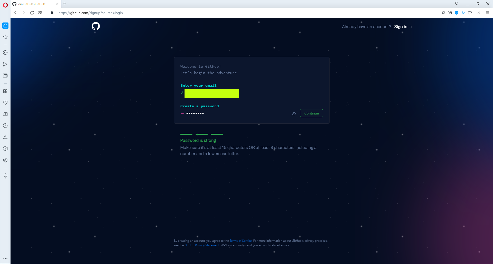
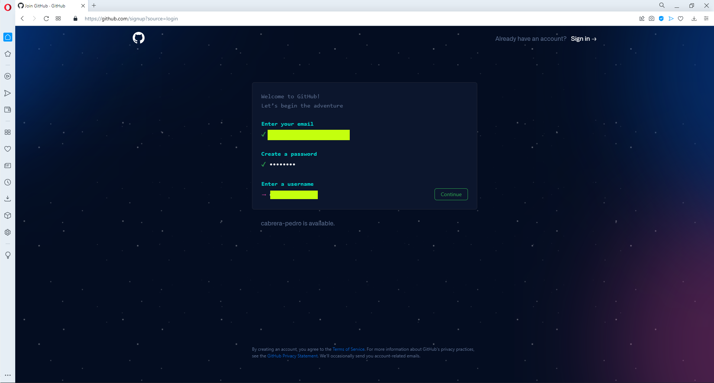
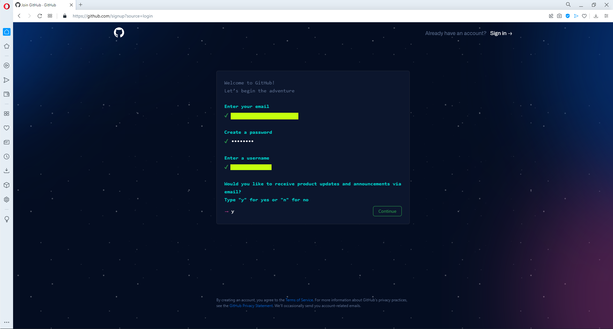
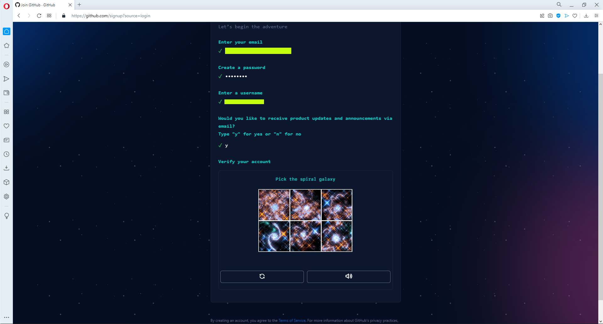
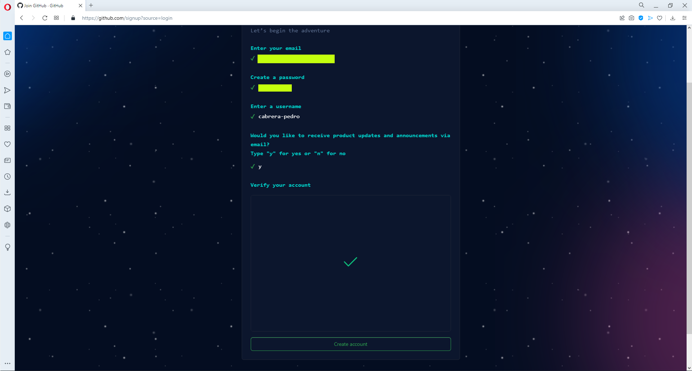
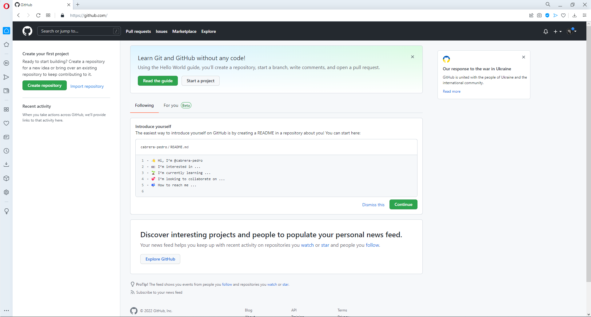

# GIT / GITHUB / CREACIÓN DE CUENTA

Tiempo aproximado: _5 minutos_

## OBJETIVO

Crear una cuenta en _GitHub_.

## DESARROLLO

### CREACIÓN DE UNA CUENTA EN GITHUB

En esta actividad se crea una cuenta en el sitio GitHub.

Para crear una cuenta en GitHub, visite con su navegador el siguiente enlace: <https://github.com/signup>

La interfaz web de GitHub le pedirá gradualmente la siguiente información:

- Correo Electrónico: _ESCRIBA SU CORREO ELECTRÓNICO_
  - Contraseña: _ESCRIBA_UNA_CONTRASEÑA_
    - Cumpla las reglas indicadas
- Nombre de Usuario: _ESCRIBA_UN_NOMBRE_DE_USUARIO_
  - Debe ser único
- Continuar: ingrese `yes` y de clic en el botón `Continue`
  - Cumpla la actividad de verificación de cuenta
- Escriba el código enviado a su correo: _12345678_ (ocho dígitos)

A continuación, se muestra una serie de imágenes que muestran un ejemplo de creación de una cuenta en GitHub.

")

## RESULTADO

Comente lo aprendido en esta actividad.

---

[GIT](04.md)
