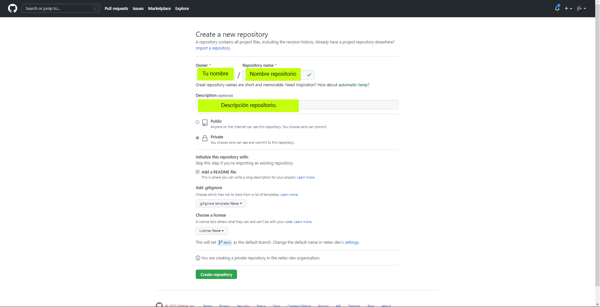
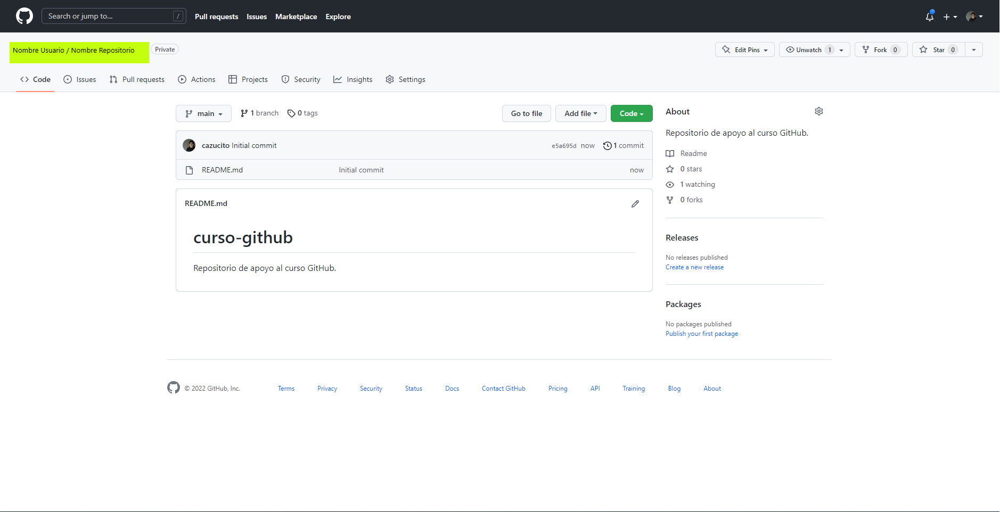
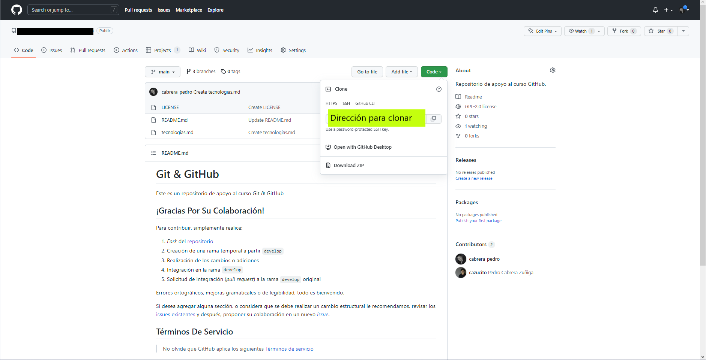

# GIT / GITHUB / PRIMEROS PASOS

Tiempo aproximado: _10 minutos_

## OBJETIVO

Conocer las funcionalidades elementales de _GitHub_.

## DESARROLLO

### CREACIÓN DE UN REPOSITORIO

Para crear un repositorio en GitHub se debe visitar <https://github.com/new> y proveer la información requerida. Debe estar autenticado con la cuenta creada en una actividad anterior.

La información requerida es:

- Repository name:
  - `RepositorioEnGitHub`
- Description
  - `Repositorio de apoyo al curso.`
- `[x] Private`
- Initialize this repository with:
  - `[x] Add a README file`
  - Add .gitignore
    - `None`
  - Choose a license
    - `None`
- Clic en el botón: `Create repository`





### DESCARGA DE UN REPOSITORIO

Para descargar un repositorio de GitHub realiza los pasos que a continuación se enumeran:

- En un navegador web ingresa la URL de la página principal del repositorio a descargar.
  - Preferentemente el repositorio creado en el paso anterior:
- Selecciona la rama que desea descargar:
  - `main`
- Da clic en el menú `Code`
  - Aparecerá un menú contextual
- En el menú contextual da clic en el menú: `Download ZIP`

Lo anterior descarga un archivo en formato `ZIP` al equipo local. Ya con el archivo se debe descomprimir y trabajar con los archivos descargados.

- _Es importante hacer notar que se descarga el contenido de la rama y no el repositorio Git completo._

### CLONACIÓN DE UN REPOSITORIO

Para clonar un repositorio de _GitHub_ realiza los pasos que a continuación se enumeran:

- Visita el repositorio _Git_ creado anteriormente `RepositorioEnGitHub`

- Obtenga la dirección para clonar el repositorio en: `<>Code` → `Code` → `SSH`



En una terminal de comandos de su equipo local ejecuta:

``` shell
git clone {URL_REPO}
```

La salida será semejante a:

``` shell
Cloning into 'RepositorioEnGitHub'...
remote: Enumerating objects: 17, done.
remote: Counting objects: 100% (17/17), done.
remote: Compressing objects: 100% (14/14), done.
remote: Total 17 (delta 3), reused 8 (delta 2), pack-reused 0
Receiving objects: 100% (17/17), 11.28 KiB | 3.76 MiB/s, done.
Resolving deltas: 100% (3/3), done.
```

Lo anterior crea una carpeta con el nombre del repositorio clonado (en este caso `RepositorioEnGitHub`) en el que se encuentra todo el contenido del repositorio y las asociaciones al repositorio remoto.

## RESULTADO

Comente lo aprendido en esta actividad.

---

[GIT](04.md)
