# GIT / GITHUB / FLUJOS / RAMA FEATURE

Tiempo aproximado: _10 minutos_

## OBJETIVO

Ejemplificar el flujo de trabajo de rama _feature_.

## DESARROLLO

En esta actividad utilizaremos el flujo de rama _feature_ para adicionar el documento `tecnologias.md` al repositorio.

### CREACIÓN DE RAMA

Para crear una rama en el repositorio creado en las actividades previas realiza los siguientes pasos:

- En el navegador ingresa el url en GitHub del repositorio previamente creado (`RepositorioEnGitHub`).
- Abre el menú contextual dando clic en `main` de la página `<>Code` del repositorio
- En el menú escribe el nombre de la rama: `tecnologias`
- Da clic en la opción `Create branch: tecnologias from main`

La siguiente imagen muestra estos pasos:

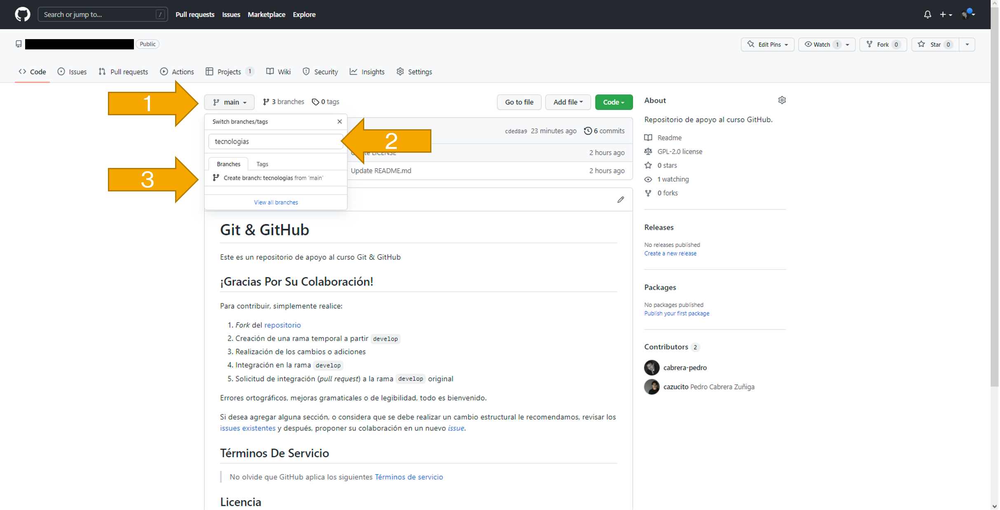

La siguiente imagen muestra el resultado de la creación de la rama:

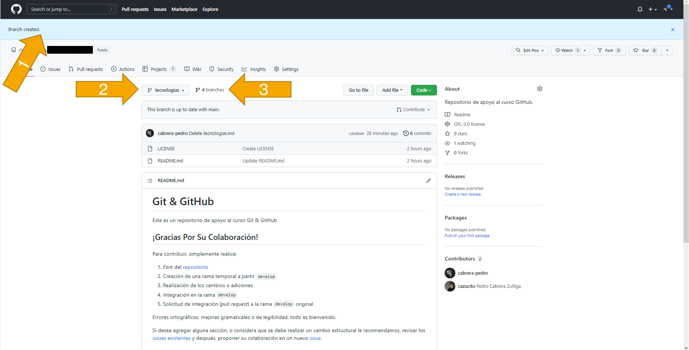

Nota que la rama contiene todo el contenido de la rama _main_ de la cual se origino.

### CREACIÓN DEL ARCHIVO `tecnologias.md`

En la rama `tecnologias` abre el menú contextual `Add file`:

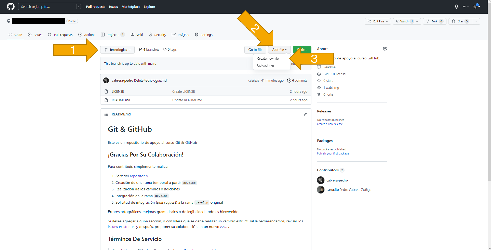

En la interfaz resultante ingrese los datos como se muestra en la siguiente imagen:

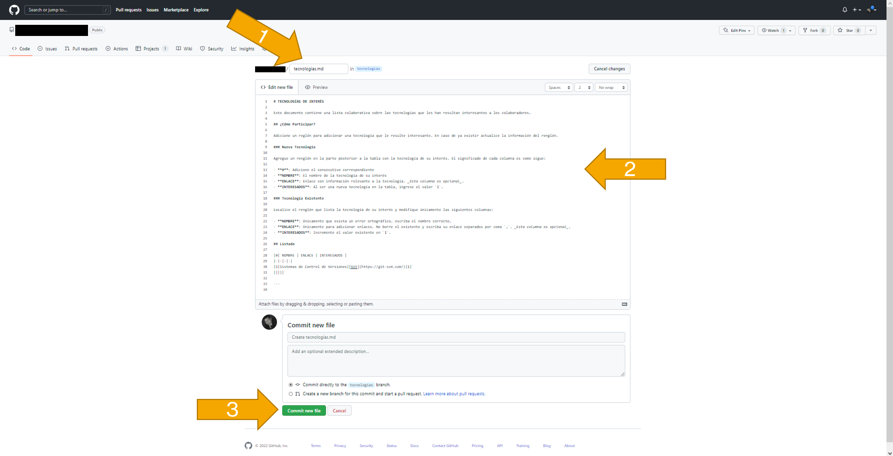

- Nombre del archivo: `tecnologias.md`

- Contenido del archivo:

``` markdown
# TECNOLOGÍAS DE INTERÉS

Este documento contiene una lista colaborativa sobre las tecnologías que les han resultan interesantes a los colaboradores.

## ¿Cómo Participar?

Adiciona un renglón para agregar una tecnología que le resulte interesante. En caso de ya existir actualice la información del renglón.

### Nueva Tecnología

Agrega un renglón en la parte posterior a la tabla con la tecnología de su interés. El significado de cada columna es como sigue:

- **#**: Adiciona el consecutivo correspondiente
- **NOMBRE**: El nombre de la tecnología de tu interés
- **ENLACE**: Enlace con información relevante a la tecnología. _Esta columna es opcional_.
- **INTERESADOS**: Al ser una nueva tecnología en la tabla, ingrese el valor `1`.

### Tecnología Existente

Localiza el renglón que lista la tecnología de su interés y modifica únicamente las siguientes columnas:

- **NOMBRE**: Únicamente de existir un error ortográfico, escribe el nombre correcto.
- **ENLACE**: Únicamente para adicionar enlaces. No borres el existente y escribe tu enlace separado por coma `,`. _Esta columna es opcional_.
- **INTERESADOS**: Incrementa el valor existente en `1`.

## Listado

|#| NOMBRE | ENLACE | INTERESADOS |
|-|-|-|-|
|1|Sistemas de Control de Versiones|[Git](https://git-scm.com/)|1|
|||||

---
```

- Haga clic en el botón `Commit new file`

Nota que ahora el archivo aparece en el contenido del repositorio (en la rama `tecnologias`).

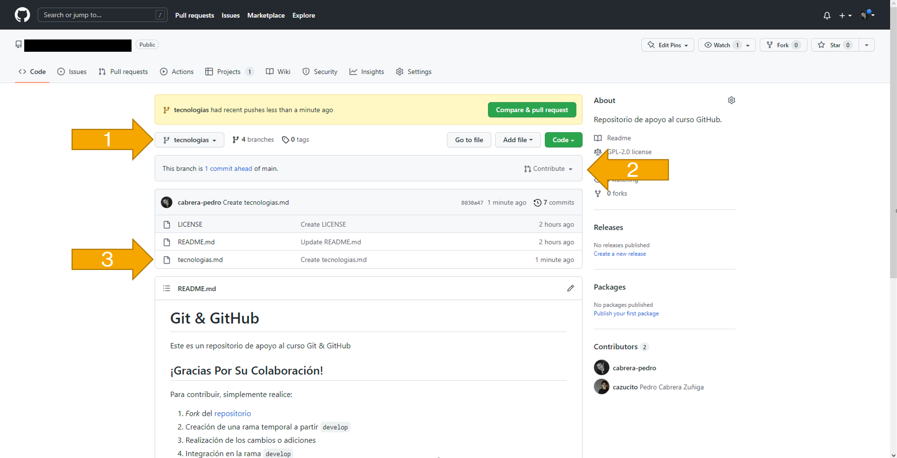

Al dar clic sobre el archivo se muestra su contenido:

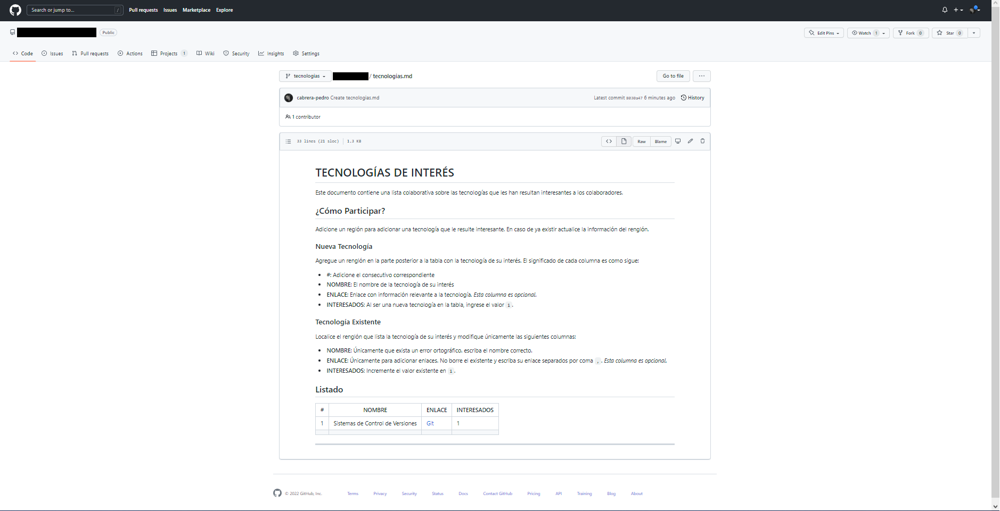

### INTEGRACIÓN DE CAMBIOS

Para integrar los cambios hechos en la rama `tecnologias` se puede realizar una _Pull Request_ hacia la rama destino (normalmente _main_).

En la pestaña `Pull Request` del repositorio da clic en el botón `New pull request`.

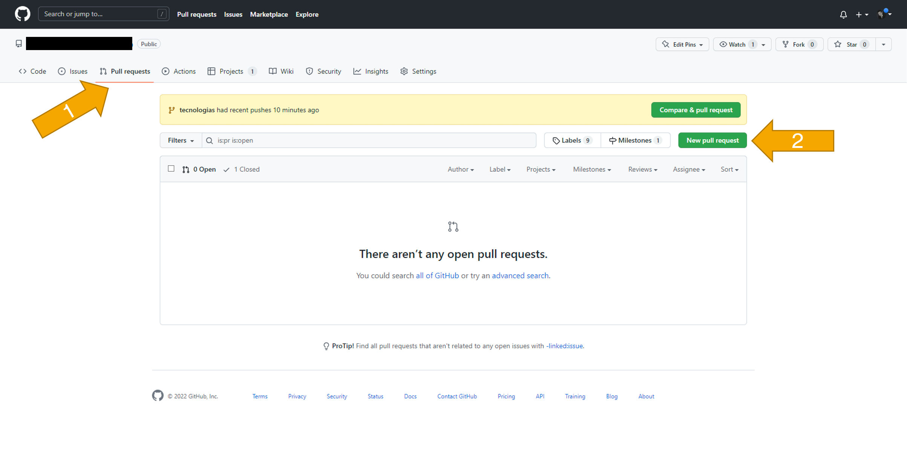

En la nueva interfaz selecciona la rama base `main` y la rama a integrar `tecnologias`. Analiza la información mostrada en la interfaz.

A continuación, da clic en el botón `Create pull request`.

La interfaz debe mostrar algo semejante a:

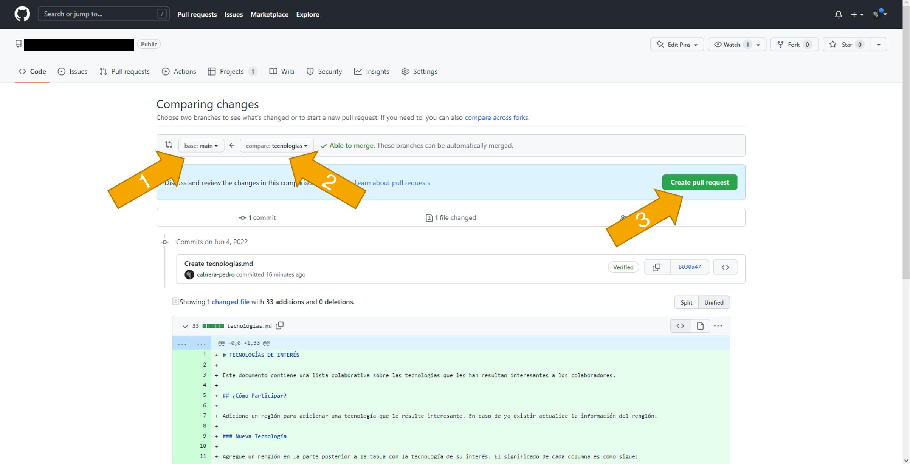

La siguiente interfaz solicita nombre y comentarios para la creación de la _pull request_. Deja los campos con los valores predeterminados y de clic en el botón `Create pull request`.

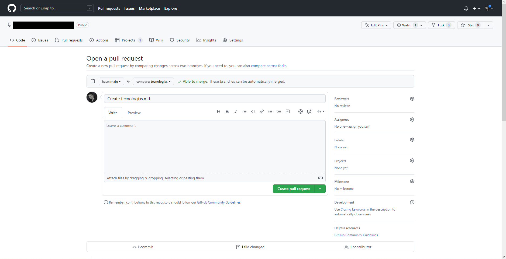

Después de analizar el contenido de la interfaz da clic en el botón `Merge pull request`. Esto te solicitará que des clic nuevamente para confirmar.

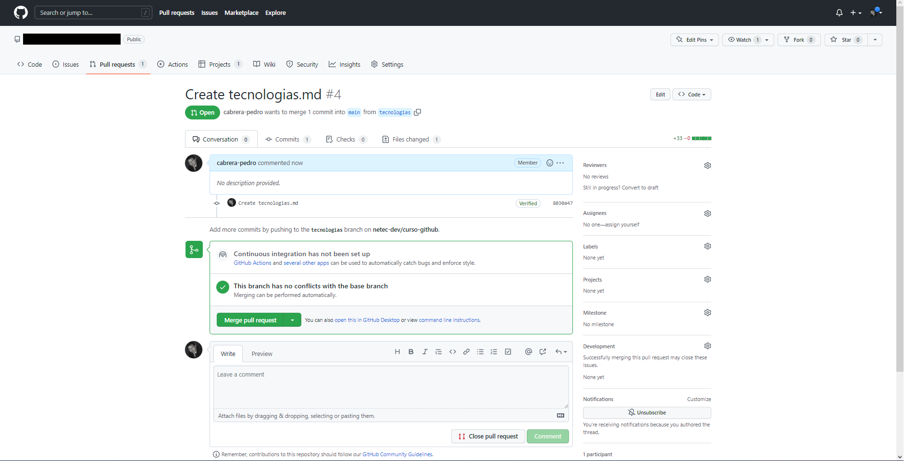

Una vez que se ha confirmado la integración, la pantalla muestra los detalles del proceso y aparece la opción de eliminación de rama `Delete branch`.

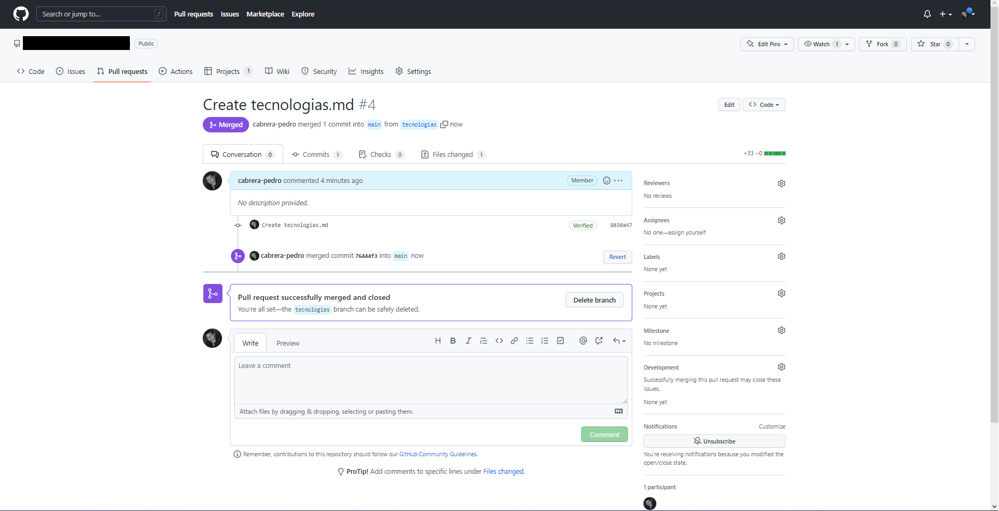

Haz clic en el botón `Delete branch` para eliminar la rama _feature_. Después de solicitar el borrado, la pantalla se actualiza indicando que la rama se ha borrado.

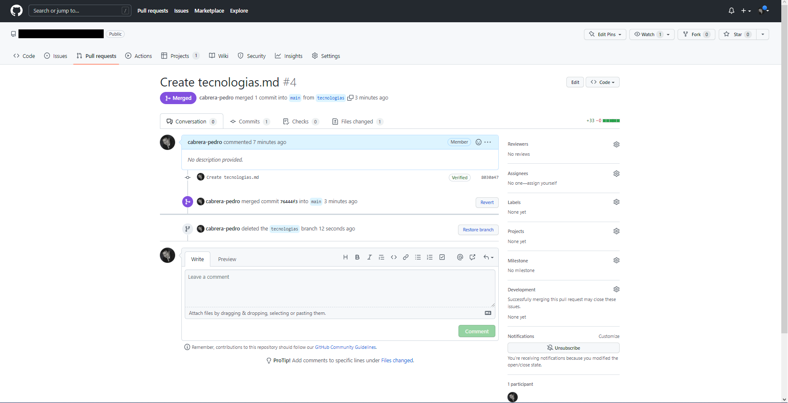

### RAMA PRINCIPAL

Ahora se puede observar que en la rama principal ya se encuentra el archivo `tecnologias.md` y que la rama `tecnologias` ya no existe.

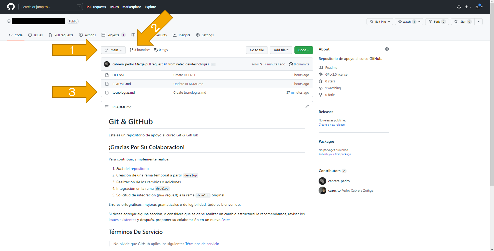

## RESULTADO

Comente lo aprendido en esta actividad.

---

[GIT](04.md)
