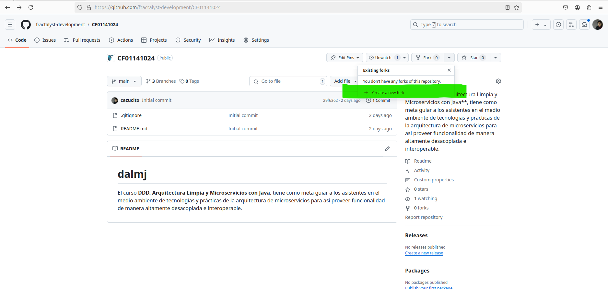
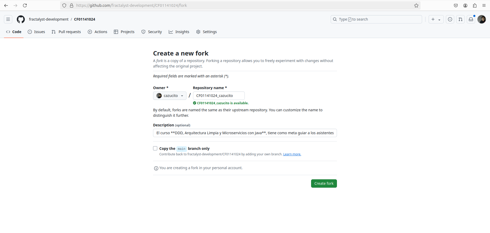
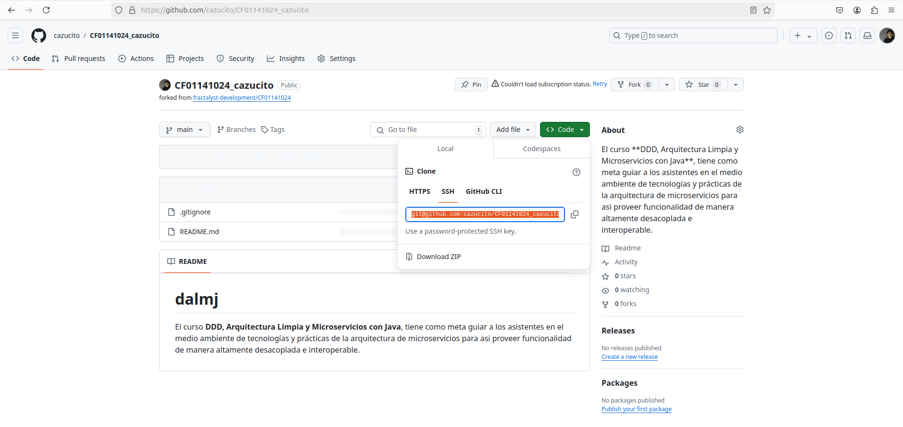
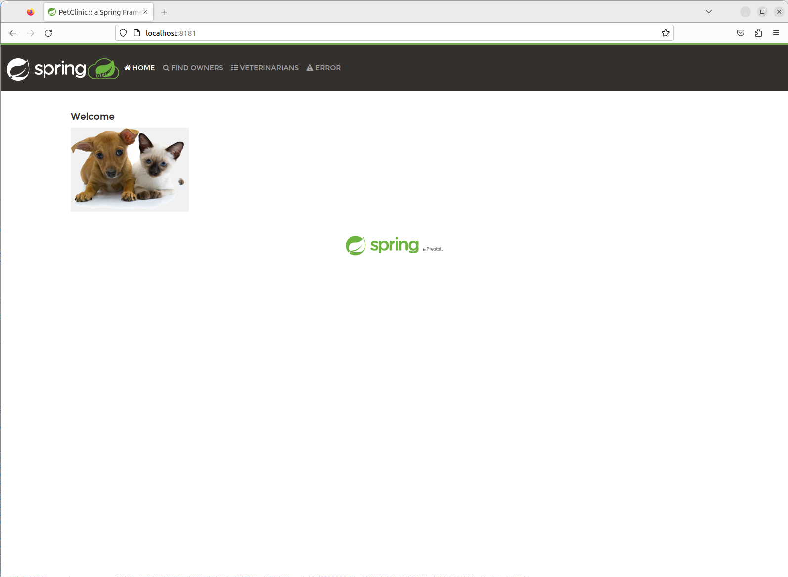

# GIT / GITHUB / FLUJOS / FORKING

Tiempo aproximado: _15 minutos_

## OBJETIVO

Ejemplificar el flujo de trabajo de rama _forking_.

## PRERREQUISITOS

### JAVA DEVELOPMENT KIT (JDK)

Para determinar si es necesaria la instalación, realiza lo indicado en la sección de **VALIDACIÓN** localizada más adelante.

De no resultar exitosa la validación procede a la instalación como se indica en la siguiente sección.

#### INSTALACIÓN

Para la actualización de los repositorios, ejecuta en una terminal de comandos lo siguiente:

``` shell
sudo apt-get update
```

La salida de la ejecución debe ser similar a:

``` shell
[sudo] password for usuario:
Hit:1 http://security.ubuntu.com/ubuntu noble-security InRelease            
Hit:2 http://mx.archive.ubuntu.com/ubuntu noble InRelease                   
Get:3 http://mx.archive.ubuntu.com/ubuntu noble-updates InRelease [126 kB]
Hit:4 http://mx.archive.ubuntu.com/ubuntu noble-backports InRelease
Get:5 http://mx.archive.ubuntu.com/ubuntu noble-updates/main amd64 Packages [530 kB]
Get:6 http://mx.archive.ubuntu.com/ubuntu noble-updates/universe amd64 Packages [374 kB]
Fetched 1,031 kB in 12s (83.7 kB/) 
Reading package lists... Done
```

Para la instalación, ejecuta:

``` shell
sudo apt install openjdk-17-jdk openjdk-17-jre
```

- _Aceptar cualquier confirmación solicitada._

La salida de la ejecución debe ser similar a:

``` shell
Reading package lists... Done
Building dependency tree... Done
Reading state information... Done
The following additional packages will be installed:
  ca-certificates-java fonts-dejavu-extra java-common libatk-wrapper-java libatk-wrapper-java-jni libice-dev libpthread-stubs0-dev libsm-dev libx11-dev libxau-dev libxcb1-dev
  libxdmcp-dev libxt-dev openjdk-17-jdk-headless openjdk-17-jre-headless x11proto-dev xorg-sgml-doctools xtrans-dev
Suggested packages:
  default-jre libice-doc libsm-doc libx11-doc libxcb-doc libxt-doc openjdk-17-demo openjdk-17-source visualvm fonts-ipafont-gothic fonts-ipafont-mincho fonts-wqy-microhei
  | fonts-wqy-zenhei
The following NEW packages will be installed:
  ca-certificates-java fonts-dejavu-extra java-common libatk-wrapper-java libatk-wrapper-java-jni libice-dev libpthread-stubs0-dev libsm-dev libx11-dev libxau-dev libxcb1-dev
  libxdmcp-dev libxt-dev openjdk-17-jdk openjdk-17-jdk-headless openjdk-17-jre openjdk-17-jre-headless x11proto-dev xorg-sgml-doctools xtrans-dev
0 upgraded, 20 newly installed, 0 to remove and 3 not upgraded.
...
```

#### VALIDACIÓN

Para validar la correcta instalación desde la línea de comandos ejecuta lo siguiente:

``` shell
javac --version
```

La salida de la ejecución debe ser similar a:

``` shell
javac 17.0.12
```

### APACHE MAVEN

Para determinar si es necesaria la instalación, realiza lo indicado en la sección de **VALIDACIÓN** localizada más adelante.

De no resultar exitosa la validación procede a la instalación como se indica en la siguiente sección.

#### INSTALACIÓN

Para la actualización de los repositorios, ejecuta en una terminal de comandos lo siguiente:

``` shell
sudo apt-get update
```

La salida de la ejecución debe ser similar a:

``` shell
Hit:1 http://security.ubuntu.com/ubuntu noble-security InRelease            
Hit:2 http://mx.archive.ubuntu.com/ubuntu noble InRelease                   
Get:3 http://mx.archive.ubuntu.com/ubuntu noble-updates InRelease [126 kB]
Hit:4 http://mx.archive.ubuntu.com/ubuntu noble-backports InRelease
Get:5 http://mx.archive.ubuntu.com/ubuntu noble-updates/main amd64 Packages [530 kB]
Get:6 http://mx.archive.ubuntu.com/ubuntu noble-updates/universe amd64 Packages [374 kB]
Fetched 1,031 kB in 12s (83.7 kB/) 
Reading package lists... Done
```

Para la instalación, ejecuta:

``` shell
sudo apt install maven
```

- _Aceptar cualquier confirmación solicitada._

La salida de la ejecución debe ser similar a:

``` shell
Reading package lists... Done
Building dependency tree... Done
Reading state information... Done
The following additional packages will be installed:
  libaopalliance-java libapache-pom-java libatinject-jsr330-api-java libcdi-api-java libcommons-cli-java libcommons-io-java libcommons-lang3-java libcommons-parent-java
  liberror-prone-java libgeronimo-annotation-1.3-spec-java libgeronimo-interceptor-3.0-spec-java libguava-java libguice-java libjansi-java libjsr305-java libmaven-parent-java
  libmaven-resolver-java libmaven-shared-utils-java libmaven3-core-java libplexus-cipher-java libplexus-classworlds-java libplexus-component-annotations-java
  libplexus-interpolation-java libplexus-sec-dispatcher-java libplexus-utils2-java libsisu-inject-java libsisu-plexus-java libslf4j-java libwagon-file-java libwagon-http-shaded-java
  libwagon-provider-api-java
Suggested packages:
  libatinject-jsr330-api-java-doc libel-api-java libcommons-io-java-doc libasm-java libcglib-java libjsr305-java-doc libmaven-shared-utils-java-doc liblogback-java
  libplexus-utils2-java-doc junit4 testng libcommons-logging-java liblog4j1.2-java
The following NEW packages will be installed:
  libaopalliance-java libapache-pom-java libatinject-jsr330-api-java libcdi-api-java libcommons-cli-java libcommons-io-java libcommons-lang3-java libcommons-parent-java
  liberror-prone-java libgeronimo-annotation-1.3-spec-java libgeronimo-interceptor-3.0-spec-java libguava-java libguice-java libjansi-java libjsr305-java libmaven-parent-java
  libmaven-resolver-java libmaven-shared-utils-java libmaven3-core-java libplexus-cipher-java libplexus-classworlds-java libplexus-component-annotations-java
  libplexus-interpolation-java libplexus-sec-dispatcher-java libplexus-utils2-java libsisu-inject-java libsisu-plexus-java libslf4j-java libwagon-file-java libwagon-http-shaded-java
  libwagon-provider-api-java maven
0 upgraded, 32 newly installed, 0 to remove and 21 not upgraded.
Need to get 10.1 MB of archives.
After this operation, 13.1 MB of additional disk space will be used.
Do you want to continue? (Y/n) Y
Get:1 http://mx.archive.ubuntu.com/ubuntu noble/universe amd64 libapache-pom-java all 29-2 (5,284 B)
Get:2 http://mx.archive.ubuntu.com/ubuntu noble/universe amd64 libatinject-jsr330-api-java all 1.0+ds1-5 (5,348 B)
...
Fetched 10.0 MB in 43s (232 kB/s)                                                                  
Extracting templates from packages: 100%
Selecting previously unselected package libapache-pom-java.
(Reading database ... 150121 files and directories currently installed.)
Preparing to unpack .../00-libapache-pom-java_29-2_all.deb ...
Unpacking libapache-pom-java (29-2) ...
Selecting previously unselected package libatinject-jsr330-api-java.
Preparing to unpack .../01-libatinject-jsr330-api-java_1.0+ds1-5_all.deb ...
Unpacking libatinject-jsr330-api-java (1.0+ds1-5) ...
Selecting previously unselected package libgeronimo-interceptor-3.0-spec-java.
Preparing to unpack .../02-libgeronimo-interceptor-3.0-spec-java_1.0.1-4fakesync_all.deb ...
...
Setting up libguava-java (32.0.1-1) ...
Setting up liberror-prone-java (2.18.0-1) ...
Setting up libguice-java (4.2.3-2) ...
Setting up libmaven3-core-java (3.8.7-2) ...
Setting up maven (3.8.7-2) ...
update-alternatives: using /usr/share/maven/bin/mvn to provide /usr/bin/mvn (mvn) in auto mode
```

#### VALIDACIÓN

Para validar la correcta instalación desde la línea de comandos ejecuta lo siguiente:

``` shell
mvn --version
```

La salida de la ejecución debe ser similar a:

``` shell
Apache Maven 3.8.7
Maven home: /usr/share/maven
Java version: 17.0.12, vendor: Ubuntu, runtime: /usr/lib/jvm/java-17-openjdk-amd64
Default locale: en_US, platform encoding: UTF-8
OS name: "linux", version: "6.8.0-45-generic", arch: "amd64", family: "unix"
```

### VISUAL STUDIO CODE

Para instalar el **Visual Studio Code** ejecuta los siguientes pasos.

#### ACTUALIZACIÓN DEL REPOSITORIO DE PAQUETES

``` shell
sudo apt update
```

La salida de la ejecución debe ser similar a:

``` shell
[sudo] password for usuario: 
Hit:1 http://security.ubuntu.com/ubuntu noble-security InRelease
Hit:2 http://mx.archive.ubuntu.com/ubuntu noble InRelease
Get:3 http://mx.archive.ubuntu.com/ubuntu noble-updates InRelease [126 kB]
Hit:4 http://mx.archive.ubuntu.com/ubuntu noble-backports InRelease
Fetched 126 kB in 12s (10.9 kB/s)
Reading package lists... Done
Building dependency tree... Done
Reading state information... Done
3 packages can be upgraded. Run 'apt list --upgradable' to see them.
```

#### CONFIGURACIÓN DE DEPENDENCIAS

``` shell
sudo apt install software-properties-common apt-transport-https wget -y
```

La salida de la ejecución debe ser similar a:

``` shell
Reading package lists... Done
Building dependency tree... Done
Reading state information... Done
software-properties-common is already the newest version (0.99.48).
software-properties-common set to manually installed.
wget is already the newest version (1.21.4-1ubuntu4.1).
wget set to manually installed.
The following NEW packages will be installed:
  apt-transport-https
0 upgraded, 1 newly installed, 0 to remove and 3 not upgraded.
Need to get 3,974 B of archives.
After this operation, 35.8 kB of additional disk space will be used.
Get:1 http://mx.archive.ubuntu.com/ubuntu noble/universe amd64 apt-transport-https all 2.7.14build2 [3,974 B]
Fetched 3,974 B in 0s (9,096 B/s)               
Selecting previously unselected package apt-transport-https.
(Reading database ... 152220 files and directories currently installed.)
Preparing to unpack .../apt-transport-https_2.7.14build2_all.deb ...
Unpacking apt-transport-https (2.7.14build2) ...
Setting up apt-transport-https (2.7.14build2) ...
```

#### CONFIGURACIÓN DE LLAVE GPG

``` shell
wget -q https://packages.microsoft.com/keys/microsoft.asc -O- | sudo apt-key add -
```

La salida de la ejecución debe ser similar a:

``` shell
Warning: apt-key is deprecated. Manage keyring files in trusted.gpg.d instead (see apt-key(8)).
OK
```

#### CONFIGURACIÓN DEL REPOSITORIO

``` shell
sudo add-apt-repository "deb [arch=amd64] https://packages.microsoft.com/repos/vscode stable main"
```

La salida de la ejecución debe ser similar a:

``` shell
Repository: 'deb [arch=amd64] https://packages.microsoft.com/repos/vscode stable main'
Description:
Archive for codename: stable components: main
More info: https://packages.microsoft.com/repos/vscode
Adding repository.
Press [ENTER] to continue or Ctrl-c to cancel.
Adding deb entry to /etc/apt/sources.list.d/archive_uri-https_packages_microsoft_com_repos_vscode-noble.list
Adding disabled deb-src entry to /etc/apt/sources.list.d/archive_uri-https_packages_microsoft_com_repos_vscode-noble.list
Hit:1 http://security.ubuntu.com/ubuntu noble-security InRelease
Get:2 https://packages.microsoft.com/repos/vscode stable InRelease [3,594 B]
Hit:3 http://mx.archive.ubuntu.com/ubuntu noble InRelease
Get:4 https://packages.microsoft.com/repos/vscode stable/main amd64 Packages [26.4 kB]
Hit:5 http://mx.archive.ubuntu.com/ubuntu noble-updates InRelease
Hit:6 http://mx.archive.ubuntu.com/ubuntu noble-backports InRelease
Fetched 29.9 kB in 1s (20.2 kB/s)
Reading package lists... Done
W: https://packages.microsoft.com/repos/vscode/dists/stable/InRelease: Key is stored in legacy trusted.gpg keyring (/etc/apt/trusted.gpg), see the DEPRECATION section in apt-key(8) for details.
```

#### INSTALACIÓN VISUAL STUDIO CODE

``` shell
sudo apt install code
```

La salida de la ejecución debe ser similar a:

``` shell
Reading package lists... Done
Building dependency tree... Done
Reading state information... Done
The following NEW packages will be installed:
  code
0 upgraded, 1 newly installed, 0 to remove and 3 not upgraded.
Need to get 103 MB of archives.
After this operation, 410 MB of additional disk space will be used.
Get:1 https://packages.microsoft.com/repos/vscode stable/main amd64 code amd64 1.93.1-1726079302 [103 MB]
Fetched 103 MB in 18s (5,738 kB/s)                                                                                                 
Preconfiguring packages ...
Selecting previously unselected package code.
(Reading database ... 152224 files and directories currently installed.)
Preparing to unpack .../code_1.93.1-1726079302_amd64.deb ...
Unpacking code (1.93.1-1726079302) ...
Setting up code (1.93.1-1726079302) ...
Processing triggers for gnome-menus (3.36.0-1.1ubuntu3) ...
Processing triggers for shared-mime-info (2.4-4) ...
Processing triggers for desktop-file-utils (0.27-2build1) ...
```

#### VALIDACIÓN

Para validar la correcta instalación desde la línea de comandos ejecuta lo siguiente:

``` shell
code --version
```

La salida de la ejecución debe ser similar a:

``` shell
1.93.1
38c31bc77e0dd6ae88a4e9cc93428cc27a56ba40
x64
```

## DESARROLLO

### BIFURCACIÓN

Realiza una bifurcación del repositorio localizado en GitHub <https://github.com/fractalyst-development/cf01141024>.

Haga clic en el botón **Fork** ubicado en la zona de la esquina superior derecha como se muestra a continuación:



En la ventana, después de llenar con la información que se muestra, da clic en `Create Fork`:

- Repository name: `CF01141024_cazucito`
  - Donde el nombre se construye con la cadena "CF01141024" y `\_NOMBRE-DE-USUARIO`
- **Copy the main branch only: `SIN SELECCIONAR`**



### CLONADO

Para tener una copia local de trabajo, clona el repositorio recién creado por la bifurcación. La dirección de clonado puede localizarse en el botón `Code` de la pantalla inicial del repositorio.



Tu dirección debe ser similar a: `git@github.com:cazucito/CF01141024_cazucito.git`

En una terminal de comandos ubicada en la ruta `/home/usuario/Desktop/CF01141024` ejecuta el siguiente comando para crear la copia local del repositorio de trabajo.

``` shell
git clone git@github.com:cazucito/CF01141024_cazucito.git
```

- **Recuerda sustituir la dirección de tu repositorio.**

La salida debe ser similar a:

``` shell
Cloning into 'CF01141024_cazucito'...
remote: Enumerating objects: 169, done.
remote: Counting objects: 100% (169/169), done.
remote: Compressing objects: 100% (162/162), done.
remote: Total 169 (delta 6), reused 167 (delta 6), pack-reused 0 (from 0)
Receiving objects: 100% (169/169), 18.81 MiB | 2.33 MiB/s, done.
Resolving deltas: 100% (6/6), done.
```

### RAMA DE TRABAJO

En la carpeta del repositorio recién clonado ubícate en la rama de trabajo: `labs/devops_ci-cd`.

``` shell
git switch labs/devops_ci-cd
```

La salida debe ser similar a:

``` shell
Switched to branch 'labs/devops_ci-cd'
Your branch is up to date with 'origin/labs/devops_ci-cd'.
```

### ANÁLISIS

Ya en la rama del proyecto Java, analiza el contenido del directorio.

- Para esto puede abrir el proyecto en VSCode.

#### EJECUCIÓN DE PRUEBAS

Para ejecutar las pruebas unitarias (estando ubicado en la carpeta principal del proyecto), necesitas ejecutar el comando siguiente:

``` shell
mvn test
```

La salida debe ser similar a:

``` shell
...
[INFO] Results:
[INFO] 
[WARNING] Tests run: 41, Failures: 0, Errors: 0, Skipped: 1
[INFO] 
[INFO] ------------------------------------------------------------------------
[INFO] BUILD SUCCESS
[INFO] ------------------------------------------------------------------------
[INFO] Total time:  27.887 s
[INFO] Finished at: 2024-09-24T18:13:30-06:00
[INFO] ------------------------------------------------------------------------
```

**_NOTA: De encontrar algún error en la ejecución intente ejecutandolo nuevamente._**

Como se observa en la salida, se han ejecutado de manera exitosa las pruebas unitarias.

#### CONSTRUCCIÓN SPRING PET CLINIC

Para generar el artefacto _jar_ de la aplicación utiliza el siguiente comando:

``` shell
mvn clean install
```

**_NOTA: La primera ocasión que se ejecuta el comando puede tardar algunos minutos._**

La salida debe ser similar a:

``` shell
              |\      _,,,--,,_
             /,`.-'`'   ._  \-;;,_
  _______ __|,4-  ) )_   .;.(__`'-'__     ___ __    _ ___ _______
 |       | '---''(_/._)-'(_\_)   |   |   |   |  |  | |   |       |
 |    _  |    ___|_     _|       |   |   |   |   |_| |   |       | __ _ _
 |   |_| |   |___  |   | |       |   |   |   |       |   |       | \ \ \ \
 |    ___|    ___| |   | |      _|   |___|   |  _    |   |      _|  \ \ \ \
 |   |   |   |___  |   | |     |_|       |   | | |   |   |     |_    ) ) ) )
 |___|   |_______| |___| |_______|_______|___|_|  |__|___|_______|  / / / /
 ==================================================================/_/_/_/

:: Built with Spring Boot :: 2.7.3


2024-09-24 18:16:56.516  INFO 21073 --- [           main] o.s.s.p.owner.VisitControllerTests       : Starting VisitControllerTests using Java 17.0.12 on vm with PID 21073 (started by usuario in /home/usuario/Desktop/CF01141024)
2024-09-24 18:16:56.517  INFO 21073 --- [           main] o.s.s.p.owner.VisitControllerTests       : No active profile set, falling back to 1 default profile: "default"
2024-09-24 18:16:56.925  INFO 21073 --- [           main] o.s.b.t.m.w.SpringBootMockServletContext : Initializing Spring TestDispatcherServlet ''
2024-09-24 18:16:56.926  INFO 21073 --- [           main] o.s.t.web.servlet.TestDispatcherServlet  : Initializing Servlet ''
2024-09-24 18:16:56.926  INFO 21073 --- [           main] o.s.t.web.servlet.TestDispatcherServlet  : Completed initialization in 0 ms
2024-09-24 18:16:56.932  INFO 21073 --- [           main] o.s.s.p.owner.VisitControllerTests       : Started VisitControllerTests in 0.446 seconds (JVM running for 23.133)
[INFO] Tests run: 3, Failures: 0, Errors: 0, Skipped: 0, Time elapsed: 0.592 s - in org.springframework.samples.petclinic.owner.VisitControllerTests
2024-09-24 18:16:57.088  INFO 21073 --- [ionShutdownHook] j.LocalContainerEntityManagerFactoryBean : Closing JPA EntityManagerFactory for persistence unit 'default'
2024-09-24 18:16:57.347  INFO 21073 --- [ionShutdownHook] com.zaxxer.hikari.HikariDataSource       : HikariPool-1 - Shutdown initiated...
2024-09-24 18:16:57.365  INFO 21073 --- [ionShutdownHook] com.zaxxer.hikari.HikariDataSource       : HikariPool-1 - Shutdown completed.
2024-09-24 18:16:57.418  INFO 21073 --- [ionShutdownHook] j.LocalContainerEntityManagerFactoryBean : Closing JPA EntityManagerFactory for persistence unit 'default'
2024-09-24 18:16:57.421  INFO 21073 --- [ionShutdownHook] org.ehcache.core.EhcacheManager          : Cache 'vets' removed from EhcacheManager.
2024-09-24 18:16:57.431  INFO 21073 --- [ionShutdownHook] com.zaxxer.hikari.HikariDataSource       : HikariPool-2 - Shutdown initiated...
2024-09-24 18:16:57.467  INFO 21073 --- [ionShutdownHook] com.zaxxer.hikari.HikariDataSource       : HikariPool-2 - Shutdown completed.
[INFO] 
[INFO] Results:
[INFO] 
[WARNING] Tests run: 41, Failures: 0, Errors: 0, Skipped: 1
[INFO] 
[INFO] 
[INFO] --- jacoco-maven-plugin:0.8.7:report (report) @ spring-petclinic ---
[INFO] Loading execution data file /home/usuario/Desktop/CF01141024/target/jacoco.exec
[INFO] Analyzed bundle 'petclinic' with 20 classes
[INFO] 
[INFO] --- maven-jar-plugin:3.2.2:jar (default-jar) @ spring-petclinic ---
[INFO] Building jar: /home/usuario/Desktop/CF01141024/target/spring-petclinic-2.7.3.jar
[INFO] 
[INFO] --- spring-boot-maven-plugin:2.7.3:repackage (repackage) @ spring-petclinic ---
[INFO] Replacing main artifact with repackaged archive
[INFO] 
[INFO] --- maven-install-plugin:2.5.2:install (default-install) @ spring-petclinic ---
[INFO] Installing /home/usuario/Desktop/CF01141024/target/spring-petclinic-2.7.3.jar to /home/usuario/.m2/repository/org/springframework/samples/spring-petclinic/2.7.3/spring-petclinic-2.7.3.jar
[INFO] Installing /home/usuario/Desktop/CF01141024/pom.xml to /home/usuario/.m2/repository/org/springframework/samples/spring-petclinic/2.7.3/spring-petclinic-2.7.3.pom
[INFO] ------------------------------------------------------------------------
[INFO] BUILD SUCCESS
[INFO] ------------------------------------------------------------------------
[INFO] Total time:  34.018 s
[INFO] Finished at: 2024-09-24T18:16:59-06:00
[INFO] ------------------------------------------------------------------------
```

- _Es posible que se descarguen algunas dependencias._

#### EJECUCIÓN

Para iniciar la aplicación debes ejecutar el comando `java -jar …​` como se muestra adelante. La terminal se quedará en uso hasta que decidas detener la aplicación.

``` shell
java -jar target/spring-petclinic-2.7.3.jar
```

La salida debe ser similar a:

``` shell
              |\      _,,,--,,_
             /,`.-'`'   ._  \-;;,_
  _______ __|,4-  ) )_   .;.(__`'-'__     ___ __    _ ___ _______
 |       | '---''(_/._)-'(_\_)   |   |   |   |  |  | |   |       |
 |    _  |    ___|_     _|       |   |   |   |   |_| |   |       | __ _ _
 |   |_| |   |___  |   | |       |   |   |   |       |   |       | \ \ \ \
 |    ___|    ___| |   | |      _|   |___|   |  _    |   |      _|  \ \ \ \
 |   |   |   |___  |   | |     |_|       |   | | |   |   |     |_    ) ) ) )
 |___|   |_______| |___| |_______|_______|___|_|  |__|___|_______|  / / / /
 ==================================================================/_/_/_/

:: Built with Spring Boot :: 2.7.3


2024-09-24 18:18:37.793  INFO 21352 --- [           main] o.s.s.petclinic.PetClinicApplication     : Starting PetClinicApplication v2.7.3 using Java 17.0.12 on vm with PID 21352 (/home/usuario/Desktop/CF01141024/target/spring-petclinic-2.7.3.jar started by usuario in /home/usuario/Desktop/CF01141024)
2024-09-24 18:18:37.802  INFO 21352 --- [           main] o.s.s.petclinic.PetClinicApplication     : No active profile set, falling back to 1 default profile: "default"
2024-09-24 18:18:39.240  INFO 21352 --- [           main] .s.d.r.c.RepositoryConfigurationDelegate : Bootstrapping Spring Data JPA repositories in DEFAULT mode.
2024-09-24 18:18:39.352  INFO 21352 --- [           main] .s.d.r.c.RepositoryConfigurationDelegate : Finished Spring Data repository scanning in 102 ms. Found 2 JPA repository interfaces.
2024-09-24 18:18:40.419  INFO 21352 --- [           main] o.s.b.w.embedded.tomcat.TomcatWebServer  : Tomcat initialized with port(s): 8181 (http)
2024-09-24 18:18:40.430  INFO 21352 --- [           main] o.apache.catalina.core.StandardService   : Starting service [Tomcat]
2024-09-24 18:18:40.430  INFO 21352 --- [           main] org.apache.catalina.core.StandardEngine  : Starting Servlet engine: [Apache Tomcat/9.0.65]
2024-09-24 18:18:40.591  INFO 21352 --- [           main] o.a.c.c.C.[Tomcat].[localhost].[/]       : Initializing Spring embedded WebApplicationContext
2024-09-24 18:18:40.592  INFO 21352 --- [           main] w.s.c.ServletWebServerApplicationContext : Root WebApplicationContext: initialization completed in 2678 ms
2024-09-24 18:18:41.176  INFO 21352 --- [           main] org.ehcache.core.EhcacheManager          : Cache 'vets' created in EhcacheManager.
2024-09-24 18:18:41.208  INFO 21352 --- [           main] org.ehcache.jsr107.Eh107CacheManager     : Registering Ehcache MBean javax.cache:type=CacheStatistics,CacheManager=urn.X-ehcache.jsr107-default-config,Cache=vets
2024-09-24 18:18:41.228  INFO 21352 --- [           main] com.zaxxer.hikari.HikariDataSource       : HikariPool-1 - Starting...
2024-09-24 18:18:41.567  INFO 21352 --- [           main] com.zaxxer.hikari.HikariDataSource       : HikariPool-1 - Start completed.
2024-09-24 18:18:41.783  INFO 21352 --- [           main] o.hibernate.jpa.internal.util.LogHelper  : HHH000204: Processing PersistenceUnitInfo [name: default]
2024-09-24 18:18:41.884  INFO 21352 --- [           main] org.hibernate.Version                    : HHH000412: Hibernate ORM core version 5.6.10.Final
2024-09-24 18:18:42.105  INFO 21352 --- [           main] o.hibernate.annotations.common.Version   : HCANN000001: Hibernate Commons Annotations {5.1.2.Final}
2024-09-24 18:18:42.310  INFO 21352 --- [           main] org.hibernate.dialect.Dialect            : HHH000400: Using dialect: org.hibernate.dialect.H2Dialect
2024-09-24 18:18:42.996  INFO 21352 --- [           main] o.h.e.t.j.p.i.JtaPlatformInitiator       : HHH000490: Using JtaPlatform implementation: [org.hibernate.engine.transaction.jta.platform.internal.NoJtaPlatform]
2024-09-24 18:18:43.006  INFO 21352 --- [           main] j.LocalContainerEntityManagerFactoryBean : Initialized JPA EntityManagerFactory for persistence unit 'default'
2024-09-24 18:18:44.678  INFO 21352 --- [           main] o.s.b.a.e.web.EndpointLinksResolver      : Exposing 13 endpoint(s) beneath base path '/actuator'
2024-09-24 18:18:44.755  INFO 21352 --- [           main] o.s.b.w.embedded.tomcat.TomcatWebServer  : Tomcat started on port(s): 8181 (http) with context path ''
2024-09-24 18:18:44.788  INFO 21352 --- [           main] o.s.s.petclinic.PetClinicApplication     : Started PetClinicApplication in 7.732 seconds (JVM running for 8.317)
```

Para comprobar el funcionamiento de la aplicación ingresa en un navegador la url: <http://localhost:8181/>



``` shell
2024-09-24 18:20:26.376  INFO 21352 --- [ionShutdownHook] j.LocalContainerEntityManagerFactoryBean : Closing JPA EntityManagerFactory for persistence unit 'default'
2024-09-24 18:20:26.385  INFO 21352 --- [ionShutdownHook] org.ehcache.core.EhcacheManager          : Cache 'vets' removed from EhcacheManager.
2024-09-24 18:20:26.410  INFO 21352 --- [ionShutdownHook] com.zaxxer.hikari.HikariDataSource       : HikariPool-1 - Shutdown initiated...
2024-09-24 18:20:26.461  INFO 21352 --- [ionShutdownHook] com.zaxxer.hikari.HikariDataSource       : HikariPool-1 - Shutdown completed.
```

#### DETENCIÓN

Para detener la ejecución de la aplicación se debe cerrara la terminal de comandos en la que se encuentre ejecutando o ejecutar `Control + C` en la terminal en cuestión.

## RESULTADO

Comente lo aprendido en esta actividad.

---

[GIT](04.md)
