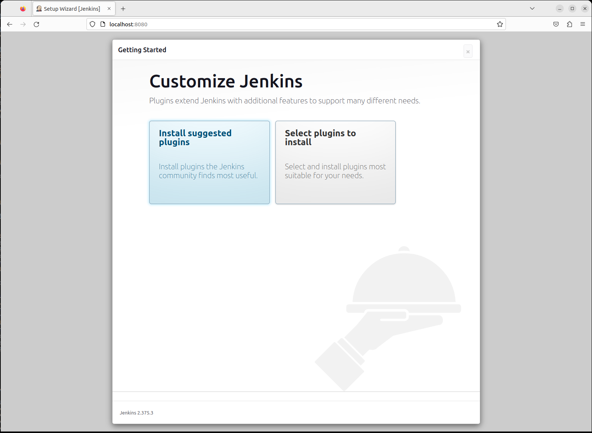
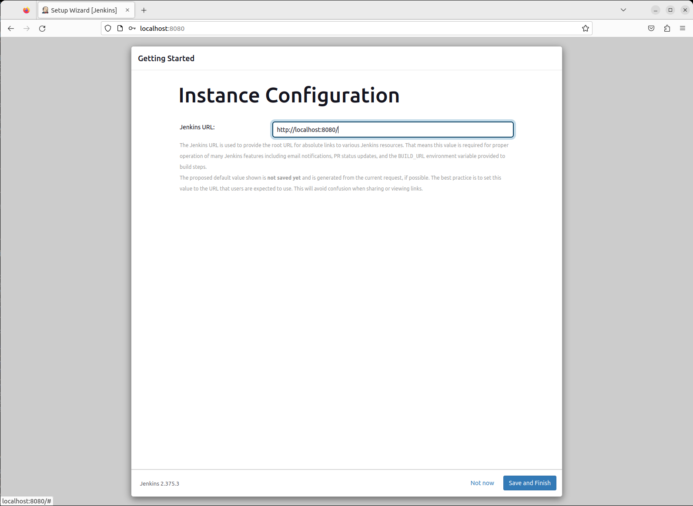

# CI-CD / JENKINS / INSTALACIÓN

Tiempo aproximado: _15 minutos_

## OBJETIVO

En esta actividad se instala localmente `Jenkins` según lo indicado en la [guía oficial](https://www.jenkins.io/doc/book/installing/linux/#debianubuntu).

### PRERREQUISITOS

Para validar la correcta instalación desde la línea de comandos ejecuta lo siguiente:

``` shell
javac --version
```

La salida de la ejecución debe ser similar a:

``` shell
javac 17.0.12
```

#### REPOSITORIOS JENKINS

En esta guía de instalación se utiliza el gestor de paquetes `apt-get` de ubuntu, por lo que se necesita adicionar los repositorios oficiales de Jenkins.

Adicionar llaves:

``` shell
sudo wget -O /usr/share/keyrings/jenkins-keyring.asc https://pkg.jenkins.io/debian-stable/jenkins.io-2023.key
```

Con una salida similar a:

``` shell
--2023-11-13 17:45:43--  https://pkg.jenkins.io/debian-stable/jenkins.io-2023.key
Resolving pkg.jenkins.io (pkg.jenkins.io)... 146.75.106.133, 2a04:4e42:8a::645
Connecting to pkg.jenkins.io (pkg.jenkins.io)|146.75.106.133|:443... connected.
HTTP request sent, awaiting response... 200 OK
Length: 3175 (3.1K) [application/pgp-keys]
Saving to: /usr/share/keyrings/jenkins-keyring.asc

/usr/share/keyrings/jenkins-keyring.asc          100%[===================================================>]   3.10K  --.-KB/s    in 0s

2023-11-13 17:45:43 (48.7 MB/s) - ‘/usr/share/keyrings/jenkins-keyring.asc’ saved [3175/3175]
```

Adicionar repositorio:

``` shell
echo deb [signed-by=/usr/share/keyrings/jenkins-keyring.asc] https://pkg.jenkins.io/debian-stable binary/ | sudo tee /etc/apt/sources.list.d/jenkins.list > /dev/null
```

Sí los comandos anteriores se ejecutan exitosamente **no muestran salida en la consola**.

``` shell
sudo apt-get update
```

Con una salida similar a:

``` shell
Hit:1 http://security.ubuntu.com/ubuntu jammy-security InRelease
Ign:2 https://pkg.jenkins.io/debian-stable binary/ InRelease
Get:3 https://pkg.jenkins.io/debian-stable binary/ Release [2 044 B]
Hit:4 http://mx.archive.ubuntu.com/ubuntu jammy InRelease
Get:5 https://pkg.jenkins.io/debian-stable binary/ Release.gpg [833 B]
Hit:6 http://mx.archive.ubuntu.com/ubuntu jammy-updates InRelease
Hit:7 http://mx.archive.ubuntu.com/ubuntu jammy-backports InRelease
Get:8 https://pkg.jenkins.io/debian-stable binary/ Packages [25.8 kB]
Fetched 28.7 kB in 1s (23.3 kB/s)
Reading package lists... Done
```

## DESARROLLO

Apoyado con el instructor, realiza las siguientes actividades.

### INSTALACIÓN

Ahora el comando que solicita la instalación de `Jenkins`.

- _De solicitar alguna confirmación, indica `Y`._

``` shell
sudo apt-get install jenkins
```

Con una salida similar a:

``` shell
Reading package lists... Done
Building dependency tree... Done
Reading state information... Done
The following additional packages will be installed:
  net-tools
The following NEW packages will be installed:
  jenkins net-tools
0 upgraded, 2 newly installed, 0 to remove and 3 not upgraded.
Need to get 89.1 MB of archives.
After this operation, 90.4 MB of additional disk space will be used.
Do you want to continue? [Y/n] Y
Get:1 http://mx.archive.ubuntu.com/ubuntu jammy/main amd64 net-tools amd64 1.60+git20181103.0eebece-1ubuntu5 [204 kB]
Get:2 https://pkg.jenkins.io/debian-stable binary/ jenkins 2.414.3 [88.9 MB]
Fetched 89.1 MB in 23s (3 854 kB/s)
Selecting previously unselected package net-tools.
(Reading database ... 206248 files and directories currently installed.)
Preparing to unpack .../net-tools_1.60+git20181103.0eebece-1ubuntu5_amd64.deb ...
Unpacking net-tools (1.60+git20181103.0eebece-1ubuntu5) ...
Selecting previously unselected package jenkins.
Preparing to unpack .../jenkins_2.414.3_all.deb ...
Unpacking jenkins (2.414.3) ...
Setting up net-tools (1.60+git20181103.0eebece-1ubuntu5) ...
Setting up jenkins (2.414.3) ...
Created symlink /etc/systemd/system/multi-user.target.wants/jenkins.service → /lib/systemd/system/jenkins.service.
Processing triggers for man-db (2.10.2-1) ...
```

### CONFIGURACIÓN

#### INICIAL

Para completar la instalación se requiere realizar los siguientes pasos:

- En un navegador de internet abre el enlace: <http://localhost:8080>


- Para recuperar la contraseña inicial copia el resultado de ejecutar el comando:

``` shell
sudo cat /var/lib/jenkins/secrets/initialAdminPassword
#salida: 3946d967438f4d9fb10df8333a82d637
```

- Ingresa la contraseña y da clic en continuar.

- A continuación, selecciona la opción de **Install suggested plugins** y espera un momento hasta que culmine la instalación.



- Ahora, ingrese los siguientes datos en la pantalla de creación de usuario administrador
  - Nombre de usuario: `usuario`
  - Contraseña: `Usu_2012`
  - Confirmación de contraseña: `Usu_2012`
  - Nombre completo: `Usuario Jenkins`
  - Correo electrónico: `info@fractalyst.com.mx`

De clic en `Save and Continue`

- En la siguiente pantalla se muestra la dirección en la que Jenkins estará funcionando.
  - De manera predeterminada es: <http://localhost:8080>



- En la última pantalla da clic en el botón: **Start using Jenkins**

#### PROCESO

**Estos pasos son informativos. En el entorno de laboratorios no es requerido realizarlos.**

Para que Jenkins no se inicie con el equipo se debe ejecutar:

``` shell
sudo systemctl disable jenkins
```

Para comprobar la configuración y el estado de Jenkins ejecuta:

``` shell
sudo systemctl status jenkins
```

Produce una salida similar a:

``` shell
● jenkins.service - Jenkins Continuous Integration Server
     Loaded: loaded (/lib/systemd/system/jenkins.service; enabled; vendor preset: enabled)
     Active: active (running) since Mon 2023-11-13 17:49:58 CST; 2min 19s ago
   Main PID: 4942 (java)
      Tasks: 46 (limit: 13913)
     Memory: 2.6G
        CPU: 1min 8.225s
     CGroup: /system.slice/jenkins.service
             └─4942 /usr/bin/java -Djava.awt.headless=true -jar /usr/share/java/jenkins.war --webroot=/var/cache/jenkins/war --httpPort=8080

nov 13 17:49:34 labs jenkins[4942]: 8174392caaec482fb7e9c1a26af85c3c
nov 13 17:49:34 labs jenkins[4942]: This may also be found at: /var/lib/jenkins/secrets/initialAdminPassword
nov 13 17:49:34 labs jenkins[4942]: *************************************************************
nov 13 17:49:34 labs jenkins[4942]: *************************************************************
nov 13 17:49:34 labs jenkins[4942]: *************************************************************
nov 13 17:49:58 labs jenkins[4942]: 2023-11-13 23:49:57.999+0000 [id=36]        INFO        jenkins.InitReactorRunner$1#onAttained: Completed initialization
nov 13 17:49:58 labs jenkins[4942]: 2023-11-13 23:49:58.045+0000 [id=25]        INFO        hudson.lifecycle.Lifecycle#onReady: Jenkins is fully up and running
nov 13 17:49:58 labs systemd[1]: Started Jenkins Continuous Integration Server.
nov 13 17:49:58 labs jenkins[4942]: 2023-11-13 23:49:58.321+0000 [id=53]        INFO        h.m.DownloadService$Downloadable#load: Obtained the updated data file for hudson.tasks.Maven.MavenInstaller
nov 13 17:49:58 labs jenkins[4942]: 2023-11-13 23:49:58.322+0000 [id=53]        INFO        hudson.util.Retrier#start: Realizada la acción check updates server con éxito en el intento #1
```

##### INICIAR

Para iniciar **Jenkins** se debe ejecutar:

``` shell
sudo systemctl start jenkins
```

##### DETENER

Para detener **Jenkins** se debe ejecutar:

``` shell
sudo systemctl stop jenkins
```

### VALIDACIÓN

Para validar la correcta instalación de Jenkins se debe abrir el enlace <http://localhost:8080> en un navegador web, ingresar con los datos de usuario:

- Nombre de usuario: `usuario`
- Contraseña: `Usu_2012`

Y debe aparecer la pantalla con el tablero de inicio de Jenkins:


## RESULTADO

Comente lo aprendido en esta actividad.

---

[CI-CD](05.md)
