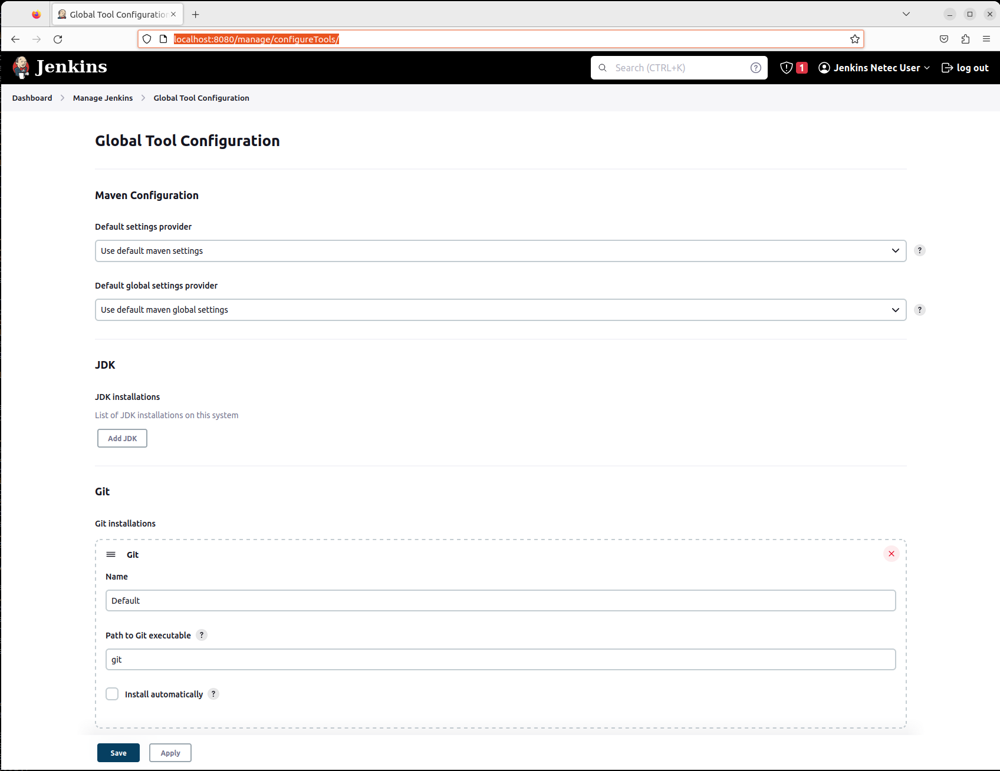
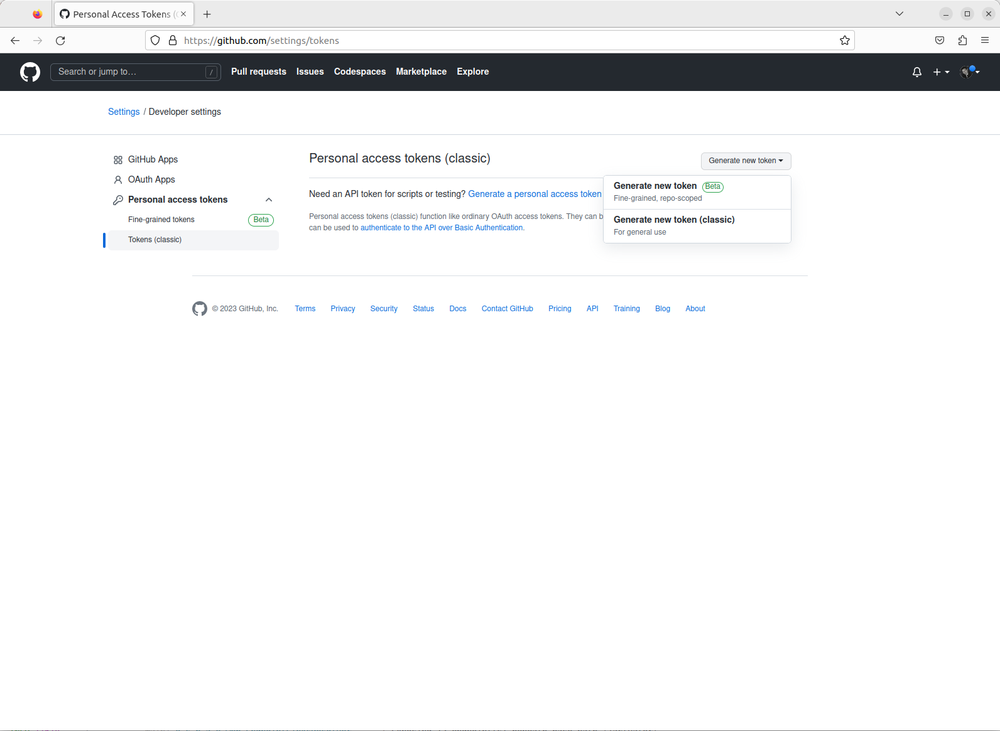
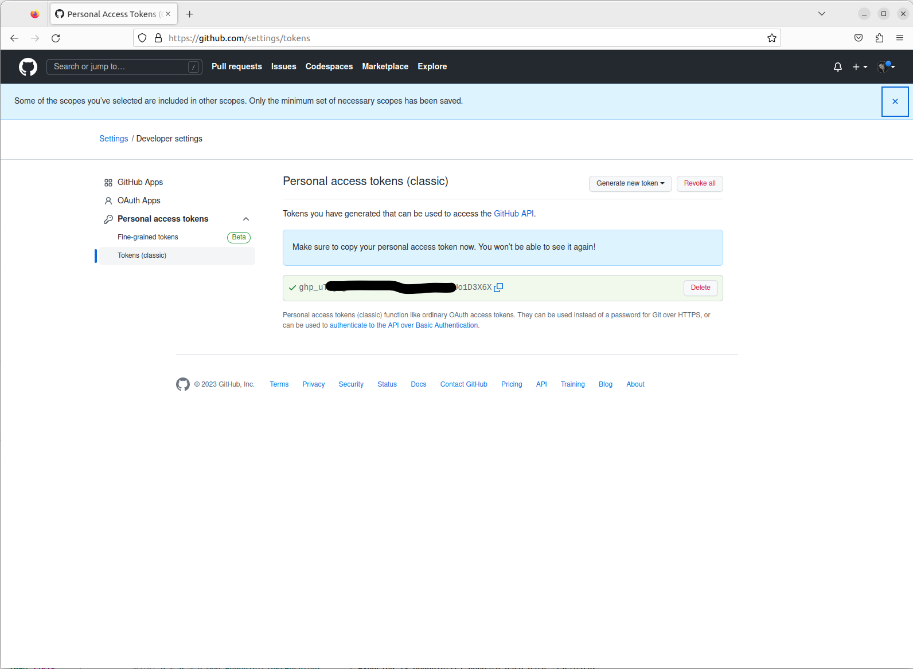
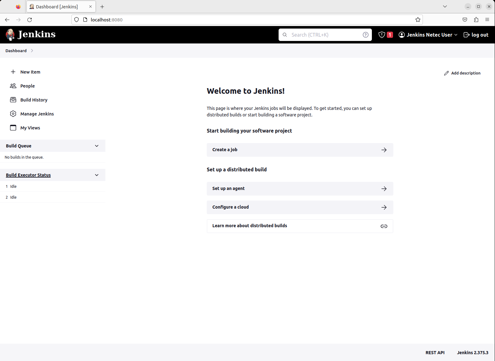
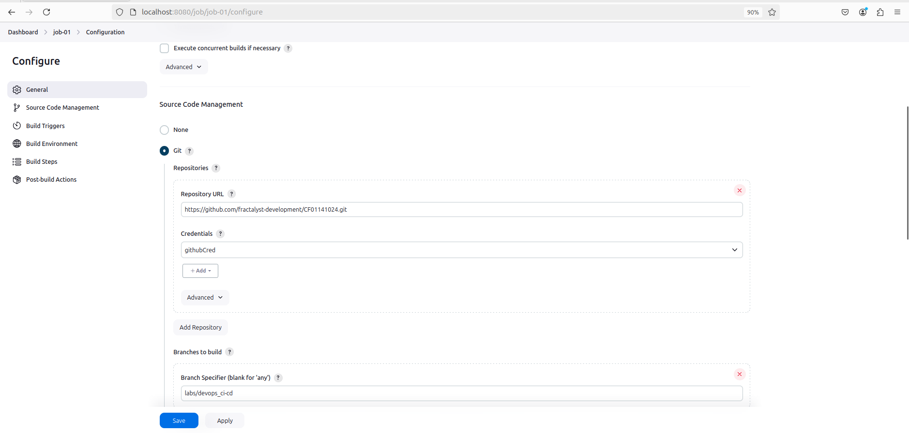
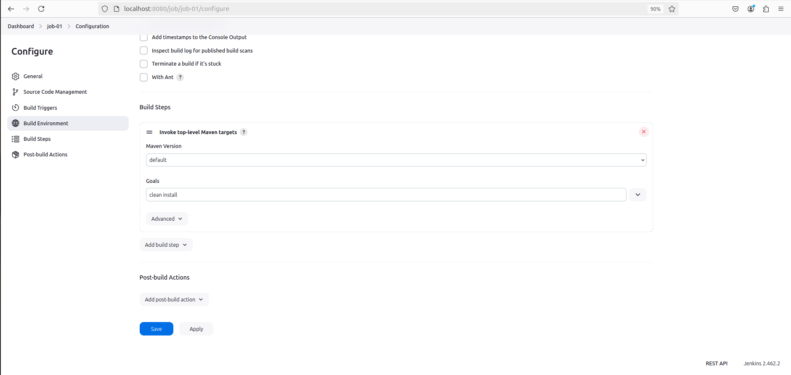

# CI-CD / JENKINS / JOBS

Tiempo aproximado: _15 minutos_

## OBJETIVO

Construir un _job_ (en _Jenkins_) para la construcción de una aplicación en _Java_.

### CONTEXTO

Using Jenkins: <https://www.jenkins.io/doc/book/using/>

## DESARROLLO

Apoyado con el instructor, realiza las siguientes actividades.

### CONFIGURACIÓN JENKINS

#### JDK Y MAVEN

En la ventana de configuración de herramientas globales (<http://localhost:8080/manage/configureTools/>) realizar la siguiente configuración:



- JDK installations (Add JDK)
  - Name: `default`
  - JAVA_HOME: `/usr/lib/jvm/java-17-openjdk-amd64`
- Maven installations (Add Maven)
  - Name: `default`
  - MAVEN_HOME: `/usr/share/maven`

#### GITHUB

Para la creación del _job_ se requiere que _Jenkins_ interactúe con _GitHub_ para lo que necesitamos crear un _Personal access token_ en el siguiente enlace: <https://github.com/settings/tokens>

En la pantalla mostrada se debe dar clic en el botón `Generate new token` y seleccionar de la lista de opciones la nombrada con `Generate new token (classic)`.



Ingresa las siguientes opciones:

- Note: `jenkinsToken`
- Expiration: `7 días`
- Select scopes: `Selecciona todas las opciones`
  - NOTA: _Por simplicidad se seleccionan todos los permisos, en el día a día no es común hacer esto._

Con esas opciones dar clic en el botón `Generate token`.



- **Guarda el token en un lugar seguro ya que no se mostrará nuevamente.**

### JENKINS / JOB

A continuación, se indican los pasos para la creación de un _job_ que construye y ejecuta de manera automática la aplicación _Spring Pet Clinic_.

#### AUTENTICACIÓN A GITHUB

Como se descargará trabajará con un repositorio en _GitHub_ se debe crear una credencial para que _Jenkins_ pueda acceder.

De cic en el botón `Add Credentials` en la siguiente pantalla en _Jenkins_: http://localhost:8080/manage/credentials/store/system/domain/_/

")

- Kind: `Username with password`
- Username: `cazucito` (SU NOMBRE DE USUARIO EN GITHUB)
- Treat username as secret: `Seleccionado`
- Secret: `PEGAR EL TOKEN DE PASO ANTERIOR`
- ID: `githubCred`
- Description: `githubCred`
- Clic en el botón `Create`

")

Ahora puede verse la credencial recién creada.

#### CREACIÓN DE UN ITEM

Desde la pantalla principal:



- Haz clic en la opción: "Create a job" o en "New Item".
  - Ingresa la siguiente información:
    - Enter an item name: `job-01`
    - Selecciona: `Freestyle project`
    - Clic en: `OK`

En la pantalla siguiente ingresa la siguiente información:

Sección General:

- General
  - Description: `Job para la descarga, construcción, pruebas y publicación de la aplicación Spring Pet Clinic.`

Sección de SCM:

- Source Code Management
  - Selecciona: `Git`
    - Repositories
      - Repository URL: `https://github.com/fractalyst-development/CF01141024.git`
        - Debe ser el repositorio de tu cuenta de usuario.
        - Inicialmente aparece un mensaje que indica problemas de autenticación:
          - _Failed to connect to repository …​ fatal: Authentication failed for <https://github.com/fractalyst-development/CF01141024.git>_
    - Credentials: `githubCred`
  - Branches to build
    - Branch Specifier (blank for 'any'): `labs/devops_ci-cd`



Sección de construcción y ejecución:

- General
  - Build steps
  - Selecciona de la lista: `Invoke top-level Maven targets`
    - Maven Version: `default`
    - Goals: `clean install`



Al dar clic en el botón `Save` se guarda el _job_ y nos lleva a su página de inicio.

#### EJECUCIÓN DEL JOB

Desde la página principal del _job_ recién creado da clic en la opción `Build now` y observa el resultado.

- NOTA: La primera ocasión que se ejecuta este _job_ descarga en el repositorio local de _Maven_ todas las dependencias requeridas, por lo que puede tardar un poco.

La salida de la ejecución debe ser similar a:

``` shell
Started by user Usuario Jenkins
Running as SYSTEM
Building in workspace /var/lib/jenkins/workspace/job-01
The recommended git tool is: NONE
using credential githubCred
Cloning the remote Git repository
Cloning repository https://github.com/fractalyst-development/CF01141024.git
 > git init /var/lib/jenkins/workspace/job-01 # timeout=10
Fetching upstream changes from https://github.com/fractalyst-development/CF01141024.git
...
[INFO] Installing /var/lib/jenkins/workspace/job-01/target/spring-petclinic-2.7.3.jar to /var/lib/jenkins/.m2/repository/org/springframework/samples/spring-petclinic/2.7.3/spring-petclinic-2.7.3.jar
[INFO] Installing /var/lib/jenkins/workspace/job-01/pom.xml to /var/lib/jenkins/.m2/repository/org/springframework/samples/spring-petclinic/2.7.3/spring-petclinic-2.7.3.pom
[INFO] [------------------------------------------------------------------------]
[INFO] [BUILD SUCCESS]
[INFO] [------------------------------------------------------------------------]
[INFO] Total time:  04:46 min
[INFO] Finished at: 2024-09-25T15:23:56-06:00
[INFO] [------------------------------------------------------------------------]
Finished: SUCCESS

```

## RESULTADO

Comente lo realizado en esta actividad.

---

[CI-CD](05.md)
