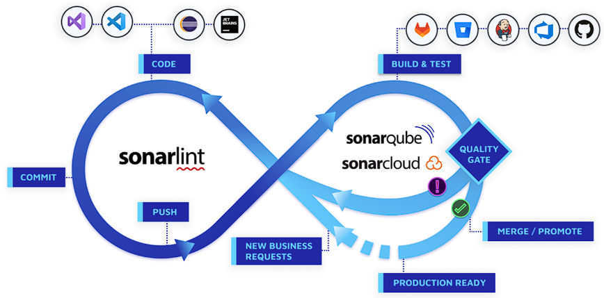
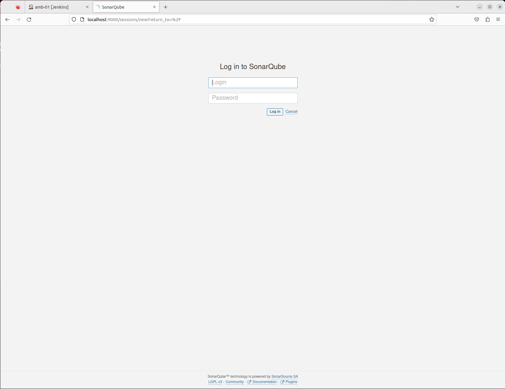
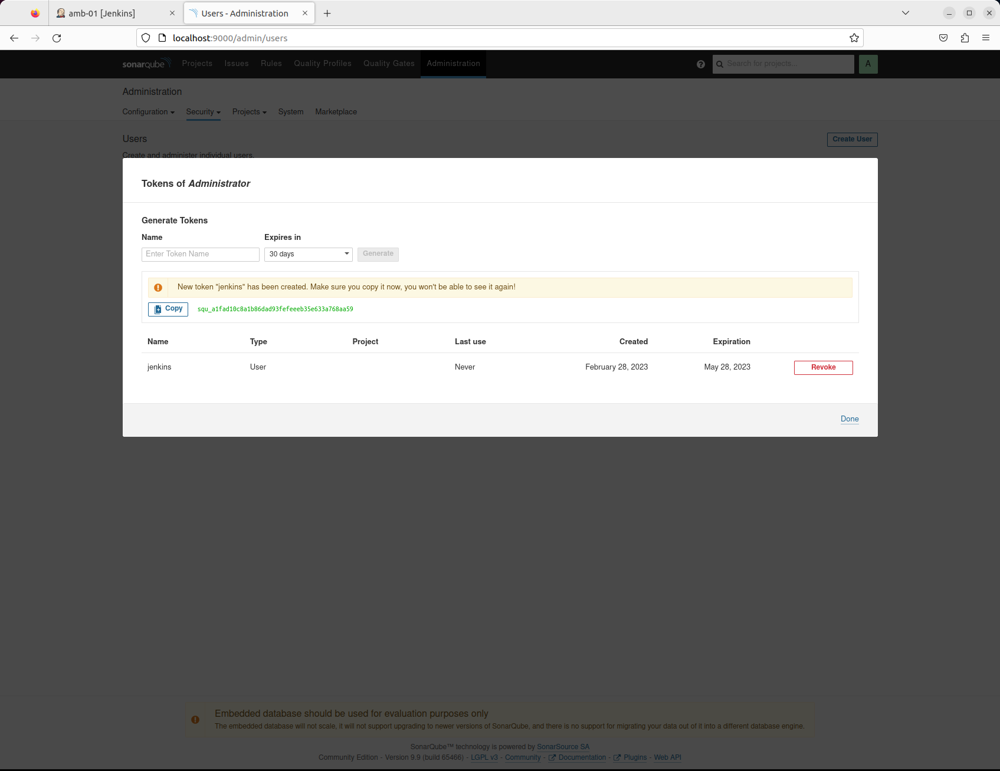
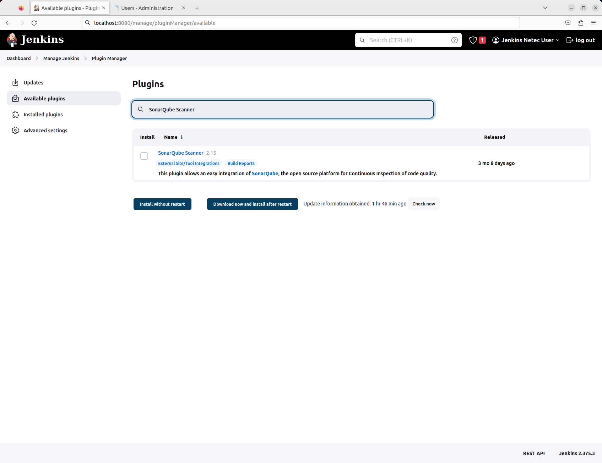
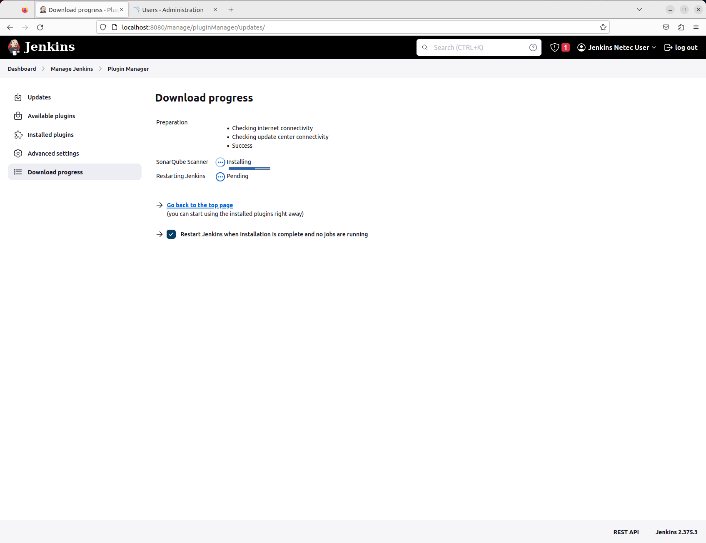
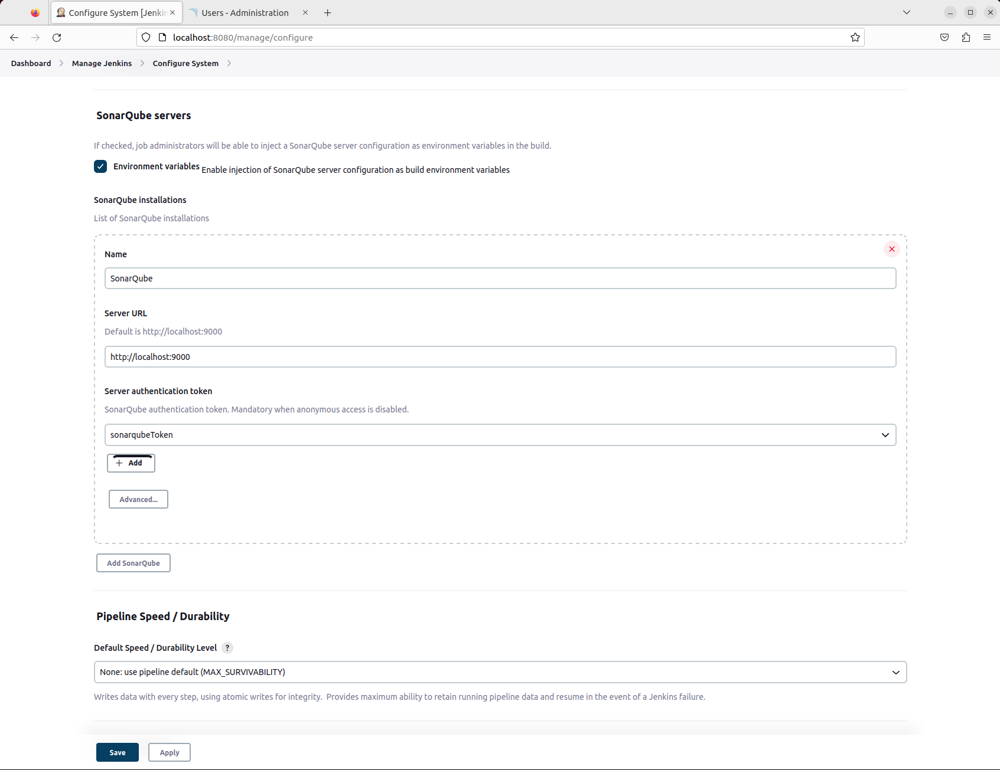
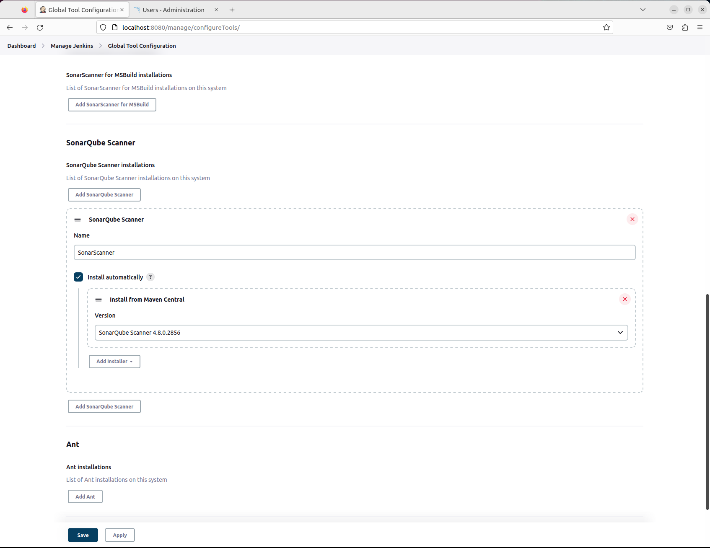

# CI-CD / JENKINS / SONARQUBE

Tiempo aproximado: _15 minutos_

## OBJETIVO

Instalar y configurar _SonarQube_ (en _Jenkins_) para su inclusión en el _job_.

## DESARROLLO

Apoyado con el instructor, realiza las siguientes actividades.

### CONTEXTO

Visitar: <https://docs.sonarqube.org/latest/>



### INSTALACIÓN

Descarga de la imagen:

``` shell
docker pull sonarqube
```

Salida similar a:

``` shell
Using default tag: latest
latest: Pulling from library/sonarqube
10ac4908093d: Pull complete
6df15e605e38: Pull complete
6e89b8aba240: Pull complete
ba4c59299320: Pull complete
360063409bd8: Pull complete
6651edf80baa: Pull complete
Digest: sha256:25e1433817b1d044b9ec7cd37cf070f4ed3131dfa8cf8a89a08928b693f97eff
Status: Downloaded newer image for sonarqube:latest
docker.io/library/sonarqube:latest
```

Creación del contenedor:

``` shell
docker run --detach --name sonarqube --publish 9000:9000 --publish 9092:9092 sonarqube
```

Salida similar a:

``` shell
378c414a0cb225433f7a4b3c7085a2226389667eb95a05307fcd83857efe39b4
```

### CONFIGURACIÓN INICIAL

Ingrese la dirección <http://localhost:9000> para ingresar a la interfaz gráfica de _Sonarqube_.



El usuario y contraseña predeterminado es `admin`, al ingresarlo solicitará cambiarlo. Utiliza los siguientes:

- Contraseña actual: `admin`
- Nueva contraseña: `Usu_2012`
- Confirmación de contraseña: `Usu_2012`

#### TOKEN

En el enlace <http://localhost:9000/admin/users> da clic en la opción de actualizar tokens localizada en la columna `Tokens` del usuario `Administrador`.

En la ventana contextual `Tokens of Administrator` ingrese:

- Name: `jenkinsToken`
- Expiration: `30 días`

Da clic en el botón `Generate`.



- Guarda el token en un lugar seguro ya que no se mostrará nuevamente.

Para concluir este paso da clic en el enlace `Done`.

### CONFIGURACIÓN EN JENKINS

#### AUTENTICACIÓN A SONARQUBE

Para la comunicación de _Jenkins_ y _SonarQube_ se debe crear una credencial.

Da clic en el botón `Add Credentials` en la siguiente pantalla en _Jenkins_: <http://localhost:8080/manage/credentials/store/system/domain/_/>

")

- Kind: `Secret text`
- Secret: `PEGAR EL TOKEN DE PASO ANTERIOR`
- ID: `sonarqubeToken`
- Description: `sonarqubeToken`
- Clic en el botón `Create`

")

Ahora puede verse la credencial recién creada.

#### PLUGIN: SONARQUBE SCANNER

En un navegador web ingresa el enlace <http://localhost:8080/manage/pluginManager/available> para configurar el _plugin_ de _SonarQube_ en _Jenkins_.

En el campo de búsqueda ingrese: `SonarQube Scanner`



Marca la opción de `Install` y da clic en el botón `Download now and install after restart`.



Marca la opción `Restart Jenkins when installation is complete and no jobs are running` y espera hasta que se termine la instalación.

- Después de haber esperado unos 3-5 minutos y no ver cambios actualiza la pantalla.

##### CONFIGURACIÓN

En la opción `Configure System` de _Jenkins_ en el enlace: <http://localhost:8080/manage/configure>, localiza la sección `SonarQube servers` e ingresa la información:

- SonarQube servers
  - Marca `Environment variables`
  - Clic en botón `Add SonarQube`
    - Name: `SonarQube`
    - Server URL: `http://localhost:9000`
    - Server authentication token: `sonarqubeToken`

Da clic en `Apply` y `Save`.



##### SONARQUBE SCANNER

En la ventana de configuración de herramientas globales (<http://localhost:8080/manage/configureTools/>) realizar la siguiente configuración:

- SonarQube Scanner
  - Name: `SonarScanner`
  - Install automatically: `marcado`
  - Install from Maven Central: Última versión (Por ejemplo: `SonarQube Scanner 6.2.0.4584`)



Da clic en `Apply` y `Save`.

## RESULTADO

Comente lo aprendido en esta actividad.

---

[CI-CD](05.md)
