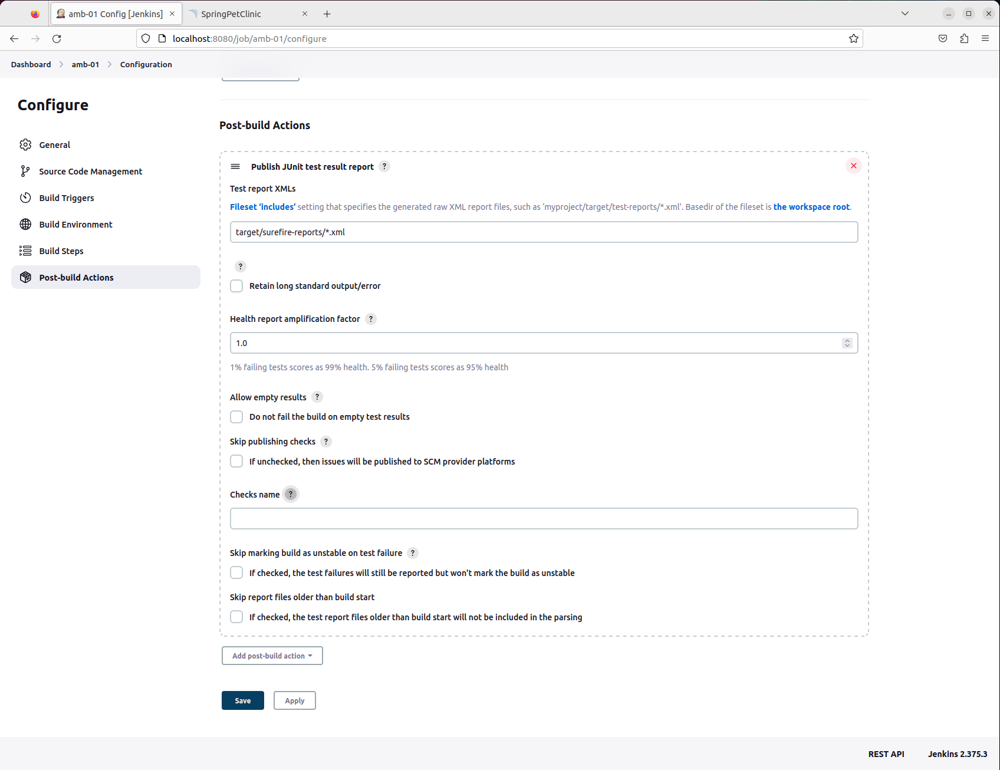
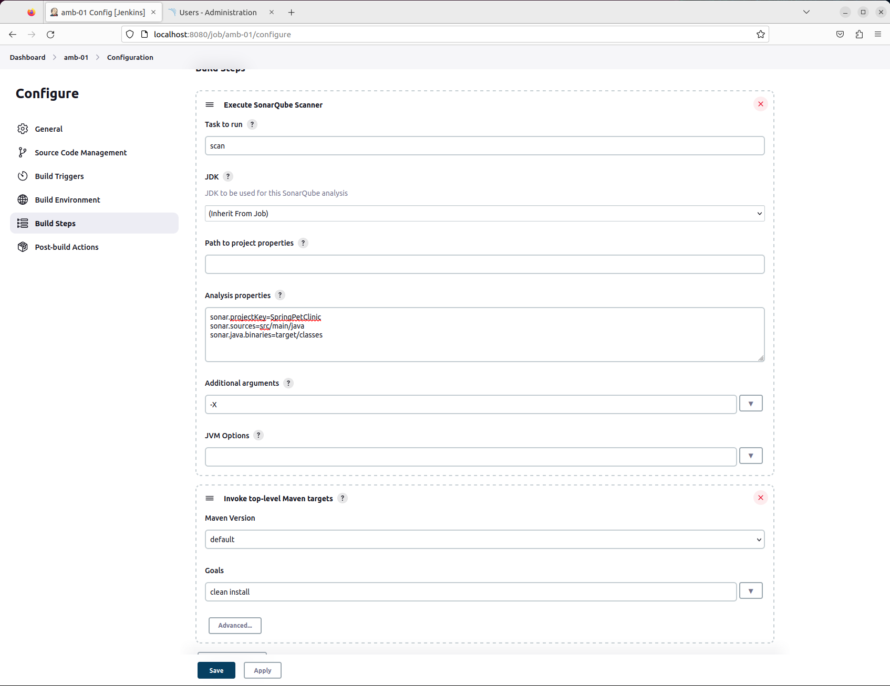
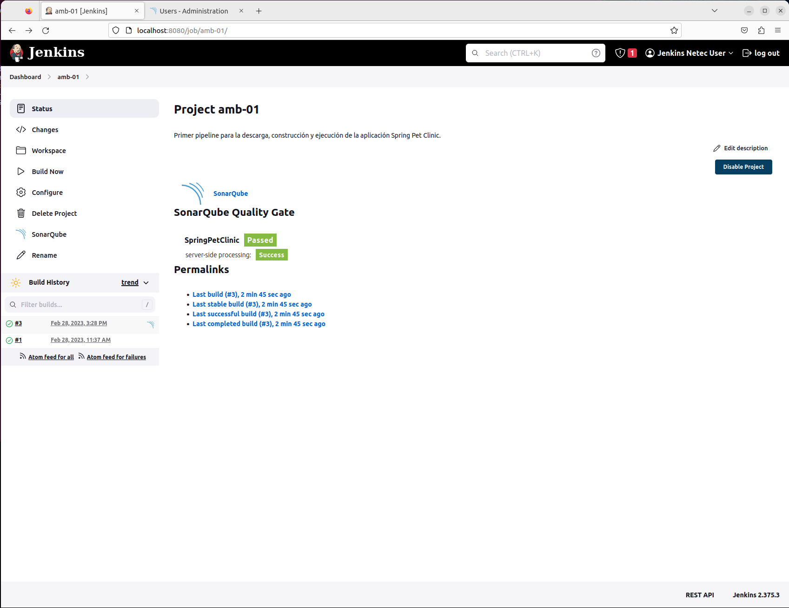
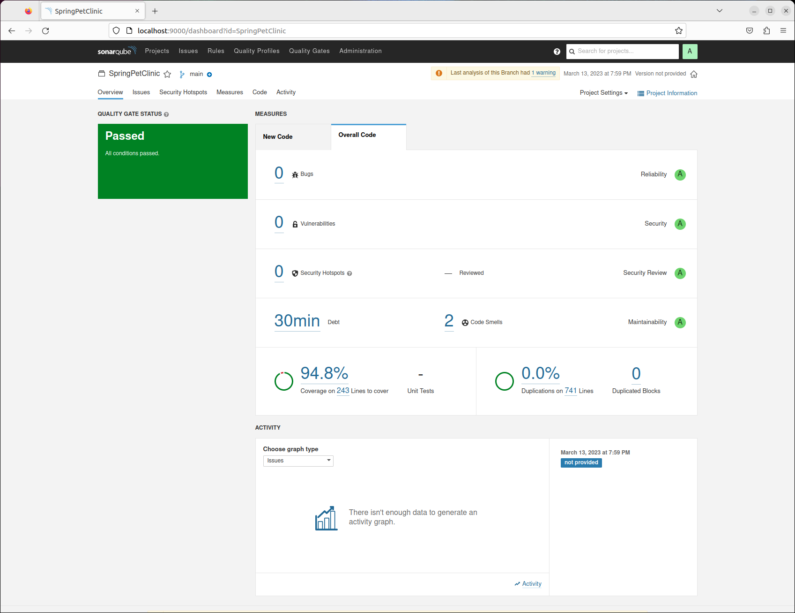

# CI-CD / JENKINS / SONARQUBE

Tiempo aproximado: _15 minutos_

## OBJETIVO

Adicionar pruebas automáticas al _job_.

## DESARROLLO

Apoyado con el instructor, realiza las siguientes actividades.

### JUNIT

Antes de adicionar el escaneo de _SonarQube_, adicionaremos una acción post construcción para publicar el reporte de JUnit.

En el enlace <http://localhost:8080/job/job-01/configure> localiza la sección `Post-build Actions`.

Del botón `Add post-build action` selecciona la opción `Publish JUnit test result report` y provee la información siguiente:

- Post-build Actions
  - Test reports XMLs: `target/surefire-reports/*.xml`



Para guardar las modificaciones, da clic en `Apply` y en `Save`.

### SONARQUBE SCANNER

En el enlace <http://localhost:8080/job/job-01/configure> localiza la sección `Build Steps`.

Del botón `Add build step` selecciona la opción `Execute SonarQube Scanner` y provee la información siguiente:

- Execute SonarQube Scanner
  - Task to run: `scan`
    - Esta opción puede no aparecer.
  - Analysis properties:
    - `sonar.projectKey=SpringPetClinic`
    - `sonar.sources=src/main/java`
    - `sonar.java.binaries=target/classes`
  - Additional arguments: `-X`

Ahora mueve el paso para que sea el primero en ejecutar. Debe quedar sobre la invocación de _Maven_.



Para guardar las modificaciones, da clic en `Apply` y en `Save`.

### EJECUCIÓN JOB

Desde la página principal del _job_ recién creado da clic en la opción `Build now` y observe el resultado.

La salida de la ejecución debe ser similar a:

``` shell
Started by user Usuario Jenkins
Running as SYSTEM
Building in workspace /var/lib/jenkins/workspace/job-01
The recommended git tool is: NONE
using credential githubCred
 > git rev-parse --resolve-git-dir /var/lib/jenkins/workspace/job-01/.git # timeout=10
Fetching changes from the remote Git repository
 > git config remote.origin.url https://github.com/fractalyst-development/CF01141024.git # timeout=10
Fetching upstream changes from https://github.com/fractalyst-development/CF01141024.git
...


              |\      _,,,--,,_
             /,`.-'`'   ._  \-;;,_
  _______ __|,4-  ) )_   .;.(__`'-'__     ___ __    _ ___ _______
 |       | '---''(_/._)-'(_\_)   |   |   |   |  |  | |   |       |
 |    _  |    ___|_     _|       |   |   |   |   |_| |   |       | __ _ _
 |   |_| |   |___  |   | |       |   |   |   |       |   |       | \ \ \ \
 |    ___|    ___| |   | |      _|   |___|   |  _    |   |      _|  \ \ \ \
 |   |   |   |___  |   | |     |_|       |   | | |   |   |     |_    ) ) ) )
 |___|   |_______| |___| |_______|_______|___|_|  |__|___|_______|  / / / /
 ==================================================================/_/_/_/

:: Built with Spring Boot :: 2.7.3


2024-09-25 16:10:07.705  INFO 15620 --- [           main] o.s.s.p.owner.VisitControllerTests       : Starting VisitControllerTests using Java 17.0.12 on vm with PID 15620 (started by jenkins in /var/lib/jenkins/workspace/job-01)
2024-09-25 16:10:07.707  INFO 15620 --- [           main] o.s.s.p.owner.VisitControllerTests       : No active profile set, falling back to 1 default profile: "default"
2024-09-25 16:10:08.462  INFO 15620 --- [           main] o.s.b.t.m.w.SpringBootMockServletContext : Initializing Spring TestDispatcherServlet ''
2024-09-25 16:10:08.463  INFO 15620 --- [           main] o.s.t.web.servlet.TestDispatcherServlet  : Initializing Servlet ''
2024-09-25 16:10:08.464  INFO 15620 --- [           main] o.s.t.web.servlet.TestDispatcherServlet  : Completed initialization in 1 ms
2024-09-25 16:10:08.474  INFO 15620 --- [           main] o.s.s.p.owner.VisitControllerTests       : Started VisitControllerTests in 0.817 seconds (JVM running for 36.568)
[INFO] 1;32mTests run: 0;1;32m3, Failures: 0, Errors: 0, Skipped: 0, Time elapsed: 0.96 s - in org.springframework.samples.petclinic.owner.VisitControllerTests
2024-09-25 16:10:08.647  INFO 15620 --- [ionShutdownHook] j.LocalContainerEntityManagerFactoryBean : Closing JPA EntityManagerFactory for persistence unit 'default'
2024-09-25 16:10:08.649  INFO 15620 --- [ionShutdownHook] com.zaxxer.hikari.HikariDataSource       : HikariPool-1 - Shutdown initiated...
2024-09-25 16:10:08.685  INFO 15620 --- [ionShutdownHook] com.zaxxer.hikari.HikariDataSource       : HikariPool-1 - Shutdown completed.
2024-09-25 16:10:08.903  INFO 15620 --- [ionShutdownHook] j.LocalContainerEntityManagerFactoryBean : Closing JPA EntityManagerFactory for persistence unit 'default'
2024-09-25 16:10:08.916  INFO 15620 --- [ionShutdownHook] org.ehcache.core.EhcacheManager          : Cache 'vets' removed from EhcacheManager.
2024-09-25 16:10:08.925  INFO 15620 --- [ionShutdownHook] com.zaxxer.hikari.HikariDataSource       : HikariPool-2 - Shutdown initiated...
2024-09-25 16:10:08.940  INFO 15620 --- [ionShutdownHook] com.zaxxer.hikari.HikariDataSource       : HikariPool-2 - Shutdown completed.
[INFO] 
[INFO] Results:
[INFO] 
[WARNING] Tests run: 41, Failures: 0, Errors: 0, Skipped: 1
[INFO] 
[INFO] 
[INFO] --- jacoco-maven-plugin:0.8.7:report (report) @ 36mspring-petclinic0; ---
[INFO] Loading execution data file /var/lib/jenkins/workspace/job-01/target/jacoco.exec
[INFO] Analyzed bundle 'petclinic' with 20 classes
[INFO] 
[INFO] --- maven-jar-plugin:3.2.2:jar (default-jar) @ 36mspring-petclinic0; ---
[INFO] Building jar: /var/lib/jenkins/workspace/job-01/target/spring-petclinic-2.7.3.jar
[INFO] 
[INFO] --- spring-boot-maven-plugin:2.7.3:repackage (repackage) @ 36mspring-petclinic0; ---
[INFO] Replacing main artifact with repackaged archive
[INFO] 
[INFO] --- maven-install-plugin:2.5.2:install (default-install) @ 36mspring-petclinic0; ---
[INFO] Installing /var/lib/jenkins/workspace/job-01/target/spring-petclinic-2.7.3.jar to /var/lib/jenkins/.m2/repository/org/springframework/samples/spring-petclinic/2.7.3/spring-petclinic-2.7.3.jar
[INFO] Installing /var/lib/jenkins/workspace/job-01/pom.xml to /var/lib/jenkins/.m2/repository/org/springframework/samples/spring-petclinic/2.7.3/spring-petclinic-2.7.3.pom
[INFO] ------------------------------------------------------------------------
[INFO] BUILD SUCCESS
[INFO] ------------------------------------------------------------------------
[INFO] Total time:  01:03 min
[INFO] Finished at: 2024-09-25T16:10:11-06:00
[INFO] ------------------------------------------------------------------------
Recording test results
[Checks API] No suitable checks publisher found.
Finished: SUCCESS
```

### REPORTE EN SONARQUBE

En el enlace <http://localhost:8080/job/job-01/> da clic en el ícono de _SonarQube_ que aparece.



Da clic en el enlace con el texto _SonarQube_ o vaya a este enlace en el navegador web: <http://localhost:9000/dashboard?id=SpringPetClinic>.



## RESULTADO

Comente lo trabajado en esta actividad.

---

[CI-CD](05.md)
