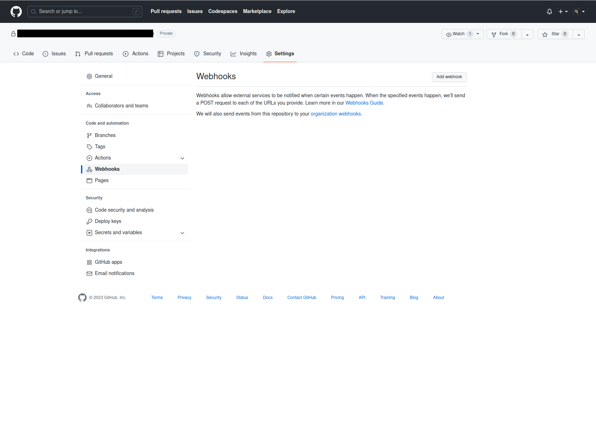
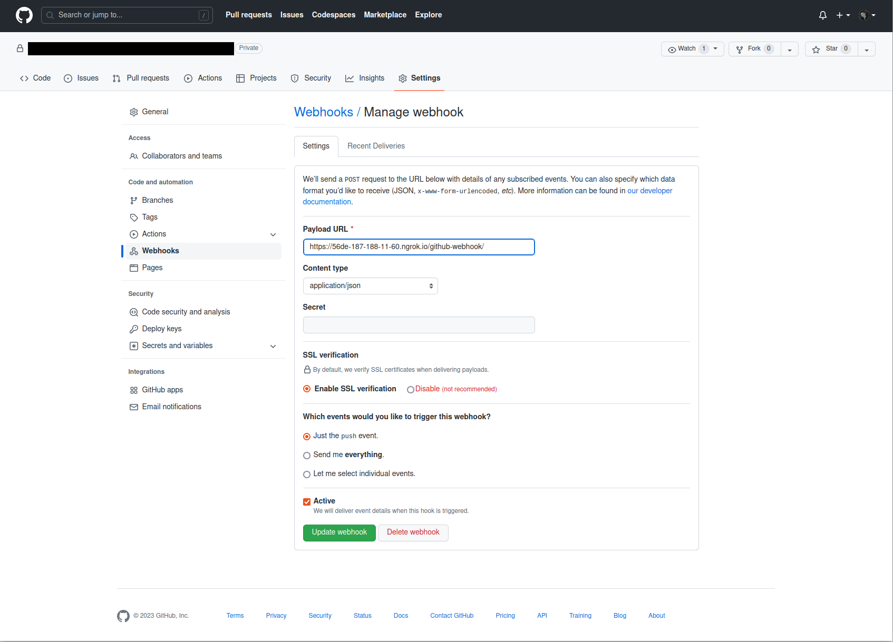
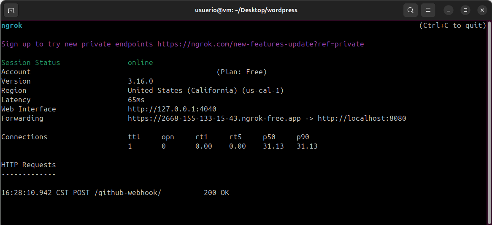

# CI-CD / JENKINS / GITHUB / WEBHOOKS / CONFIGURACIÓN

Tiempo aproximado: _15 minutos_

## OBJETIVO

Instalar la herramienta _ngrok_ para recibir notificaciones desde _GitHub_ a _Jenkins_.
Configurar un _webhook_ en _GitHub_.

## DESARROLLO

Apoyado con el instructor, realiza las siguientes actividades.

### NGROK

#### INSTALACIÓN

Para instalar ejecuta el comando:

``` shell
snap install ngrok
```

Con una salida semejante a:

``` shell
ngrok (v3/stable) 3.1.0 from Kyle Wenholz (kyle-ngrok) installed
```

#### TOKEN

Para obtener el token de utilización se requiere crear una cuenta en <https://dashboard.ngrok.com/signup>. Se recomienda autenticarse con _GitHub_ (Sign up with GitHub).

Una vez autenticado, se procede a activar _ngrok_ ejecutando en una terminal de comandos:

``` shell
ngrok config add-authtoken TOKEN_PERSONAL
```

Con una salida similar a:

``` shell
Authtoken saved to configuration file: /home/usuario/snap/ngrok/89/.config/ngrok/ngrok.yml
```

#### EJECUCIÓN

En una terminal de comandos que se quedará activa hasta que se ejecuta `Control+C` se procede a iniciar _ngrok_.

``` shell
ngrok http 8080
```

Con una salida similar a:

``` shell
ngrok                                                                                                                 (Ctrl+C to quit)


Want to improve ngrok? Take our survey:  https://ngrok.com/survey

Session Status                online
Account                       cabrera-pedro (Plan: Free)
Update                        update available (version 3.1.1, Ctrl-U to update)
Version                       3.1.0
Region                        United States (us)
Latency                       55ms
Web Interface                 http://127.0.0.1:4040
Forwarding                    https://56de-187-188-11-60.ngrok.io -> http://localhost:8080

Connections                   ttl     opn     rt1     rt5     p50     p90
                              0       0       0.00    0.00    0.00    0.00
```

En la parte inferior, en la sección `Connections` irán apareciendo las notificaciones enviadas por _GitHub_.

### WEBHOOK EN GITHUB

Selecciona la opción `Settings` y `Webhooks` en tu repositorio de trabajo.



En esa pantalla da clic en el botón `Add webhook` y provee la siguiente información:

- `Webhooks` / `Add webhook`
  - `Payload URL`: <https://56de-187-188-11-60.ngrok.io/github-webhook/>
    - La dirección proporcionada por la herramienta _ngrok_ más el sufijo `/github-webhook/`.
  - `Content type`: application/json



Para guardar las modificaciones, da clic en `Add webhook`.

Verifica en la ventana de _ngrok_ que el _webhook_ se ha comunicado correctamente.



## RESULTADO

Comente lo trabajado en esta actividad.

---

[CI-CD](05.md)
