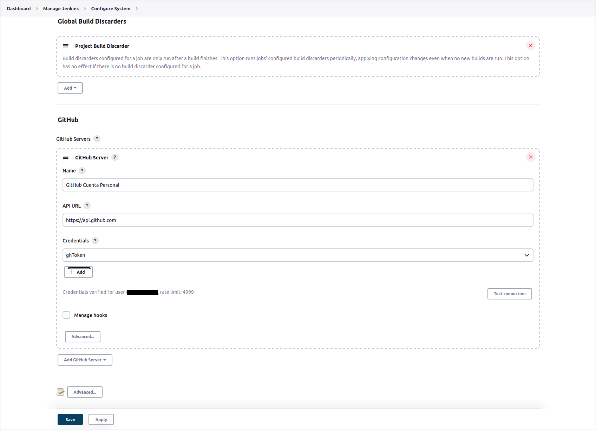

# CI-CD / JENKINS / GITHUB / WEBHOOKS / PIPELINE

Tiempo aproximado: _15 minutos_

## OBJETIVO

Configurar el _job_ para responder a un evento _push_ al repositorio en _GitHub_.

## DESARROLLO

Apoyado con el instructor, realiza las siguientes actividades.

### GITHUB: CREDENCIALES

Como se realizarán diferentes acciones sobre el repositorio en _GitHub_ se debe crear una credencial para _Jenkins_.

Da cic en el botón `Add Credentials` en la siguiente pantalla en _Jenkins_: <http://localhost:8080/manage/credentials/store/system/domain/_/>

- Kind: `Secret Text`
- Secret: `PEGAR EL TOKEN DE GITHUB`
- ID: `githubToken`
- Description: `githubToken`
- Clic en el botón `Create`

")

Ahora puede verse el token recién creado.

### JENKINS / AUTENTICACIÓN

En el enlace <http://localhost:8080/manage/configure> localiza la sección `GitHub` y provee la información siguiente:

- GitHub
  - GitHub Server
  - Add GitHub Server
    - Name: `GitHub Cuenta Personal`
    - Credentials: `githubToken`

Da clic en el botón `Test Connection` para validar la conexión con _GitHub_:

- Credentials verified for user cabrera-pedro, rate limit: 4999



Para guardar los cambios de clic en el botón `Apply` y luego en `Save`.

### JOB

En el enlace <http://localhost:8080/job/job-01/configure> modifique según la información mostrada:

Sección General:

- General
  - Description: `Job para la descarga, construcción y ejecución de la aplicación _Spring Pet Clinic_ activado por un evento push en el repositorio en GitHub.`
    - GitHub project: `Marcado`
    - Project url: `https://github.com/fractalyst-development/CF01141024.git`
      - Sustituye el valor por el de su _fork_.

Sección de SCM:

- `Source Code Management`
  - Selecciona: `Git`
    - Repositories
      - Repository URL: `https://github.com/fractalyst-development/CF01141024.git`
        - Sustituye el valor por el de su _fork_.
        - Inicialmente aparece un mensaje que indica problemas de autenticación: "Failed to connect to repository …​ fatal: Authentication failed for https://github.com/fractalyst-development/CF01141024.git"
      - Credentials: `githubCred`
    - Branches to build
      - Branch Specifier (blank for 'any'): `labs/devops_ci-cd_add-new-feature`

Sección de disparadores:

- Build Triggers
  - GitHub hook trigger for GITScm polling: `Marcado`

Sección de construcción y ejecución:

- Build steps
  - Selecciona de la lista: `Execute shell`
    - Command:
      - `git stash`
      - `git switch labs/devops_ci-cd`
      - `git merge origin/labs/devops_ci-cd_add-new-feature`

**Este paso debe ir al final de la sección.**

Sección de acciones post construcción:

- Post-build Actions
  - Selecciona de la lista: `Git Publisher`
    - Push Only If Build Succeeds: `Marcada`
  - Branches
    - Branch to push:
      - `labs/devops_ci-cd`
    - Target remote name
      - `origin`

Este paso debe ir al final de la sección.

Para guardar los cambios de clic en el botón `Apply` y luego en `Save`.

### REPOSITORIO LOCAL

En la terminal de comando (en el repositorio de trabajo) realiza lo siguiente:

- Actualiza el repositorio local
  - `git switch labs/devops_ci-cd`
  - `git pull`
- Crea la nueva rama `labs/devops_ci-cd_add-new-feature` a partir de `labs/devops_ci-cd`
  - `git branch labs/devops_ci-cd_add-new-feature labs/devops_ci-cd`
- Cámbiate en la nueva rama
  - `git switch labs/devops_ci-cd_add-new-feature`
- Crea un nuevo archivo llamado `NuevaFeature.md` y adiciona un texto.
  - Sí el archivo existe, agrega contenido
- Adiciona los cambios al área de _stage_
  - `git add NuevaFeature.md`
- Confirma los cambios
  - `git commit --message="Nueva feature 01"`
- Sube los cambios al repositorio remoto
  - `git push --set-upstream origin labs/devops_ci-cd_add-new-feature`

Después de la ejecución de los comandos previos, ir a la página de _job_ en _Jenkins_.

La salida deberá ser similar a:

``` shell
Started by GitHub push by cazucito
Running as SYSTEM
Building in workspace /var/lib/jenkins/workspace/job-01
The recommended git tool is: NONE
using credential githubCred
 > git rev-parse --resolve-git-dir /var/lib/jenkins/workspace/job-01/.git # timeout=10
Fetching changes from the remote Git repository

...

 [INFO] 
 [INFO] --- maven-install-plugin:2.5.2:install (default-install) @ spring-petclinic ---
 [INFO] Installing /var/lib/jenkins/workspace/job-01/target/spring-petclinic-2.7.3.jar to /var/lib/jenkins/.m2/repository/org/springframework/samples/spring-petclinic/2.7.3/spring-petclinic-2.7.3.jar
 [INFO] Installing /var/lib/jenkins/workspace/job-01/pom.xml to /var/lib/jenkins/.m2/repository/org/springframework/samples/spring-petclinic/2.7.3/spring-petclinic-2.7.3.pom
 [INFO] ------------------------------------------------------------------------
 [INFO] BUILD SUCCESS
 [INFO] ------------------------------------------------------------------------
 [INFO] Total time:  01:12 min
 [INFO] Finished at: 2024-09-25T17:02:03-06:00
 [INFO] ------------------------------------------------------------------------
[job-01] $ /bin/sh -xe /tmp/jenkins6012820034020226292.sh
+ git stash
No local changes to save
+ git switch labs/devops_ci-cd
Previous HEAD position was 0ffe906 Nueva feature 01
Switched to a new branch 'labs/devops_ci-cd'
branch 'labs/devops_ci-cd' set up to track 'origin/labs/devops_ci-cd'.
+ git merge origin/labs/devops_ci-cd_add-new-feature
Updating b68acd0..0ffe906
Fast-forward
 NuevaFeature.md | 4 ++++
 1 file changed, 4 insertions(+)
 create mode 100644 NuevaFeature.md
Recording test results
[Checks API] No suitable checks publisher found.
The recommended git tool is: NONE
using credential githubCred
Pushing HEAD to branch labs/devops_ci-cd at repo origin
 > git --version # timeout=10
 > git --version # 'git version 2.43.0'
using GIT_ASKPASS to set credentials githubCred
 > git push https://github.com/fractalyst-development/CF01141024.git HEAD:labs/devops_ci-cd # timeout=10
Finished: SUCCESS
```

Verifique que los cambios realizados al repositorio ya se encuentran en _GitHub_.

## RESULTADO

Comente lo trabajado en esta actividad.

---

[CI-CD](05.md)
