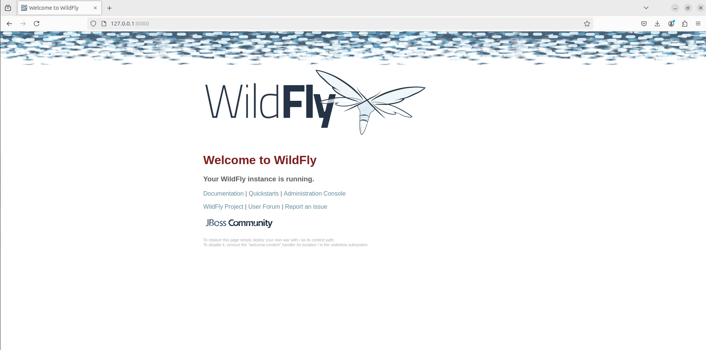
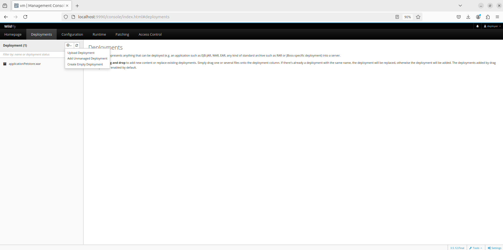
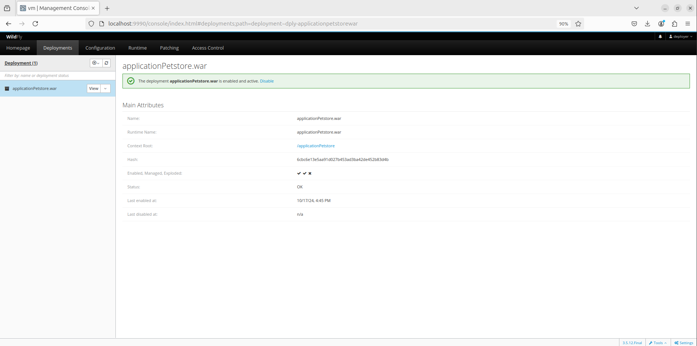
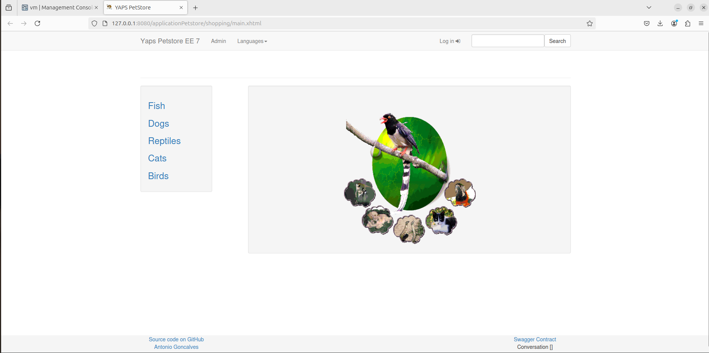

# JAVA PET STORE - Java EE7

Tiempo aproximado: _15 minutos_

## OBJETIVO

En esta actividad se realiza un breve recorrido por el mundo de las aplicaciones distribuidas en la plataforma tecnológica Java EE.

## PRERREQUISITOS

### REPOSITORIO

Esta actividad requiere que el repositorio de trabajo este en:

- Rama: `labs/software-architectures`
  - Se recomienda siempre trabajar sobre una rama _feature_.
    - `git checkout -b labs/software-architectures_cazucito`
- Carpeta: `PetstoreJavaEE7`

## CONTEXTO

1. Visite los siguientes enlaces
   1. [Java BluePrints](https://en.wikipedia.org/wiki/Java_BluePrints)
   2. [Introducing the Java Pet Store 2.0 Application](https://www.oracle.com/technical-resources/articles/javaee/pet-store-application.html)
2. Comente sus impresiones
   1. ¿Qué son los BluePrints?
   2. ¿Qué es la Java Pet Store?
      1. ¿La conocía?
      2. ¿La considera relevante?

## DESARROLLO

### APLICACIÓN N-NIVELES

### ANÁLISIS

Abra el proyecto en un editor de código, por ejemplo _Visual Studio Code_; y revise los elementos que la conforman.

- Comente sus observaciones.

### CONSTRUCCIÓN

Para construir la aplicación, en la carpeta raíz del proyecto ejecute en una terminal de comandos lo siguiente:

``` shell
mvn clean package
```

_Es probable que se descarguen dependencias por lo que el proceso de construcción puede tardar algunos minutos._

Se obtiene una salida semejante a:

``` shell
[INFO] Scanning for projects...
[INFO] 
[INFO] ----------------< org.agoncal.application:petstoreee7 >-----------------
[INFO] Building Petstore application using Java EE 7 7.0
[INFO] --------------------------------[ war ]---------------------------------
[INFO] 
[INFO] --- maven-clean-plugin:2.5:clean (default-clean) @ petstoreee7 ---
[INFO] Deleting /home/usuario/Desktop/CF01141024/PetstoreJavaEE7/target
[INFO] 
[INFO] --- maven-resources-plugin:2.6:resources (default-resources) @ petstoreee7 ---
[INFO] Using 'UTF-8' encoding to copy filtered resources.
[INFO] Copying 10 resources
[INFO] 
[INFO] --- maven-compiler-plugin:3.1:compile (default-compile) @ petstoreee7 ---
[INFO] Changes detected - recompiling the module!
[INFO] Compiling 68 source files to /home/usuario/Desktop/CF01141024/PetstoreJavaEE7/target/classes
[INFO] 
[INFO] --- swagger-maven-plugin:3.1.8:generate (default) @ petstoreee7 ---
[INFO] 
[INFO] --- maven-resources-plugin:2.6:testResources (default-testResources) @ petstoreee7 ---
[INFO] Using 'UTF-8' encoding to copy filtered resources.
[INFO] Copying 1 resource
[INFO] 
[INFO] --- maven-compiler-plugin:3.1:testCompile (default-testCompile) @ petstoreee7 ---
[INFO] Changes detected - recompiling the module!
[INFO] Compiling 34 source files to /home/usuario/Desktop/CF01141024/PetstoreJavaEE7/target/test-classes
[WARNING] /home/usuario/Desktop/CF01141024/PetstoreJavaEE7/src/test/java/org/agoncal/application/petstore/view/admin/OrderLineBeanIT.java: Some input files use or override a deprecated API that is marked for removal.
[WARNING] /home/usuario/Desktop/CF01141024/PetstoreJavaEE7/src/test/java/org/agoncal/application/petstore/view/admin/OrderLineBeanIT.java: Recompile with -Xlint:removal for details.
[INFO] 
[INFO] --- maven-surefire-plugin:3.0.0-M8:test (default-test) @ petstoreee7 ---
[INFO] Using auto detected provider org.apache.maven.surefire.junit4.JUnit4Provider
[INFO] 
[INFO] -------------------------------------------------------
[INFO]  T E S T S
[INFO] -------------------------------------------------------
[INFO] Running org.agoncal.application.petstore.model.AddressTest
[INFO] Tests run: 1, Failures: 0, Errors: 0, Skipped: 0, Time elapsed: 0.738 s - in org.agoncal.application.petstore.model.AddressTest
[INFO] Running org.agoncal.application.petstore.model.PurchaseOrderTest
[INFO] Tests run: 1, Failures: 0, Errors: 0, Skipped: 0, Time elapsed: 0.155 s - in org.agoncal.application.petstore.model.PurchaseOrderTest
[INFO] Running org.agoncal.application.petstore.model.OrderLineTest
[INFO] Tests run: 1, Failures: 0, Errors: 0, Skipped: 0, Time elapsed: 0.073 s - in org.agoncal.application.petstore.model.OrderLineTest
[INFO] Running org.agoncal.application.petstore.model.CreditCardTest
[INFO] Tests run: 1, Failures: 0, Errors: 0, Skipped: 0, Time elapsed: 0.01 s - in org.agoncal.application.petstore.model.CreditCardTest
[INFO] Running org.agoncal.application.petstore.model.ProductTest
[INFO] Tests run: 1, Failures: 0, Errors: 0, Skipped: 0, Time elapsed: 0.001 s - in org.agoncal.application.petstore.model.ProductTest
[INFO] Running org.agoncal.application.petstore.model.CategoryTest
[INFO] Tests run: 1, Failures: 0, Errors: 0, Skipped: 0, Time elapsed: 0.034 s - in org.agoncal.application.petstore.model.CategoryTest
[INFO] Running org.agoncal.application.petstore.model.ItemTest
[INFO] Tests run: 1, Failures: 0, Errors: 0, Skipped: 0, Time elapsed: 0.09 s - in org.agoncal.application.petstore.model.ItemTest
[INFO] Running org.agoncal.application.petstore.model.CustomerTest
[INFO] Tests run: 1, Failures: 0, Errors: 0, Skipped: 0, Time elapsed: 0.168 s - in org.agoncal.application.petstore.model.CustomerTest
[INFO] Running org.agoncal.application.petstore.model.CountryTest
[INFO] Tests run: 1, Failures: 0, Errors: 0, Skipped: 0, Time elapsed: 0.033 s - in org.agoncal.application.petstore.model.CountryTest
[INFO] 
[INFO] Results:
[INFO] 
[INFO] Tests run: 9, Failures: 0, Errors: 0, Skipped: 0
[INFO] 
[INFO] 
[INFO] --- maven-war-plugin:3.1.0:war (default-war) @ petstoreee7 ---
[INFO] Packaging webapp
[INFO] Assembling webapp [petstoreee7] in [/home/usuario/Desktop/CF01141024/PetstoreJavaEE7/target/applicationPetstore]
[INFO] Processing war project
[INFO] Copying webapp resources [/home/usuario/Desktop/CF01141024/PetstoreJavaEE7/src/main/webapp]
[INFO] Webapp assembled in [365 msecs]
[INFO] Building war: /home/usuario/Desktop/CF01141024/PetstoreJavaEE7/target/applicationPetstore.war
[INFO] ------------------------------------------------------------------------
[INFO] BUILD SUCCESS
[INFO] ------------------------------------------------------------------------
[INFO] Total time:  12.499 s
[INFO] Finished at: 2024-10-17T16:14:10-06:00
[INFO] ------------------------------------------------------------------------
```

### SERVIDOR DE APLICACIONES

En el paso anterior se generó un archivo _war_ con la aplicación. Este archivo debe ser desplegado en un servidor de aplicaciones para su ejecución.

#### DESCARGA

Para esta demostración se utiliza WildFly. Utilice el siguiente enlace para la descarga de la versión 26.1.0.Final:

- Descargar: [WildFly 26.1.0.Final](https://github.com/wildfly/wildfly/releases/download/26.1.0.Final/wildfly-26.1.0.Final.zip)

Descomprima el archivo ZIP recién descargado.

#### CONFIGURACIÓN

Para desplegar la aplicación empresarial Java Pet Store debe tener operando (y configurado) el servidor de aplicaciones.

##### CREACIÓN DE USUARIO

En el servidor de aplicaciones cree un usuario para desplegar la aplicación ejecutando el comando `add-user.sh` en la carpeta `wildfly-26.1.0.Final/bin` del servidor.

``` shell
./add-user.sh
```

Este comando le solicitará la siguiente información:

- (a): a
- Username : `deployer`
- Password : `Welcome_1`
- Re-enter Password : `Welcome_1`
- Is this correct yes/no? `yes`
- yes/no? `yes`

La salida de la ejecución debe ser semejante a:

``` shell
What type of user do you wish to add? 
 a) Management User (mgmt-users.properties) 
 b) Application User (application-users.properties)
(a): a

Enter the details of the new user to add.
Using realm 'ManagementRealm' as discovered from the existing property files.
Username : deployer
Password recommendations are listed below. To modify these restrictions edit the add-user.properties configuration file.
 - The password should be different from the username
 - The password should not be one of the following restricted values {root, admin, administrator}
 - The password should contain at least 8 characters, 1 alphabetic character(s), 1 digit(s), 1 non-alphanumeric symbol(s)
Password : 
Re-enter Password : 
What groups do you want this user to belong to? (Please enter a comma separated list, or leave blank for none)[  ]: 
About to add user 'deployer' for realm 'ManagementRealm'
Is this correct yes/no? yes
Added user 'deployer' to file '/home/usuario/Downloads/wildfly-26.1.0.Final/standalone/configuration/mgmt-users.properties'
Added user 'deployer' to file '/home/usuario/Downloads/wildfly-26.1.0.Final/domain/configuration/mgmt-users.properties'
Added user 'deployer' with groups  to file '/home/usuario/Downloads/wildfly-26.1.0.Final/standalone/configuration/mgmt-groups.properties'
Added user 'deployer' with groups  to file '/home/usuario/Downloads/wildfly-26.1.0.Final/domain/configuration/mgmt-groups.properties'
Is this new user going to be used for one AS process to connect to another AS process? 
e.g. for a slave host controller connecting to the master or for a Remoting connection for server to server Jakarta Enterprise Beans calls.
yes/no? yes
To represent the user add the following to the server-identities definition <secret value="V2VsY29tZV8x" />
```

#### INICIAR EL SERVIDOR

Para iniciar al servidor se debe ejecutar el comando `standalone.sh` en la carpeta `wildfly-26.1.0.Final/bin` del servidor. Es importante hacer notar que esta terminal se quedará en uso por la ejecución del servidor.

``` shell
./standalone.sh
```

La salida debe ser similar a:

``` shell
./standalone.sh: 312: [: x-server -Xms64m -Xmx512m -XX:MetaspaceSize=96M -XX:MaxMetaspaceSize=256m -Djava.net.preferIPv4Stack=true -Djboss.modules.system.pkgs=org.jboss.byteman -Djava.awt.headless=true --add-exports=java.desktop/sun.awt=ALL-UNNAMED --add-exports=java.naming/com.sun.jndi.ldap=ALL-UNNAMED --add-opens=java.base/java.lang=ALL-UNNAMED --add-opens=java.base/java.lang.invoke=ALL-UNNAMED --add-opens=java.base/java.lang.reflect=ALL-UNNAMED --add-opens=java.base/java.io=ALL-UNNAMED --add-opens=java.base/java.security=ALL-UNNAMED --add-opens=java.base/java.util=ALL-UNNAMED --add-opens=java.base/java.util.concurrent=ALL-UNNAMED --add-opens=java.management/javax.management=ALL-UNNAMED --add-opens=java.naming/javax.naming=ALL-UNNAMED -Djava.security.manager=allow: unexpected operator
=========================================================================

  JBoss Bootstrap Environment

  JBOSS_HOME: /home/usuario/Downloads/wildfly-26.1.0.Final

  JAVA: java

  JAVA_OPTS:  -server -Xms64m -Xmx512m -XX:MetaspaceSize=96M -XX:MaxMetaspaceSize=256m -Djava.net.preferIPv4Stack=true -Djboss.modules.system.pkgs=org.jboss.byteman -Djava.awt.headless=true  --add-exports=java.desktop/sun.awt=ALL-UNNAMED --add-exports=java.naming/com.sun.jndi.ldap=ALL-UNNAMED --add-opens=java.base/java.lang=ALL-UNNAMED --add-opens=java.base/java.lang.invoke=ALL-UNNAMED --add-opens=java.base/java.lang.reflect=ALL-UNNAMED --add-opens=java.base/java.io=ALL-UNNAMED --add-opens=java.base/java.security=ALL-UNNAMED --add-opens=java.base/java.util=ALL-UNNAMED --add-opens=java.base/java.util.concurrent=ALL-UNNAMED --add-opens=java.management/javax.management=ALL-UNNAMED --add-opens=java.naming/javax.naming=ALL-UNNAMED -Djava.security.manager=allow

=========================================================================

16:36:26,927 INFO  [org.jboss.modules] (main) JBoss Modules version 2.0.2.Final
16:36:27,820 INFO  [org.jboss.msc] (main) JBoss MSC version 1.4.13.Final
16:36:27,834 INFO  [org.jboss.threads] (main) JBoss Threads version 2.4.0.Final
16:36:28,016 INFO  [org.jboss.as] (MSC service thread 1-1) WFLYSRV0049: WildFly Full 26.1.0.Final (WildFly Core 18.1.0.Final) starting
16:36:29,514 INFO  [org.wildfly.security] (ServerService Thread Pool -- 26) ELY00001: WildFly Elytron version 1.19.0.Final
16:36:30,726 INFO  [org.jboss.as.server] (Controller Boot Thread) WFLYSRV0039: Creating http management service using socket-binding (management-http)
16:36:30,767 INFO  [org.xnio] (MSC service thread 1-1) XNIO version 3.8.6.Final
16:36:30,835 INFO  [org.xnio.nio] (MSC service thread 1-1) XNIO NIO Implementation Version 3.8.6.Final
16:36:30,996 INFO  [org.wildfly.extension.elytron.oidc._private] (ServerService Thread Pool -- 52) WFLYOIDC0001: Activating WildFly Elytron OIDC Subsystem
16:36:31,001 INFO  [org.jboss.as.clustering.infinispan] (ServerService Thread Pool -- 54) WFLYCLINF0001: Activating Infinispan subsystem.
16:36:31,013 INFO  [org.jboss.as.connector.subsystems.datasources] (ServerService Thread Pool -- 44) WFLYJCA0004: Deploying JDBC-compliant driver class org.h2.Driver (version 1.4)
16:36:31,039 INFO  [org.jboss.as.jaxrs] (ServerService Thread Pool -- 56) WFLYRS0016: RESTEasy version 4.7.4.Final
16:36:31,069 INFO  [org.wildfly.extension.io] (ServerService Thread Pool -- 55) WFLYIO001: Worker 'default' has auto-configured to 4 IO threads with 32 max task threads based on your 2 available processors
16:36:31,145 INFO  [org.wildfly.extension.health] (ServerService Thread Pool -- 53) WFLYHEALTH0001: Activating Base Health Subsystem
16:36:31,168 INFO  [org.jboss.as.jsf] (ServerService Thread Pool -- 61) WFLYJSF0007: Activated the following Jakarta Server Faces Implementations: [main]
16:36:31,182 INFO  [org.wildfly.extension.microprofile.opentracing] (ServerService Thread Pool -- 66) WFLYTRACEXT0001: Activating MicroProfile OpenTracing Subsystem
16:36:31,176 INFO  [org.wildfly.extension.microprofile.jwt.smallrye] (ServerService Thread Pool -- 65) WFLYJWT0001: Activating MicroProfile JWT Subsystem
16:36:31,132 INFO  [org.jboss.as.connector] (MSC service thread 1-4) WFLYJCA0009: Starting Jakarta Connectors Subsystem (WildFly/IronJacamar 1.5.3.Final)
16:36:31,174 INFO  [org.wildfly.extension.microprofile.config.smallrye] (ServerService Thread Pool -- 64) WFLYCONF0001: Activating MicroProfile Config Subsystem
16:36:31,202 WARN  [org.jboss.as.txn] (ServerService Thread Pool -- 74) WFLYTX0013: The node-identifier attribute on the /subsystem=transactions is set to the default value. This is a danger for environments running multiple servers. Please make sure the attribute value is unique.
16:36:31,309 INFO  [org.jboss.remoting] (MSC service thread 1-2) JBoss Remoting version 5.0.24.Final
16:36:31,354 INFO  [org.jboss.as.webservices] (ServerService Thread Pool -- 76) WFLYWS0002: Activating WebServices Extension
16:36:31,210 INFO  [org.jboss.as.naming] (ServerService Thread Pool -- 67) WFLYNAM0001: Activating Naming Subsystem
16:36:31,316 WARN  [org.wildfly.extension.elytron] (MSC service thread 1-3) WFLYELY00023: KeyStore file '/home/usuario/Downloads/wildfly-26.1.0.Final/standalone/configuration/application.keystore' does not exist. Used blank.
16:36:31,397 INFO  [org.jboss.as.connector.deployers.jdbc] (MSC service thread 1-2) WFLYJCA0018: Started Driver service with driver-name = h2
16:36:31,438 INFO  [org.wildfly.extension.metrics] (ServerService Thread Pool -- 63) WFLYMETRICS0001: Activating Base Metrics Subsystem
16:36:31,491 WARN  [org.wildfly.extension.elytron] (MSC service thread 1-4) WFLYELY01084: KeyStore /home/usuario/Downloads/wildfly-26.1.0.Final/standalone/configuration/application.keystore not found, it will be auto generated on first use with a self-signed certificate for host localhost
16:36:31,567 INFO  [org.wildfly.extension.undertow] (MSC service thread 1-1) WFLYUT0003: Undertow 2.2.16.Final starting
16:36:31,575 INFO  [org.jboss.as.naming] (MSC service thread 1-3) WFLYNAM0003: Starting Naming Service
16:36:31,672 INFO  [org.jboss.as.mail.extension] (MSC service thread 1-3) WFLYMAIL0001: Bound mail session [java:jboss/mail/Default]
16:36:31,830 INFO  [org.jboss.as.ejb3] (MSC service thread 1-1) WFLYEJB0481: Strict pool slsb-strict-max-pool is using a max instance size of 32 (per class), which is derived from thread worker pool sizing.
16:36:31,860 INFO  [org.jboss.as.ejb3] (MSC service thread 1-3) WFLYEJB0482: Strict pool mdb-strict-max-pool is using a max instance size of 8 (per class), which is derived from the number of CPUs on this host.
16:36:32,138 INFO  [org.wildfly.extension.undertow] (ServerService Thread Pool -- 75) WFLYUT0014: Creating file handler for path '/home/usuario/Downloads/wildfly-26.1.0.Final/welcome-content' with options [directory-listing: 'false', follow-symlink: 'false', case-sensitive: 'true', safe-symlink-paths: '[]']
16:36:32,264 INFO  [org.wildfly.extension.undertow] (MSC service thread 1-2) WFLYUT0012: Started server default-server.
16:36:32,280 INFO  [org.wildfly.extension.undertow] (MSC service thread 1-2) WFLYUT0006: Undertow HTTP listener default listening on 127.0.0.1:8080
16:36:32,311 INFO  [org.wildfly.extension.undertow] (MSC service thread 1-4) Queuing requests.
16:36:32,394 INFO  [org.wildfly.extension.undertow] (MSC service thread 1-2) WFLYUT0006: Undertow HTTPS listener https listening on 127.0.0.1:8443
16:36:32,396 INFO  [org.wildfly.extension.undertow] (MSC service thread 1-4) WFLYUT0018: Host default-host starting
16:36:32,514 INFO  [org.jboss.as.patching] (MSC service thread 1-2) WFLYPAT0050: WildFly Full cumulative patch ID is: base, one-off patches include: none
16:36:32,541 INFO  [org.jboss.as.ejb3] (MSC service thread 1-3) WFLYEJB0493: Jakarta Enterprise Beans subsystem suspension complete
16:36:32,583 INFO  [org.jboss.as.server.deployment.scanner] (MSC service thread 1-1) WFLYDS0013: Started FileSystemDeploymentService for directory /home/usuario/Downloads/wildfly-26.1.0.Final/standalone/deployments
16:36:32,574 INFO  [org.jboss.as.connector.subsystems.datasources] (MSC service thread 1-2) WFLYJCA0001: Bound data source [java:jboss/datasources/ExampleDS]
16:36:32,705 INFO  [org.jboss.ws.common.management] (MSC service thread 1-4) JBWS022052: Starting JBossWS 5.4.4.Final (Apache CXF 3.4.5) 
16:36:32,962 INFO  [org.jboss.as.server] (Controller Boot Thread) WFLYSRV0212: Resuming server
16:36:32,978 INFO  [org.jboss.as] (Controller Boot Thread) WFLYSRV0025: WildFly Full 26.1.0.Final (WildFly Core 18.1.0.Final) started in 6439ms - Started 298 of 538 services (337 services are lazy, passive or on-demand) - Server configuration file in use: standalone.xml
16:36:32,982 INFO  [org.jboss.as] (Controller Boot Thread) WFLYSRV0060: Http management interface listening on http://127.0.0.1:9990/management
16:36:32,983 INFO  [org.jboss.as] (Controller Boot Thread) WFLYSRV0051: Admin console listening on http://127.0.0.1:9990
```

Para validar que el servidor está operando correctamente visite <http://localhost:8080/> en un navegador web.



### DESPLIEGUE

Las aplicaciones empresariales típicamente requieren de un servidor de aplicaciones para su ejecución. El proceso de despliegue es específico de cada servidor.

En esta demostración se realiza el proceso de despliegue mediante la aplicación administrativa del mismo servidor WildFly.

Ingrese en un navegador web <http://localhost:8080/console> e ingrese la siguiente información:

1. Username: `deployer`
2. Password: `Welcome_1`

En la página de inicio `Homepage` seleccione la sección `Deployments` y seleccione `Upload Deployment`.



En la ventana `Upload Deployments` cargue el archivo `PetstoreJavaEE7/target/applicationPetstore.war` y de clic en el botón `Next`.

No realice modificaciones en la ventana `Specify Names` y de clic en el botón `Finish`. Espere un momento y a continuación, de clic en `View Deployment`.



### UTILIZACIÓN

Para utilizar la aplicación recientemente desplegada visite desde un navegador el enlace <http://localhost:8080/applicationPetstore>.



Dedique unos minutos para navegar en la aplicación.

### API REST SWAGGER

Puede consultar el API REST que expone la aplicación (en Swagger) visitando <http://localhost:8080/applicationPetstore/swagger.json>.

``` json
{
  "swagger" : "2.0",
  "info" : {
    "description" : "PetStore APIs exposed",
    "version" : "1.0.0",
    "title" : "Petstore APIs",
    "contact" : {
      "name" : "Antonio Goncalves",
      "url" : "https://antoniogoncalves.org/",
      "email" : "antonio.goncalves@gmail.com"
    }
  },
  "host" : "localhost:8080",
  "basePath" : "/applicationPetstore/rest",
  "tags" : [ {
    "name" : "Category"
  }, {
    "name" : "Country"
  }, {
    "name" : "Customer"
  }, {
    "name" : "Item"
  }, {
    "name" : "Product"
  } ],
  "schemes" : [ "http", "https" ],
  "paths" : {
    "/categories" : {
      "get" : {
        "tags" : [ "Category" ],
        "summary" : "Lists all the categories",
        "description" : "",
        "operationId" : "listAll",
        "produces" : [ "application/xml", "application/json" ],
        "parameters" : [ {
          "name" : "start",
          "in" : "query",
          "required" : false,
          "type" : "integer",
          "format" : "int32"
        }, {
          "name" : "max",
          "in" : "query",
          "required" : false,
          "type" : "integer",
          "format" : "int32"
        } ],
        "responses" : {
          "200" : {
            "description" : "successful operation",
            "schema" : {
              "type" : "array",
              "items" : {
                "$ref" : "#/definitions/Category"
              }
            }
          }
        }
      },
      "post" : {
        "tags" : [ "Category" ],
        "summary" : "Creates a category",
        "description" : "",
        "operationId" : "create",
        "consumes" : [ "application/xml", "application/json" ],
        "responses" : {
          "default" : {
            "description" : "successful operation"
          }
        }
      }
    },
    "/categories/{id}" : {
      "get" : {
        "tags" : [ "Category" ],
        "summary" : "Finds a category given an identifier",
        "description" : "",
        "operationId" : "findById",
        "produces" : [ "application/xml", "application/json" ],
        "parameters" : [ {
          "name" : "id",
          "in" : "path",
          "required" : true,
          "type" : "integer",
          "pattern" : "[0-9][0-9]*",
          "format" : "int64"
        } ],
        "responses" : {
          "default" : {
            "description" : "successful operation"
          }
        }
      },
      "put" : {
        "tags" : [ "Category" ],
        "summary" : "Updates a category",
        "description" : "",
        "operationId" : "update",
        "consumes" : [ "application/xml", "application/json" ],
        "responses" : {
          "default" : {
            "description" : "successful operation"
          }
        }
      },
      "delete" : {
        "tags" : [ "Category" ],
        "summary" : "Deletes a category by id",
        "description" : "",
        "operationId" : "deleteById",
        "parameters" : [ {
          "name" : "id",
          "in" : "path",
          "required" : true,
          "type" : "integer",
          "pattern" : "[0-9][0-9]*",
          "format" : "int64"
        } ],
        "responses" : {
          "default" : {
            "description" : "successful operation"
          }
        }
      }
    },
    "/countries" : {
      "get" : {
        "tags" : [ "Country" ],
        "summary" : "Lists all the countries",
        "description" : "",
        "operationId" : "listAll",
        "produces" : [ "application/xml", "application/json" ],
        "parameters" : [ {
          "name" : "start",
          "in" : "query",
          "required" : false,
          "type" : "integer",
          "format" : "int32"
        }, {
          "name" : "max",
          "in" : "query",
          "required" : false,
          "type" : "integer",
          "format" : "int32"
        } ],
        "responses" : {
          "200" : {
            "description" : "successful operation",
            "schema" : {
              "type" : "array",
              "items" : {
                "$ref" : "#/definitions/Country"
              }
            }
          }
        }
      },
      "post" : {
        "tags" : [ "Country" ],
        "summary" : "Creates a country",
        "description" : "",
        "operationId" : "create",
        "consumes" : [ "application/xml", "application/json" ],
        "responses" : {
          "default" : {
            "description" : "successful operation"
          }
        }
      }
    },
    "/countries/{id}" : {
      "get" : {
        "tags" : [ "Country" ],
        "summary" : "Retrieves a country by its id",
        "description" : "",
        "operationId" : "findById",
        "produces" : [ "application/xml", "application/json" ],
        "parameters" : [ {
          "name" : "id",
          "in" : "path",
          "required" : true,
          "type" : "integer",
          "pattern" : "[0-9][0-9]*",
          "format" : "int64"
        } ],
        "responses" : {
          "default" : {
            "description" : "successful operation"
          }
        }
      },
      "put" : {
        "tags" : [ "Country" ],
        "summary" : "Updates a country",
        "description" : "",
        "operationId" : "update",
        "consumes" : [ "application/xml", "application/json" ],
        "responses" : {
          "default" : {
            "description" : "successful operation"
          }
        }
      },
      "delete" : {
        "tags" : [ "Country" ],
        "summary" : "Deletes a country given an id",
        "description" : "",
        "operationId" : "deleteById",
        "parameters" : [ {
          "name" : "id",
          "in" : "path",
          "required" : true,
          "type" : "integer",
          "pattern" : "[0-9][0-9]*",
          "format" : "int64"
        } ],
        "responses" : {
          "default" : {
            "description" : "successful operation"
          }
        }
      }
    },
    "/customers" : {
      "get" : {
        "tags" : [ "Customer" ],
        "summary" : "Lists all the customers",
        "description" : "",
        "operationId" : "listAll",
        "produces" : [ "application/xml", "application/json" ],
        "parameters" : [ {
          "name" : "start",
          "in" : "query",
          "required" : false,
          "type" : "integer",
          "format" : "int32"
        }, {
          "name" : "max",
          "in" : "query",
          "required" : false,
          "type" : "integer",
          "format" : "int32"
        } ],
        "responses" : {
          "200" : {
            "description" : "successful operation",
            "schema" : {
              "type" : "array",
              "items" : {
                "$ref" : "#/definitions/Customer"
              }
            }
          }
        }
      },
      "post" : {
        "tags" : [ "Customer" ],
        "summary" : "Creates a customer",
        "description" : "",
        "operationId" : "create",
        "consumes" : [ "application/xml", "application/json" ],
        "responses" : {
          "default" : {
            "description" : "successful operation"
          }
        }
      }
    },
    "/customers/{id}" : {
      "get" : {
        "tags" : [ "Customer" ],
        "summary" : "Finds a customer by it identifier",
        "description" : "",
        "operationId" : "findById",
        "produces" : [ "application/xml", "application/json" ],
        "parameters" : [ {
          "name" : "id",
          "in" : "path",
          "required" : true,
          "type" : "integer",
          "pattern" : "[0-9][0-9]*",
          "format" : "int64"
        } ],
        "responses" : {
          "default" : {
            "description" : "successful operation"
          }
        }
      },
      "put" : {
        "tags" : [ "Customer" ],
        "summary" : "Updates a customer",
        "description" : "",
        "operationId" : "update",
        "consumes" : [ "application/xml", "application/json" ],
        "responses" : {
          "default" : {
            "description" : "successful operation"
          }
        }
      },
      "delete" : {
        "tags" : [ "Customer" ],
        "summary" : "Deletes a customer by id",
        "description" : "",
        "operationId" : "deleteById",
        "parameters" : [ {
          "name" : "id",
          "in" : "path",
          "required" : true,
          "type" : "integer",
          "pattern" : "[0-9][0-9]*",
          "format" : "int64"
        } ],
        "responses" : {
          "default" : {
            "description" : "successful operation"
          }
        }
      }
    },
    "/items" : {
      "get" : {
        "tags" : [ "Item" ],
        "summary" : "Lists all items",
        "description" : "",
        "operationId" : "listAll",
        "produces" : [ "application/xml", "application/json" ],
        "parameters" : [ {
          "name" : "start",
          "in" : "query",
          "required" : false,
          "type" : "integer",
          "format" : "int32"
        }, {
          "name" : "max",
          "in" : "query",
          "required" : false,
          "type" : "integer",
          "format" : "int32"
        } ],
        "responses" : {
          "200" : {
            "description" : "successful operation",
            "schema" : {
              "type" : "array",
              "items" : {
                "$ref" : "#/definitions/Item"
              }
            }
          }
        }
      },
      "post" : {
        "tags" : [ "Item" ],
        "summary" : "Creates a new item",
        "description" : "",
        "operationId" : "create",
        "consumes" : [ "application/xml", "application/json" ],
        "responses" : {
          "default" : {
            "description" : "successful operation"
          }
        }
      }
    },
    "/items/{id}" : {
      "get" : {
        "tags" : [ "Item" ],
        "summary" : "Finds an item by its id",
        "description" : "",
        "operationId" : "findById",
        "produces" : [ "application/xml", "application/json" ],
        "parameters" : [ {
          "name" : "id",
          "in" : "path",
          "required" : true,
          "type" : "integer",
          "pattern" : "[0-9][0-9]*",
          "format" : "int64"
        } ],
        "responses" : {
          "default" : {
            "description" : "successful operation"
          }
        }
      },
      "put" : {
        "tags" : [ "Item" ],
        "summary" : "Updates an item",
        "description" : "",
        "operationId" : "update",
        "consumes" : [ "application/xml", "application/json" ],
        "responses" : {
          "default" : {
            "description" : "successful operation"
          }
        }
      },
      "delete" : {
        "tags" : [ "Item" ],
        "summary" : "Deletes an item by its id",
        "description" : "",
        "operationId" : "deleteById",
        "parameters" : [ {
          "name" : "id",
          "in" : "path",
          "required" : true,
          "type" : "integer",
          "pattern" : "[0-9][0-9]*",
          "format" : "int64"
        } ],
        "responses" : {
          "default" : {
            "description" : "successful operation"
          }
        }
      }
    },
    "/products" : {
      "get" : {
        "tags" : [ "Product" ],
        "summary" : "Lists all products",
        "description" : "",
        "operationId" : "listAll",
        "produces" : [ "application/xml", "application/json" ],
        "parameters" : [ {
          "name" : "start",
          "in" : "query",
          "required" : false,
          "type" : "integer",
          "format" : "int32"
        }, {
          "name" : "max",
          "in" : "query",
          "required" : false,
          "type" : "integer",
          "format" : "int32"
        } ],
        "responses" : {
          "200" : {
            "description" : "successful operation",
            "schema" : {
              "type" : "array",
              "items" : {
                "$ref" : "#/definitions/Product"
              }
            }
          }
        }
      },
      "post" : {
        "tags" : [ "Product" ],
        "summary" : "Creates new product",
        "description" : "",
        "operationId" : "create",
        "consumes" : [ "application/xml", "application/json" ],
        "responses" : {
          "default" : {
            "description" : "successful operation"
          }
        }
      }
    },
    "/products/{id}" : {
      "get" : {
        "tags" : [ "Product" ],
        "summary" : "Finds a product by id",
        "description" : "",
        "operationId" : "findById",
        "produces" : [ "application/xml", "application/json" ],
        "parameters" : [ {
          "name" : "id",
          "in" : "path",
          "required" : true,
          "type" : "integer",
          "pattern" : "[0-9][0-9]*",
          "format" : "int64"
        } ],
        "responses" : {
          "default" : {
            "description" : "successful operation"
          }
        }
      },
      "put" : {
        "tags" : [ "Product" ],
        "summary" : "Updates a product",
        "description" : "",
        "operationId" : "update",
        "consumes" : [ "application/xml", "application/json" ],
        "responses" : {
          "default" : {
            "description" : "successful operation"
          }
        }
      },
      "delete" : {
        "tags" : [ "Product" ],
        "summary" : "Deletes a product by id",
        "description" : "",
        "operationId" : "deleteById",
        "parameters" : [ {
          "name" : "id",
          "in" : "path",
          "required" : true,
          "type" : "integer",
          "pattern" : "[0-9][0-9]*",
          "format" : "int64"
        } ],
        "responses" : {
          "default" : {
            "description" : "successful operation"
          }
        }
      }
    }
  },
  "definitions" : {
    "Address" : {
      "type" : "object",
      "required" : [ "city", "street1", "zipcode" ],
      "properties" : {
        "street1" : {
          "type" : "string",
          "minLength" : 5,
          "maxLength" : 50
        },
        "street2" : {
          "type" : "string"
        },
        "city" : {
          "type" : "string",
          "minLength" : 2,
          "maxLength" : 50
        },
        "state" : {
          "type" : "string"
        },
        "zipcode" : {
          "type" : "string",
          "minLength" : 1,
          "maxLength" : 10
        },
        "country" : {
          "$ref" : "#/definitions/Country"
        }
      }
    },
    "Category" : {
      "type" : "object",
      "required" : [ "description", "name" ],
      "properties" : {
        "id" : {
          "type" : "integer",
          "format" : "int64"
        },
        "version" : {
          "type" : "integer",
          "format" : "int32"
        },
        "name" : {
          "type" : "string",
          "minLength" : 1,
          "maxLength" : 30
        },
        "description" : {
          "type" : "string",
          "minLength" : 0,
          "maxLength" : 3000
        }
      }
    },
    "Country" : {
      "type" : "object",
      "required" : [ "iso3", "isoCode", "name", "numcode", "printableName" ],
      "properties" : {
        "id" : {
          "type" : "integer",
          "format" : "int64"
        },
        "version" : {
          "type" : "integer",
          "format" : "int32"
        },
        "isoCode" : {
          "type" : "string",
          "minLength" : 2,
          "maxLength" : 2
        },
        "name" : {
          "type" : "string",
          "minLength" : 2,
          "maxLength" : 80
        },
        "printableName" : {
          "type" : "string",
          "minLength" : 2,
          "maxLength" : 80
        },
        "iso3" : {
          "type" : "string",
          "minLength" : 3,
          "maxLength" : 3
        },
        "numcode" : {
          "type" : "string",
          "minLength" : 3,
          "maxLength" : 3
        }
      }
    },
    "Customer" : {
      "type" : "object",
      "required" : [ "firstName", "lastName", "password" ],
      "properties" : {
        "id" : {
          "type" : "integer",
          "format" : "int64"
        },
        "version" : {
          "type" : "integer",
          "format" : "int32"
        },
        "firstName" : {
          "type" : "string",
          "minLength" : 2,
          "maxLength" : 50
        },
        "lastName" : {
          "type" : "string",
          "minLength" : 2,
          "maxLength" : 50
        },
        "telephone" : {
          "type" : "string"
        },
        "email" : {
          "type" : "string"
        },
        "login" : {
          "type" : "string"
        },
        "password" : {
          "type" : "string",
          "minLength" : 1,
          "maxLength" : 256
        },
        "uuid" : {
          "type" : "string",
          "minLength" : 1,
          "maxLength" : 256
        },
        "role" : {
          "type" : "string",
          "enum" : [ "USER", "ADMIN" ]
        },
        "dateOfBirth" : {
          "type" : "string",
          "format" : "date-time"
        },
        "age" : {
          "type" : "integer",
          "format" : "int32"
        },
        "homeAddress" : {
          "$ref" : "#/definitions/Address"
        },
        "fullName" : {
          "type" : "string"
        }
      }
    },
    "Item" : {
      "type" : "object",
      "required" : [ "description", "name", "unitCost" ],
      "properties" : {
        "id" : {
          "type" : "integer",
          "format" : "int64"
        },
        "version" : {
          "type" : "integer",
          "format" : "int32"
        },
        "name" : {
          "type" : "string",
          "minLength" : 1,
          "maxLength" : 30
        },
        "description" : {
          "type" : "string",
          "minLength" : 0,
          "maxLength" : 3000
        },
        "imagePath" : {
          "type" : "string"
        },
        "unitCost" : {
          "type" : "number",
          "format" : "float"
        },
        "product" : {
          "$ref" : "#/definitions/Product"
        }
      }
    },
    "Product" : {
      "type" : "object",
      "required" : [ "description", "name" ],
      "properties" : {
        "id" : {
          "type" : "integer",
          "format" : "int64"
        },
        "version" : {
          "type" : "integer",
          "format" : "int32"
        },
        "name" : {
          "type" : "string",
          "minLength" : 1,
          "maxLength" : 30
        },
        "description" : {
          "type" : "string",
          "minLength" : 0,
          "maxLength" : 3000
        },
        "category" : {
          "$ref" : "#/definitions/Category"
        }
      }
    }
  }
}
```

Por ejemplo, para obtener las categorías puede realizar una solicitud HTTP GET al endpoint <http://localhost:8080/applicationPetstore/rest/categories>  de la siguiente manera:

``` shell
curl -X GET http://localhost:8080/applicationPetstore/rest/categories
```

Obteniendo un resultado semejante a:

``` xml
<?xml version="1.0" encoding="UTF-8" standalone="yes"?>
<collection>
    <category>
        <description>Any of numerous cold-blooded aquatic vertebrates characteristically having fins, gills, and a streamlined body</description>
        <id>1000</id>
        <name>Fish</name>
        <version>1</version>
    </category>
    <category>
        <description>A domesticated carnivorous mammal related to the foxes and wolves and raised in a wide variety of breeds</description>
        <id>1001</id>
        <name>Dogs</name>
        <version>1</version>
    </category>
    <category>
        <description>Any of various cold-blooded, usually egg-laying vertebrates, such as a snake, lizard, crocodile, turtle</description>
        <id>1002</id>
        <name>Reptiles</name>
        <version>1</version>
    </category>
    <category>
        <description> Small carnivorous mammal domesticated since early times as a catcher of rats and mice and as a pet and existing in several distinctive breeds and varieties</description>
        <id>1003</id>
        <name>Cats</name>
        <version>1</version>
    </category>
    <category>
        <description>Any of the class Aves of warm-blooded, egg-laying, feathered vertebrates with forelimbs modified to form wings</description>
        <id>1004</id>
        <name>Birds</name>
        <version>1</version>
    </category>
</collection>
```

### RESTABLECIMIENTO

Para restablecer el ambiente de trabajo se debe detener la ejecución haciendo `Ctrl+C` en la terminal de comandos en la que se haya iniciado dicha ejecución.

## RESULTADO

Comenta los puntos más relevantes de las actividades.

## REFERENCIAS

- [Java BluePrints](https://en.wikipedia.org/wiki/Java_BluePrints)
- [Introducing the Java Pet Store 2.0 Application](https://www.oracle.com/technical-resources/articles/javaee/pet-store-application.html)
- [Application - Petstore Java EE 7](https://github.com/agoncal/agoncal-application-petstore-ee7)
- [WildFly](https://www.wildfly.org/)

---

[MÓDULO 02](../../M02.md)
