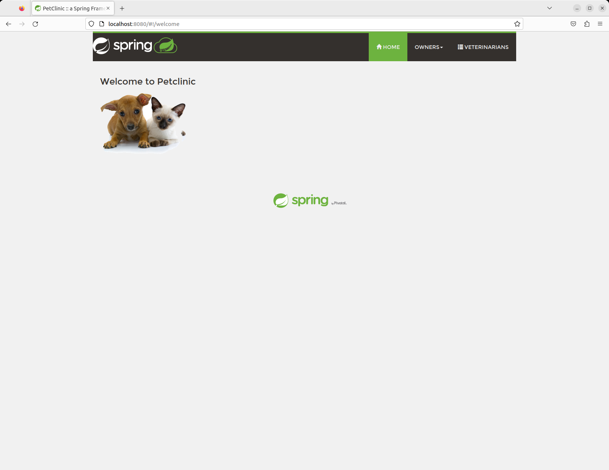

# MICROSERVICIO - Sprint Pet Clinic

Tiempo aproximado: _30 minutos_

## OBJETIVO

En esta actividad se realiza el análisis, despliegue y consumo de un microservicio con interfaz REST.

## PRERREQUISITOS

### REPOSITORIO

Esta actividad requiere que el repositorio de trabajo este en:

- Rama: `labs/software-architectures`
  - Se recomienda siempre trabajar sobre una rama _feature_.
    - Por ejemplo: `git checkout -b labs/software-architectures_cazucito`
- Carpeta: `spc-microservices`

### CONTENEDORES

Para determinar los contenedores en ejecución corre el comando:

``` shell
docker container ls
```

La salida debe ser similar a:

``` shell
CONTAINER ID   IMAGE     COMMAND   CREATED   STATUS    PORTS     NAMES
```

Sí la salida muestra contenedores en ejecución deténgalos con:

``` shell
docker container stop NOMBRE_CONTENEDOR
```

## DESARROLLO

### ANÁLISIS

El contenido de esta rama proviene del repositorio [Distributed version of Spring Petclinic built with Spring Cloud](https://github.com/spring-petclinic/spring-petclinic-microservices) en GitHub.

**Analiza el contenido con detenimiento su contenido.**


Abra el proyecto en un editor de código, por ejemplo `Visual Studio Code`, `IntelliJ`, `Spring Tool Suite`, etcétera y revise los elementos que la conforman.

- Comente sus observaciones.

### CONSTRUCCIÓN

Antes de ejecutar el comando de construcción lista las imágenes docker existentes en su repositorio local de docker:

``` shell
docker image ls
```

LA salida mostrará las imágenes existentes en el repositorio local de docker. Tome nota de las existentes par su comparación después de crear las del proyecto.

Para construir los contenedores con la aplicación ejecuta:

``` shell
./mvnw clean install -P buildDocker
```

Nota: De existir un error de permisos ejecute: `chmod +x mvnw`

_Este comando normalmente tarda **varios** minutos._

La salida debe ser similar:

``` shell
ProgressMessage{id=null, status=null, stream=null, error=null, progress=null, progressDetail=null}
Successfully built 56e66ee8b865
Successfully tagged springcommunity/spring-petclinic-api-gateway:latest
[INFO] Built springcommunity/spring-petclinic-api-gateway
[INFO] ------------------------------------------------------------------------
[INFO] Reactor Summary:
[INFO] 
[INFO] spring-petclinic-microservices 3.0.2 ............... SUCCESS [  0.755 s]
[INFO] spring-petclinic-admin-server ...................... SUCCESS [ 37.212 s]
[INFO] spring-petclinic-customers-service ................. SUCCESS [ 28.114 s]
[INFO] spring-petclinic-vets-service ...................... SUCCESS [01:13 min]
[INFO] spring-petclinic-visits-service .................... SUCCESS [ 54.781 s]
[INFO] spring-petclinic-config-server ..................... SUCCESS [ 23.891 s]
[INFO] spring-petclinic-discovery-server .................. SUCCESS [ 36.920 s]
[INFO] spring-petclinic-api-gateway 3.0.2 ................. SUCCESS [01:20 min]
[INFO] ------------------------------------------------------------------------
[INFO] BUILD SUCCESS
[INFO] ------------------------------------------------------------------------
[INFO] Total time: 05:37 min
[INFO] Finished at: 2024-10-18T11:46:07-06:00
[INFO] ------------------------------------------------------------------------
```

Después de ejecutar el comando de construcción liste las imágenes docker existentes en su repositorio local de docker:

``` shell
docker image ls
```

- ¿Observa alguna diferencia?

### EJECUCIÓN

Para inicializar se utiliza **docker compose**:

``` shell
docker compose up
```

Este comando genera una extensa salida y bloquea la terminal hasta que se lance un `Ctrl+C` o en otra terminal en la misma ruta se ejecute `docker compose down`.

_Este comando normalmente tarda **varios** minutos._

### CONSUMO

En un navegador visite: <http://localhost:8080>



#### URLS DE INTERES

A continuación le proporcionamos algunos URLs para explorar.

- AngularJS frontend (API Gateway)
  - <http://localhost:8080>
- Servicios: Customers (8081), Vets(8082) y Visits(8083)
  - Los puertos pueden variar, visita el panel de Eureka para conocerlos.
  - <http://localhost:8080/api/gateway/owners/1>
  - <http://localhost:8080/api/vet/vets>
- Servicio de Descubrimiento (Eureka)
  - <http://localhost:8761>
- Servicio de Configuración
  - <http://localhost:8888>
- Servidor de Tracing (Zipkin / openzipkin)
  - <http://localhost:9411/zipkin>
    - Posiblemente sin información
- Servidor de Administración (Spring Boot Admin)
  - <http://localhost:9090>
- Tableros Grafana
  - <http://localhost:3000>
- Prometheus
  - <http://localhost:9091>

### RESTABLECIMIENTO

Para restablecer el ambiente de trabajo se debe detener la ejecución haciendo `Ctrl+C` en la terminal de comandos en la que se haya iniciado dicha ejecución en otra terminal en la misma ruta se ejecute `docker compose down`.

``` shell
docker compose down
```

La salida será similar a:

``` shell
[+] Running 11/11
 ✔ Container api-gateway              Removed                                                                                                  7.0s 
 ✔ Container vets-service             Removed                                                                                                  5.5s 
 ✔ Container admin-server             Removed                                                                                                  6.2s 
 ✔ Container grafana-server           Removed                                                                                                  1.3s 
 ✔ Container visits-service           Removed                                                                                                  5.2s 
 ✔ Container prometheus-server        Removed                                                                                                  1.3s 
 ✔ Container tracing-server           Removed                                                                                                  3.6s 
 ✔ Container customers-service        Removed                                                                                                  4.9s 
 ✔ Container discovery-server         Removed                                                                                                  0.6s 
 ✔ Container config-server            Removed                                                                                                  0.7s 
 ✔ Network spc-microservices_default  Removed                                                                                                  0.3s
```

## RESULTADO

Comenta los puntos más relevantes de las actividades.

## REFERENCIAS

- [Spring Pet Clinic Presentation](http://fr.slideshare.net/AntoineRey/spring-framework-petclinic-sample-application)
- [Distributed version of Spring Petclinic built with Spring Cloud](https://github.com/spring-petclinic/spring-petclinic-microservices)

---

[MÓDULO 02](../../M02.md)
