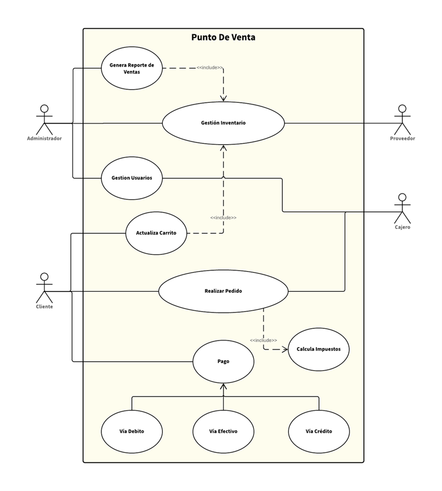
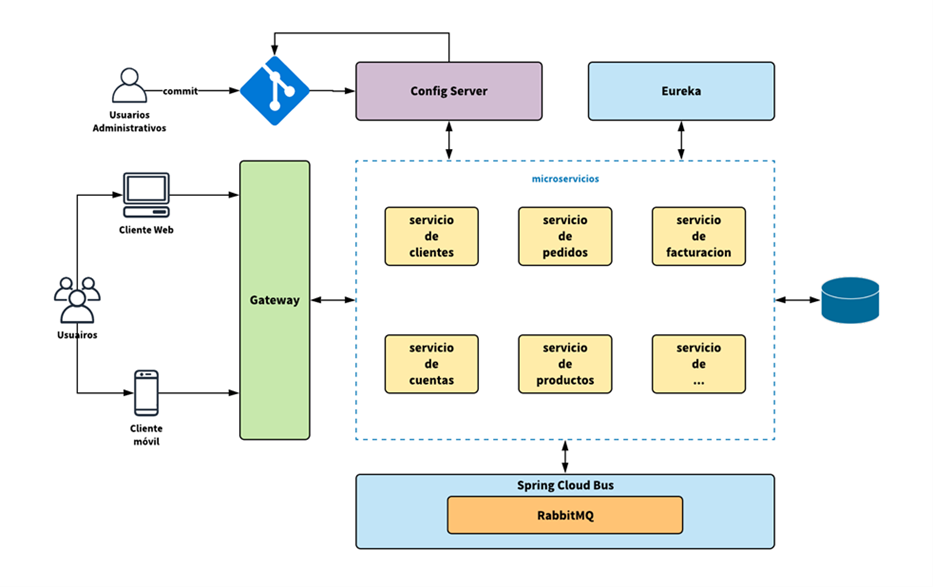
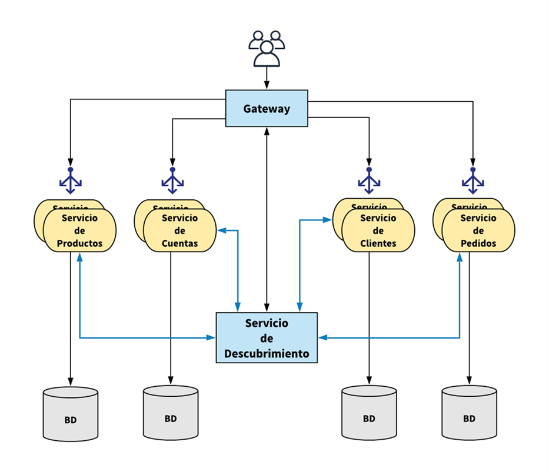

# CASO DE ESTUDIO: PUNTO DE VENTA (PDV)

Tiempo aproximado: _15 minutos_

## OBJETIVO

En esta actividad se plantea el caso de estudio que se utiliza de ejemplo para las diapositivas y las actividades prácticas.

## DESARROLLO

Sistema de software que permite automatizar un Punto de Venta (PDV). Debe modelar el proceso típico de adquisición de productos mediante un carrito de compra (selección, eliminación, generación del comprobante de compra, etc.). Además de la administración de los elementos necesarios para su operación (Productos, Clientes, etc.).

Los requerimientos iniciales son delineados en el siguiente diagrama:

### PROPUESTA

Sin restricciones o acotamientos metodológicos genere el o los modelos que considere permitan la implementación del caso de estudio mencionado.

No continué a las secciones siguientes de esta actividad hasta haber realizado esta propuesta.

#### DISCUSIÓN

La discusión va determinada por los siguientes cuestionamientos:

- ¿Su propuesta de solución fue afectada por los temas vistos en este capítulo?
- ¿Su propuesta es nativa de la nube?, ¿si/no?, ¿por qué?
- ¿Qué tecnologías propone o propuso para la implementación?, ¿Por qué motivos?

#### PROPUESTA INICIAL

Un sistema de software que permite automatizar un Punto de Venta (PDV).

En su diseño y construcción se deben considerar los puntos siguientes:

- Basado en la arquitectura de microservicios
- Incluyendo las tecnologías de Maven, Spring Boot & Spring Cloud antes mencionadas
- Será un sistema con funcionalidad simplificada
- La exposición será mediante APIs RESTful
- De crear interfaces gráficas serán muy simplificadas

La arquitectura general es la descrita en el siguiente diagrama. Es importante mencionar que más que un diagrama de arquitectura final es la conceptualización general de los componentes principales y de su colaboración.

El siguiente diagrama muestra una visión general de la ejecución e interacción de algunos de sus elementos más relevantes.

Los elementos principales son:

- Servicio de clientes
  - Este componente proporciona la funcionalidad necesaria para administrar a los clientes del sistema.
- Servicio de Cuentas
  - Este componente permite administrar las cuentas financieras de los clientes.
- Servicio de Productos
  - Este componente administra los productos que están disponibles mediante el sistema.
- Sistema de Pedidos
  - Este componente es el responsable de realizar los pedidos.
- Servicio de Facturación
  - Este componente permite realizar comprobantes de los pedidos.
- Servicio de Descubrimiento
  - Componente para la localización de servicios.
- Servicio de Ruteo
  - Componente de ruteo en la solicitud de funcionalidad.
- Servicio de Configuración
  - Componente de externalización de la configuración.

Algunas de las entidades requeridas son: Cliente, Cuenta, Pedido y Producto

## RESULTADO

Comenta los puntos más relevantes de las actividades.

## REFERENCIAS

- [Layering Microservices](http://philcalcado.com/2018/09/24/services_layers.html)

---

[DISEÑO DE MICROSERVICIOS](../../M03.md)
