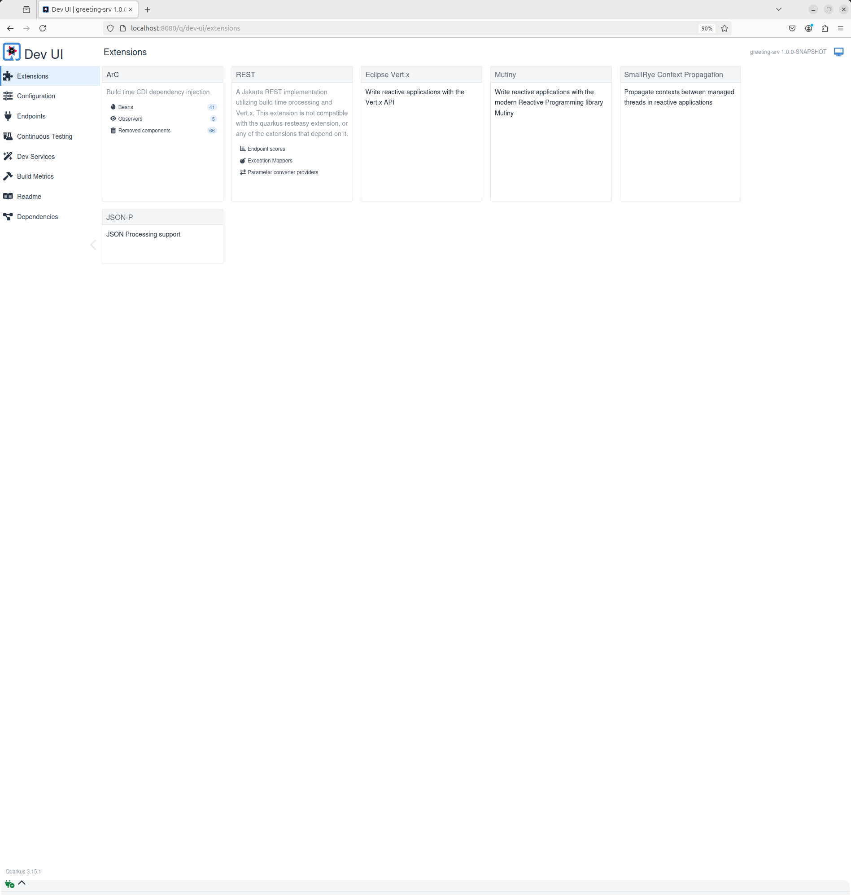

# SCAFFOLDING - QUARKUS

Tiempo aproximado: _15 minutos_

## OBJETIVO

Analizar un scaffolding simple de proyectos.

### REPOSITORIO

Esta actividad requiere que el repositorio de trabajo este en:

- Rama: `labs/microservices-design`
  - Se recomienda siempre trabajar sobre una rama _feature_.
    - Por ejemplo: `git checkout -b labs/microservices-design_cazucito`
- Carpeta: `/home/usuario/Desktop/CF01141024/scaffolding_quarkus`

## DESARROLLO

En este paso utilizaremos el complemento de _Quarkus_ para _Maven, con el que se creará una pequeña aplicación nativa de la nube.


### HERRAMIENTAS

Para crear el _scaffolding_ se utiliza el _CLI_ de _Quarkus_.

#### INSTALACIÓN

Para instalar ejecute:

``` shell
sdk install quarkus
```

La salida debe ser similar a:

``` shell

Downloading: quarkus 3.15.1

In progress...

##################################################################################################################################################################################### 100.0%

Installing: quarkus 3.15.1
Done installing!


Setting quarkus 3.15.1 as default.
```

#### VALIDACIÓN

Para validar la correcta instalación ejecute:

``` shell
quarkus
```

La salida debe ser similar a:

``` shell

Quarkus CLI version 3.15.1

Create Quarkus projects with Maven, Gradle, or JBang.
Manage extensions and source registries.

Create: quarkus create
Iterate: quarkus dev
Build and test: quarkus build

Find more information at https://quarkus.io
If you have questions, check https://github.com/quarkusio/quarkus/discussions


Usage: quarkus [-ehv] [--refresh] [--verbose] [--config=CONFIG]
               [-D=<String=String>]... [COMMAND]
Options:
      --refresh         Refresh the local Quarkus extension registry cache
      --config=CONFIG   Configuration file
  -h, --help            Display this help message.
  -v, --version         Print CLI version information and exit.
  -e, --errors          Print more context on errors and exceptions.
      --verbose         Verbose mode.
  -D=<String=String>    Java properties

Commands:
  create                  Create a new project.
    app                   Create a Quarkus application project.
    cli                   Create a Quarkus command-line project.
    extension             Create a Quarkus extension project
  build                   Build the current project.
  dev                     Run the current project in dev (live coding) mode.
  run                     Run application.
  test                    Run the current project in continuous testing mode.
  config                  Manage Quarkus configuration
    set                   Sets a configuration in application.properties
    remove                Removes a configuration from application.properties
    encrypt, enc          Encrypt Secrets
  extension, ext          Configure extensions of an existing project.
    list, ls              List platforms and extensions.
    categories, cat       List extension categories.
    add                   Add extension(s) to this project.
    remove, rm            Remove extension(s) from this project.
  image                   Build or push project container image.
    build                 Build a container image.
      docker              Build a container image using Docker.
      podman              Build a container image using Podman.
      buildpack           Build a container image using Buildpack.
      jib                 Build a container image using Jib.
      openshift           Build a container image using OpenShift.
    push                  Push a container image.
  deploy                  Deploy application.
    kubernetes            Perform the deploy action on Kubernetes.
    openshift             Perform the deploy action on OpenShift.
    knative               Perform the deploy action on Knative.
    kind                  Perform the deploy action on Kind.
    minikube              Perform the deploy action on minikube.
  registry                Configure Quarkus registry client
    list                  List enabled Quarkus registries
    add                   Add a Quarkus extension registry
    remove                Remove a Quarkus extension registry
  info                    Display project information and verify versions
                            health (platform and extensions).
  update, up, upgrade     Suggest recommended project updates with the
                            possibility to apply them.
  version                 Display CLI version information.
  plugin, plug            Configure plugins of the Quarkus CLI.
    list, ls              List CLI plugins.
    add                   Add plugin(s) to the Quarkus CLI.
    remove                Remove plugin(s) to the Quarkus CLI.
    sync                  Sync (discover / purge) CLI Plugins.
  completion              bash/zsh completion:  source <(quarkus completion)

Use "quarkus <command> --help" for more information about a given command.
```

### CONSTRUCCIÓN

Para crear una aplicación nativa de la nube en _Quarkus_ lanza el comando maven siguiente:

``` shell
mvn io.quarkus:quarkus-maven-plugin:2.16.3.Final:create -DprojectGroupId=mx.com.fractalyst.pocs -DprojectArtifactId=greeting-srv -DclassName="mx.com.fractalyst.pocs.GreetingResource" -Dpath="/hello"
```

La salida debe ser similar:

``` shell
[INFO] Scanning for projects...
[INFO] 
[INFO] ------------------< org.apache.maven:standalone-pom >-------------------
[INFO] Building Maven Stub Project (No POM) 1
[INFO] --------------------------------[ pom ]---------------------------------
[INFO] 
[INFO] --- quarkus-maven-plugin:2.16.3.Final:create (default-cli) @ standalone-pom ---
[INFO] -----------
[INFO] 
applying codestarts...
[INFO] 📚  java
🔨  maven
📦  quarkus
📝  config-properties
🔧  dockerfiles
🔧  maven-wrapper
🚀  resteasy-reactive-codestart
[INFO] 
-----------
[SUCCESS] ✅  quarkus project has been successfully generated in:
--> /home/usuario/Desktop/CF01141024/scaffolding_quarkus/sol/greeting-srv
-----------
[INFO] 
[INFO] ========================================================================================
[INFO] Your new application has been created in /home/usuario/Desktop/CF01141024/scaffolding_quarkus/sol/greeting-srv
[INFO] Navigate into this directory and launch your application with mvn quarkus:dev
[INFO] Your application will be accessible on http://localhost:8080
[INFO] ========================================================================================
[INFO] 
[INFO] ------------------------------------------------------------------------
[INFO] BUILD SUCCESS
[INFO] ------------------------------------------------------------------------
[INFO] Total time:  4.280 s
[INFO] Finished at: 2024-10-19T18:04:27-06:00
[INFO] ------------------------------------------------------------------------
```

Lo anterior genera un proyecto _Maven_ en la carpeta `greeting-srv`:

- La estructura de un projecto _Maven_
- Un recurso `mx.com.fractalyst.pocs.GreetingResource` expuesto en `/hello`
- Pruebas unitarias
- Una página de destino a la que se puede acceder `http://localhost:8080` después de iniciar la aplicación
- Ejemplos de `Dockerfile` para una variedad de objetivos de compilación (nativos, jvm, etc.)
- El archivo de configuración de la aplicación

El archivo `greeting-srv/pom.xml` contiene la importación de _Quarkus POM_, lo que le permite omitir la versión en las diferentes dependencias de _Quarkus_, el complemento `quarkus-maven-plugin` responsable del empaquetado de la aplicación y también proporcionando el modo de desarrollo.

``` xml
  <dependencyManagement>
    <dependencies>
      <dependency>
        <groupId>${quarkus.platform.group-id}</groupId>
        <artifactId>${quarkus.platform.artifact-id}</artifactId>
        <version>${quarkus.platform.version}</version>
        <type>pom</type>
        <scope>import</scope>
      </dependency>
    </dependencies>
  </dependencyManagement>
```

Si nos enfocamos en la sección de dependencias, se puede ver que estamos usando extensiones de _Quarkus_ que permiten el desarrollo y prueba de aplicaciones REST:

``` xml
<dependencies>
  <dependency>
    <groupId>io.quarkus</groupId>
    <artifactId>quarkus-arc</artifactId>
  </dependency>
  <dependency>
    <groupId>io.quarkus</groupId>
    <artifactId>quarkus-resteasy-reactive</artifactId>
  </dependency>
  <dependency>
    <groupId>io.quarkus</groupId>
    <artifactId>quarkus-junit5</artifactId>
    <scope>test</scope>
  </dependency>
  <dependency>
    <groupId>io.rest-assured</groupId>
    <artifactId>rest-assured</artifactId>
    <scope>test</scope>
  </dependency>
</dependencies>
```

También se creo el archivo `getting-srv/src/main/java/mx/com/fractalyst/pocs/GreetingResource.java`:

``` java
package mx.com.fractalyst.pocs;

import jakarta.ws.rs.GET;
import jakarta.ws.rs.Path;
import jakarta.ws.rs.Produces;
import jakarta.ws.rs.core.MediaType;

@Path("/hello")
public class GreetingResource {

    @GET
    @Produces(MediaType.TEXT_PLAIN)
    public String hello() {
        return "Hello from Quarkus REST";
    }
}
```

### EJECUCIÓN

Desde el directorio del proyecto (`cd greeting-srv`), ejecuta la aplicación usando:

``` shell
mvn compile quarkus:dev -Dquarkus.http.host=0.0.0.0
```

_La primera compilación tarde varios minutos debido a la descarga de las dependencias._

La salida debe ser similar a:

``` shell
[INFO] Scanning for projects...
[INFO] 
[INFO] ----------------< mx.com.fractalyst.pocs:greeting-srv >-----------------
[INFO] Building greeting-srv 1.0.0-SNAPSHOT
[INFO] --------------------------------[ jar ]---------------------------------
[INFO] 
[INFO] --- maven-resources-plugin:2.6:resources (default-resources) @ greeting-srv ---
[INFO] Using 'UTF-8' encoding to copy filtered resources.
[INFO] Copying 2 resources
[INFO] 
[INFO] --- quarkus-maven-plugin:3.15.1:generate-code (default) @ greeting-srv ---
[INFO] 
[INFO] --- maven-compiler-plugin:3.13.0:compile (default-compile) @ greeting-srv ---
[INFO] Recompiling the module because of changed source code.
[INFO] Compiling 1 source file with javac [debug release 17] to target/classes
[INFO] 
[INFO] --- quarkus-maven-plugin:3.15.1:dev (default-cli) @ greeting-srv ---
[INFO] Invoking resources:2.6:testResources (default-testResources) @ greeting-srv
[INFO] Using 'UTF-8' encoding to copy filtered resources.
[INFO] skip non existing resourceDirectory /home/usuario/Desktop/CF01141024/scaffolding_quarkus/sol/greeting-srv/src/test/resources
[INFO] Invoking quarkus:3.15.1:generate-code-tests (default) @ greeting-srv
[INFO] Invoking compiler:3.13.0:testCompile (default-testCompile) @ greeting-srv
[INFO] Recompiling the module because of changed dependency.
[INFO] Compiling 2 source files with javac [debug release 17] to target/test-classes
Listening for transport dt_socket at address: 5005
__  ____  __  _____   ___  __ ____  ______ 
 --/ __ \/ / / / _ | / _ \/ //_/ / / / __/ 
 -/ /_/ / /_/ / __ |/ , _/ ,< / /_/ /\ \   
--\___\_\____/_/ |_/_/|_/_/|_|\____/___/   
2024-10-19 18:05:46,166 INFO  [io.quarkus] (Quarkus Main Thread) greeting-srv 1.0.0-SNAPSHOT on JVM (powered by Quarkus 3.15.1) started in 3.250s. Listening on: http://0.0.0.0:8080

2024-10-19 18:05:46,172 INFO  [io.quarkus] (Quarkus Main Thread) Profile dev activated. Live Coding activated.
2024-10-19 18:05:46,173 INFO  [io.quarkus] (Quarkus Main Thread) Installed features: [cdi, rest, smallrye-context-propagation, vertx]

--
Tests paused
Press [e] to edit command line args (currently ''), [r] to resume testing, [o] Toggle test output, [:] for the terminal, [h] for more options>
```

Ten en cuenta el tiempo de inicio increíblemente rápido! Una vez iniciado, abre una nueva ventana de terminal y ejecuta el siguiente comando para consultar la aplicación:

``` shell
curl localhost:8080/hello
```

La aplicación debe responder con lo siguiente:

``` shell
Hello from Quarkus REST
```

#### RECARGA EN VIVO

Para probar las capacidades de recarga en vivo de _Quarkus_. Edita el código fuente en `src/main/java/mx/com/fractalyst/pocs/GreetingResource.java` y cambia el mensaje de: `Hello from Quarkus REST` a `Hola DDD, Arquitectura Limpia y Microservicios en Java.`.

También se debe modificar el código fuente en `src/test/java/mx/com/fractalyst/pocs/GreetingResourceTest.java`, cambiando el mensaje de: `Hello from Quarkus REST` a `Hola DDD, Arquitectura Limpia y Microservicios en Java.`.

**Guarda el archivo, pero no reinicies el proceso _Quarkus_ en ejecución en la primera terminal.**

Ejecuta el comando `curl` de nuevo:

``` shell
curl localhost:8080/hello
```

La aplicación debe responder con lo siguiente:

``` shell
Hola DDD, Arquitectura Limpia y Microservicios en Java.
```

El objetivo _Maven_ `quarkus:dev` ejecuta _Quarkus_ en modo de desarrollo. Esto habilita la recarga en vivo con compilación en segundo plano, lo que significa que cuando se modifican los archivos, estos cambios surtirán efecto automáticamente.

### INTERFAZ DE DESARROLLO

Cuando se ejecutan en el modo desarrollador, las aplicaciones de _Quarkus_ exponen una interfaz de usuario útil para inspeccionar y realizar cambios en la aplicación sobre la marcha (al igual que el modo de codificación en vivo). Permite visualizar rápidamente todas las extensiones cargadas actualmente, ver y editar sus valores de configuración, ver su estado e ir directamente a su documentación.

Abre la siguiente URL en un navegador para acceder a la interfaz de usuario de desarrollo para su aplicación en ejecución:

- <http://localhost:8080/q/dev-ui/>



### CDI

Modifiquemos la aplicación y agreguemos un _bean_. Antes de comenzar, ten en cuenta que podemos dejar la aplicación en ejecución; no necesitamos detenerlo y reiniciarlo para recoger los cambios.

Crea el siguiente archivo `src/main/java/mx/com/fractalyst/pocs/GreetingService.java` con el siguiente contenido:

``` java
package mx.com.fractalyst.pocs;

import jakarta.enterprise.context.ApplicationScoped;

@ApplicationScoped
public class GreetingService {

    private String hostname = System.getenv().getOrDefault("HOSTNAME", "unknown");

    public String greeting(String name) {
        return "Hola " + name + " desde " + hostname;
    }

}
```

A continuación, agrega la inyección al `GreetingResource.java` archivo existente. Para simplificar, puede reemplazar su contenido existente con lo siguiente:

``` java
package mx.com.fractalyst.pocs;

import jakarta.inject.Inject;
import jakarta.ws.rs.GET;
import jakarta.ws.rs.Path;

@Path("/hello")
public class GreetingResource {

    @Inject
    GreetingService service;

    @GET
    @Path("/{name}")
    public String greeting(String name) {
        return service.greeting(name);
    }

    @GET
    public String hello() {
        return "Hola DDD, Arquitectura Limpia y Microservicios en Java.";
    }
}
```

#### INSPECCIÓN DE RESULTADOS

Dado que todavía tenemos nuestra aplicación ejecutándose usando `mvn quarkus:dev`, cuando realizas estos cambios y vuelvas a cargar el _endpoint_, _Quarkus_ notará todos estos cambios y los recargará automáticamente.

Se puede acceder al nuevo _endpoint_ usando el siguiente comando:

``` shell
curl localhost:8080/hello/quarkus
```

El resultado debe ser similar al siguiente:

``` shell
Hola quarkus desde unknown
```

En este caso, _unknown_ es el nombre del host local en el que se ejecuta el proceso de _Quarkus_.

### EMPAQUETADO

Detengamos la aplicación original para poder empacarla y volver a ejecutarla como un archivo JAR ejecutable. En la terminal, presione `CTRL-C` para detener la aplicación.

Usa el objetivo `package` para construir los archivos JAR de la aplicación:

``` shell
mvn package -DskipTests=true
```

La salida debe ser similar a:

``` shell
[INFO] Scanning for projects...
[INFO] 
[INFO] ----------------< mx.com.fractalyst.pocs:greeting-srv >-----------------
[INFO] Building greeting-srv 1.0.0-SNAPSHOT
[INFO] --------------------------------[ jar ]---------------------------------
[INFO] 
[INFO] --- maven-resources-plugin:2.6:resources (default-resources) @ greeting-srv ---
[INFO] Using 'UTF-8' encoding to copy filtered resources.
[INFO] Copying 2 resources
[INFO] 
[INFO] --- quarkus-maven-plugin:3.15.1:generate-code (default) @ greeting-srv ---
[INFO] 
[INFO] --- maven-compiler-plugin:3.13.0:compile (default-compile) @ greeting-srv ---
[INFO] Nothing to compile - all classes are up to date.
[INFO] 
[INFO] --- quarkus-maven-plugin:3.15.1:generate-code-tests (default) @ greeting-srv ---
[INFO] 
[INFO] --- maven-resources-plugin:2.6:testResources (default-testResources) @ greeting-srv ---
[INFO] Using 'UTF-8' encoding to copy filtered resources.
[INFO] skip non existing resourceDirectory /home/usuario/Desktop/CF01141024/scaffolding_quarkus/sol/greeting-srv/src/test/resources
[INFO] 
[INFO] --- maven-compiler-plugin:3.13.0:testCompile (default-testCompile) @ greeting-srv ---
[INFO] Nothing to compile - all classes are up to date.
[INFO] 
[INFO] --- maven-surefire-plugin:3.3.1:test (default-test) @ greeting-srv ---
[INFO] Tests are skipped.
[INFO] 
[INFO] --- maven-jar-plugin:2.4:jar (default-jar) @ greeting-srv ---
[INFO] 
[INFO] --- quarkus-maven-plugin:3.15.1:build (default) @ greeting-srv ---
[INFO] [io.quarkus.deployment.QuarkusAugmentor] Quarkus augmentation completed in 2580ms
[INFO] ------------------------------------------------------------------------
[INFO] BUILD SUCCESS
[INFO] ------------------------------------------------------------------------
[INFO] Total time:  8.091 s
[INFO] Finished at: 2024-10-19T18:23:30-06:00
[INFO] ------------------------------------------------------------------------
```

Este comando produce dos archivos:

- `greeting-srv-1.0.0-SNAPSHOT.jar`
  - Este JAR contiene solo las clases y recursos de los proyectos; es el artefacto regular producido por la construcción de _Maven_
- `quarkus-app/quarkus-run.jar`
  - La aplicación también está empaquetada como un jar ejecutable.
  - Ten en cuenta que no es un _über-jar_ ya que las dependencias se copian en varios subdirectorios (y deberían incluirse en cualquier imagen de contenedor en capas).

Puedes encontrar estos dos archivos en el directorio `target/`:

``` shell
ls -l target/*.jar target/quarkus-app/*.jar
```

#### EJECUCIÓN DEL JAR

Puede ejecutar el JAR en la JVM cde manera tradicional:

``` shell
java -jar target/quarkus-app/quarkus-run.jar
```

Con una salida similar a:

``` shell
__  ____  __  _____   ___  __ ____  ______ 
 --/ __ \/ / / / _ | / _ \/ //_/ / / / __/ 
 -/ /_/ / /_/ / __ |/ , _/ ,< / /_/ /\ \   
--\___\_\____/_/ |_/_/|_/_/|_|\____/___/   
2024-10-19 18:25:51,801 INFO  [io.quarkus] (main) greeting-srv 1.0.0-SNAPSHOT on JVM (powered by Quarkus 3.15.1) started in 0.885s. Listening on: http://0.0.0.0:8080
2024-10-19 18:25:51,809 INFO  [io.quarkus] (main) Profile prod activated. 
2024-10-19 18:25:51,809 INFO  [io.quarkus] (main) Installed features: [cdi, rest, smallrye-context-propagation, vertx]
```

Puedes probar que se está ejecutando utilizando la misma URL del paso anterior:

``` shell
curl localhost:8080/hello
```

La aplicación debe responder con lo siguiente:

``` shell
Hola DDD, Arquitectura Limpia y Microservicios en Java.
```

#### DETENER EL JAR

Detenga el JAR ejecutable presionando `CTRL-C` en su terminal.

## MÁS

1. [Quarkus Super-Heroes Workshop](https://quarkus.io/quarkus-workshops/super-heroes/)

## RESULTADO

Comenta los puntos más relevantes de las actividades.

## REFERENCIAS

- [Building Applications With Maven](https://quarkus.io/guides/maven-tooling)
- [Getting Started Quarkus](https://kubebyexample.com/learning-paths/developing-quarkus-kubernetes/getting-started-quarkus/introduction)

---

[DISEÑO DE MICROSERVICIOS](../../M03.md)
