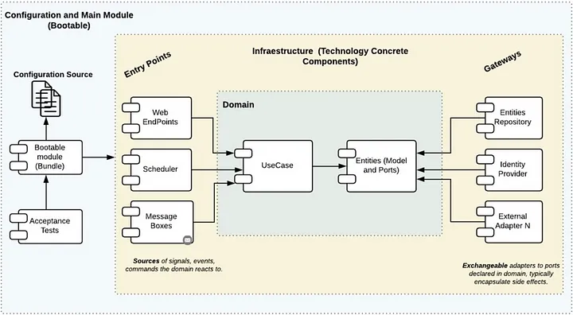

# SCAFFOLDING - BANCOLOMBIA

Tiempo aproximado: _30 minutos_

## OBJETIVO

Analizar un scaffolding simple de proyectos.

## PRERREQUISITOS

### REPOSITORIO

Esta actividad requiere que el repositorio de trabajo este en:

- Rama: `labs/microservices-design`
  - Se recomienda siempre trabajar sobre una rama _feature_.
    - Por ejemplo: `git checkout -b labs/microservices-design_cazucito`
- Carpeta: `/home/usuario/Desktop/CF01141024/scaffolding_bancol`

### SDKMAN

Para instalar `SDKMAN!` ejecuta los siguientes pasos.

``` shell
curl -s "https://get.sdkman.io" | bash
```

Se tendrá una salida semejante a:

``` shell

                                -+syyyyyyys:
                            `/yho:`       -yd.
                         `/yh/`             +m.
                       .oho.                 hy                          .`
                     .sh/`                   :N`                `-/o`  `+dyyo:.
                   .yh:`                     `M-          `-/osysoym  :hs` `-+sys:      hhyssssssssy+
                 .sh:`                       `N:          ms/-``  yy.yh-      -hy.    `.N-````````+N.
               `od/`                         `N-       -/oM-      ddd+`     `sd:     hNNm        -N:
              :do`                           .M.       dMMM-     `ms.      /d+`     `NMMs       `do
            .yy-                             :N`    ```mMMM.      -      -hy.       /MMM:       yh
          `+d+`           `:/oo/`       `-/osyh/ossssssdNMM`           .sh:         yMMN`      /m.
         -dh-           :ymNMMMMy  `-/shmNm-`:N/-.``   `.sN            /N-         `NMMy      .m/
       `oNs`          -hysosmMMMMydmNmds+-.:ohm           :             sd`        :MMM/      yy
      .hN+           /d:    -MMMmhs/-.`   .MMMh   .ss+-                 `yy`       sMMN`     :N.
     :mN/           `N/     `o/-`         :MMMo   +MMMN-         .`      `ds       mMMh      do
    /NN/            `N+....--:/+oooosooo+:sMMM:   hMMMM:        `my       .m+     -MMM+     :N.
   /NMo              -+ooooo+/:-....`...:+hNMN.  `NMMMd`        .MM/       -m:    oMMN.     hs
  -NMd`                                    :mm   -MMMm- .s/     -MMm.       /m-   mMMd     -N.
 `mMM/                                      .-   /MMh. -dMo     -MMMy        od. .MMMs..---yh
 +MMM.                                           sNo`.sNMM+     :MMMM/        sh`+MMMNmNm+++-
 mMMM-                                           /--ohmMMM+     :MMMMm.       `hyymmmdddo
 MMMMh.                  ````                  `-+yy/`yMMM/     :MMMMMy       -sm:.``..-:-.`
 dMMMMmo-.``````..-:/osyhddddho.           `+shdh+.   hMMM:     :MmMMMM/   ./yy/` `:sys+/+sh/
 .dMMMMMMmdddddmmNMMMNNNNNMMMMMs           sNdo-      dMMM-  `-/yd/MMMMm-:sy+.   :hs-      /N`
  `/ymNNNNNNNmmdys+/::----/dMMm:          +m-         mMMM+ohmo/.` sMMMMdo-    .om:       `sh
     `.-----+/.`       `.-+hh/`         `od.          NMMNmds/     `mmy:`     +mMy      `:yy.
           /moyso+//+ossso:.           .yy`          `dy+:`         ..       :MMMN+---/oys:
         /+m:  `.-:::-`               /d+                                    +MMMMMMMNh:`
        +MN/                        -yh.                                     `+hddhy+.
       /MM+                       .sh:
      :NMo                      -sh/
     -NMs                    `/yy:
    .NMy                  `:sh+.
   `mMm`               ./yds-
  `dMMMmyo:-.````.-:oymNy:`
  +NMMMMMMMMMMMMMMMMms:`
    -+shmNMMMNmdy+:`


                                                                 Now attempting installation...


Looking for a previous installation of SDKMAN...
Looking for unzip...
Looking for zip...
Looking for curl...
Looking for sed...
Installing SDKMAN scripts...
Create distribution directories...
Getting available candidates...
Prime platform file...
Prime the config file...
Installing script cli archive...
* Downloading...
######################################################################## 100.0%
* Checking archive integrity...
* Extracting archive...
* Copying archive contents...
* Cleaning up...

Installing script cli archive...
* Downloading...
######################################################################## 100.0%
* Checking archive integrity...
* Extracting archive...
* Copying archive contents...
* Cleaning up...

Set version to 5.18.2 ...
Set native version to 0.4.6 ...
Attempt update of interactive bash profile on regular UNIX...
Added sdkman init snippet to /home/usuario/.bashrc
Attempt update of zsh profile...
Updated existing /home/usuario/.zshrc


All done!


You are subscribed to the STABLE channel.

Please open a new terminal, or run the following in the existing one:

    source "/home/usuario/.sdkman/bin/sdkman-init.sh"

Then issue the following command:

    sdk help

Enjoy!!!
```

Ahora para inicializar `SDKMAN!`, ejecute:

Para validar que ha sido instalado correctamente:

La salida debe ser similar a:

``` shell
sdk version
```

La salida debe ser similar a:

``` shell

SDKMAN!
script: 5.18.2
native: 0.4.6

```

### GRADLE

Para esta actividad se requiere instalar `gradle`.

``` shell
sdk install gradle 8.10.2
```

Con una salida semejante a:

``` shell

Downloading: gradle 8.10.2

In progress...

##################################################################################################################################################################################### 100.0%##################################################################################################################################################################################### 100.0%

Installing: gradle 8.10.2
Done installing!


Setting gradle 8.10.2 as default.
```

Para validar la correcta instalación ejecute:

``` shell
gradle --version
```

La salida debe ser semejante a:

``` shell
------------------------------------------------------------
Gradle 8.10.2
------------------------------------------------------------

Build time:    2024-09-23 21:28:39 UTC
Revision:      415adb9e06a516c44b391edff552fd42139443f7

Kotlin:        1.9.24
Groovy:        3.0.22
Ant:           Apache Ant(TM) version 1.10.14 compiled on August 16 2023
Launcher JVM:  17.0.12 (Ubuntu 17.0.12+7-Ubuntu-1ubuntu224.04)
Daemon JVM:    /usr/lib/jvm/java-17-openjdk-amd64 (no JDK specified, using current Java home)
OS:            Linux 6.8.0-47-generic amd64
```

## DESARROLLO

Lea el artículo [CLEAN ARCHITECTURE - AISLANDO LOS DETALLES](https://medium.com/bancolombia-tech/clean-architecture-aislando-los-detalles-4f9530f35d7a) - [PDF](mm/Clean%20Architecture%E2%80%8A%E2%80%94%E2%80%8AAislando%20los%20detalles%20-%20Reader%20Mode.pdf "https://medium.com/bancolombia-tech/clean-architecture-aislando-los-detalles-4f9530f35d7a")



### SCAFFOLD CLEAN ARCHITECTURE PLUGIN

Utiliza la documentación oficial [Scaffold Clean Architecture](https://github.com/bancolombia/scaffold-clean-architecture) y los siguientes comandos como base, para crear una aplicación en el enfoque de arquitectura limpia.

**NOTA: En cada comando no olvides analizar los cambios en el directorio.**

#### PLUGIN

En un nuevo directorio (v.g. `scaffolding_bancol`) crea el archivo `build.gradle` con el _plugin_ (complemento) creado por _Bancolombia_ para crear el _scaffolding_ de un proyecto en arquitectura limpia.

``` shell
echo 'plugins { id "co.com.bancolombia.cleanArchitecture" version "3.18.1" }' > build.gradle
```

#### TAREAS

Para observar las tareas disponibles ejecuta:

``` shell
gradle tasks
```

La salida debe ser similar a:

``` shell

> Task :tasks

------------------------------------------------------------
Tasks runnable from root project 'sol'
------------------------------------------------------------

Build tasks
-----------
assemble - Assembles the outputs of this project.
build - Assembles and tests this project.
buildDependents - Assembles and tests this project and all projects that depend on it.
buildNeeded - Assembles and tests this project and all projects it depends on.
classes - Assembles main classes.
clean - Deletes the build directory.
jar - Assembles a jar archive containing the classes of the 'main' feature.
testClasses - Assembles test classes.

Build Setup tasks
-----------------
init - Initializes a new Gradle build.
updateDaemonJvm - Generates or updates the Gradle Daemon JVM criteria.
wrapper - Generates Gradle wrapper files.

Clean Architecture tasks
------------------------
a - Set analytics state
analytics - Set analytics state
ca - Scaffolding clean architecture project
cleanArchitecture - Scaffolding clean architecture project
deleteModule - Delete gradle module
dm - Delete gradle module
gat - Generate subproject by karate framework in deployment layer
gda - Generate driven adapter in infrastructure layer
generateAcceptanceTest - Generate subproject by karate framework in deployment layer
generateDrivenAdapter - Generate driven adapter in infrastructure layer
generateEntryPoint - Generate entry point in infrastructure layer
generateHelper - Generate helper in infrastructure layer
generateModel - Generate model in domain layer
generatePerformanceTest - Generate performance test
generatePipeline - Generate CI pipeline as a code in deployment layer
generateUseCase - Generate use case in domain layer
gep - Generate entry point in infrastructure layer
gh - Generate helper in infrastructure layer
gm - Generate model in domain layer
gpl - Generate CI pipeline as a code in deployment layer
gpt - Generate performance test
guc - Generate use case in domain layer
internalTask - Run non final user task
it - Run non final user task
u - Update project dependencies
updateCleanArchitecture - Update project dependencies
validateStructure - Validate that project references are not violated
vs - Validate that project references are not violated

Documentation tasks
-------------------
javadoc - Generates Javadoc API documentation for the 'main' feature.

Help tasks
----------
buildEnvironment - Displays all buildscript dependencies declared in root project 'sol'.
dependencies - Displays all dependencies declared in root project 'sol'.
dependencyInsight - Displays the insight into a specific dependency in root project 'sol'.
help - Displays a help message.
javaToolchains - Displays the detected java toolchains.
outgoingVariants - Displays the outgoing variants of root project 'sol'.
projects - Displays the sub-projects of root project 'sol'.
properties - Displays the properties of root project 'sol'.
resolvableConfigurations - Displays the configurations that can be resolved in root project 'sol'.
tasks - Displays the tasks runnable from root project 'sol'.

Verification tasks
------------------
check - Runs all checks.
test - Runs the test suite.

Rules
-----
Pattern: clean<TaskName>: Cleans the output files of a task.
Pattern: build<ConfigurationName>: Assembles the artifacts of a configuration.

To see all tasks and more detail, run gradle tasks --all

To see more detail about a task, run gradle help --task <task>

BUILD SUCCESSFUL in 49s
1 actionable task: 1 executed
```

##### PROYECTO

Para generar una estructura base se utiliza el siguiente comando, especificando el nombre del paquete, el tipo imperativo o reactivo, y el nombre del proyecto.

``` shell
gradle cleanArchitecture --package=mx.com.fractalyst.pocs --type=imperative --name=ScaffoldPoc --lombok=true --metrics=true --javaVersion=VERSION_17
```

La salida debe ser similar a:

``` shell

> Task :cleanArchitecture
Clean Architecture plugin version: 3.18.1
Package: mx.com.fractalyst.pocs
Project Type: IMPERATIVE
Java Version: VERSION_17
Project Name: ScaffoldPoc
Applying changes on disk
files: 16, dirs: 18, deleted dirs: 0
Changes successfully applied
You have the latest plugin version 3.18.1
Connecting to project to run task wrapper
Connected! executing task wrapper
##########################
##   Analytics Notice   ##
##########################
Analytics are enabled by default if you want to disable it please run: gradle analytics --enabled false

BUILD SUCCESSFUL in 19s
1 actionable task: 1 executed
```

##### ENVÍO DE DATOS

A tu criterio deshabilita el envío de datos a los creadores ejecutando:

``` shell
gradle analytics --enabled false
```

La salida debe ser similar a:

``` shell

BUILD SUCCESSFUL in 2s
1 actionable task: 1 executed
```

##### MODELO

La tarea `generateModel` o `gm` genera una clase y una interfaz en la capa del modelo.

Parámetros:

- name: `Producto`

``` shell
gradle generateModel --name=Producto
```

La salida debe ser similar a:

``` shell
> Task :generateModel
Clean Architecture plugin version: 3.18.1
Model Name: Producto
Applying changes on disk
files: 2, dirs: 3, deleted dirs: 0
Changes successfully applied
You have the latest plugin version 3.18.1

Deprecated Gradle features were used in this build, making it incompatible with Gradle 9.0.

You can use '--warning-mode all' to show the individual deprecation warnings and determine if they come from your own scripts or plugins.

For more on this, please refer to https://docs.gradle.org/8.10.2/userguide/command_line_interface.html#sec:command_line_warnings in the Gradle documentation.

BUILD SUCCESSFUL in 2s
1 actionable task: 1 executed
```

###### ELEMENTOS

``` java
package mx.com.fractalyst.pocs.model.producto.gateways;

import mx.com.fractalyst.pocs.model.producto.Producto;

import java.util.List;
import java.math.BigDecimal;

public interface ProductoRepository {
    public abstract Producto getProducto (String id);
    List<Producto> getProductos ();
    BigDecimal getProductoPrecio (String id);
    boolean addProducto (Producto producto);

    // 
    String ping (String mensaje);   
}

```

``` java
package mx.com.fractalyst.pocs.model.producto;

import lombok.Builder;
import lombok.AllArgsConstructor;
import lombok.Getter;
import lombok.NoArgsConstructor;
import lombok.Setter;


import java.util.List;
import java.math.BigDecimal;

@Getter
@Setter
@NoArgsConstructor
@AllArgsConstructor
@Builder(toBuilder = true)
public class Producto {
    private String id;
    private String nombre;
    private BigDecimal precio;
}
```

##### CASOS DE USO

La tarea `generateUseCase` o `guc` genera una clase en la capa del modelo.

Parámetros:

- name: Producto

``` shell
gradle generateUseCase --name=Producto
```

La salida debe ser similar a:

``` shell
> Task :generateUseCase
Clean Architecture plugin version: 3.18.1
Use Case Name: Producto
Applying changes on disk
files: 2, dirs: 3, deleted dirs: 0
Changes successfully applied
You have the latest plugin version 3.18.1

Deprecated Gradle features were used in this build, making it incompatible with Gradle 9.0.

You can use '--warning-mode all' to show the individual deprecation warnings and determine if they come from your own scripts or plugins.

For more on this, please refer to https://docs.gradle.org/8.10.2/userguide/command_line_interface.html#sec:command_line_warnings in the Gradle documentation.

BUILD SUCCESSFUL in 2s
1 actionable task: 1 executed
```

###### ELEMENTOS

``` java
package mx.com.fractalyst.pocs.usecase.producto;

import mx.com.fractalyst.pocs.model.producto.Producto;
import mx.com.fractalyst.pocs.model.producto.gateways.ProductoRepository;

import java.math.BigDecimal;
import java.util.List;
import lombok.RequiredArgsConstructor;

@RequiredArgsConstructor
public class ProductoUseCase {
        
        private final ProductoRepository service;

        public Producto getProducto (String id) {
            return service.getProducto(id);
        }

        public List<Producto> getProductos () {
            return service.getProductos();
        }

        public BigDecimal getProductoPrecio (String id) {
            return service.getProductoPrecio(id);
        }

        public boolean addProducto (Producto producto) {
            return service.addProducto(producto);
        }
     
        public String ping (String mensaje) {
            return service.ping(mensaje);
        }
           
}
```

##### DRIVEN ADAPTER

La tarea `generateDrivenAdapter` o `gda` genera un módulo en la capa de infraestructura.

Parámetros:

- type: generic
- name: Producto

``` shell
gradle generateDrivenAdapter --type=generic --name=Producto
```

La salida debe ser similar a:

``` shell
> Task :generateDrivenAdapter
Clean Architecture plugin version: 3.18.1
DrivenAdapter name: Producto
adding module producto to settings.gradle
adding dependency implementation project(':producto') to module app-service
Applying changes on disk
files: 3, dirs: 3, deleted dirs: 0
Changes successfully applied
You have the latest plugin version 3.18.1

Deprecated Gradle features were used in this build, making it incompatible with Gradle 9.0.

You can use '--warning-mode all' to show the individual deprecation warnings and determine if they come from your own scripts or plugins.

For more on this, please refer to https://docs.gradle.org/8.10.2/userguide/command_line_interface.html#sec:command_line_warnings in the Gradle documentation.

BUILD SUCCESSFUL in 2s
1 actionable task: 1 executed
```

_De no crearse el elemento, creelo en: `poc-bancol-scaffolding/infrastructure/driven-adapters/producto/src/main/java/mx/com/fractalyst/pocs/producto/ProductoService.java`._

###### ELEMENTOS

``` java
package mx.com.fractalyst.pocs.producto;

import mx.com.fractalyst.pocs.model.producto.Producto;
import mx.com.fractalyst.pocs.model.producto.gateways.ProductoRepository;

import org.springframework.stereotype.Service;

import java.math.BigDecimal;
import java.util.ArrayList;
import java.util.List;
import java.util.UUID;

@Service
public class ProductoService implements ProductoRepository {
 
    private final static List<Producto> productos = new ArrayList<>(10);  // Memoria
    private final Producto NO_PRODUCTO = Producto.builder().id(UUID.randomUUID().toString()).nombre("NO-NAME").precio(new BigDecimal(0.0)).build();

    @Override
    public Producto getProducto(String id) {
        return productos.stream()
        .filter(p -> p.getId().equalsIgnoreCase(id)).findAny()
        .orElse(NO_PRODUCTO);
    }

    @Override
    public List<Producto> getProductos() {
        return productos;
    }

    @Override
    public BigDecimal getProductoPrecio(final String id) {
        return productos.stream()
        .filter(p -> p.getId().equalsIgnoreCase(id)).map(p -> p.getPrecio()).findAny()
        .orElse(NO_PRODUCTO.getPrecio());
    }

    @Override
    public boolean addProducto(Producto producto) {
        // 
        return productos.add(producto);
    }

    @Override
    public String ping(String mensaje) {
        return mensaje;
    }

}
```

##### ENTRY POINT

La tarea `generateEntryPoint` o `gep` genera un módulo en la capa de infraestructura.

Parámetros:

- type (obligatorio): restmvc
- name: Producto

``` shell
gradle generateEntryPoint --type=restmvc --server=tomcat --name=Producto
```

La salida debe ser similar a:

``` shell
> Task :generateEntryPoint
Clean Architecture plugin version: 3.18.1
EntryPoint name: Producto
adding module api-rest to settings.gradle
adding dependency implementation project(':api-rest') to module app-service
adding dependency testImplementation 'org.springframework:spring-web' to module app-service
Applying changes on disk
files: 7, dirs: 6, deleted dirs: 0
Updating application properties
Changes successfully applied
You have the latest plugin version 3.18.1

Deprecated Gradle features were used in this build, making it incompatible with Gradle 9.0.

You can use '--warning-mode all' to show the individual deprecation warnings and determine if they come from your own scripts or plugins.

For more on this, please refer to https://docs.gradle.org/8.10.2/userguide/command_line_interface.html#sec:command_line_warnings in the Gradle documentation.

BUILD SUCCESSFUL in 2s
1 actionable task: 1 executed
```

###### ELEMENTOS

``` java
package mx.com.fractalyst.pocs.api;

import mx.com.fractalyst.pocs.model.producto.Producto;
import mx.com.fractalyst.pocs.usecase.producto.ProductoUseCase;
import lombok.AllArgsConstructor;
import org.springframework.http.MediaType;
import org.springframework.web.bind.annotation.GetMapping;
import org.springframework.web.bind.annotation.PostMapping;
import org.springframework.web.bind.annotation.RequestMapping;
import org.springframework.web.bind.annotation.RestController;
import org.springframework.web.bind.annotation.PathVariable;
import org.springframework.web.bind.annotation.RequestParam;
import org.springframework.web.bind.annotation.RequestBody;
import org.slf4j.Logger;
import org.slf4j.LoggerFactory;
import java.math.BigDecimal;
import java.util.List;

@RestController
@RequestMapping(value = "/api", produces = MediaType.APPLICATION_JSON_VALUE)
@AllArgsConstructor
public class ApiRest {

    private final ProductoUseCase useCase;
    private static final Logger LOGGER = LoggerFactory.getLogger(ApiRest.class);

    @GetMapping("/ping")
    public String ping (@RequestParam(name="mensaje", required = false) String mensaje) {
        if(mensaje==null) mensaje = "pong";
        return useCase.ping(mensaje);
    }

    @GetMapping(path = "/productos")
    public List<Producto> getProductos () {
        return useCase.getProductos();
    }

    @GetMapping(path = "/productos/{id}")
    public Producto getProducto (@PathVariable(name="id") String id) {
        return useCase.getProducto(id);
    }

    @GetMapping(path ="/productos/{id}/precio")
    public BigDecimal getProductoPrecio (@PathVariable(name="id") String id) {
        return useCase.getProductoPrecio(id);
    }

    @PostMapping("/productos")
    public boolean addProducto (@RequestBody Producto producto) {
        LOGGER.info("::: P/P ::: {} / {}", producto.getNombre(), producto.getPrecio());
        return useCase.addProducto(producto);
    }
}
```

#### APP-SERVICE

Para evitar alguna colisión en el puerto de exposición de este servicio modifica el archivo `{PROYECTO}/applications/app-service/src/main/resources/application.yaml` para que coincida con el siguiente contenido:

``` yaml
server:
  port: 8282
spring:
  application:
    name: "ScaffoldPoc"
  devtools:
    add-properties: false
  h2:
    console:
      enabled: true
      path: "/h2"
  profiles:
    include: null
management:
  endpoints:
    web:
      exposure:
        include: "health,prometheus"
  endpoint:
    health:
      probes:
        enabled: true
cors:
  allowed-origins: "http://localhost:4200,http://localhost:8282"
```

#### CONSTRUCCIÓN

Para construir un proyecto en _gradle_ ejecuta:

``` shell
gradle clean build -x test
```

La salida debe ser similar a:

``` shell
Starting a Gradle Daemon (subsequent builds will be faster)

> Task :validateStructure
Clean Architecture plugin version: 3.18.1
Submodules: usecase
Submodules: model
Submodules: app-service
Submodules: producto
Submodules: api-rest
Project Package: mx.com.fractalyst.pocs
has spring-web dependency to run validations: true
Injecting ArchitectureTest in module app-service
Applying changes on disk
files: 3, dirs: 3, deleted dirs: 0
Changes successfully applied
You have the latest plugin version 3.18.1
Validating Model Module
--- Dependency: spring-boot-dependencies
Validating Use Case Module
--- Dependency: spring-boot-dependencies
--- Dependency: model
Validating Infrastructure Layer
Validating producto Module
--- Dependency: spring-boot-dependencies
--- Dependency: model
--- Dependency: spring-context
Validating api-rest Module
--- Dependency: spring-boot-dependencies
--- Dependency: spring-boot-starter-undertow
--- Dependency: usecase
--- Dependency: model
--- Dependency: spring-boot-starter-web
--- Dependency: spring-boot-starter-actuator
--- Dependency: micrometer-registry-prometheus
The project is valid

Deprecated Gradle features were used in this build, making it incompatible with Gradle 9.0.

You can use '--warning-mode all' to show the individual deprecation warnings and determine if they come from your own scripts or plugins.

For more on this, please refer to https://docs.gradle.org/8.10.2/userguide/command_line_interface.html#sec:command_line_warnings in the Gradle documentation.

BUILD SUCCESSFUL in 28s
14 actionable tasks: 1 executed, 13 up-to-date
```

#### EJECUCIÓN

Para iniciar el proyecto ejecuta:

``` shell
gradle bootRun
```

La salida debe ser similar a:

``` shell
> Task :validateStructure
Clean Architecture plugin version: 3.18.1
Submodules: usecase
Submodules: model
Submodules: app-service
Submodules: producto
Submodules: api-rest
Project Package: mx.com.fractalyst.pocs
has spring-web dependency to run validations: true
Injecting ArchitectureTest in module app-service
Applying changes on disk
files: 3, dirs: 3, deleted dirs: 0
Changes successfully applied
You have the latest plugin version 3.18.1
Validating Model Module
--- Dependency: spring-boot-dependencies
Validating Use Case Module
--- Dependency: spring-boot-dependencies
--- Dependency: model
Validating Infrastructure Layer
Validating producto Module
--- Dependency: spring-boot-dependencies
--- Dependency: model
--- Dependency: spring-context
Validating api-rest Module
--- Dependency: spring-boot-dependencies
--- Dependency: spring-boot-starter-undertow
--- Dependency: usecase
--- Dependency: model
--- Dependency: spring-boot-starter-web
--- Dependency: spring-boot-starter-actuator
--- Dependency: micrometer-registry-prometheus
The project is valid

> Task :app-service:bootRun

  .   ____          _            __ _ _
 /\\ / ___'_ __ _ _(_)_ __  __ _ \ \ \ \
( ( )\___ | '_ | '_| | '_ \/ _` | \ \ \ \
 \\/  ___)| |_)| | | | | || (_| |  ) ) ) )
  '  |____| .__|_| |_|_| |_\__, | / / / /
 =========|_|==============|___/=/_/_/_/

 :: Spring Boot ::                (v3.3.4)

2024-10-19T19:52:41.378-06:00  INFO 6861 --- [ScaffoldPoc] [  restartedMain] mx.com.fractalyst.pocs.MainApplication   : Starting MainApplication using Java 17.0.12 with PID 6861 (/home/usuario/Desktop/CF01141024/scaffolding_bancol/sol/applications/app-service/build/classes/java/main started by usuario in /home/usuario/Desktop/CF01141024/scaffolding_bancol/sol/applications/app-service)
2024-10-19T19:52:41.386-06:00  INFO 6861 --- [ScaffoldPoc] [  restartedMain] mx.com.fractalyst.pocs.MainApplication   : No active profile set, falling back to 1 default profile: "default"
2024-10-19T19:52:41.755-06:00  INFO 6861 --- [ScaffoldPoc] [  restartedMain] .e.DevToolsPropertyDefaultsPostProcessor : For additional web related logging consider setting the 'logging.level.web' property to 'DEBUG'
2024-10-19T19:52:44.711-06:00  WARN 6861 --- [ScaffoldPoc] [  restartedMain] io.undertow.websockets.jsr               : UT026010: Buffer pool was not set on WebSocketDeploymentInfo, the default pool will be used
2024-10-19T19:52:44.741-06:00  INFO 6861 --- [ScaffoldPoc] [  restartedMain] io.undertow.servlet                      : Initializing Spring embedded WebApplicationContext
2024-10-19T19:52:44.743-06:00  INFO 6861 --- [ScaffoldPoc] [  restartedMain] w.s.c.ServletWebServerApplicationContext : Root WebApplicationContext: initialization completed in 2986 ms
2024-10-19T19:52:46.241-06:00  INFO 6861 --- [ScaffoldPoc] [  restartedMain] o.s.b.d.a.OptionalLiveReloadServer       : LiveReload server is running on port 35729
2024-10-19T19:52:46.251-06:00  INFO 6861 --- [ScaffoldPoc] [  restartedMain] o.s.b.a.e.web.EndpointLinksResolver      : Exposing 2 endpoints beneath base path '/actuator'
2024-10-19T19:52:46.333-06:00  INFO 6861 --- [ScaffoldPoc] [  restartedMain] io.undertow                              : starting server: Undertow - 2.3.17.Final
2024-10-19T19:52:46.351-06:00  INFO 6861 --- [ScaffoldPoc] [  restartedMain] org.xnio                                 : XNIO version 3.8.16.Final
2024-10-19T19:52:46.374-06:00  INFO 6861 --- [ScaffoldPoc] [  restartedMain] org.xnio.nio                             : XNIO NIO Implementation Version 3.8.16.Final
2024-10-19T19:52:46.620-06:00  INFO 6861 --- [ScaffoldPoc] [  restartedMain] org.jboss.threads                        : JBoss Threads version 3.5.0.Final
2024-10-19T19:52:46.750-06:00  INFO 6861 --- [ScaffoldPoc] [  restartedMain] o.s.b.w.e.undertow.UndertowWebServer     : Undertow started on port 8282 (http) with context path '/'
2024-10-19T19:52:46.773-06:00  INFO 6861 --- [ScaffoldPoc] [  restartedMain] mx.com.fractalyst.pocs.MainApplication   : Started MainApplication in 7.42 seconds (process running for 9.564)
<============-> 95% EXECUTING [34s]
> :app-service:bootRun
> IDLE
```

El resultado del comando anterior deja en ejecución el servicio. La terminal de comandos quedará en uso. Para detenerlo debes ejecutar [Ctrl] + [C] en dicha terminal.

#### CONSUMO

Puedes consumir el servicio haciendo solicitudes _REST_ a los siguientes _endpoints_:

- GET http://localhost:8282/api/ping?mensaje=hola%20mundo
- POST http://localhost:8282/api/productos
  - {
  "id": "876",
  "nombre": "PC",
  "precio": 876.78
}
- GET http://localhost:8282/api/productos
- GET http://localhost:8282/api/productos/ID_PRODUCTO/precio

Un ejemplo de consumo propuesto con _curl_ se muestra a continuación:

##### PING

``` curl
curl http://localhost:8282/api/ping?mensaje=Hola%20mundo
```

Con una salida similar a:

``` shell
Hola mundo
```

##### CREAR

``` curl
curl -X POST http://localhost:8282/api/productos -H "Content-Type: application/json" -d '{"id":"876","nombre":"PC","precio":876.54}'
```

Con una salida similar a:

``` shell
true
```

##### RECUPERAR

``` curl
curl http://localhost:8282/api/productos/876
```

Con una salida similar a:

``` json
{"id":"9876543210","nombre":"PC","precio":876.78}
```

###### PRECIO

``` curl
curl http://localhost:8282/api/productos/876/precio
```

Con una salida similar a:

``` json
876.54
```

###### LISTADO

``` curl
curl http://localhost:8282/api/productos
```

Con una salida similar a:

``` json
[{"id":"876","nombre":"PC","precio":876.54}]
```

## RESULTADO

Comenta los puntos más relevantes de las actividades.

## REFERENCIAS

- [CLEAN ARCHITECTURE - AISLANDO LOS DETALLES](https://medium.com/bancolombia-tech/clean-architecture-aislando-los-detalles-4f9530f35d7a)
- [Scaffolding of Clean Architecture](https://github.com/bancolombia/scaffold-clean-architecture)
- [Scaffold Clean Architecture - Docs](https://bancolombia.github.io/scaffold-clean-architecture/)

---

[DISEÑO DE MICROSERVICIOS](../../M03.md)
