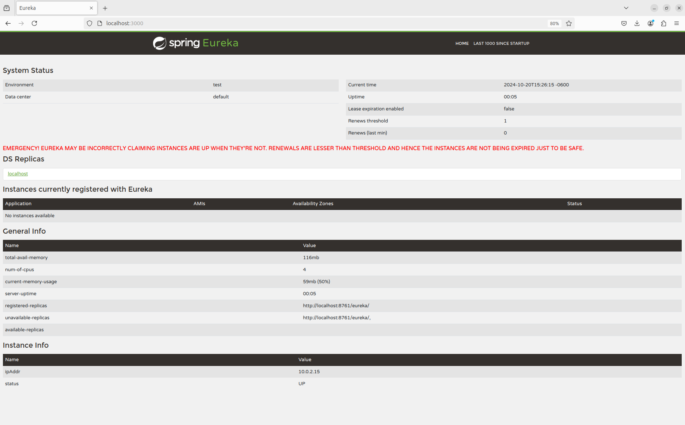
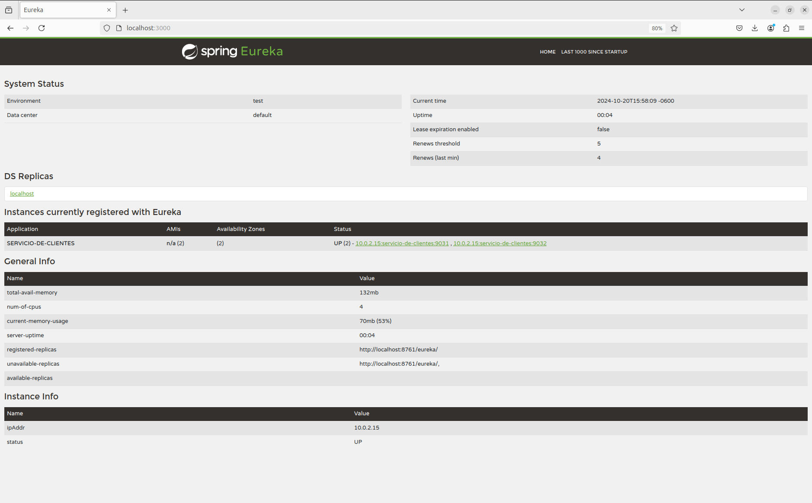

# SPRING CLOUD EUREKA

Tiempo aproximado: _15 minutos_

## OBJETIVO

En esta actividad se crean varios proyectos en Spring Boot para la utilización de Spring Cloud Eureka.

### REPOSITORIO

Esta actividad requiere que el repositorio de trabajo este en:

- Rama: `labs/microservices-development`
  - Se recomienda siempre trabajar sobre una rama _feature_.
    - Por ejemplo: `git checkout -b labs/microservices-development_cazucito`
- Carpeta: `/home/usuario/Desktop/CF01141024/eureka`

## DESARROLLO

### PROYECTO: EUREKA SERVER

Para crear una aplicación Spring Boot con Spring Tool Suite, entre al editor y seleccione la opción: `File → New → Spring Starter Project`.

En la ventana ingrese la siguiente información:

- Name: **eureka-eureka**
- Type: **Maven Project**
- Packaging: **Jar**
- Java (versión): **17**
- Language: **Java**
- Group: **mx.com.fractalyst.pdv**
- Artifact: **eureka-eureka**
- Version: **0.1.0-SNAPSHOT**
- Description: **Spring Cloud Eureka Server**
- Package Name: **mx.com.fractalyst.pdv.sc**

De clic en `Next`:

- Spring Boot Version: **3.3.4**
  - Se recomienda utilizar las versiones estables
- Dependencias: `Eureka Server`, `Spring Boot Actuator` y `Spring Web`.

De clic en `Next`:

- No realice cambios

De clic en `Finish`.

Este último paso solicita la creación y apertura del proyecto Maven en el STS.

#### SPRING BOOT ACTUATOR: INFO

Para visualizar información en el endpoint `actuator/info` se debe adicionar la ejecución del _goal_ `build-info` en el _plug-in_ `spring-boot-maven-plugin`.

Haga que la sección del _plug-in_ se vea como el bloque de `pom.xml` que se muestra a continuación:

``` xml
          <plugin>
                <groupId>org.springframework.boot</groupId>
                <artifactId>spring-boot-maven-plugin</artifactId>
                <executions>
                    <execution>
                        <goals>
                            <goal>build-info</goal>
                        </goals>
                    </execution>
                </executions>
            </plugin>
```

#### SPRING BOOT APPLICATION

Ahora adicione la anotación `@EnableEurekaServer` a la clase ya anotada con `@SpringBootApplication`.

La clase debe quedar como sigue:

``` java
package mx.com.fractalyst.pdv.sc;

import org.springframework.boot.SpringApplication;
import org.springframework.boot.autoconfigure.SpringBootApplication;
import org.springframework.cloud.netflix.eureka.server.EnableEurekaServer;

@SpringBootApplication
@EnableEurekaServer
public class EurekaEurekaApplication {

    public static void main(String[] args) {
        SpringApplication.run(EurekaEurekaApplication.class, args);
    }

}
```

#### CONFIGURACIÓN: application.yml

Para definir los detalles del servidor de descubrimiento cree el archivo de configuración de la aplicación `application.yml` con el siguiente contenido:

``` yaml
spring:
  application:
    name: servicio-de-descubrimiento

server:
  port: ${PORT:3000}

eureka:
  client:
    registerWithEureka: false
    fetchRegistry: false

management:
  endpoint:
    shutdown:
      enabled: true
  endpoints:
    web:
      exposure:
        include: "*"
```

#### CONSTRUCCIÓN

Para construir el servidor _Spring Cloud Eureka_ ejecute el siguiente comando Maven en una terminal en la raíz del proyecto (`/home/usuario/Desktop/CF01141024/eureka/eureka-eureka`):

``` shell
mvn clean package
```

Debería ver un resultado similar al siguiente:

``` shell
[INFO] Scanning for projects...
[INFO] 
[INFO] ----------------< mx.com.fractalyst.pdv:eureka-eureka >-----------------
[INFO] Building eureka-eureka 0.1.0-SNAPSHOT
[INFO] --------------------------------[ jar ]---------------------------------
Downloading from central: https://repo.maven.apache.org/maven2/org/apache/maven/plugins/maven-clean-plugin/3.3.2/maven-clean-plugin-3.3.2.pom
Downloaded from central: https://repo.maven.apache.org/maven2/org/apache/maven/plugins/maven-clean-plugin/3.3.2/maven-clean-plugin-3.3.2.pom (5.3 kB at 4.9 kB/s)
Downloading from central: https://repo.maven.apache.org/maven2/org/apache/maven/plugins/maven-plugins/40/maven-plugins-40.pom
Downloaded from central: https://repo.maven.apache.org/maven2/org/apache/maven/plugins/maven-plugins/40/maven-plugins-40.pom (8.1 kB at 42 kB/s)
Downloading from central: https://repo.maven.apache.org/maven2/org/apache/maven/maven-parent/40/maven-parent-40.pom
Downloaded from central: https://repo.maven.apache.org/maven2/org/apache/maven/maven-parent/40/maven-parent-40.pom (49 kB at 181 kB/s)
[INFO] 
[INFO] --- maven-clean-plugin:3.3.2:clean (default-clean) @ eureka-eureka ---
[INFO] Deleting /home/usuario/Desktop/CF01141024/eureka-eureka/target
[INFO] 
[INFO] --- spring-boot-maven-plugin:3.3.4:build-info (default) @ eureka-eureka ---
[INFO] 
[INFO] --- maven-resources-plugin:3.3.1:resources (default-resources) @ eureka-eureka ---
[INFO] Copying 1 resource from src/main/resources to target/classes
[INFO] Copying 0 resource from src/main/resources to target/classes
[INFO] 
[INFO] --- maven-compiler-plugin:3.13.0:compile (default-compile) @ eureka-eureka ---
[INFO] Recompiling the module because of changed source code.
[INFO] Compiling 1 source file with javac [debug parameters release 17] to target/classes
[INFO] 
[INFO] --- maven-resources-plugin:3.3.1:testResources (default-testResources) @ eureka-eureka ---
[INFO] skip non existing resourceDirectory /home/usuario/Desktop/CF01141024/eureka-eureka/src/test/resources
[INFO] 
[INFO] --- maven-compiler-plugin:3.13.0:testCompile (default-testCompile) @ eureka-eureka ---
[INFO] Recompiling the module because of changed dependency.
[INFO] Compiling 1 source file with javac [debug parameters release 17] to target/test-classes
[INFO] 
[INFO] --- maven-surefire-plugin:3.2.5:test (default-test) @ eureka-eureka ---
Downloading from central: https://repo.maven.apache.org/maven2/org/apache/maven/surefire/maven-surefire-common/3.2.5/maven-surefire-common-3.2.5.pom
Downloaded from central: https://repo.maven.apache.org/maven2/org/apache/maven/surefire/maven-surefire-common/3.2.5/maven-surefire-common-3.2.5.pom (6.2 kB at 33 kB/s)
Downloading from central: https://repo.maven.apache.org/maven2/org/apache/maven/surefire/surefire-api/3.2.5/surefire-api-3.2.5.pom
Downloaded from central: https://repo.maven.apache.org/maven2/org/apache/maven/surefire/surefire-api/3.2.5/surefire-api-3.2.5.pom (3.5 kB at 18 kB/s)
Downloading from central: https://repo.maven.apache.org/maven2/org/apache/maven/surefire/surefire-logger-api/3.2.5/surefire-logger-api-3.2.5.pom
Downloaded from central: https://repo.maven.apache.org/maven2/org/apache/maven/surefire/surefire-logger-api/3.2.5/surefire-logger-api-3.2.5.pom (3.3 kB at 18 kB/s)
Downloading from central: https://repo.maven.apache.org/maven2/org/apache/maven/surefire/surefire-shared-utils/3.2.5/surefire-shared-utils-3.2.5.pom
Downloaded from central: https://repo.maven.apache.org/maven2/org/apache/maven/surefire/surefire-shared-utils/3.2.5/surefire-shared-utils-3.2.5.pom (4.1 kB at 22 kB/s)
Downloading from central: https://repo.maven.apache.org/maven2/org/apache/maven/surefire/surefire-extensions-api/3.2.5/surefire-extensions-api-3.2.5.pom
Downloaded from central: https://repo.maven.apache.org/maven2/org/apache/maven/surefire/surefire-extensions-api/3.2.5/surefire-extensions-api-3.2.5.pom (3.3 kB at 14 kB/s)
Downloading from central: https://repo.maven.apache.org/maven2/org/apache/maven/surefire/surefire-booter/3.2.5/surefire-booter-3.2.5.pom
Downloaded from central: https://repo.maven.apache.org/maven2/org/apache/maven/surefire/surefire-booter/3.2.5/surefire-booter-3.2.5.pom (4.5 kB at 23 kB/s)
Downloading from central: https://repo.maven.apache.org/maven2/org/apache/maven/surefire/surefire-extensions-spi/3.2.5/surefire-extensions-spi-3.2.5.pom
Downloaded from central: https://repo.maven.apache.org/maven2/org/apache/maven/surefire/surefire-extensions-spi/3.2.5/surefire-extensions-spi-3.2.5.pom (1.8 kB at 8.3 kB/s)
Downloading from central: https://repo.maven.apache.org/maven2/org/apache/maven/surefire/maven-surefire-common/3.2.5/maven-surefire-common-3.2.5.jar
Downloading from central: https://repo.maven.apache.org/maven2/org/apache/maven/surefire/surefire-api/3.2.5/surefire-api-3.2.5.jar
Downloading from central: https://repo.maven.apache.org/maven2/org/apache/maven/surefire/surefire-logger-api/3.2.5/surefire-logger-api-3.2.5.jar
Downloading from central: https://repo.maven.apache.org/maven2/org/apache/maven/surefire/surefire-extensions-api/3.2.5/surefire-extensions-api-3.2.5.jar
Downloading from central: https://repo.maven.apache.org/maven2/org/apache/maven/surefire/surefire-booter/3.2.5/surefire-booter-3.2.5.jar
Downloaded from central: https://repo.maven.apache.org/maven2/org/apache/maven/surefire/surefire-api/3.2.5/surefire-api-3.2.5.jar (171 kB at 445 kB/s)
Downloading from central: https://repo.maven.apache.org/maven2/org/apache/maven/surefire/surefire-extensions-spi/3.2.5/surefire-extensions-spi-3.2.5.jar
Downloaded from central: https://repo.maven.apache.org/maven2/org/apache/maven/surefire/surefire-logger-api/3.2.5/surefire-logger-api-3.2.5.jar (14 kB at 30 kB/s)
Downloading from central: https://repo.maven.apache.org/maven2/org/apache/maven/surefire/surefire-shared-utils/3.2.5/surefire-shared-utils-3.2.5.jar
Downloaded from central: https://repo.maven.apache.org/maven2/org/apache/maven/surefire/surefire-extensions-spi/3.2.5/surefire-extensions-spi-3.2.5.jar (8.2 kB at 14 kB/s)
Downloaded from central: https://repo.maven.apache.org/maven2/org/apache/maven/surefire/surefire-extensions-api/3.2.5/surefire-extensions-api-3.2.5.jar (26 kB at 40 kB/s)
Downloaded from central: https://repo.maven.apache.org/maven2/org/apache/maven/surefire/surefire-booter/3.2.5/surefire-booter-3.2.5.jar (118 kB at 139 kB/s)
Downloaded from central: https://repo.maven.apache.org/maven2/org/apache/maven/surefire/maven-surefire-common/3.2.5/maven-surefire-common-3.2.5.jar (308 kB at 360 kB/s)
Downloaded from central: https://repo.maven.apache.org/maven2/org/apache/maven/surefire/surefire-shared-utils/3.2.5/surefire-shared-utils-3.2.5.jar (2.4 MB at 2.0 MB/s)
[INFO] Using auto detected provider org.apache.maven.surefire.junitplatform.JUnitPlatformProvider
Downloading from central: https://repo.maven.apache.org/maven2/org/apache/maven/surefire/surefire-junit-platform/3.2.5/surefire-junit-platform-3.2.5.pom
Downloaded from central: https://repo.maven.apache.org/maven2/org/apache/maven/surefire/surefire-junit-platform/3.2.5/surefire-junit-platform-3.2.5.pom (4.7 kB at 24 kB/s)
Downloading from central: https://repo.maven.apache.org/maven2/org/apache/maven/surefire/surefire-providers/3.2.5/surefire-providers-3.2.5.pom
Downloaded from central: https://repo.maven.apache.org/maven2/org/apache/maven/surefire/surefire-providers/3.2.5/surefire-providers-3.2.5.pom (2.6 kB at 13 kB/s)
Downloading from central: https://repo.maven.apache.org/maven2/org/apache/maven/surefire/common-java5/3.2.5/common-java5-3.2.5.pom
Downloaded from central: https://repo.maven.apache.org/maven2/org/apache/maven/surefire/common-java5/3.2.5/common-java5-3.2.5.pom (2.8 kB at 15 kB/s)
Downloading from central: https://repo.maven.apache.org/maven2/org/junit/platform/junit-platform-launcher/1.9.3/junit-platform-launcher-1.9.3.pom
Downloaded from central: https://repo.maven.apache.org/maven2/org/junit/platform/junit-platform-launcher/1.9.3/junit-platform-launcher-1.9.3.pom (3.0 kB at 12 kB/s)
Downloading from central: https://repo.maven.apache.org/maven2/org/junit/platform/junit-platform-engine/1.9.3/junit-platform-engine-1.9.3.pom
Downloaded from central: https://repo.maven.apache.org/maven2/org/junit/platform/junit-platform-engine/1.9.3/junit-platform-engine-1.9.3.pom (3.2 kB at 17 kB/s)
Downloading from central: https://repo.maven.apache.org/maven2/org/junit/platform/junit-platform-commons/1.9.3/junit-platform-commons-1.9.3.pom
Downloaded from central: https://repo.maven.apache.org/maven2/org/junit/platform/junit-platform-commons/1.9.3/junit-platform-commons-1.9.3.pom (2.8 kB at 15 kB/s)
Downloading from central: https://repo.maven.apache.org/maven2/org/apache/maven/surefire/surefire-junit-platform/3.2.5/surefire-junit-platform-3.2.5.jar
Downloading from central: https://repo.maven.apache.org/maven2/org/junit/platform/junit-platform-launcher/1.9.3/junit-platform-launcher-1.9.3.jar
Downloading from central: https://repo.maven.apache.org/maven2/org/apache/maven/surefire/common-java5/3.2.5/common-java5-3.2.5.jar
Downloading from central: https://repo.maven.apache.org/maven2/org/junit/platform/junit-platform-engine/1.9.3/junit-platform-engine-1.9.3.jar
Downloading from central: https://repo.maven.apache.org/maven2/org/junit/platform/junit-platform-commons/1.9.3/junit-platform-commons-1.9.3.jar
Downloaded from central: https://repo.maven.apache.org/maven2/org/apache/maven/surefire/surefire-junit-platform/3.2.5/surefire-junit-platform-3.2.5.jar (27 kB at 111 kB/s)
Downloaded from central: https://repo.maven.apache.org/maven2/org/apache/maven/surefire/common-java5/3.2.5/common-java5-3.2.5.jar (18 kB at 66 kB/s)
Downloaded from central: https://repo.maven.apache.org/maven2/org/junit/platform/junit-platform-launcher/1.9.3/junit-platform-launcher-1.9.3.jar (169 kB at 521 kB/s)
Downloaded from central: https://repo.maven.apache.org/maven2/org/junit/platform/junit-platform-commons/1.9.3/junit-platform-commons-1.9.3.jar (103 kB at 315 kB/s)
Downloaded from central: https://repo.maven.apache.org/maven2/org/junit/platform/junit-platform-engine/1.9.3/junit-platform-engine-1.9.3.jar (189 kB at 572 kB/s)
[INFO] 
[INFO] -------------------------------------------------------
[INFO]  T E S T S
[INFO] -------------------------------------------------------
[INFO] Running mx.com.fractalyst.pdv.sc.EurekaEurekaApplicationTests
Standard Commons Logging discovery in action with spring-jcl: please remove commons-logging.jar from classpath in order to avoid potential conflicts
15:18:36.650 [main] INFO org.springframework.test.context.support.AnnotationConfigContextLoaderUtils -- Could not detect default configuration classes for test class [mx.com.fractalyst.pdv.sc.EurekaEurekaApplicationTests]: EurekaEurekaApplicationTests does not declare any static, non-private, non-final, nested classes annotated with @Configuration.
15:18:36.960 [main] INFO org.springframework.boot.test.context.SpringBootTestContextBootstrapper -- Found @SpringBootConfiguration mx.com.fractalyst.pdv.sc.EurekaEurekaApplication for test class mx.com.fractalyst.pdv.sc.EurekaEurekaApplicationTests

  .   ____          _            __ _ _
 /\\ / ___'_ __ _ _(_)_ __  __ _ \ \ \ \
( ( )\___ | '_ | '_| | '_ \/ _` | \ \ \ \
 \\/  ___)| |_)| | | | | || (_| |  ) ) ) )
  '  |____| .__|_| |_|_| |_\__, | / / / /
 =========|_|==============|___/=/_/_/_/

 :: Spring Boot ::                (v3.3.4)

2024-10-20T15:18:38.296-06:00  INFO 6478 --- [servicio-de-descubrimiento] [           main] m.c.f.p.sc.EurekaEurekaApplicationTests  : Starting EurekaEurekaApplicationTests using Java 17.0.12 with PID 6478 (started by usuario in /home/usuario/Desktop/CF01141024/eureka-eureka)
2024-10-20T15:18:38.302-06:00  INFO 6478 --- [servicio-de-descubrimiento] [           main] m.c.f.p.sc.EurekaEurekaApplicationTests  : No active profile set, falling back to 1 default profile: "default"
2024-10-20T15:18:41.925-06:00  INFO 6478 --- [servicio-de-descubrimiento] [           main] o.s.cloud.context.scope.GenericScope     : BeanFactory id=57298144-4911-32a8-a134-bbd63c12b15d
2024-10-20T15:18:42.178-06:00  WARN 6478 --- [servicio-de-descubrimiento] [           main] trationDelegate$BeanPostProcessorChecker : Bean 'org.springframework.cloud.client.loadbalancer.LoadBalancerAutoConfiguration$DeferringLoadBalancerInterceptorConfig' of type [org.springframework.cloud.client.loadbalancer.LoadBalancerAutoConfiguration$DeferringLoadBalancerInterceptorConfig] is not eligible for getting processed by all BeanPostProcessors (for example: not eligible for auto-proxying). The currently created BeanPostProcessor [lbRestClientPostProcessor] is declared through a non-static factory method on that class; consider declaring it as static instead.
2024-10-20T15:18:42.194-06:00  WARN 6478 --- [servicio-de-descubrimiento] [           main] trationDelegate$BeanPostProcessorChecker : Bean 'deferringLoadBalancerInterceptor' of type [org.springframework.cloud.client.loadbalancer.DeferringLoadBalancerInterceptor] is not eligible for getting processed by all BeanPostProcessors (for example: not eligible for auto-proxying). Is this bean getting eagerly injected into a currently created BeanPostProcessor [lbRestClientPostProcessor]? Check the corresponding BeanPostProcessor declaration and its dependencies.
2024-10-20T15:18:45.347-06:00  WARN 6478 --- [servicio-de-descubrimiento] [           main] iguration$LoadBalancerCaffeineWarnLogger : Spring Cloud LoadBalancer is currently working with the default cache. While this cache implementation is useful for development and tests, it's recommended to use Caffeine cache in production.You can switch to using Caffeine cache, by adding it and org.springframework.cache.caffeine.CaffeineCacheManager to the classpath.
2024-10-20T15:18:45.989-06:00  INFO 6478 --- [servicio-de-descubrimiento] [           main] o.s.c.n.eureka.InstanceInfoFactory       : Setting initial instance status as: STARTING
2024-10-20T15:18:46.120-06:00  INFO 6478 --- [servicio-de-descubrimiento] [           main] com.netflix.discovery.DiscoveryClient    : Initializing Eureka in region us-east-1
2024-10-20T15:18:46.122-06:00  INFO 6478 --- [servicio-de-descubrimiento] [           main] com.netflix.discovery.DiscoveryClient    : Client configured to neither register nor query for data.
2024-10-20T15:18:46.126-06:00  INFO 6478 --- [servicio-de-descubrimiento] [           main] com.netflix.discovery.DiscoveryClient    : Discovery Client initialized at timestamp 1729459126125 with initial instances count: 0
2024-10-20T15:18:46.208-06:00  INFO 6478 --- [servicio-de-descubrimiento] [           main] c.n.eureka.DefaultEurekaServerContext    : Initializing ...
2024-10-20T15:18:46.213-06:00  INFO 6478 --- [servicio-de-descubrimiento] [           main] c.n.eureka.cluster.PeerEurekaNodes       : Adding new peer nodes [http://localhost:8761/eureka/]
2024-10-20T15:18:46.435-06:00  INFO 6478 --- [servicio-de-descubrimiento] [           main] c.n.d.provider.DiscoveryJerseyProvider   : Using JSON encoding codec LegacyJacksonJson
2024-10-20T15:18:46.436-06:00  INFO 6478 --- [servicio-de-descubrimiento] [           main] c.n.d.provider.DiscoveryJerseyProvider   : Using JSON decoding codec LegacyJacksonJson
2024-10-20T15:18:46.436-06:00  INFO 6478 --- [servicio-de-descubrimiento] [           main] c.n.d.provider.DiscoveryJerseyProvider   : Using XML encoding codec XStreamXml
2024-10-20T15:18:46.436-06:00  INFO 6478 --- [servicio-de-descubrimiento] [           main] c.n.d.provider.DiscoveryJerseyProvider   : Using XML decoding codec XStreamXml
2024-10-20T15:18:46.657-06:00  INFO 6478 --- [servicio-de-descubrimiento] [           main] c.n.eureka.cluster.PeerEurekaNodes       : Replica node URL:  http://localhost:8761/eureka/
2024-10-20T15:18:46.704-06:00  INFO 6478 --- [servicio-de-descubrimiento] [           main] c.n.e.registry.AbstractInstanceRegistry  : Finished initializing remote region registries. All known remote regions: []
2024-10-20T15:18:46.707-06:00  INFO 6478 --- [servicio-de-descubrimiento] [           main] c.n.eureka.DefaultEurekaServerContext    : Initialized
2024-10-20T15:18:47.039-06:00  INFO 6478 --- [servicio-de-descubrimiento] [           main] o.s.b.a.e.web.EndpointLinksResolver      : Exposing 18 endpoints beneath base path '/actuator'
2024-10-20T15:18:47.144-06:00  INFO 6478 --- [servicio-de-descubrimiento] [           main] o.s.c.n.e.s.EurekaServiceRegistry        : Registering application SERVICIO-DE-DESCUBRIMIENTO with eureka with status UP
2024-10-20T15:18:47.163-06:00  INFO 6478 --- [servicio-de-descubrimiento] [      Thread-10] o.s.c.n.e.server.EurekaServerBootstrap   : isAws returned false
2024-10-20T15:18:47.163-06:00  INFO 6478 --- [servicio-de-descubrimiento] [      Thread-10] o.s.c.n.e.server.EurekaServerBootstrap   : Initialized server context
2024-10-20T15:18:47.164-06:00  INFO 6478 --- [servicio-de-descubrimiento] [      Thread-10] c.n.e.r.PeerAwareInstanceRegistryImpl    : Got 1 instances from neighboring DS node
2024-10-20T15:18:47.164-06:00  INFO 6478 --- [servicio-de-descubrimiento] [      Thread-10] c.n.e.r.PeerAwareInstanceRegistryImpl    : Renew threshold is: 1
2024-10-20T15:18:47.164-06:00  INFO 6478 --- [servicio-de-descubrimiento] [      Thread-10] c.n.e.r.PeerAwareInstanceRegistryImpl    : Changing status to UP
2024-10-20T15:18:47.167-06:00  INFO 6478 --- [servicio-de-descubrimiento] [      Thread-10] e.s.EurekaServerInitializerConfiguration : Started Eureka Server
2024-10-20T15:18:47.191-06:00  INFO 6478 --- [servicio-de-descubrimiento] [           main] m.c.f.p.sc.EurekaEurekaApplicationTests  : Started EurekaEurekaApplicationTests in 9.773 seconds (process running for 12.247)
OpenJDK 64-Bit Server VM warning: Sharing is only supported for boot loader classes because bootstrap classpath has been appended
[INFO] Tests run: 1, Failures: 0, Errors: 0, Skipped: 0, Time elapsed: 12.38 s -- in mx.com.fractalyst.pdv.sc.EurekaEurekaApplicationTests
[INFO] 
[INFO] Results:
[INFO] 
[INFO] Tests run: 1, Failures: 0, Errors: 0, Skipped: 0
[INFO] 
[INFO] 
[INFO] --- maven-jar-plugin:3.4.2:jar (default-jar) @ eureka-eureka ---
[INFO] Building jar: /home/usuario/Desktop/CF01141024/eureka-eureka/target/eureka-eureka-0.1.0-SNAPSHOT.jar
[INFO] 
[INFO] --- spring-boot-maven-plugin:3.3.4:repackage (repackage) @ eureka-eureka ---
[INFO] Replacing main artifact /home/usuario/Desktop/CF01141024/eureka-eureka/target/eureka-eureka-0.1.0-SNAPSHOT.jar with repackaged archive, adding nested dependencies in BOOT-INF/.
[INFO] The original artifact has been renamed to /home/usuario/Desktop/CF01141024/eureka-eureka/target/eureka-eureka-0.1.0-SNAPSHOT.jar.original
[INFO] ------------------------------------------------------------------------
[INFO] BUILD SUCCESS
[INFO] ------------------------------------------------------------------------
[INFO] Total time:  26.384 s
[INFO] Finished at: 2024-10-20T15:18:49-06:00
[INFO] ------------------------------------------------------------------------
```

#### EJECUCIÓN

Para ejecutar la aplicación se puede ejecutar el _jar_ ubicado en la carpeta `target` del proyecto:

``` shell
java -jar target/eureka-eureka-0.1.0-SNAPSHOT.jar
```

Se debe ver un resultado similar al siguiente:

``` shell
Standard Commons Logging discovery in action with spring-jcl: please remove commons-logging.jar from classpath in order to avoid potential conflicts

  .   ____          _            __ _ _
 /\\ / ___'_ __ _ _(_)_ __  __ _ \ \ \ \
( ( )\___ | '_ | '_| | '_ \/ _` | \ \ \ \
 \\/  ___)| |_)| | | | | || (_| |  ) ) ) )
  '  |____| .__|_| |_|_| |_\__, | / / / /
 =========|_|==============|___/=/_/_/_/

 :: Spring Boot ::                (v3.3.4)

2024-10-20T15:20:59.418-06:00  INFO 6658 --- [servicio-de-descubrimiento] [           main] m.c.f.pdv.sc.EurekaEurekaApplication     : Starting EurekaEurekaApplication v0.1.0-SNAPSHOT using Java 17.0.12 with PID 6658 (/home/usuario/Desktop/CF01141024/eureka-eureka/target/eureka-eureka-0.1.0-SNAPSHOT.jar started by usuario in /home/usuario/Desktop/CF01141024/eureka-eureka)
2024-10-20T15:20:59.422-06:00  INFO 6658 --- [servicio-de-descubrimiento] [           main] m.c.f.pdv.sc.EurekaEurekaApplication     : No active profile set, falling back to 1 default profile: "default"
2024-10-20T15:21:01.486-06:00  INFO 6658 --- [servicio-de-descubrimiento] [           main] o.s.cloud.context.scope.GenericScope     : BeanFactory id=c25ab87a-5a43-352c-8ab3-1a489d2b2af4
2024-10-20T15:21:01.586-06:00  WARN 6658 --- [servicio-de-descubrimiento] [           main] trationDelegate$BeanPostProcessorChecker : Bean 'org.springframework.cloud.client.loadbalancer.LoadBalancerAutoConfiguration$DeferringLoadBalancerInterceptorConfig' of type [org.springframework.cloud.client.loadbalancer.LoadBalancerAutoConfiguration$DeferringLoadBalancerInterceptorConfig] is not eligible for getting processed by all BeanPostProcessors (for example: not eligible for auto-proxying). The currently created BeanPostProcessor [lbRestClientPostProcessor] is declared through a non-static factory method on that class; consider declaring it as static instead.
2024-10-20T15:21:01.594-06:00  WARN 6658 --- [servicio-de-descubrimiento] [           main] trationDelegate$BeanPostProcessorChecker : Bean 'deferringLoadBalancerInterceptor' of type [org.springframework.cloud.client.loadbalancer.DeferringLoadBalancerInterceptor] is not eligible for getting processed by all BeanPostProcessors (for example: not eligible for auto-proxying). Is this bean getting eagerly injected into a currently created BeanPostProcessor [lbRestClientPostProcessor]? Check the corresponding BeanPostProcessor declaration and its dependencies.
2024-10-20T15:21:01.986-06:00  INFO 6658 --- [servicio-de-descubrimiento] [           main] o.s.b.w.embedded.tomcat.TomcatWebServer  : Tomcat initialized with port 3000 (http)
2024-10-20T15:21:02.007-06:00  INFO 6658 --- [servicio-de-descubrimiento] [           main] o.apache.catalina.core.StandardService   : Starting service [Tomcat]
2024-10-20T15:21:02.007-06:00  INFO 6658 --- [servicio-de-descubrimiento] [           main] o.apache.catalina.core.StandardEngine    : Starting Servlet engine: [Apache Tomcat/10.1.30]
2024-10-20T15:21:02.065-06:00  INFO 6658 --- [servicio-de-descubrimiento] [           main] o.a.c.c.C.[Tomcat].[localhost].[/]       : Initializing Spring embedded WebApplicationContext
2024-10-20T15:21:02.072-06:00  INFO 6658 --- [servicio-de-descubrimiento] [           main] w.s.c.ServletWebServerApplicationContext : Root WebApplicationContext: initialization completed in 2585 ms
Standard Commons Logging discovery in action with spring-jcl: please remove commons-logging.jar from classpath in order to avoid potential conflicts
2024-10-20T15:21:03.877-06:00  INFO 6658 --- [servicio-de-descubrimiento] [           main] c.n.d.provider.DiscoveryJerseyProvider   : Using JSON encoding codec LegacyJacksonJson
2024-10-20T15:21:03.879-06:00  INFO 6658 --- [servicio-de-descubrimiento] [           main] c.n.d.provider.DiscoveryJerseyProvider   : Using JSON decoding codec LegacyJacksonJson
2024-10-20T15:21:04.175-06:00  INFO 6658 --- [servicio-de-descubrimiento] [           main] c.n.d.provider.DiscoveryJerseyProvider   : Using XML encoding codec XStreamXml
2024-10-20T15:21:04.176-06:00  INFO 6658 --- [servicio-de-descubrimiento] [           main] c.n.d.provider.DiscoveryJerseyProvider   : Using XML decoding codec XStreamXml
2024-10-20T15:21:05.728-06:00  WARN 6658 --- [servicio-de-descubrimiento] [           main] iguration$LoadBalancerCaffeineWarnLogger : Spring Cloud LoadBalancer is currently working with the default cache. While this cache implementation is useful for development and tests, it's recommended to use Caffeine cache in production.You can switch to using Caffeine cache, by adding it and org.springframework.cache.caffeine.CaffeineCacheManager to the classpath.
2024-10-20T15:21:05.770-06:00  INFO 6658 --- [servicio-de-descubrimiento] [           main] o.s.c.n.eureka.InstanceInfoFactory       : Setting initial instance status as: STARTING
2024-10-20T15:21:05.830-06:00  INFO 6658 --- [servicio-de-descubrimiento] [           main] com.netflix.discovery.DiscoveryClient    : Initializing Eureka in region us-east-1
2024-10-20T15:21:05.830-06:00  INFO 6658 --- [servicio-de-descubrimiento] [           main] com.netflix.discovery.DiscoveryClient    : Client configured to neither register nor query for data.
2024-10-20T15:21:05.835-06:00  INFO 6658 --- [servicio-de-descubrimiento] [           main] com.netflix.discovery.DiscoveryClient    : Discovery Client initialized at timestamp 1729459265834 with initial instances count: 0
2024-10-20T15:21:05.909-06:00  INFO 6658 --- [servicio-de-descubrimiento] [           main] c.n.eureka.DefaultEurekaServerContext    : Initializing ...
2024-10-20T15:21:05.912-06:00  INFO 6658 --- [servicio-de-descubrimiento] [           main] c.n.eureka.cluster.PeerEurekaNodes       : Adding new peer nodes [http://localhost:8761/eureka/]
2024-10-20T15:21:06.110-06:00  INFO 6658 --- [servicio-de-descubrimiento] [           main] c.n.d.provider.DiscoveryJerseyProvider   : Using JSON encoding codec LegacyJacksonJson
2024-10-20T15:21:06.111-06:00  INFO 6658 --- [servicio-de-descubrimiento] [           main] c.n.d.provider.DiscoveryJerseyProvider   : Using JSON decoding codec LegacyJacksonJson
2024-10-20T15:21:06.111-06:00  INFO 6658 --- [servicio-de-descubrimiento] [           main] c.n.d.provider.DiscoveryJerseyProvider   : Using XML encoding codec XStreamXml
2024-10-20T15:21:06.111-06:00  INFO 6658 --- [servicio-de-descubrimiento] [           main] c.n.d.provider.DiscoveryJerseyProvider   : Using XML decoding codec XStreamXml
2024-10-20T15:21:06.325-06:00  INFO 6658 --- [servicio-de-descubrimiento] [           main] c.n.eureka.cluster.PeerEurekaNodes       : Replica node URL:  http://localhost:8761/eureka/
2024-10-20T15:21:06.340-06:00  INFO 6658 --- [servicio-de-descubrimiento] [           main] c.n.e.registry.AbstractInstanceRegistry  : Finished initializing remote region registries. All known remote regions: []
2024-10-20T15:21:06.340-06:00  INFO 6658 --- [servicio-de-descubrimiento] [           main] c.n.eureka.DefaultEurekaServerContext    : Initialized
2024-10-20T15:21:06.356-06:00  INFO 6658 --- [servicio-de-descubrimiento] [           main] o.s.b.a.e.web.EndpointLinksResolver      : Exposing 18 endpoints beneath base path '/actuator'
2024-10-20T15:21:06.412-06:00  INFO 6658 --- [servicio-de-descubrimiento] [           main] o.s.c.n.e.s.EurekaServiceRegistry        : Registering application SERVICIO-DE-DESCUBRIMIENTO with eureka with status UP
2024-10-20T15:21:06.474-06:00  INFO 6658 --- [servicio-de-descubrimiento] [       Thread-9] o.s.c.n.e.server.EurekaServerBootstrap   : isAws returned false
2024-10-20T15:21:06.476-06:00  INFO 6658 --- [servicio-de-descubrimiento] [       Thread-9] o.s.c.n.e.server.EurekaServerBootstrap   : Initialized server context
2024-10-20T15:21:06.476-06:00  INFO 6658 --- [servicio-de-descubrimiento] [       Thread-9] c.n.e.r.PeerAwareInstanceRegistryImpl    : Got 1 instances from neighboring DS node
2024-10-20T15:21:06.477-06:00  INFO 6658 --- [servicio-de-descubrimiento] [       Thread-9] c.n.e.r.PeerAwareInstanceRegistryImpl    : Renew threshold is: 1
2024-10-20T15:21:06.477-06:00  INFO 6658 --- [servicio-de-descubrimiento] [       Thread-9] c.n.e.r.PeerAwareInstanceRegistryImpl    : Changing status to UP
2024-10-20T15:21:06.480-06:00  INFO 6658 --- [servicio-de-descubrimiento] [       Thread-9] e.s.EurekaServerInitializerConfiguration : Started Eureka Server
2024-10-20T15:21:06.682-06:00  INFO 6658 --- [servicio-de-descubrimiento] [           main] o.s.b.w.embedded.tomcat.TomcatWebServer  : Tomcat started on port 3000 (http) with context path '/'
2024-10-20T15:21:06.684-06:00  INFO 6658 --- [servicio-de-descubrimiento] [           main] .s.c.n.e.s.EurekaAutoServiceRegistration : Updating port to 3000
2024-10-20T15:21:06.800-06:00  INFO 6658 --- [servicio-de-descubrimiento] [           main] m.c.f.pdv.sc.EurekaEurekaApplication     : Started EurekaEurekaApplication in 8.105 seconds (process running for 8.991)
```

Esta ejecución hace disponible el servidor _Eureka_.

La terminal de comandos se bloquea por lo que las siguientes acciones deben ser realizadas en otra terminal y de requerir detener el servidor debe ejecutar `Ctrl+C` en la terminal en la que se haya iniciado.

Para validar que el servidor de descubrimiento se encuentras funcionando se puede llamar al _endpoint_ publicado por el actuador `/actuator/health` como se muestra a continuación:

``` shell
curl http://localhost:3000/actuator/health
```

La salida debe ser similar a:

``` json
{
  "status":"UP"
}
```

Y puede llamar al endpoint /actuator/info para obtener información del servicio:

``` shell
curl http://localhost:3000/actuator/info
```

La salida debe ser similar a:

``` json
{
    "build": {
        "artifact": "eureka-eureka",
        "name": "eureka-eureka",
        "time": "2024-10-20T21:18:23.292Z",
        "version": "0.1.0-SNAPSHOT",
        "group": "mx.com.fractalyst.pdv"
    }
}
```

Con lo anterior podemos está seguros de que el servidor-de-descubrimiento está operativo.

##### EUREKA DASHBOARD

El servidor de descubrimiento Eureka brinda un dashboard que puede ser accesible mediante un cliente web en el url: <http://localhost:3000>



### PROYECTO: CLIENTES

Para crear una aplicación _Spring Boot_ con _Spring Tool Suite_, entre al editor y seleccione la opción `File → New → Spring Starter Project`.

En la ventana ingrese la siguiente información:

- Name: **eureka-clientes**
- Type: **Maven Project**
- Packaging: **Jar**
- Java (versión): **17**
- Language: **Java**
- Group: **mx.com.fractalyst.pdv**
- Artifact: **eureka-clientes**
- Version: **0.1.0-SNAPSHOT**
- Description: **Spring Cloud Eureka - Clientes**
- Package Name: **mx.com.fractalyst.pdv.sc**

De clic en `Next`:

- Spring Boot Version: **3.3.4**
  - Se recomienda utilizar las versiones estables
- Dependencias: `Eureka Discovery Client`, `Spring Boot Actuator` y `Spring Web`.

De clic en `Next`:

- No realice cambios.
  
De clic en `Finish`.

Este último paso solicita la creación y apertura del proyecto Maven en el STS.

#### SPRING BOOT ACTUATOR: INFO

Para visualizar información en el _endpoint_ `actuator/info` se debe adicionar la ejecución del _goal_ `build-info` en el _plug-in_ `spring-boot-maven-plugin`.
Haga que la sección del plug-in se vea como el bloque de pom.xml que se muestra a continuación:

``` xml
          <plugin>
                <groupId>org.springframework.boot</groupId>
                <artifactId>spring-boot-maven-plugin</artifactId>
                <executions>
                    <execution>
                        <goals>
                            <goal>build-info</goal>
                        </goals>
                    </execution>
                </executions>
            </plugin>
```

#### SPRING BOOT APPLICATION

La aplicación además de su lógica de negocio debe comunicarse con el servidor _Eureka_, para lo cual debe registrarse y enviar información de metadatos como _host_, puerto, URL de indicador de estado y página de inicio.

_Eureka Server_ recibe mensajes de _heartbeat_ de cada instancia perteneciente a un servicio. Si el latido no se recibe después de un período de tiempo configurado, la instancia se elimina del registro.

Para lograr lo anterior se debe adicionar la anotación `@EnableDiscoveryClient` a la clase ya anotada con `@SpringBootApplication`.
La clase debe quedar como se muestra a continuación:

``` java
package mx.com.fractalyst.pdv.sc;

import org.springframework.boot.SpringApplication;
import org.springframework.boot.autoconfigure.SpringBootApplication;
import org.springframework.cloud.client.discovery.EnableDiscoveryClient;

@SpringBootApplication
@EnableDiscoveryClient
public class EurekaClientesApplication {

	public static void main(String[] args) {
		SpringApplication.run(EurekaClientesApplication.class, args);
	}

}
```

#### CONFIGURACIÓN: application.yml

El siguiente paso es configurar la información del `servicio-de-descubrimiento` en el cliente, así como la configuración propia del servicio. Para lo anterior se debe crear el archivo de configuración de la aplicación `src/main/resources/application.yml` con el siguiente contenido:

``` yaml
spring:
  application:
    name: servicio-de-clientes

server:
  port: ${PORT:9030}

eureka:
  client:
    service-url:
      defaultZone: ${EUREKA_URL:http://localhost:3000/eureka/}

management:
  endpoint:
    shutdown:
      enabled: true
  endpoints:
    web:
      exposure:
        include: "*"
```

#### CONSTRUCCIÓN

Para construir el servidor Eureka ejecute el siguiente comando Maven en una terminal en la raíz del proyecto:

``` shell
mvn clean package
```

Debería ver un resultado similar al siguiente:

``` shell
[INFO] Scanning for projects...
[INFO] 
[INFO] ---------------< mx.com.fractalyst.pdv:eureka-clientes >----------------
[INFO] Building eureka-clientes 0.1.0-SNAPSHOT
[INFO] --------------------------------[ jar ]---------------------------------
[INFO] 
[INFO] --- maven-clean-plugin:3.3.2:clean (default-clean) @ eureka-clientes ---
[INFO] Deleting /home/usuario/Desktop/CF01141024/eureka-clientes/target
[INFO] 
[INFO] --- spring-boot-maven-plugin:3.3.4:build-info (default) @ eureka-clientes ---
[INFO] 
[INFO] --- maven-resources-plugin:3.3.1:resources (default-resources) @ eureka-clientes ---
[INFO] Copying 1 resource from src/main/resources to target/classes
[INFO] Copying 0 resource from src/main/resources to target/classes
[INFO] 
[INFO] --- maven-compiler-plugin:3.13.0:compile (default-compile) @ eureka-clientes ---
[INFO] Recompiling the module because of changed source code.
[INFO] Compiling 1 source file with javac [debug parameters release 17] to target/classes
[INFO] 
[INFO] --- maven-resources-plugin:3.3.1:testResources (default-testResources) @ eureka-clientes ---
[INFO] skip non existing resourceDirectory /home/usuario/Desktop/CF01141024/eureka-clientes/src/test/resources
[INFO] 
[INFO] --- maven-compiler-plugin:3.13.0:testCompile (default-testCompile) @ eureka-clientes ---
[INFO] Recompiling the module because of changed dependency.
[INFO] Compiling 1 source file with javac [debug parameters release 17] to target/test-classes
[INFO] 
[INFO] --- maven-surefire-plugin:3.2.5:test (default-test) @ eureka-clientes ---
[INFO] Using auto detected provider org.apache.maven.surefire.junitplatform.JUnitPlatformProvider
[INFO] 
[INFO] -------------------------------------------------------
[INFO]  T E S T S
[INFO] -------------------------------------------------------
[INFO] Running mx.com.fractalyst.pdv.sc.EurekaClientesApplicationTests
15:45:41.217 [main] INFO org.springframework.test.context.support.AnnotationConfigContextLoaderUtils -- Could not detect default configuration classes for test class [mx.com.fractalyst.pdv.sc.EurekaClientesApplicationTests]: EurekaClientesApplicationTests does not declare any static, non-private, non-final, nested classes annotated with @Configuration.
15:45:41.444 [main] INFO org.springframework.boot.test.context.SpringBootTestContextBootstrapper -- Found @SpringBootConfiguration mx.com.fractalyst.pdv.sc.EurekaClientesApplication for test class mx.com.fractalyst.pdv.sc.EurekaClientesApplicationTests

  .   ____          _            __ _ _
 /\\ / ___'_ __ _ _(_)_ __  __ _ \ \ \ \
( ( )\___ | '_ | '_| | '_ \/ _` | \ \ \ \
 \\/  ___)| |_)| | | | | || (_| |  ) ) ) )
  '  |____| .__|_| |_|_| |_\__, | / / / /
 =========|_|==============|___/=/_/_/_/

 :: Spring Boot ::                (v3.3.4)

2024-10-20T15:45:42.262-06:00  INFO 7961 --- [servicio-de-clientes] [           main] m.c.f.p.s.EurekaClientesApplicationTests : Starting EurekaClientesApplicationTests using Java 17.0.12 with PID 7961 (started by usuario in /home/usuario/Desktop/CF01141024/eureka-clientes)
2024-10-20T15:45:42.263-06:00  INFO 7961 --- [servicio-de-clientes] [           main] m.c.f.p.s.EurekaClientesApplicationTests : No active profile set, falling back to 1 default profile: "default"
2024-10-20T15:45:44.399-06:00  INFO 7961 --- [servicio-de-clientes] [           main] o.s.cloud.context.scope.GenericScope     : BeanFactory id=aaab1793-1e7a-30b0-9f54-0b1868b8d072
2024-10-20T15:45:44.513-06:00  WARN 7961 --- [servicio-de-clientes] [           main] trationDelegate$BeanPostProcessorChecker : Bean 'org.springframework.cloud.client.loadbalancer.LoadBalancerAutoConfiguration$DeferringLoadBalancerInterceptorConfig' of type [org.springframework.cloud.client.loadbalancer.LoadBalancerAutoConfiguration$DeferringLoadBalancerInterceptorConfig] is not eligible for getting processed by all BeanPostProcessors (for example: not eligible for auto-proxying). The currently created BeanPostProcessor [lbRestClientPostProcessor] is declared through a non-static factory method on that class; consider declaring it as static instead.
2024-10-20T15:45:44.518-06:00  WARN 7961 --- [servicio-de-clientes] [           main] trationDelegate$BeanPostProcessorChecker : Bean 'deferringLoadBalancerInterceptor' of type [org.springframework.cloud.client.loadbalancer.DeferringLoadBalancerInterceptor] is not eligible for getting processed by all BeanPostProcessors (for example: not eligible for auto-proxying). Is this bean getting eagerly injected into a currently created BeanPostProcessor [lbRestClientPostProcessor]? Check the corresponding BeanPostProcessor declaration and its dependencies.
2024-10-20T15:45:46.194-06:00  INFO 7961 --- [servicio-de-clientes] [           main] DiscoveryClientOptionalArgsConfiguration : Eureka HTTP Client uses RestTemplate.
2024-10-20T15:45:46.245-06:00  WARN 7961 --- [servicio-de-clientes] [           main] iguration$LoadBalancerCaffeineWarnLogger : Spring Cloud LoadBalancer is currently working with the default cache. While this cache implementation is useful for development and tests, it's recommended to use Caffeine cache in production.You can switch to using Caffeine cache, by adding it and org.springframework.cache.caffeine.CaffeineCacheManager to the classpath.
2024-10-20T15:45:46.258-06:00  INFO 7961 --- [servicio-de-clientes] [           main] o.s.b.a.e.web.EndpointLinksResolver      : Exposing 18 endpoints beneath base path '/actuator'
2024-10-20T15:45:46.328-06:00  INFO 7961 --- [servicio-de-clientes] [           main] o.s.c.n.eureka.InstanceInfoFactory       : Setting initial instance status as: STARTING
2024-10-20T15:45:46.353-06:00  INFO 7961 --- [servicio-de-clientes] [           main] com.netflix.discovery.DiscoveryClient    : Initializing Eureka in region us-east-1
2024-10-20T15:45:46.358-06:00  INFO 7961 --- [servicio-de-clientes] [           main] c.n.d.s.r.aws.ConfigClusterResolver      : Resolving eureka endpoints via configuration
2024-10-20T15:45:46.372-06:00  INFO 7961 --- [servicio-de-clientes] [           main] com.netflix.discovery.DiscoveryClient    : Disable delta property : false
2024-10-20T15:45:46.372-06:00  INFO 7961 --- [servicio-de-clientes] [           main] com.netflix.discovery.DiscoveryClient    : Single vip registry refresh property : null
2024-10-20T15:45:46.372-06:00  INFO 7961 --- [servicio-de-clientes] [           main] com.netflix.discovery.DiscoveryClient    : Force full registry fetch : false
2024-10-20T15:45:46.372-06:00  INFO 7961 --- [servicio-de-clientes] [           main] com.netflix.discovery.DiscoveryClient    : Application is null : false
2024-10-20T15:45:46.373-06:00  INFO 7961 --- [servicio-de-clientes] [           main] com.netflix.discovery.DiscoveryClient    : Registered Applications size is zero : true
2024-10-20T15:45:46.374-06:00  INFO 7961 --- [servicio-de-clientes] [           main] com.netflix.discovery.DiscoveryClient    : Application version is -1: true
2024-10-20T15:45:46.375-06:00  INFO 7961 --- [servicio-de-clientes] [           main] com.netflix.discovery.DiscoveryClient    : Getting all instance registry info from the eureka server
2024-10-20T15:45:47.546-06:00  INFO 7961 --- [servicio-de-clientes] [           main] com.netflix.discovery.DiscoveryClient    : The response status is 200
2024-10-20T15:45:47.577-06:00  INFO 7961 --- [servicio-de-clientes] [           main] com.netflix.discovery.DiscoveryClient    : Starting heartbeat executor: renew interval is: 30
2024-10-20T15:45:47.589-06:00  INFO 7961 --- [servicio-de-clientes] [           main] c.n.discovery.InstanceInfoReplicator     : InstanceInfoReplicator onDemand update allowed rate per min is 4
2024-10-20T15:45:47.593-06:00  INFO 7961 --- [servicio-de-clientes] [           main] com.netflix.discovery.DiscoveryClient    : Discovery Client initialized at timestamp 1729460747592 with initial instances count: 0
2024-10-20T15:45:47.602-06:00  INFO 7961 --- [servicio-de-clientes] [           main] o.s.c.n.e.s.EurekaServiceRegistry        : Registering application SERVICIO-DE-CLIENTES with eureka with status UP
2024-10-20T15:45:47.604-06:00  INFO 7961 --- [servicio-de-clientes] [           main] com.netflix.discovery.DiscoveryClient    : Saw local status change event StatusChangeEvent [timestamp=1729460747604, current=UP, previous=STARTING]
2024-10-20T15:45:47.606-06:00  INFO 7961 --- [servicio-de-clientes] [foReplicator-%d] com.netflix.discovery.DiscoveryClient    : DiscoveryClient_SERVICIO-DE-CLIENTES/10.0.2.15:servicio-de-clientes:9030: registering service...
2024-10-20T15:45:47.648-06:00  INFO 7961 --- [servicio-de-clientes] [           main] m.c.f.p.s.EurekaClientesApplicationTests : Started EurekaClientesApplicationTests in 5.89 seconds (process running for 7.78)
2024-10-20T15:45:48.205-06:00  INFO 7961 --- [servicio-de-clientes] [foReplicator-%d] com.netflix.discovery.DiscoveryClient    : DiscoveryClient_SERVICIO-DE-CLIENTES/10.0.2.15:servicio-de-clientes:9030 - registration status: 204
OpenJDK 64-Bit Server VM warning: Sharing is only supported for boot loader classes because bootstrap classpath has been appended
[INFO] Tests run: 1, Failures: 0, Errors: 0, Skipped: 0, Time elapsed: 8.361 s -- in mx.com.fractalyst.pdv.sc.EurekaClientesApplicationTests
2024-10-20T15:45:49.353-06:00  INFO 7961 --- [servicio-de-clientes] [ionShutdownHook] o.s.c.n.e.s.EurekaServiceRegistry        : Unregistering application SERVICIO-DE-CLIENTES with eureka with status DOWN
2024-10-20T15:45:49.354-06:00  INFO 7961 --- [servicio-de-clientes] [ionShutdownHook] com.netflix.discovery.DiscoveryClient    : Saw local status change event StatusChangeEvent [timestamp=1729460749354, current=DOWN, previous=UP]
[INFO] 
[INFO] Results:
[INFO] 
[INFO] Tests run: 1, Failures: 0, Errors: 0, Skipped: 0
[INFO] 
[INFO] 
[INFO] --- maven-jar-plugin:3.4.2:jar (default-jar) @ eureka-clientes ---
[INFO] Building jar: /home/usuario/Desktop/CF01141024/eureka-clientes/target/eureka-clientes-0.1.0-SNAPSHOT.jar
[INFO] 
[INFO] --- spring-boot-maven-plugin:3.3.4:repackage (repackage) @ eureka-clientes ---
[INFO] Replacing main artifact /home/usuario/Desktop/CF01141024/eureka-clientes/target/eureka-clientes-0.1.0-SNAPSHOT.jar with repackaged archive, adding nested dependencies in BOOT-INF/.
[INFO] The original artifact has been renamed to /home/usuario/Desktop/CF01141024/eureka-clientes/target/eureka-clientes-0.1.0-SNAPSHOT.jar.original
[INFO] ------------------------------------------------------------------------
[INFO] BUILD SUCCESS
[INFO] ------------------------------------------------------------------------
[INFO] Total time:  17.760 s
[INFO] Finished at: 2024-10-20T15:45:51-06:00
[INFO] ------------------------------------------------------------------------
```

#### EJECUCIÓN

Para ejecutar la aplicación cliente se puede ejecutar el _jar_ ubicado en la carpeta target del proyecto:

``` shell
java -DPORT=9031 -jar target/eureka-clientes-0.1.0-SNAPSHOT.jar
```

Y para una segunda instancia:

``` shell
java -DPORT=9032 -jar target/eureka-clientes-0.1.0-SNAPSHOT.jar
```

Note que son dos ejecuciones en dos terminales diferentes, la intención es validar que ambas se registran en el servidor de descubrimiento.

Se debe ver un resultado similar al siguiente en ambas terminales:

```  shell

  .   ____          _            __ _ _
 /\\ / ___'_ __ _ _(_)_ __  __ _ \ \ \ \
( ( )\___ | '_ | '_| | '_ \/ _` | \ \ \ \
 \\/  ___)| |_)| | | | | || (_| |  ) ) ) )
  '  |____| .__|_| |_|_| |_\__, | / / / /
 =========|_|==============|___/=/_/_/_/

 :: Spring Boot ::                (v3.3.4)

2024-10-20T15:54:14.729-06:00  INFO 8644 --- [servicio-de-clientes] [           main] m.c.f.pdv.sc.EurekaClientesApplication   : Starting EurekaClientesApplication v0.1.0-SNAPSHOT using Java 17.0.12 with PID 8644 (/home/usuario/Desktop/CF01141024/eureka-clientes/target/eureka-clientes-0.1.0-SNAPSHOT.jar started by usuario in /home/usuario/Desktop/CF01141024/eureka-clientes)
2024-10-20T15:54:14.736-06:00  INFO 8644 --- [servicio-de-clientes] [           main] m.c.f.pdv.sc.EurekaClientesApplication   : No active profile set, falling back to 1 default profile: "default"
2024-10-20T15:54:17.456-06:00  INFO 8644 --- [servicio-de-clientes] [           main] o.s.cloud.context.scope.GenericScope     : BeanFactory id=4a43f044-776b-3d9b-b110-77c74d01e1a5
2024-10-20T15:54:17.553-06:00  WARN 8644 --- [servicio-de-clientes] [           main] trationDelegate$BeanPostProcessorChecker : Bean 'org.springframework.cloud.client.loadbalancer.LoadBalancerAutoConfiguration$DeferringLoadBalancerInterceptorConfig' of type [org.springframework.cloud.client.loadbalancer.LoadBalancerAutoConfiguration$DeferringLoadBalancerInterceptorConfig] is not eligible for getting processed by all BeanPostProcessors (for example: not eligible for auto-proxying). The currently created BeanPostProcessor [lbRestClientPostProcessor] is declared through a non-static factory method on that class; consider declaring it as static instead.
2024-10-20T15:54:17.557-06:00  WARN 8644 --- [servicio-de-clientes] [           main] trationDelegate$BeanPostProcessorChecker : Bean 'deferringLoadBalancerInterceptor' of type [org.springframework.cloud.client.loadbalancer.DeferringLoadBalancerInterceptor] is not eligible for getting processed by all BeanPostProcessors (for example: not eligible for auto-proxying). Is this bean getting eagerly injected into a currently created BeanPostProcessor [lbRestClientPostProcessor]? Check the corresponding BeanPostProcessor declaration and its dependencies.
2024-10-20T15:54:17.841-06:00  INFO 8644 --- [servicio-de-clientes] [           main] o.s.b.w.embedded.tomcat.TomcatWebServer  : Tomcat initialized with port 9031 (http)
2024-10-20T15:54:17.855-06:00  INFO 8644 --- [servicio-de-clientes] [           main] o.apache.catalina.core.StandardService   : Starting service [Tomcat]
2024-10-20T15:54:17.856-06:00  INFO 8644 --- [servicio-de-clientes] [           main] o.apache.catalina.core.StandardEngine    : Starting Servlet engine: [Apache Tomcat/10.1.30]
2024-10-20T15:54:17.897-06:00  INFO 8644 --- [servicio-de-clientes] [           main] o.a.c.c.C.[Tomcat].[localhost].[/]       : Initializing Spring embedded WebApplicationContext
2024-10-20T15:54:17.900-06:00  INFO 8644 --- [servicio-de-clientes] [           main] w.s.c.ServletWebServerApplicationContext : Root WebApplicationContext: initialization completed in 2946 ms
2024-10-20T15:54:19.796-06:00  INFO 8644 --- [servicio-de-clientes] [           main] DiscoveryClientOptionalArgsConfiguration : Eureka HTTP Client uses RestTemplate.
2024-10-20T15:54:19.902-06:00  WARN 8644 --- [servicio-de-clientes] [           main] iguration$LoadBalancerCaffeineWarnLogger : Spring Cloud LoadBalancer is currently working with the default cache. While this cache implementation is useful for development and tests, it's recommended to use Caffeine cache in production.You can switch to using Caffeine cache, by adding it and org.springframework.cache.caffeine.CaffeineCacheManager to the classpath.
2024-10-20T15:54:19.916-06:00  INFO 8644 --- [servicio-de-clientes] [           main] o.s.b.a.e.web.EndpointLinksResolver      : Exposing 18 endpoints beneath base path '/actuator'
2024-10-20T15:54:20.132-06:00  INFO 8644 --- [servicio-de-clientes] [           main] o.s.c.n.eureka.InstanceInfoFactory       : Setting initial instance status as: STARTING
2024-10-20T15:54:20.230-06:00  INFO 8644 --- [servicio-de-clientes] [           main] com.netflix.discovery.DiscoveryClient    : Initializing Eureka in region us-east-1
2024-10-20T15:54:20.241-06:00  INFO 8644 --- [servicio-de-clientes] [           main] c.n.d.s.r.aws.ConfigClusterResolver      : Resolving eureka endpoints via configuration
2024-10-20T15:54:20.276-06:00  INFO 8644 --- [servicio-de-clientes] [           main] com.netflix.discovery.DiscoveryClient    : Disable delta property : false
2024-10-20T15:54:20.276-06:00  INFO 8644 --- [servicio-de-clientes] [           main] com.netflix.discovery.DiscoveryClient    : Single vip registry refresh property : null
2024-10-20T15:54:20.277-06:00  INFO 8644 --- [servicio-de-clientes] [           main] com.netflix.discovery.DiscoveryClient    : Force full registry fetch : false
2024-10-20T15:54:20.279-06:00  INFO 8644 --- [servicio-de-clientes] [           main] com.netflix.discovery.DiscoveryClient    : Application is null : false
2024-10-20T15:54:20.279-06:00  INFO 8644 --- [servicio-de-clientes] [           main] com.netflix.discovery.DiscoveryClient    : Registered Applications size is zero : true
2024-10-20T15:54:20.279-06:00  INFO 8644 --- [servicio-de-clientes] [           main] com.netflix.discovery.DiscoveryClient    : Application version is -1: true
2024-10-20T15:54:20.280-06:00  INFO 8644 --- [servicio-de-clientes] [           main] com.netflix.discovery.DiscoveryClient    : Getting all instance registry info from the eureka server
2024-10-20T15:54:22.428-06:00  INFO 8644 --- [servicio-de-clientes] [           main] com.netflix.discovery.DiscoveryClient    : The response status is 200
2024-10-20T15:54:22.431-06:00  INFO 8644 --- [servicio-de-clientes] [           main] com.netflix.discovery.DiscoveryClient    : Starting heartbeat executor: renew interval is: 30
2024-10-20T15:54:22.432-06:00  INFO 8644 --- [servicio-de-clientes] [           main] c.n.discovery.InstanceInfoReplicator     : InstanceInfoReplicator onDemand update allowed rate per min is 4
2024-10-20T15:54:22.437-06:00  INFO 8644 --- [servicio-de-clientes] [           main] com.netflix.discovery.DiscoveryClient    : Discovery Client initialized at timestamp 1729461262436 with initial instances count: 0
2024-10-20T15:54:22.448-06:00  INFO 8644 --- [servicio-de-clientes] [           main] o.s.c.n.e.s.EurekaServiceRegistry        : Registering application SERVICIO-DE-CLIENTES with eureka with status UP
2024-10-20T15:54:22.449-06:00  INFO 8644 --- [servicio-de-clientes] [           main] com.netflix.discovery.DiscoveryClient    : Saw local status change event StatusChangeEvent [timestamp=1729461262449, current=UP, previous=STARTING]
2024-10-20T15:54:22.461-06:00  INFO 8644 --- [servicio-de-clientes] [foReplicator-%d] com.netflix.discovery.DiscoveryClient    : DiscoveryClient_SERVICIO-DE-CLIENTES/10.0.2.15:servicio-de-clientes:9031: registering service...
2024-10-20T15:54:22.644-06:00  INFO 8644 --- [servicio-de-clientes] [           main] o.s.b.w.embedded.tomcat.TomcatWebServer  : Tomcat started on port 9031 (http) with context path '/'
2024-10-20T15:54:22.646-06:00  INFO 8644 --- [servicio-de-clientes] [           main] .s.c.n.e.s.EurekaAutoServiceRegistration : Updating port to 9031
2024-10-20T15:54:22.811-06:00  INFO 8644 --- [servicio-de-clientes] [           main] m.c.f.pdv.sc.EurekaClientesApplication   : Started EurekaClientesApplication in 9.055 seconds (process running for 10.172)
2024-10-20T15:54:22.941-06:00  INFO 8644 --- [servicio-de-clientes] [foReplicator-%d] com.netflix.discovery.DiscoveryClient    : DiscoveryClient_SERVICIO-DE-CLIENTES/10.0.2.15:servicio-de-clientes:9031 - registration status: 204
2024-10-20T15:54:52.432-06:00  INFO 8644 --- [servicio-de-clientes] [reshExecutor-%d] com.netflix.discovery.DiscoveryClient    : Disable delta property : false
2024-10-20T15:54:52.433-06:00  INFO 8644 --- [servicio-de-clientes] [reshExecutor-%d] com.netflix.discovery.DiscoveryClient    : Single vip registry refresh property : null
2024-10-20T15:54:52.433-06:00  INFO 8644 --- [servicio-de-clientes] [reshExecutor-%d] com.netflix.discovery.DiscoveryClient    : Force full registry fetch : false
2024-10-20T15:54:52.433-06:00  INFO 8644 --- [servicio-de-clientes] [reshExecutor-%d] com.netflix.discovery.DiscoveryClient    : Application is null : false
2024-10-20T15:54:52.433-06:00  INFO 8644 --- [servicio-de-clientes] [reshExecutor-%d] com.netflix.discovery.DiscoveryClient    : Registered Applications size is zero : true
2024-10-20T15:54:52.433-06:00  INFO 8644 --- [servicio-de-clientes] [reshExecutor-%d] com.netflix.discovery.DiscoveryClient    : Application version is -1: false
2024-10-20T15:54:52.433-06:00  INFO 8644 --- [servicio-de-clientes] [reshExecutor-%d] com.netflix.discovery.DiscoveryClient    : Getting all instance registry info from the eureka server
2024-10-20T15:54:52.472-06:00  INFO 8644 --- [servicio-de-clientes] [reshExecutor-%d] com.netflix.discovery.DiscoveryClient    : The response status is 200
```

Esta ejecución hace disponible el servicio que utiliza al servidor _Eureka_. La terminal de comandos se queda en uso por lo que las siguientes acciones deben ser realizadas en otra terminal y de requerir detener el servidor debe ejecutar `Ctrl+C` en la terminal en la que se haya iniciado.

#### EUREKA DASHBOARD

El servidor de descubrimiento _Eureka_ brinda un _dashboard_ que puede ser accesible mediante un cliente web en el url: <http://localhost:3000> y en el cual podemos observar que están registradas dos instancias del `servicio-de-clientes`.



Adicionalmente si da clic en la columna `Status` en la sección de `Instances currently registered with Eureka` se obtiene la información del _endpoint_ `actuator/info` de cada servicio.

#### DETENCIÓN

Aunque existen diversas maneras para detener a la aplicación cliente en ejecución, se puede llamar al método _API_ `POST /actuator/shutdown` del cliente.

En otra terminal ejecute:

```  shell
curl -X POST http://localhost:9031/actuator/shutdown
```

Se obtendrá una salida semejante a:

```  shell
{
  "message":"Shutting down, bye..."
}
```

Debe notar que en la terminal donde se levantó el servicio se ha desbloqueado y se ha detenido el servicio. De igual manera si observa el _Eureka Dashboard_ notará que ya no está registrado.

### RESTABLECIMIENTO

Para restablecer el ambiente de trabajo se debe detener la ejecución haciendo `Ctrl+C` en la terminal de comandos en la que se haya iniciado dicha ejecución.

## RESULTADO

Comente los puntos más relevantes de las actividades.

## REFERENCIAS

- [Spring Cloud Netflix](https://docs.spring.io/spring-cloud-netflix/docs/current/reference/html/)

---

[DESARROLLO DE MICROSERVICIOS](../../M04.md)
