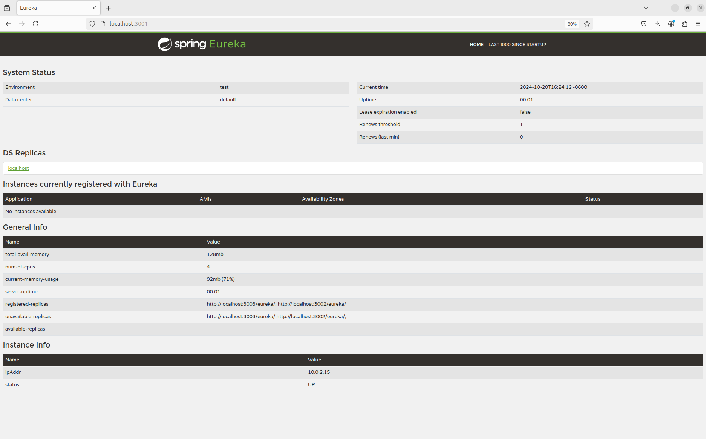
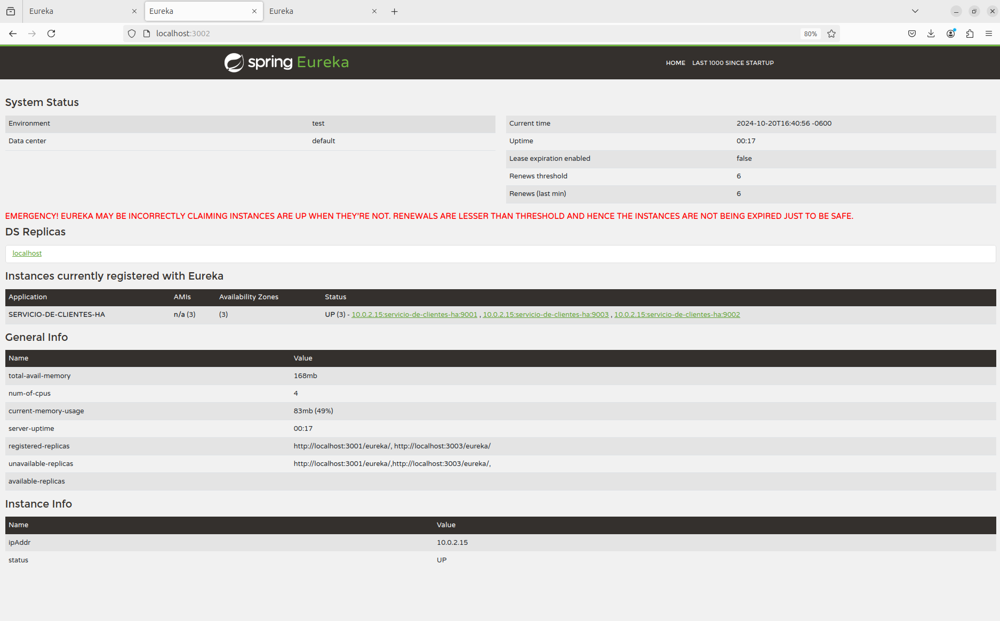

# SPRING CLOUD EUREKA ALTA DISPONIBILIDAD

Tiempo aproximado: _15 minutos_

## OBJETIVO

En esta actividad se crean varios proyectos en Spring Boot para la utilización de Spring Cloud Eureka en alta disponibilidad.

### REPOSITORIO

Esta actividad requiere que el repositorio de trabajo este en:

- Rama: `labs/microservices-development`
  - Se recomienda siempre trabajar sobre una rama _feature_.
    - Por ejemplo: `git checkout -b labs/microservices-development_cazucito`
- Carpeta: `/home/usuario/Desktop/CF01141024/eureka`

## DESARROLLO

_Spring Cloud Eureka_ está construido para ser _High Available_ y brindar la capacidad de recuperación (_failover_) dos pilares principales del desarrollo en _Netflix_. Se basa en el modelo de replicación de igual a igual (todos los servidores replican datos y envían latidos a todos los pares).

Para comprobar la replicación realice un nuevo servidor de descubrimiento (del que ejecutarán tres instancias) y un cliente (igualmente ejecutará tres instancias).

### PROYECTO: EUREKA SERVER HA

Para crear una aplicación Spring Boot con Spring Tool Suite, entre al editor y seleccione la opción: `File → New → Spring Starter Project`.

En la ventana ingrese la siguiente información:

- Name: **eureka-ha-eureka**
- Type: **Maven Project**
- Packaging: **Jar**
- Java (versión): **17**
- Language: **Java**
- Group: **mx.com.fractalyst.pdv**
- Artifact: **eureka-ha-eureka**
- Version: **0.1.0-SNAPSHOT**
- Description: **Spring Cloud Eureka Server - HA**
- Package Name: **mx.com.fractalyst.pdv.sc**

De clic en `Next`:

- Spring Boot Version: **3.3.4**
  - Se recomienda utilizar las versiones estables
- Dependencias: `Eureka Server`, `Spring Boot Actuator` y `Spring Web`.

De clic en `Next`:

- No realice cambios

De clic en `Finish`.

Este último paso solicita la creación y apertura del proyecto Maven en el STS.

#### SPRING BOOT ACTUATOR: INFO

Para visualizar información en el endpoint `actuator/info` se debe adicionar la ejecución del _goal_ `build-info` en el _plug-in_ `spring-boot-maven-plugin`.

Haga que la sección del _plug-in_ se vea como el bloque de `pom.xml` que se muestra a continuación:

``` xml
          <plugin>
                <groupId>org.springframework.boot</groupId>
                <artifactId>spring-boot-maven-plugin</artifactId>
                <executions>
                    <execution>
                        <goals>
                            <goal>build-info</goal>
                        </goals>
                    </execution>
                </executions>
            </plugin>
```

#### SPRING BOOT APPLICATION

Ahora adicione la anotación `@EnableEurekaServer` a la clase ya anotada con `@SpringBootApplication`.

La clase debe quedar como sigue:

``` java
package mx.com.fractalyst.pdv.sc;

import org.springframework.boot.SpringApplication;
import org.springframework.boot.autoconfigure.SpringBootApplication;
import org.springframework.cloud.netflix.eureka.server.EnableEurekaServer;

@SpringBootApplication
@EnableEurekaServer
public class EurekaHaEurekaApplication {

	public static void main(String[] args) {
		SpringApplication.run(EurekaHaEurekaApplication.class, args);
	}

}
```

#### CONFIGURACIÓN: application.yml

Para definir los detalles del servidor de descubrimiento cree el archivo de configuración de la aplicación `application.yml` con el siguiente contenido:

``` yaml
spring:
  application:
    name: servicio-de-descubrimiento-ha

eureka:
  client:
    registerWithEureka: false
    fetchRegistry: false

management:
  endpoint:
    shutdown:
      enabled: true
  endpoints:
    web:
      exposure:
        include: "*"

---
# Para utilizar este perfil
# java -D"spring.profiles.active=nodo1" -jar target/eureka-ha-eureka-0.1.0-SNAPSHOT.jar
spring:
  config:
    activate:
      on-profile: nodo1

eureka:
  instance:
    hostname: nodo1
    metadataMap:
      zone: zona1
  client:
    serviceUrl:
      defaultZone: http://localhost:3002/eureka/,http://localhost:3003/eureka/

server:
  port: ${PORT:3001}

---
# Para utilizar este perfil
# java -D"spring.profiles.active=nodo2" -jar target/eureka-ha-eureka-0.1.0-SNAPSHOT.jar
spring:
  config:
    activate:
      on-profile: nodo2

eureka:
  instance:
    hostname: nodo2
    metadataMap:
      zone: zona2
  client:
    serviceUrl:
      defaultZone: http://localhost:3001/eureka/,http://localhost:3003/eureka/

server:
  port: ${PORT:3002}

---
# Para utilizar este perfil
# java -D"spring.profiles.active=nodo3" -jar target/eureka-ha-eureka-0.1.0-SNAPSHOT.jar
spring:
  config:
    activate:
      on-profile: nodo3

eureka:
  instance:
    hostname: nodo3
    metadataMap:
      zone: zona3
  client:
    serviceUrl:
      defaultZone: http://localhost:3001/eureka/,http://localhost:3002/eureka/

server:
  port: ${PORT:3003}
```

#### CONSTRUCCIÓN

Para construir el servidor _Spring Cloud Eureka_ ejecute el siguiente comando Maven en una terminal en la raíz del proyecto (`/home/usuario/Desktop/CF01141024/eureka/eureka-ha-eureka`):

``` shell
mvn clean package
```

Debería ver un resultado similar al siguiente:

``` shell
[INFO] Scanning for projects...
[INFO] 
[INFO] ---------------< mx.com.fractalyst.pdv:eureka-ha-eureka >---------------
[INFO] Building eureka-ha-eureka 0.1.0-SNAPSHOT
[INFO] --------------------------------[ jar ]---------------------------------
[INFO] 
[INFO] --- maven-clean-plugin:3.3.2:clean (default-clean) @ eureka-ha-eureka ---
[INFO] Deleting /home/usuario/Desktop/CF01141024/eureka-ha-eureka/target
[INFO] 
[INFO] --- spring-boot-maven-plugin:3.3.4:build-info (default) @ eureka-ha-eureka ---
[INFO] 
[INFO] --- maven-resources-plugin:3.3.1:resources (default-resources) @ eureka-ha-eureka ---
[INFO] Copying 1 resource from src/main/resources to target/classes
[INFO] Copying 0 resource from src/main/resources to target/classes
[INFO] 
[INFO] --- maven-compiler-plugin:3.13.0:compile (default-compile) @ eureka-ha-eureka ---
[INFO] Recompiling the module because of changed source code.
[INFO] Compiling 1 source file with javac [debug parameters release 17] to target/classes
[INFO] 
[INFO] --- maven-resources-plugin:3.3.1:testResources (default-testResources) @ eureka-ha-eureka ---
[INFO] skip non existing resourceDirectory /home/usuario/Desktop/CF01141024/eureka-ha-eureka/src/test/resources
[INFO] 
[INFO] --- maven-compiler-plugin:3.13.0:testCompile (default-testCompile) @ eureka-ha-eureka ---
[INFO] Recompiling the module because of changed dependency.
[INFO] Compiling 1 source file with javac [debug parameters release 17] to target/test-classes
[INFO] 
[INFO] --- maven-surefire-plugin:3.2.5:test (default-test) @ eureka-ha-eureka ---
[INFO] Using auto detected provider org.apache.maven.surefire.junitplatform.JUnitPlatformProvider
[INFO] 
[INFO] -------------------------------------------------------
[INFO]  T E S T S
[INFO] -------------------------------------------------------
[INFO] Running mx.com.fractalyst.pdv.sc.EurekaHaEurekaApplicationTests
Standard Commons Logging discovery in action with spring-jcl: please remove commons-logging.jar from classpath in order to avoid potential conflicts
16:21:35.553 [main] INFO org.springframework.test.context.support.AnnotationConfigContextLoaderUtils -- Could not detect default configuration classes for test class [mx.com.fractalyst.pdv.sc.EurekaHaEurekaApplicationTests]: EurekaHaEurekaApplicationTests does not declare any static, non-private, non-final, nested classes annotated with @Configuration.
16:21:35.750 [main] INFO org.springframework.boot.test.context.SpringBootTestContextBootstrapper -- Found @SpringBootConfiguration mx.com.fractalyst.pdv.sc.EurekaHaEurekaApplication for test class mx.com.fractalyst.pdv.sc.EurekaHaEurekaApplicationTests

  .   ____          _            __ _ _
 /\\ / ___'_ __ _ _(_)_ __  __ _ \ \ \ \
( ( )\___ | '_ | '_| | '_ \/ _` | \ \ \ \
 \\/  ___)| |_)| | | | | || (_| |  ) ) ) )
  '  |____| .__|_| |_|_| |_\__, | / / / /
 =========|_|==============|___/=/_/_/_/

 :: Spring Boot ::                (v3.3.4)

2024-10-20T16:21:36.602-06:00  INFO 9807 --- [servicio-de-descubrimiento-ha] [           main] m.c.f.p.s.EurekaHaEurekaApplicationTests : Starting EurekaHaEurekaApplicationTests using Java 17.0.12 with PID 9807 (started by usuario in /home/usuario/Desktop/CF01141024/eureka-ha-eureka)
2024-10-20T16:21:36.603-06:00  INFO 9807 --- [servicio-de-descubrimiento-ha] [           main] m.c.f.p.s.EurekaHaEurekaApplicationTests : No active profile set, falling back to 1 default profile: "default"
2024-10-20T16:21:39.053-06:00  INFO 9807 --- [servicio-de-descubrimiento-ha] [           main] o.s.cloud.context.scope.GenericScope     : BeanFactory id=fadc486c-68a5-3161-9053-6d8fdc250efa
2024-10-20T16:21:39.212-06:00  WARN 9807 --- [servicio-de-descubrimiento-ha] [           main] trationDelegate$BeanPostProcessorChecker : Bean 'org.springframework.cloud.client.loadbalancer.LoadBalancerAutoConfiguration$DeferringLoadBalancerInterceptorConfig' of type [org.springframework.cloud.client.loadbalancer.LoadBalancerAutoConfiguration$DeferringLoadBalancerInterceptorConfig] is not eligible for getting processed by all BeanPostProcessors (for example: not eligible for auto-proxying). The currently created BeanPostProcessor [lbRestClientPostProcessor] is declared through a non-static factory method on that class; consider declaring it as static instead.
2024-10-20T16:21:39.222-06:00  WARN 9807 --- [servicio-de-descubrimiento-ha] [           main] trationDelegate$BeanPostProcessorChecker : Bean 'deferringLoadBalancerInterceptor' of type [org.springframework.cloud.client.loadbalancer.DeferringLoadBalancerInterceptor] is not eligible for getting processed by all BeanPostProcessors (for example: not eligible for auto-proxying). Is this bean getting eagerly injected into a currently created BeanPostProcessor [lbRestClientPostProcessor]? Check the corresponding BeanPostProcessor declaration and its dependencies.
2024-10-20T16:21:41.083-06:00  WARN 9807 --- [servicio-de-descubrimiento-ha] [           main] iguration$LoadBalancerCaffeineWarnLogger : Spring Cloud LoadBalancer is currently working with the default cache. While this cache implementation is useful for development and tests, it's recommended to use Caffeine cache in production.You can switch to using Caffeine cache, by adding it and org.springframework.cache.caffeine.CaffeineCacheManager to the classpath.
2024-10-20T16:21:41.320-06:00  INFO 9807 --- [servicio-de-descubrimiento-ha] [           main] o.s.c.n.eureka.InstanceInfoFactory       : Setting initial instance status as: STARTING
2024-10-20T16:21:41.342-06:00  INFO 9807 --- [servicio-de-descubrimiento-ha] [           main] com.netflix.discovery.DiscoveryClient    : Initializing Eureka in region us-east-1
2024-10-20T16:21:41.343-06:00  INFO 9807 --- [servicio-de-descubrimiento-ha] [           main] com.netflix.discovery.DiscoveryClient    : Client configured to neither register nor query for data.
2024-10-20T16:21:41.346-06:00  INFO 9807 --- [servicio-de-descubrimiento-ha] [           main] com.netflix.discovery.DiscoveryClient    : Discovery Client initialized at timestamp 1729462901345 with initial instances count: 0
2024-10-20T16:21:41.394-06:00  INFO 9807 --- [servicio-de-descubrimiento-ha] [           main] c.n.eureka.DefaultEurekaServerContext    : Initializing ...
2024-10-20T16:21:41.396-06:00  INFO 9807 --- [servicio-de-descubrimiento-ha] [           main] c.n.eureka.cluster.PeerEurekaNodes       : Adding new peer nodes [http://localhost:8761/eureka/]
2024-10-20T16:21:41.602-06:00  INFO 9807 --- [servicio-de-descubrimiento-ha] [           main] c.n.d.provider.DiscoveryJerseyProvider   : Using JSON encoding codec LegacyJacksonJson
2024-10-20T16:21:41.603-06:00  INFO 9807 --- [servicio-de-descubrimiento-ha] [           main] c.n.d.provider.DiscoveryJerseyProvider   : Using JSON decoding codec LegacyJacksonJson
2024-10-20T16:21:41.603-06:00  INFO 9807 --- [servicio-de-descubrimiento-ha] [           main] c.n.d.provider.DiscoveryJerseyProvider   : Using XML encoding codec XStreamXml
2024-10-20T16:21:41.603-06:00  INFO 9807 --- [servicio-de-descubrimiento-ha] [           main] c.n.d.provider.DiscoveryJerseyProvider   : Using XML decoding codec XStreamXml
2024-10-20T16:21:41.788-06:00  INFO 9807 --- [servicio-de-descubrimiento-ha] [           main] c.n.eureka.cluster.PeerEurekaNodes       : Replica node URL:  http://localhost:8761/eureka/
2024-10-20T16:21:41.810-06:00  INFO 9807 --- [servicio-de-descubrimiento-ha] [           main] c.n.e.registry.AbstractInstanceRegistry  : Finished initializing remote region registries. All known remote regions: []
2024-10-20T16:21:41.811-06:00  INFO 9807 --- [servicio-de-descubrimiento-ha] [           main] c.n.eureka.DefaultEurekaServerContext    : Initialized
2024-10-20T16:21:41.921-06:00  INFO 9807 --- [servicio-de-descubrimiento-ha] [           main] o.s.b.a.e.web.EndpointLinksResolver      : Exposing 18 endpoints beneath base path '/actuator'
2024-10-20T16:21:42.011-06:00  INFO 9807 --- [servicio-de-descubrimiento-ha] [           main] o.s.c.n.e.s.EurekaServiceRegistry        : Registering application SERVICIO-DE-DESCUBRIMIENTO-HA with eureka with status UP
2024-10-20T16:21:42.036-06:00  INFO 9807 --- [servicio-de-descubrimiento-ha] [      Thread-10] o.s.c.n.e.server.EurekaServerBootstrap   : isAws returned false
2024-10-20T16:21:42.037-06:00  INFO 9807 --- [servicio-de-descubrimiento-ha] [      Thread-10] o.s.c.n.e.server.EurekaServerBootstrap   : Initialized server context
2024-10-20T16:21:42.037-06:00  INFO 9807 --- [servicio-de-descubrimiento-ha] [      Thread-10] c.n.e.r.PeerAwareInstanceRegistryImpl    : Got 1 instances from neighboring DS node
2024-10-20T16:21:42.037-06:00  INFO 9807 --- [servicio-de-descubrimiento-ha] [      Thread-10] c.n.e.r.PeerAwareInstanceRegistryImpl    : Renew threshold is: 1
2024-10-20T16:21:42.037-06:00  INFO 9807 --- [servicio-de-descubrimiento-ha] [      Thread-10] c.n.e.r.PeerAwareInstanceRegistryImpl    : Changing status to UP
2024-10-20T16:21:42.040-06:00  INFO 9807 --- [servicio-de-descubrimiento-ha] [      Thread-10] e.s.EurekaServerInitializerConfiguration : Started Eureka Server
2024-10-20T16:21:42.056-06:00  INFO 9807 --- [servicio-de-descubrimiento-ha] [           main] m.c.f.p.s.EurekaHaEurekaApplicationTests : Started EurekaHaEurekaApplicationTests in 6.029 seconds (process running for 7.778)
OpenJDK 64-Bit Server VM warning: Sharing is only supported for boot loader classes because bootstrap classpath has been appended
[INFO] Tests run: 1, Failures: 0, Errors: 0, Skipped: 0, Time elapsed: 8.252 s -- in mx.com.fractalyst.pdv.sc.EurekaHaEurekaApplicationTests
[INFO] 
[INFO] Results:
[INFO] 
[INFO] Tests run: 1, Failures: 0, Errors: 0, Skipped: 0
[INFO] 
[INFO] 
[INFO] --- maven-jar-plugin:3.4.2:jar (default-jar) @ eureka-ha-eureka ---
[INFO] Building jar: /home/usuario/Desktop/CF01141024/eureka-ha-eureka/target/eureka-ha-eureka-0.1.0-SNAPSHOT.jar
[INFO] 
[INFO] --- spring-boot-maven-plugin:3.3.4:repackage (repackage) @ eureka-ha-eureka ---
[INFO] Replacing main artifact /home/usuario/Desktop/CF01141024/eureka-ha-eureka/target/eureka-ha-eureka-0.1.0-SNAPSHOT.jar with repackaged archive, adding nested dependencies in BOOT-INF/.
[INFO] The original artifact has been renamed to /home/usuario/Desktop/CF01141024/eureka-ha-eureka/target/eureka-ha-eureka-0.1.0-SNAPSHOT.jar.original
[INFO] ------------------------------------------------------------------------
[INFO] BUILD SUCCESS
[INFO] ------------------------------------------------------------------------
[INFO] Total time:  15.682 s
[INFO] Finished at: 2024-10-20T16:21:44-06:00
[INFO] ------------------------------------------------------------------------
```

#### EJECUCIÓN

Ahora ejecute (en tres terminales distintas) las tres instancias del servidor de descubrimiento, mediante los comandos:

- Terminal 1:

``` shell
java -D"spring.profiles.active=nodo1" -jar target/eureka-ha-eureka-0.1.0-SNAPSHOT.jar
```

- Terminal 2:

``` shell
java -D"spring.profiles.active=nodo2" -jar target/eureka-ha-eureka-0.1.0-SNAPSHOT.jar
```

- Terminal 3:

``` shell
java -D"spring.profiles.active=nodo3" -jar target/eureka-ha-eureka-0.1.0-SNAPSHOT.jar
```

La salida (en los tres casos) debe ser similar a:

``` shell
Standard Commons Logging discovery in action with spring-jcl: please remove commons-logging.jar from classpath in order to avoid potential conflicts

  .   ____          _            __ _ _
 /\\ / ___'_ __ _ _(_)_ __  __ _ \ \ \ \
( ( )\___ | '_ | '_| | '_ \/ _` | \ \ \ \
 \\/  ___)| |_)| | | | | || (_| |  ) ) ) )
  '  |____| .__|_| |_|_| |_\__, | / / / /
 =========|_|==============|___/=/_/_/_/

 :: Spring Boot ::                (v3.3.4)

2024-10-20T16:22:59.638-06:00  INFO 10015 --- [servicio-de-descubrimiento-ha] [           main] m.c.f.pdv.sc.EurekaHaEurekaApplication   : Starting EurekaHaEurekaApplication v0.1.0-SNAPSHOT using Java 17.0.12 with PID 10015 (/home/usuario/Desktop/CF01141024/eureka-ha-eureka/target/eureka-ha-eureka-0.1.0-SNAPSHOT.jar started by usuario in /home/usuario/Desktop/CF01141024/eureka-ha-eureka)
2024-10-20T16:22:59.644-06:00  INFO 10015 --- [servicio-de-descubrimiento-ha] [           main] m.c.f.pdv.sc.EurekaHaEurekaApplication   : The following 1 profile is active: "nodo1"
2024-10-20T16:23:02.354-06:00  INFO 10015 --- [servicio-de-descubrimiento-ha] [           main] o.s.cloud.context.scope.GenericScope     : BeanFactory id=ad2a8522-efb7-3b37-b6a0-15952427f339
2024-10-20T16:23:02.487-06:00  WARN 10015 --- [servicio-de-descubrimiento-ha] [           main] trationDelegate$BeanPostProcessorChecker : Bean 'org.springframework.cloud.client.loadbalancer.LoadBalancerAutoConfiguration$DeferringLoadBalancerInterceptorConfig' of type [org.springframework.cloud.client.loadbalancer.LoadBalancerAutoConfiguration$DeferringLoadBalancerInterceptorConfig] is not eligible for getting processed by all BeanPostProcessors (for example: not eligible for auto-proxying). The currently created BeanPostProcessor [lbRestClientPostProcessor] is declared through a non-static factory method on that class; consider declaring it as static instead.
2024-10-20T16:23:02.505-06:00  WARN 10015 --- [servicio-de-descubrimiento-ha] [           main] trationDelegate$BeanPostProcessorChecker : Bean 'deferringLoadBalancerInterceptor' of type [org.springframework.cloud.client.loadbalancer.DeferringLoadBalancerInterceptor] is not eligible for getting processed by all BeanPostProcessors (for example: not eligible for auto-proxying). Is this bean getting eagerly injected into a currently created BeanPostProcessor [lbRestClientPostProcessor]? Check the corresponding BeanPostProcessor declaration and its dependencies.
2024-10-20T16:23:03.058-06:00  INFO 10015 --- [servicio-de-descubrimiento-ha] [           main] o.s.b.w.embedded.tomcat.TomcatWebServer  : Tomcat initialized with port 3001 (http)
2024-10-20T16:23:03.111-06:00  INFO 10015 --- [servicio-de-descubrimiento-ha] [           main] o.apache.catalina.core.StandardService   : Starting service [Tomcat]
2024-10-20T16:23:03.112-06:00  INFO 10015 --- [servicio-de-descubrimiento-ha] [           main] o.apache.catalina.core.StandardEngine    : Starting Servlet engine: [Apache Tomcat/10.1.30]
2024-10-20T16:23:03.236-06:00  INFO 10015 --- [servicio-de-descubrimiento-ha] [           main] o.a.c.c.C.[Tomcat].[localhost].[/]       : Initializing Spring embedded WebApplicationContext
2024-10-20T16:23:03.239-06:00  INFO 10015 --- [servicio-de-descubrimiento-ha] [           main] w.s.c.ServletWebServerApplicationContext : Root WebApplicationContext: initialization completed in 3389 ms
Standard Commons Logging discovery in action with spring-jcl: please remove commons-logging.jar from classpath in order to avoid potential conflicts
2024-10-20T16:23:05.841-06:00  INFO 10015 --- [servicio-de-descubrimiento-ha] [           main] c.n.d.provider.DiscoveryJerseyProvider   : Using JSON encoding codec LegacyJacksonJson
2024-10-20T16:23:05.848-06:00  INFO 10015 --- [servicio-de-descubrimiento-ha] [           main] c.n.d.provider.DiscoveryJerseyProvider   : Using JSON decoding codec LegacyJacksonJson
2024-10-20T16:23:06.330-06:00  INFO 10015 --- [servicio-de-descubrimiento-ha] [           main] c.n.d.provider.DiscoveryJerseyProvider   : Using XML encoding codec XStreamXml
2024-10-20T16:23:06.331-06:00  INFO 10015 --- [servicio-de-descubrimiento-ha] [           main] c.n.d.provider.DiscoveryJerseyProvider   : Using XML decoding codec XStreamXml
2024-10-20T16:23:08.033-06:00  WARN 10015 --- [servicio-de-descubrimiento-ha] [           main] iguration$LoadBalancerCaffeineWarnLogger : Spring Cloud LoadBalancer is currently working with the default cache. While this cache implementation is useful for development and tests, it's recommended to use Caffeine cache in production.You can switch to using Caffeine cache, by adding it and org.springframework.cache.caffeine.CaffeineCacheManager to the classpath.
2024-10-20T16:23:08.065-06:00  INFO 10015 --- [servicio-de-descubrimiento-ha] [           main] o.s.c.n.eureka.InstanceInfoFactory       : Setting initial instance status as: STARTING
2024-10-20T16:23:08.115-06:00  INFO 10015 --- [servicio-de-descubrimiento-ha] [           main] com.netflix.discovery.DiscoveryClient    : Initializing Eureka in region us-east-1
2024-10-20T16:23:08.115-06:00  INFO 10015 --- [servicio-de-descubrimiento-ha] [           main] com.netflix.discovery.DiscoveryClient    : Client configured to neither register nor query for data.
2024-10-20T16:23:08.118-06:00  INFO 10015 --- [servicio-de-descubrimiento-ha] [           main] com.netflix.discovery.DiscoveryClient    : Discovery Client initialized at timestamp 1729462988117 with initial instances count: 0
2024-10-20T16:23:08.171-06:00  INFO 10015 --- [servicio-de-descubrimiento-ha] [           main] c.n.eureka.DefaultEurekaServerContext    : Initializing ...
2024-10-20T16:23:08.174-06:00  INFO 10015 --- [servicio-de-descubrimiento-ha] [           main] c.n.eureka.cluster.PeerEurekaNodes       : Adding new peer nodes [http://localhost:3003/eureka/, http://localhost:3002/eureka/]
2024-10-20T16:23:08.397-06:00  INFO 10015 --- [servicio-de-descubrimiento-ha] [           main] c.n.d.provider.DiscoveryJerseyProvider   : Using JSON encoding codec LegacyJacksonJson
2024-10-20T16:23:08.397-06:00  INFO 10015 --- [servicio-de-descubrimiento-ha] [           main] c.n.d.provider.DiscoveryJerseyProvider   : Using JSON decoding codec LegacyJacksonJson
2024-10-20T16:23:08.398-06:00  INFO 10015 --- [servicio-de-descubrimiento-ha] [           main] c.n.d.provider.DiscoveryJerseyProvider   : Using XML encoding codec XStreamXml
2024-10-20T16:23:08.398-06:00  INFO 10015 --- [servicio-de-descubrimiento-ha] [           main] c.n.d.provider.DiscoveryJerseyProvider   : Using XML decoding codec XStreamXml
2024-10-20T16:23:08.536-06:00  INFO 10015 --- [servicio-de-descubrimiento-ha] [           main] c.n.d.provider.DiscoveryJerseyProvider   : Using JSON encoding codec LegacyJacksonJson
2024-10-20T16:23:08.540-06:00  INFO 10015 --- [servicio-de-descubrimiento-ha] [           main] c.n.d.provider.DiscoveryJerseyProvider   : Using JSON decoding codec LegacyJacksonJson
2024-10-20T16:23:08.540-06:00  INFO 10015 --- [servicio-de-descubrimiento-ha] [           main] c.n.d.provider.DiscoveryJerseyProvider   : Using XML encoding codec XStreamXml
2024-10-20T16:23:08.541-06:00  INFO 10015 --- [servicio-de-descubrimiento-ha] [           main] c.n.d.provider.DiscoveryJerseyProvider   : Using XML decoding codec XStreamXml
2024-10-20T16:23:08.620-06:00  INFO 10015 --- [servicio-de-descubrimiento-ha] [           main] c.n.eureka.cluster.PeerEurekaNodes       : Replica node URL:  http://localhost:3003/eureka/
2024-10-20T16:23:08.621-06:00  INFO 10015 --- [servicio-de-descubrimiento-ha] [           main] c.n.eureka.cluster.PeerEurekaNodes       : Replica node URL:  http://localhost:3002/eureka/
2024-10-20T16:23:08.636-06:00  INFO 10015 --- [servicio-de-descubrimiento-ha] [           main] c.n.e.registry.AbstractInstanceRegistry  : Finished initializing remote region registries. All known remote regions: []
2024-10-20T16:23:08.638-06:00  INFO 10015 --- [servicio-de-descubrimiento-ha] [           main] c.n.eureka.DefaultEurekaServerContext    : Initialized
2024-10-20T16:23:08.656-06:00  INFO 10015 --- [servicio-de-descubrimiento-ha] [           main] o.s.b.a.e.web.EndpointLinksResolver      : Exposing 18 endpoints beneath base path '/actuator'
2024-10-20T16:23:08.757-06:00  INFO 10015 --- [servicio-de-descubrimiento-ha] [           main] o.s.c.n.e.s.EurekaServiceRegistry        : Registering application SERVICIO-DE-DESCUBRIMIENTO-HA with eureka with status UP
2024-10-20T16:23:08.797-06:00  INFO 10015 --- [servicio-de-descubrimiento-ha] [       Thread-9] o.s.c.n.e.server.EurekaServerBootstrap   : isAws returned false
2024-10-20T16:23:08.798-06:00  INFO 10015 --- [servicio-de-descubrimiento-ha] [       Thread-9] o.s.c.n.e.server.EurekaServerBootstrap   : Initialized server context
2024-10-20T16:23:08.798-06:00  INFO 10015 --- [servicio-de-descubrimiento-ha] [       Thread-9] c.n.e.r.PeerAwareInstanceRegistryImpl    : Got 1 instances from neighboring DS node
2024-10-20T16:23:08.799-06:00  INFO 10015 --- [servicio-de-descubrimiento-ha] [       Thread-9] c.n.e.r.PeerAwareInstanceRegistryImpl    : Renew threshold is: 1
2024-10-20T16:23:08.799-06:00  INFO 10015 --- [servicio-de-descubrimiento-ha] [       Thread-9] c.n.e.r.PeerAwareInstanceRegistryImpl    : Changing status to UP
2024-10-20T16:23:08.801-06:00  INFO 10015 --- [servicio-de-descubrimiento-ha] [       Thread-9] e.s.EurekaServerInitializerConfiguration : Started Eureka Server
2024-10-20T16:23:08.885-06:00  INFO 10015 --- [servicio-de-descubrimiento-ha] [           main] o.s.b.w.embedded.tomcat.TomcatWebServer  : Tomcat started on port 3001 (http) with context path '/'
2024-10-20T16:23:08.888-06:00  INFO 10015 --- [servicio-de-descubrimiento-ha] [           main] .s.c.n.e.s.EurekaAutoServiceRegistration : Updating port to 3001
2024-10-20T16:23:08.982-06:00  INFO 10015 --- [servicio-de-descubrimiento-ha] [           main] m.c.f.pdv.sc.EurekaHaEurekaApplication   : Started EurekaHaEurekaApplication in 10.287 seconds (process running for 11.663)
```

##### EUREKA DASHBOARD

El servidor de descubrimiento Eureka brinda un dashboard que puede ser accesible mediante un cliente web, en este caso al tener tres replicas podemos acceder al Dashboard de cada una de ellas en:

1. <http://localhost:3001/>
2. <http://localhost:3002/>
3. <http://localhost:3003/>

En el Dashboard (cualquiera de ellos) se aprecia que existen dos replicas registradas para cada una de las instancias.



### PROYECTO: CLIENTES HA

Para crear una aplicación _Spring Boot_ con _Spring Tool Suite_, entre al editor y seleccione la opción `File → New → Spring Starter Project`.

En la ventana ingrese la siguiente información:

- Name: **eureka-ha-clientes**
- Type: **Maven Project**
- Packaging: **Jar**
- Java (versión): **17**
- Language: **Java**
- Group: **mx.com.fractalyst.pdv**
- Artifact: **eureka-ha-clientes**
- Version: **0.1.0-SNAPSHOT**
- Description: **Spring Cloud Eureka - Clientes - HA**
- Package Name: **mx.com.fractalyst.pdv.sc**

De clic en `Next`:

- Spring Boot Version: **3.3.4**
  - Se recomienda utilizar las versiones estables
- Dependencias: `Eureka Discovery Client`, `Spring Boot Actuator` y `Spring Web`.

De clic en `Next`:

- No realice cambios.
  
De clic en `Finish`.

Este último paso solicita la creación y apertura del proyecto Maven en el STS.

#### SPRING BOOT ACTUATOR: INFO

Para visualizar información en el _endpoint_ `actuator/info` se debe adicionar la ejecución del _goal_ `build-info` en el _plug-in_ `spring-boot-maven-plugin`.
Haga que la sección del plug-in se vea como el bloque de pom.xml que se muestra a continuación:

``` xml
          <plugin>
                <groupId>org.springframework.boot</groupId>
                <artifactId>spring-boot-maven-plugin</artifactId>
                <executions>
                    <execution>
                        <goals>
                            <goal>build-info</goal>
                        </goals>
                    </execution>
                </executions>
            </plugin>
```

#### SPRING BOOT APPLICATION

La aplicación además de su lógica de negocio debe comunicarse con el servidor _Eureka_, para lo cual debe registrarse y enviar información de metadatos como _host_, puerto, URL de indicador de estado y página de inicio.

_Eureka Server_ recibe mensajes de _heartbeat_ de cada instancia perteneciente a un servicio. Si el latido no se recibe después de un período de tiempo configurado, la instancia se elimina del registro.

Para lograr lo anterior se debe adicionar la anotación `@EnableDiscoveryClient` a la clase ya anotada con `@SpringBootApplication`.
La clase debe quedar como se muestra a continuación:

``` java
package mx.com.fractalyst.pdv.sc;

import org.springframework.boot.SpringApplication;
import org.springframework.boot.autoconfigure.SpringBootApplication;
import org.springframework.cloud.client.discovery.EnableDiscoveryClient;

@SpringBootApplication
@EnableDiscoveryClient
public class EurekaHaClientesApplication {

	public static void main(String[] args) {
		SpringApplication.run(EurekaHaClientesApplication.class, args);
	}

}
```

#### CONFIGURACIÓN: application.yml

El siguiente paso es configurar la información del `servicio-de-descubrimiento` en el cliente, así como la configuración propia del servicio. Para lo anterior se debe crear el archivo de configuración de la aplicación `src/main/resources/application.yml` con el siguiente contenido:

``` yaml
spring:
  application:
    name: servicio-de-clientes-ha

management:
  endpoint:
    shutdown:
      enabled: true
  endpoints:
    web:
      exposure:
        include: "*"

eureka:
  instance:
    hostname: localhost
    metadataMap:
      zone: zona1
  client:
    serviceUrl:
      defaultZone: http://localhost:3001/eureka/,http://localhost:3002/eureka/,http://localhost:3003/eureka/

server:
  port: ${PORT:9000}

---
# Para utilizar este perfil
# java -D"spring.profiles.active=nodo1" -jar target/eureka-ha-clientes-0.1.0-SNAPSHOT.jar
spring:
  config:
    activate:
      on-profile: nodo1

eureka:
  instance:
    hostname: localhost
    metadataMap:
      zone: zona1
  client:
    serviceUrl:
      defaultZone: ${EUREKA_URL:http://localhost:3001/eureka/}
#      defaultZone: http://localhost:3001/eureka/,http://localhost:3002/eureka/,http://localhost:3003/eureka/
server:
  port: ${PORT:9001}

---
# Para utilizar este perfil
# java -D"spring.profiles.active=nodo2" -jar target/eureka-ha-clientes-0.1.0-SNAPSHOT.jar
spring:
  config:
    activate:
      on-profile: nodo2

eureka:
  instance:
    hostname: localhost
    metadataMap:
      zone: zona2
  client:
    serviceUrl:
      defaultZone: ${EUREKA_URL:http://localhost:3002/eureka/}
#      defaultZone: http://localhost:3001/eureka/,http://localhost:3002/eureka/,http://localhost:3003/eureka/
server:
  port: ${PORT:9002}

---
# Para utilizar este perfil
# java -D"spring.profiles.active=nodo3" -jar target/eureka-ha-clientes-0.1.0-SNAPSHOT.jar
spring:
  config:
    activate:
      on-profile: nodo3

eureka:
  instance:
    hostname: localhost
    metadataMap:
      zone: zona3
  client:
    serviceUrl:
      defaultZone: ${EUREKA_URL:http://localhost:3003/eureka/}
#      defaultZone: http://localhost:3001/eureka/,http://localhost:3002/eureka/,http://localhost:3003/eureka/
server:
  port: ${PORT:9003}
```

#### CONSTRUCCIÓN

Para construir el servidor Eureka ejecute el siguiente comando Maven en una terminal en la raíz del proyecto:

``` shell
mvn clean package
```

Debería ver un resultado similar al siguiente:

``` shell
[INFO] Scanning for projects...
[INFO] 
[INFO] --------------< mx.com.fractalyst.pdv:eureka-ha-clientes >--------------
[INFO] Building eureka-ha-clientes 0.1.0-SNAPSHOT
[INFO] --------------------------------[ jar ]---------------------------------
[INFO] 
[INFO] --- maven-clean-plugin:3.3.2:clean (default-clean) @ eureka-ha-clientes ---
[INFO] Deleting /home/usuario/Desktop/CF01141024/eureka-ha-clientes/target
[INFO] 
[INFO] --- spring-boot-maven-plugin:3.3.4:build-info (default) @ eureka-ha-clientes ---
[INFO] 
[INFO] --- maven-resources-plugin:3.3.1:resources (default-resources) @ eureka-ha-clientes ---
[INFO] Copying 1 resource from src/main/resources to target/classes
[INFO] Copying 0 resource from src/main/resources to target/classes
[INFO] 
[INFO] --- maven-compiler-plugin:3.13.0:compile (default-compile) @ eureka-ha-clientes ---
[INFO] Recompiling the module because of changed source code.
[INFO] Compiling 1 source file with javac [debug parameters release 17] to target/classes
[INFO] 
[INFO] --- maven-resources-plugin:3.3.1:testResources (default-testResources) @ eureka-ha-clientes ---
[INFO] skip non existing resourceDirectory /home/usuario/Desktop/CF01141024/eureka-ha-clientes/src/test/resources
[INFO] 
[INFO] --- maven-compiler-plugin:3.13.0:testCompile (default-testCompile) @ eureka-ha-clientes ---
[INFO] Recompiling the module because of changed dependency.
[INFO] Compiling 1 source file with javac [debug parameters release 17] to target/test-classes
[INFO] 
[INFO] --- maven-surefire-plugin:3.2.5:test (default-test) @ eureka-ha-clientes ---
[INFO] Using auto detected provider org.apache.maven.surefire.junitplatform.JUnitPlatformProvider
[INFO] 
[INFO] -------------------------------------------------------
[INFO]  T E S T S
[INFO] -------------------------------------------------------
[INFO] Running mx.com.fractalyst.pdv.sc.EurekaHaClientesApplicationTests
16:33:47.056 [main] INFO org.springframework.test.context.support.AnnotationConfigContextLoaderUtils -- Could not detect default configuration classes for test class [mx.com.fractalyst.pdv.sc.EurekaHaClientesApplicationTests]: EurekaHaClientesApplicationTests does not declare any static, non-private, non-final, nested classes annotated with @Configuration.
16:33:47.241 [main] INFO org.springframework.boot.test.context.SpringBootTestContextBootstrapper -- Found @SpringBootConfiguration mx.com.fractalyst.pdv.sc.EurekaHaClientesApplication for test class mx.com.fractalyst.pdv.sc.EurekaHaClientesApplicationTests

  .   ____          _            __ _ _
 /\\ / ___'_ __ _ _(_)_ __  __ _ \ \ \ \
( ( )\___ | '_ | '_| | '_ \/ _` | \ \ \ \
 \\/  ___)| |_)| | | | | || (_| |  ) ) ) )
  '  |____| .__|_| |_|_| |_\__, | / / / /
 =========|_|==============|___/=/_/_/_/

 :: Spring Boot ::                (v3.3.4)

2024-10-20T16:33:48.526-06:00  INFO 10881 --- [servicio-de-clientes-ha] [           main] c.f.p.s.EurekaHaClientesApplicationTests : Starting EurekaHaClientesApplicationTests using Java 17.0.12 with PID 10881 (started by usuario in /home/usuario/Desktop/CF01141024/eureka-ha-clientes)
2024-10-20T16:33:48.529-06:00  INFO 10881 --- [servicio-de-clientes-ha] [           main] c.f.p.s.EurekaHaClientesApplicationTests : No active profile set, falling back to 1 default profile: "default"
2024-10-20T16:33:51.177-06:00  INFO 10881 --- [servicio-de-clientes-ha] [           main] o.s.cloud.context.scope.GenericScope     : BeanFactory id=642c47d6-ebb0-32ab-a961-2a5b7a7bcbe2
2024-10-20T16:33:51.440-06:00  WARN 10881 --- [servicio-de-clientes-ha] [           main] trationDelegate$BeanPostProcessorChecker : Bean 'org.springframework.cloud.client.loadbalancer.LoadBalancerAutoConfiguration$DeferringLoadBalancerInterceptorConfig' of type [org.springframework.cloud.client.loadbalancer.LoadBalancerAutoConfiguration$DeferringLoadBalancerInterceptorConfig] is not eligible for getting processed by all BeanPostProcessors (for example: not eligible for auto-proxying). The currently created BeanPostProcessor [lbRestClientPostProcessor] is declared through a non-static factory method on that class; consider declaring it as static instead.
2024-10-20T16:33:51.449-06:00  WARN 10881 --- [servicio-de-clientes-ha] [           main] trationDelegate$BeanPostProcessorChecker : Bean 'deferringLoadBalancerInterceptor' of type [org.springframework.cloud.client.loadbalancer.DeferringLoadBalancerInterceptor] is not eligible for getting processed by all BeanPostProcessors (for example: not eligible for auto-proxying). Is this bean getting eagerly injected into a currently created BeanPostProcessor [lbRestClientPostProcessor]? Check the corresponding BeanPostProcessor declaration and its dependencies.
2024-10-20T16:33:54.134-06:00  INFO 10881 --- [servicio-de-clientes-ha] [           main] DiscoveryClientOptionalArgsConfiguration : Eureka HTTP Client uses RestTemplate.
2024-10-20T16:33:54.204-06:00  WARN 10881 --- [servicio-de-clientes-ha] [           main] iguration$LoadBalancerCaffeineWarnLogger : Spring Cloud LoadBalancer is currently working with the default cache. While this cache implementation is useful for development and tests, it's recommended to use Caffeine cache in production.You can switch to using Caffeine cache, by adding it and org.springframework.cache.caffeine.CaffeineCacheManager to the classpath.
2024-10-20T16:33:54.228-06:00  INFO 10881 --- [servicio-de-clientes-ha] [           main] o.s.b.a.e.web.EndpointLinksResolver      : Exposing 18 endpoints beneath base path '/actuator'
2024-10-20T16:33:54.438-06:00  INFO 10881 --- [servicio-de-clientes-ha] [           main] o.s.c.n.eureka.InstanceInfoFactory       : Setting initial instance status as: STARTING
2024-10-20T16:33:54.478-06:00  INFO 10881 --- [servicio-de-clientes-ha] [           main] com.netflix.discovery.DiscoveryClient    : Initializing Eureka in region us-east-1
2024-10-20T16:33:54.483-06:00  INFO 10881 --- [servicio-de-clientes-ha] [           main] c.n.d.s.r.aws.ConfigClusterResolver      : Resolving eureka endpoints via configuration
2024-10-20T16:33:54.493-06:00  INFO 10881 --- [servicio-de-clientes-ha] [           main] com.netflix.discovery.DiscoveryClient    : Disable delta property : false
2024-10-20T16:33:54.493-06:00  INFO 10881 --- [servicio-de-clientes-ha] [           main] com.netflix.discovery.DiscoveryClient    : Single vip registry refresh property : null
2024-10-20T16:33:54.494-06:00  INFO 10881 --- [servicio-de-clientes-ha] [           main] com.netflix.discovery.DiscoveryClient    : Force full registry fetch : false
2024-10-20T16:33:54.494-06:00  INFO 10881 --- [servicio-de-clientes-ha] [           main] com.netflix.discovery.DiscoveryClient    : Application is null : false
2024-10-20T16:33:54.494-06:00  INFO 10881 --- [servicio-de-clientes-ha] [           main] com.netflix.discovery.DiscoveryClient    : Registered Applications size is zero : true
2024-10-20T16:33:54.494-06:00  INFO 10881 --- [servicio-de-clientes-ha] [           main] com.netflix.discovery.DiscoveryClient    : Application version is -1: true
2024-10-20T16:33:54.494-06:00  INFO 10881 --- [servicio-de-clientes-ha] [           main] com.netflix.discovery.DiscoveryClient    : Getting all instance registry info from the eureka server
2024-10-20T16:33:55.231-06:00  INFO 10881 --- [servicio-de-clientes-ha] [           main] com.netflix.discovery.DiscoveryClient    : The response status is 200
2024-10-20T16:33:55.233-06:00  INFO 10881 --- [servicio-de-clientes-ha] [           main] com.netflix.discovery.DiscoveryClient    : Starting heartbeat executor: renew interval is: 30
2024-10-20T16:33:55.237-06:00  INFO 10881 --- [servicio-de-clientes-ha] [           main] c.n.discovery.InstanceInfoReplicator     : InstanceInfoReplicator onDemand update allowed rate per min is 4
2024-10-20T16:33:55.240-06:00  INFO 10881 --- [servicio-de-clientes-ha] [           main] com.netflix.discovery.DiscoveryClient    : Discovery Client initialized at timestamp 1729463635239 with initial instances count: 0
2024-10-20T16:33:55.246-06:00  INFO 10881 --- [servicio-de-clientes-ha] [           main] o.s.c.n.e.s.EurekaServiceRegistry        : Registering application SERVICIO-DE-CLIENTES-HA with eureka with status UP
2024-10-20T16:33:55.247-06:00  INFO 10881 --- [servicio-de-clientes-ha] [           main] com.netflix.discovery.DiscoveryClient    : Saw local status change event StatusChangeEvent [timestamp=1729463635247, current=UP, previous=STARTING]
2024-10-20T16:33:55.250-06:00  INFO 10881 --- [servicio-de-clientes-ha] [foReplicator-%d] com.netflix.discovery.DiscoveryClient    : DiscoveryClient_SERVICIO-DE-CLIENTES-HA/10.0.2.15:servicio-de-clientes-ha:9000: registering service...
2024-10-20T16:33:55.381-06:00  INFO 10881 --- [servicio-de-clientes-ha] [           main] c.f.p.s.EurekaHaClientesApplicationTests : Started EurekaHaClientesApplicationTests in 7.624 seconds (process running for 10.515)
2024-10-20T16:33:56.096-06:00  INFO 10881 --- [servicio-de-clientes-ha] [foReplicator-%d] com.netflix.discovery.DiscoveryClient    : DiscoveryClient_SERVICIO-DE-CLIENTES-HA/10.0.2.15:servicio-de-clientes-ha:9000 - registration status: 204
OpenJDK 64-Bit Server VM warning: Sharing is only supported for boot loader classes because bootstrap classpath has been appended
[INFO] Tests run: 1, Failures: 0, Errors: 0, Skipped: 0, Time elapsed: 11.16 s -- in mx.com.fractalyst.pdv.sc.EurekaHaClientesApplicationTests
[INFO] 
[INFO] Results:
[INFO] 
[INFO] Tests run: 1, Failures: 0, Errors: 0, Skipped: 0
[INFO] 
[INFO] 
[INFO] --- maven-jar-plugin:3.4.2:jar (default-jar) @ eureka-ha-clientes ---
[INFO] Building jar: /home/usuario/Desktop/CF01141024/eureka-ha-clientes/target/eureka-ha-clientes-0.1.0-SNAPSHOT.jar
[INFO] 
[INFO] --- spring-boot-maven-plugin:3.3.4:repackage (repackage) @ eureka-ha-clientes ---
[INFO] Replacing main artifact /home/usuario/Desktop/CF01141024/eureka-ha-clientes/target/eureka-ha-clientes-0.1.0-SNAPSHOT.jar with repackaged archive, adding nested dependencies in BOOT-INF/.
[INFO] The original artifact has been renamed to /home/usuario/Desktop/CF01141024/eureka-ha-clientes/target/eureka-ha-clientes-0.1.0-SNAPSHOT.jar.original
[INFO] ------------------------------------------------------------------------
[INFO] BUILD SUCCESS
[INFO] ------------------------------------------------------------------------
[INFO] Total time:  20.739 s
[INFO] Finished at: 2024-10-20T16:33:59-06:00
[INFO] ------------------------------------------------------------------------
```

#### EJECUCIÓN

Para ejecutar las tres instancias de la aplicación cliente se puede lanzar el _jar_ ubicado en la carpeta target del proyecto con los tres perfiles como se muestra a continuación:

``` shell
java -D"spring.profiles.active=nodo1" -jar target/eureka-ha-clientes-0.1.0-SNAPSHOT.jar
```

Y para una segunda instancia:

``` shell
java -D"spring.profiles.active=nodo2" -jar target/eureka-ha-clientes-0.1.0-SNAPSHOT.jar
```

Y para una segunda instancia:

``` shell
java -D"spring.profiles.active=nodo3" -jar target/eureka-ha-clientes-0.1.0-SNAPSHOT.jar
```

Note que son tres ejecuciones, en tres terminales diferentes, la intención es validar que las tres se registran en todas las instancias del servidor de descubrimiento.

Se debe ver un resultado similar al siguiente en todas las terminales:

```  shell

  .   ____          _            __ _ _
 /\\ / ___'_ __ _ _(_)_ __  __ _ \ \ \ \
( ( )\___ | '_ | '_| | '_ \/ _` | \ \ \ \
 \\/  ___)| |_)| | | | | || (_| |  ) ) ) )
  '  |____| .__|_| |_|_| |_\__, | / / / /
 =========|_|==============|___/=/_/_/_/

 :: Spring Boot ::                (v3.3.4)

2024-10-20T16:37:05.817-06:00  INFO 11118 --- [servicio-de-clientes-ha] [           main] m.c.f.p.sc.EurekaHaClientesApplication   : Starting EurekaHaClientesApplication v0.1.0-SNAPSHOT using Java 17.0.12 with PID 11118 (/home/usuario/Desktop/CF01141024/eureka-ha-clientes/target/eureka-ha-clientes-0.1.0-SNAPSHOT.jar started by usuario in /home/usuario/Desktop/CF01141024/eureka-ha-clientes)
2024-10-20T16:37:05.824-06:00  INFO 11118 --- [servicio-de-clientes-ha] [           main] m.c.f.p.sc.EurekaHaClientesApplication   : The following 1 profile is active: "nodo1"
2024-10-20T16:37:08.667-06:00  INFO 11118 --- [servicio-de-clientes-ha] [           main] o.s.cloud.context.scope.GenericScope     : BeanFactory id=7a17dab0-508f-3e95-93c5-1897b6719b21
2024-10-20T16:37:08.737-06:00  WARN 11118 --- [servicio-de-clientes-ha] [           main] trationDelegate$BeanPostProcessorChecker : Bean 'org.springframework.cloud.client.loadbalancer.LoadBalancerAutoConfiguration$DeferringLoadBalancerInterceptorConfig' of type [org.springframework.cloud.client.loadbalancer.LoadBalancerAutoConfiguration$DeferringLoadBalancerInterceptorConfig] is not eligible for getting processed by all BeanPostProcessors (for example: not eligible for auto-proxying). The currently created BeanPostProcessor [lbRestClientPostProcessor] is declared through a non-static factory method on that class; consider declaring it as static instead.
2024-10-20T16:37:08.747-06:00  WARN 11118 --- [servicio-de-clientes-ha] [           main] trationDelegate$BeanPostProcessorChecker : Bean 'deferringLoadBalancerInterceptor' of type [org.springframework.cloud.client.loadbalancer.DeferringLoadBalancerInterceptor] is not eligible for getting processed by all BeanPostProcessors (for example: not eligible for auto-proxying). Is this bean getting eagerly injected into a currently created BeanPostProcessor [lbRestClientPostProcessor]? Check the corresponding BeanPostProcessor declaration and its dependencies.
2024-10-20T16:37:09.117-06:00  INFO 11118 --- [servicio-de-clientes-ha] [           main] o.s.b.w.embedded.tomcat.TomcatWebServer  : Tomcat initialized with port 9001 (http)
2024-10-20T16:37:09.134-06:00  INFO 11118 --- [servicio-de-clientes-ha] [           main] o.apache.catalina.core.StandardService   : Starting service [Tomcat]
2024-10-20T16:37:09.135-06:00  INFO 11118 --- [servicio-de-clientes-ha] [           main] o.apache.catalina.core.StandardEngine    : Starting Servlet engine: [Apache Tomcat/10.1.30]
2024-10-20T16:37:09.221-06:00  INFO 11118 --- [servicio-de-clientes-ha] [           main] o.a.c.c.C.[Tomcat].[localhost].[/]       : Initializing Spring embedded WebApplicationContext
2024-10-20T16:37:09.223-06:00  INFO 11118 --- [servicio-de-clientes-ha] [           main] w.s.c.ServletWebServerApplicationContext : Root WebApplicationContext: initialization completed in 3267 ms
2024-10-20T16:37:11.322-06:00  INFO 11118 --- [servicio-de-clientes-ha] [           main] DiscoveryClientOptionalArgsConfiguration : Eureka HTTP Client uses RestTemplate.
2024-10-20T16:37:11.683-06:00  WARN 11118 --- [servicio-de-clientes-ha] [           main] iguration$LoadBalancerCaffeineWarnLogger : Spring Cloud LoadBalancer is currently working with the default cache. While this cache implementation is useful for development and tests, it's recommended to use Caffeine cache in production.You can switch to using Caffeine cache, by adding it and org.springframework.cache.caffeine.CaffeineCacheManager to the classpath.
2024-10-20T16:37:11.697-06:00  INFO 11118 --- [servicio-de-clientes-ha] [           main] o.s.b.a.e.web.EndpointLinksResolver      : Exposing 18 endpoints beneath base path '/actuator'
2024-10-20T16:37:12.022-06:00  INFO 11118 --- [servicio-de-clientes-ha] [           main] o.s.c.n.eureka.InstanceInfoFactory       : Setting initial instance status as: STARTING
2024-10-20T16:37:12.087-06:00  INFO 11118 --- [servicio-de-clientes-ha] [           main] com.netflix.discovery.DiscoveryClient    : Initializing Eureka in region us-east-1
2024-10-20T16:37:12.097-06:00  INFO 11118 --- [servicio-de-clientes-ha] [           main] c.n.d.s.r.aws.ConfigClusterResolver      : Resolving eureka endpoints via configuration
2024-10-20T16:37:12.116-06:00  INFO 11118 --- [servicio-de-clientes-ha] [           main] com.netflix.discovery.DiscoveryClient    : Disable delta property : false
2024-10-20T16:37:12.116-06:00  INFO 11118 --- [servicio-de-clientes-ha] [           main] com.netflix.discovery.DiscoveryClient    : Single vip registry refresh property : null
2024-10-20T16:37:12.117-06:00  INFO 11118 --- [servicio-de-clientes-ha] [           main] com.netflix.discovery.DiscoveryClient    : Force full registry fetch : false
2024-10-20T16:37:12.118-06:00  INFO 11118 --- [servicio-de-clientes-ha] [           main] com.netflix.discovery.DiscoveryClient    : Application is null : false
2024-10-20T16:37:12.119-06:00  INFO 11118 --- [servicio-de-clientes-ha] [           main] com.netflix.discovery.DiscoveryClient    : Registered Applications size is zero : true
2024-10-20T16:37:12.119-06:00  INFO 11118 --- [servicio-de-clientes-ha] [           main] com.netflix.discovery.DiscoveryClient    : Application version is -1: true
2024-10-20T16:37:12.120-06:00  INFO 11118 --- [servicio-de-clientes-ha] [           main] com.netflix.discovery.DiscoveryClient    : Getting all instance registry info from the eureka server
2024-10-20T16:37:13.297-06:00  INFO 11118 --- [servicio-de-clientes-ha] [           main] com.netflix.discovery.DiscoveryClient    : The response status is 200
2024-10-20T16:37:13.303-06:00  INFO 11118 --- [servicio-de-clientes-ha] [           main] com.netflix.discovery.DiscoveryClient    : Starting heartbeat executor: renew interval is: 30
2024-10-20T16:37:13.315-06:00  INFO 11118 --- [servicio-de-clientes-ha] [           main] c.n.discovery.InstanceInfoReplicator     : InstanceInfoReplicator onDemand update allowed rate per min is 4
2024-10-20T16:37:13.328-06:00  INFO 11118 --- [servicio-de-clientes-ha] [           main] com.netflix.discovery.DiscoveryClient    : Discovery Client initialized at timestamp 1729463833327 with initial instances count: 0
2024-10-20T16:37:13.335-06:00  INFO 11118 --- [servicio-de-clientes-ha] [           main] o.s.c.n.e.s.EurekaServiceRegistry        : Registering application SERVICIO-DE-CLIENTES-HA with eureka with status UP
2024-10-20T16:37:13.336-06:00  INFO 11118 --- [servicio-de-clientes-ha] [           main] com.netflix.discovery.DiscoveryClient    : Saw local status change event StatusChangeEvent [timestamp=1729463833336, current=UP, previous=STARTING]
2024-10-20T16:37:13.397-06:00  INFO 11118 --- [servicio-de-clientes-ha] [foReplicator-%d] com.netflix.discovery.DiscoveryClient    : DiscoveryClient_SERVICIO-DE-CLIENTES-HA/10.0.2.15:servicio-de-clientes-ha:9001: registering service...
2024-10-20T16:37:13.491-06:00  INFO 11118 --- [servicio-de-clientes-ha] [           main] o.s.b.w.embedded.tomcat.TomcatWebServer  : Tomcat started on port 9001 (http) with context path '/'
2024-10-20T16:37:13.493-06:00  INFO 11118 --- [servicio-de-clientes-ha] [foReplicator-%d] com.netflix.discovery.DiscoveryClient    : DiscoveryClient_SERVICIO-DE-CLIENTES-HA/10.0.2.15:servicio-de-clientes-ha:9001 - registration status: 204
2024-10-20T16:37:13.495-06:00  INFO 11118 --- [servicio-de-clientes-ha] [           main] .s.c.n.e.s.EurekaAutoServiceRegistration : Updating port to 9001
2024-10-20T16:37:13.639-06:00  INFO 11118 --- [servicio-de-clientes-ha] [           main] m.c.f.p.sc.EurekaHaClientesApplication   : Started EurekaHaClientesApplication in 9.214 seconds (process running for 10.065)
```

Esta ejecución hace disponible el servicio (en tres instancias) que utiliza al servidor Eureka. La terminal de comandos se bloquea por lo que las siguientes acciones deben ser realizadas en otra terminal y de requerir detener el servidor debe ejecutar `Ctrl+C` en la terminal en la que se haya iniciado.

#### EUREKA DASHBOARD

El servidor de descubrimiento _Eureka_ brinda un _dashboard_ que puede ser accesible mediante un cliente web en el cual podemos observar que están registradas dos instancias del `servicio-de-clientes-ha`.

En este ejercicio al tener tres instancias que colaboran, podemos ver que el contenido de los tres _dashboard_ tienen a las tres instancias del servicio, independientemente en la instancia que se hayan registrado.

Visite los _dashboards_ ingresando las siguientes URLs en un navegador web:

1. <http://localhost:3001/>
2. <http://localhost:3002/>
3. <http://localhost:3003/>



Adicionalmente si da clic en la columna `Status` en la sección de `Instances currently registered with Eureka` se obtiene la información del _endpoint_ `actuator/info` de cada servicio.

#### DETENCIÓN

Aunque existen diversas maneras para detener a la aplicación cliente en ejecución, se puede llamar al método _API_ `POST /actuator/shutdown` del cliente.

En otra terminal ejecute:

```  shell
curl -X POST http://localhost:9001/actuator/shutdown
```

Se obtendrá una salida semejante a:

```  shell
{
  "message":"Shutting down, bye..."
}
```

Debe notar que en la terminal donde se levantó el servicio se ha desbloqueado y se ha detenido el servicio. De igual manera si observa el _Eureka Dashboard_ notará que ya no está registrado.

### RESTABLECIMIENTO

Para restablecer el ambiente de trabajo se debe detener la ejecución haciendo `Ctrl+C` en la terminal de comandos en la que se haya iniciado dicha ejecución.

## RESULTADO

Comente los puntos más relevantes de las actividades.

## REFERENCIAS

- [Spring Cloud Netflix](https://docs.spring.io/spring-cloud-netflix/docs/current/reference/html/)

---

[DESARROLLO DE MICROSERVICIOS](../../M04.md)