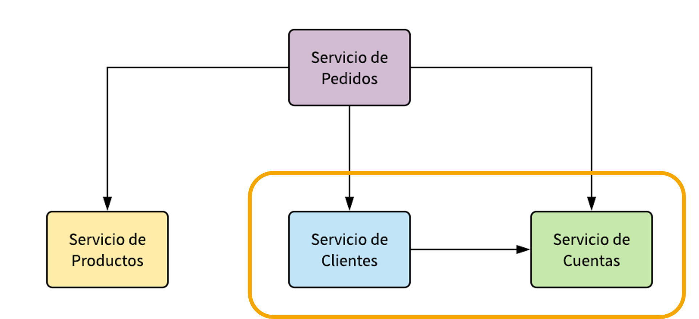
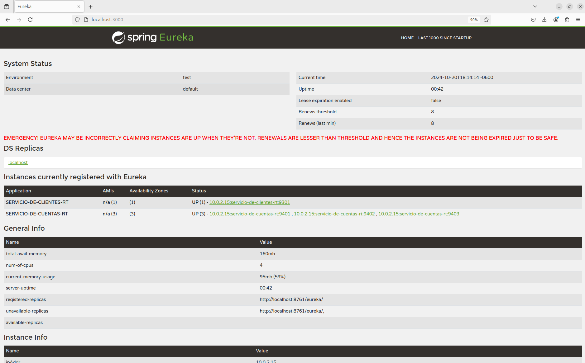
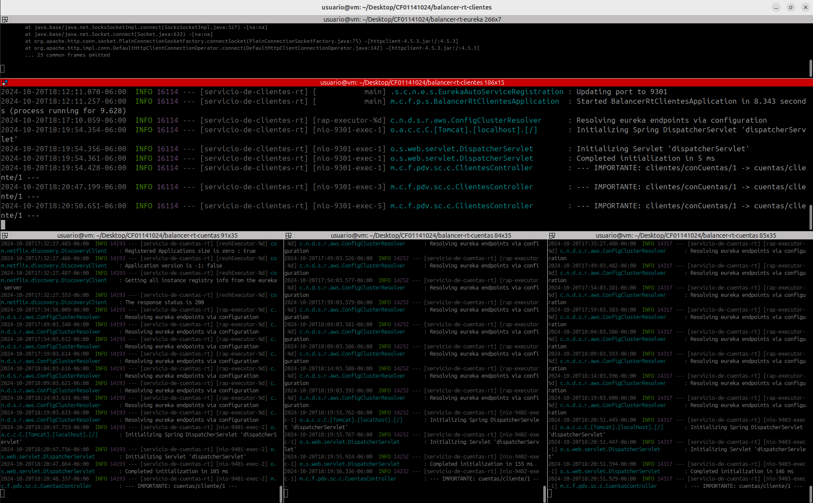

# SPRING CLOUD BALANCER: RestTemplate

Tiempo aproximado: _15 minutos_

## OBJETIVO

En esta actividad se crea un proyecto que utiliza RestTemplate para el consumo (utilizando balanceo de carga) de otro servicio.

### REPOSITORIO

Esta actividad requiere que el repositorio de trabajo este en:

- Rama: `labs/microservices-development`
  - Se recomienda siempre trabajar sobre una rama _feature_.
    - Por ejemplo: `git checkout -b labs/microservices-development_cazucito`
- Carpeta: `/home/usuario/Desktop/CF01141024/balancer`

## DESARROLLO



### PROYECTO: EUREKA SERVER

Para esta actividad se proporciona un servidor de descubrimiento (ubicado en `/home/usuario/CF01141024/balancer/balancer-rt-eureka`) que se debe construir y ejecutar.

Los pasos generales son los siguientes:

1. En una terminal de comandos construya el proyecto:
   1. `mvn clean package`
2. Ejecute el servidor de descubrimiento:
   1. `java -jar target/balancer-rt-eureka-0.1.0-SNAPSHOT.jar`

### PROYECTO: SERVICIO DE CUENTAS

Para esta actividad se proporciona un servidor de descubrimiento (ubicado en `/home/usuario/CF01141024/balancer/balancer-rt-cuentas`) que se debe construir y ejecutar.

Los pasos generales son los siguientes:

1. En una terminal de comandos construya el proyecto:
   1. `mvn clean package`
2. Ejecute el servidor de descubrimiento:
   1. `java -D"spring.profiles.active=nodo1" -jar target/balancer-rt-cuentas-0.1.0-SNAPSHOT.jar`
   2. `java -D"spring.profiles.active=nodo2" -jar target/balancer-rt-cuentas-0.1.0-SNAPSHOT.jar`
   3. `java -D"spring.profiles.active=nodo3" -jar target/balancer-rt-cuentas-0.1.0-SNAPSHOT.jar`


### PROYECTO: CLIENTES

Para crear una aplicación _Spring Boot_ con _Spring Tool Suite_, entre al editor y seleccione la opción `File → New → Spring Starter Project`.

En la ventana ingrese la siguiente información:

- Name: **balancer-rt-clientes**
- Type: **Maven Project**
- Packaging: **Jar**
- Java (versión): **17**
- Language: **Java**
- Group: **mx.com.fractalyst.pdv**
- Artifact: **balancer-rt-clientes**
- Version: **0.1.0-SNAPSHOT**
- Description: **Spring Cloud - REST Template - Clientes**
- Package Name: **mx.com.fractalyst.pdv.sc**

De clic en `Next`:

- Spring Boot Version: **3.3.4**
  - Se recomienda utilizar las versiones estables
- Dependencias: `Eureka Discovery Client`, `Spring Boot Actuator` y `Spring Web`.

De clic en `Next`:

- No realice cambios.
  
De clic en `Finish`.

Este último paso solicita la creación y apertura del proyecto Maven en el STS.

#### SPRING BOOT ACTUATOR: INFO

Para visualizar información en el _endpoint_ `actuator/info` se debe adicionar la ejecución del _goal_ `build-info` en el _plug-in_ `spring-boot-maven-plugin`.
Haga que la sección del plug-in se vea como el bloque de pom.xml que se muestra a continuación:

``` xml
          <plugin>
                <groupId>org.springframework.boot</groupId>
                <artifactId>spring-boot-maven-plugin</artifactId>
                <executions>
                    <execution>
                        <goals>
                            <goal>build-info</goal>
                        </goals>
                    </execution>
                </executions>
            </plugin>
```

#### SPRING BOOT APPLICATION

La aplicación además de su lógica de negocio debe comunicarse con el servidor _Eureka_, para lo cual debe registrarse y enviar información de metadatos como _host_, puerto, URL de indicador de estado y página de inicio.

_Eureka Server_ recibe mensajes de _heartbeat_ de cada instancia perteneciente a un servicio. Si el latido no se recibe después de un período de tiempo configurado, la instancia se elimina del registro.

Para lograr lo anterior se debe adicionar la anotación `@EnableDiscoveryClient` a la clase ya anotada con `@SpringBootApplication`.

La clase debe quedar como se muestra a continuación:

``` java
package mx.com.fractalyst.pdv.sc;

import org.springframework.boot.SpringApplication;
import org.springframework.boot.autoconfigure.SpringBootApplication;
import org.springframework.cloud.client.discovery.EnableDiscoveryClient;
import org.springframework.cloud.client.loadbalancer.LoadBalanced;
import org.springframework.context.annotation.Bean;
import org.springframework.web.client.RestTemplate;

import mx.com.fractalyst.pdv.sc.m.Cliente;
import mx.com.fractalyst.pdv.sc.m.ClientesRepository;
import mx.com.fractalyst.pdv.sc.m.TipoCliente;

@SpringBootApplication
@EnableDiscoveryClient
public class BalancerRtClientesApplication {

    public static void main(String[] args) {
        SpringApplication.run(BalancerRtClientesApplication.class, args);
    }

    @LoadBalanced
    @Bean
    RestTemplate restTemplate() {
        return new RestTemplate();
    }

    @Bean
    ClientesRepository repository() {
        ClientesRepository repository = new ClientesRepository();
        repository.add(new Cliente("Ana Anaya", TipoCliente.NUEVO));
        repository.add(new Cliente("Benito Buendia", TipoCliente.REGULAR));
        repository.add(new Cliente("Carmina Carmona", TipoCliente.VIP));
        return repository;
    }

}
```

#### CONTROLADOR: ClientesController.java

Cree la clase `src/main/java/mx/com/fractalyst/pdv/sc/c/ClientesController.java` con el siguiente contenido:

La clase debe quedar como se muestra a continuación:

``` java
package mx.com.fractalyst.pdv.sc.c;

import java.util.Arrays;
import java.util.List;
import java.util.stream.Collectors;

import org.slf4j.LoggerFactory;
import org.springframework.beans.factory.annotation.Autowired;
import org.springframework.web.bind.annotation.DeleteMapping;
import org.springframework.web.bind.annotation.GetMapping;
import org.springframework.web.bind.annotation.PathVariable;
import org.springframework.web.bind.annotation.PostMapping;
import org.springframework.web.bind.annotation.PutMapping;
import org.springframework.web.bind.annotation.RequestBody;
import org.springframework.web.bind.annotation.RequestMapping;
import org.springframework.web.bind.annotation.RestController;
import org.springframework.web.client.RestTemplate;

import mx.com.fractalyst.pdv.sc.m.Cliente;
import mx.com.fractalyst.pdv.sc.m.ClientesRepository;
import mx.com.fractalyst.pdv.sc.m.Cuenta;

@RestController
@RequestMapping("/clientes")
public class ClientesController {

    @Autowired
    RestTemplate restTemplate;

    @Autowired
    ClientesRepository clienteRepo;

    @PostMapping
    public Cliente altaCliente(@RequestBody Cliente cliente) {
        return clienteRepo.add(cliente);
    }

    @PutMapping
    public Cliente actualizaCliente(@RequestBody Cliente cliente) {
        return clienteRepo.update(cliente);
    }

    @GetMapping("/{id}")
    public Cliente obtenClientePorId(@PathVariable("id") Long id) {
        return clienteRepo.findById(id);
    }

    @GetMapping("/conCuentas/{id}")
    public Cliente obtenClientePorIdConCuentas(@PathVariable("id") Long id) {
        LoggerFactory.getLogger(getClass())
                .info("--- IMPORTANTE: clientes/conCuentas/" + id + " -> cuentas/cliente/" + id + " ---");
        Cuenta[] accounts = restTemplate.getForObject("http://servicio-de-cuentas-rt/cuentas/cliente/{cliente-id}",
                Cuenta[].class, id);
        Cliente c = clienteRepo.findById(id);
        c.setCuentas(Arrays.stream(accounts).collect(Collectors.toList()));
        return c;
    }

    @PostMapping("/ids")
    public List<Cliente> obtenClientes(@RequestBody List<Long> ids) {
        return clienteRepo.find(ids);
    }

    @DeleteMapping("/{id}")
    public void eliminaCliente(@PathVariable("id") Long id) {
        clienteRepo.delete(id);
    }
}
```

#### MODELO: Cliente.java

Cree la clase `src/main/java/mx/com/fractalyst/pdv/sc/m/Cliente.java` con el siguiente contenido:

La clase debe quedar como se muestra a continuación:

``` java
package mx.com.fractalyst.pdv.sc.m;


import java.util.ArrayList;
import java.util.List;

public class Cliente {

    private Long id;
    private String nombre;
    private TipoCliente tipoCliente;
    private List<Cuenta> cuentas = new ArrayList<>();

    public List<Cuenta> getCuentas() {
        return cuentas;
    }

    public void setCuentas(List<Cuenta> cuentas) {
        this.cuentas = cuentas;
    }

    public Cliente(Long id, String nombre, TipoCliente tipoCliente) {
        super();
        this.id = id;
        this.nombre = nombre;
        this.tipoCliente = tipoCliente;
    }

    public Cliente(String nombre, TipoCliente tipoCliente) {
        this.nombre = nombre;
        this.tipoCliente = tipoCliente;
    }

    public Long getId() {
        return id;
    }

    public void setId(Long id) {
        this.id = id;
    }

    public String getNombre() {
        return nombre;
    }

    public void setNombre(String nombre) {
        this.nombre = nombre;
    }

    public TipoCliente getTipoCliente() {
        return tipoCliente;
    }

    public void setTipoCliente(TipoCliente tipoCliente) {
        this.tipoCliente = tipoCliente;
    }

    public Cliente() {

    }

}
```

#### MODELO: ClientesRepository.java

Cree la clase `src/main/java/mx/com/fractalyst/pdv/sc/m/ClientesRepository.java` con el siguiente contenido:

La clase debe quedar como se muestra a continuación:

``` java
package mx.com.fractalyst.pdv.sc.m;

import java.util.ArrayList;
import java.util.List;
import java.util.Optional;
import java.util.stream.Collectors;

public class ClientesRepository {

    private List<Cliente> clientes = new ArrayList<>();

    public Cliente add(Cliente cliente) {
        cliente.setId((long) (clientes.size()+1));
        clientes.add(cliente);
        return cliente;
    }

    public Cliente update(Cliente cliente) {
        clientes.set(cliente.getId().intValue() - 1, cliente);
        return cliente;
    }

    public Cliente findById(Long id) {
        Optional<Cliente> cliente = clientes.stream().filter(p -> p.getId().equals(id)).findFirst();
        if (cliente.isPresent())
            return cliente.get();
        else
            return null;
    }

    public void delete(Long id) {
        clientes.remove(id.intValue());
    }

    public List<Cliente> find(List<Long> ids) {
        return clientes.stream().filter(p -> ids.contains(p.getId())).collect(Collectors.toList());
    }

}
```

#### MODELO: Cuenta.java

Cree la clase `src/main/java/mx/com/fractalyst/pdv/sc/m/Cuenta.java` con el siguiente contenido:

La clase debe quedar como se muestra a continuación:

``` java
package mx.com.fractalyst.pdv.sc.m;

public class Cuenta {

    private Long id;
    private String numeroCuenta;
    private int balance;

    public Cuenta() {

    }

    public Cuenta(Long id, String numeroCuenta, int balance) {
        this.id = id;
        this.numeroCuenta = numeroCuenta;
        this.balance = balance;
    }

    public Long getId() {
        return id;
    }

    public void setId(Long id) {
        this.id = id;
    }

    public String getNumeroCuenta() {
        return numeroCuenta;
    }

    public void setNumeroCuenta(String numeroCuenta) {
        this.numeroCuenta = numeroCuenta;
    }

    public int getBalance() {
        return balance;
    }

    public void setBalance(int balance) {
        this.balance = balance;
    }

}
```

#### MODELO: Cuenta.java

Cree el tipo enumerado `src/main/java/mx/com/fractalyst/pdv/sc/m/TipoCliente.java` con el siguiente contenido:

La clase debe quedar como se muestra a continuación:

``` java
package mx.com.fractalyst.pdv.sc.m;

public enum TipoCliente {

    NUEVO, REGULAR, VIP;

}

```

#### CONFIGURACIÓN: application.yml

El siguiente paso es configurar la información del servicio. Para lo anterior se debe crear el archivo de configuración de la aplicación `src/main/resources/application.yml` con el siguiente contenido:

``` yaml
spring:
  application:
    name: servicio-de-clientes-rt

server:
  port: ${PORT:9300}

eureka:
  client:
    service-url:
      defaultZone: ${EUREKA_URL:http://localhost:3000/eureka/}

management:
  endpoint:
    shutdown:
      enabled: true
  endpoints:
    web:
      exposure:
        include: "*"

---
# Para utilizar este perfil
# java -D"spring.profiles.active=nodo1" -jar target/balancer-rt-clientes-0.1.0-SNAPSHOT.jar
spring:
  config:
    activate:
      on-profile: nodo1

eureka:
  instance:
    hostname: localhost
    metadataMap:
      zone: zona1
  client:
    serviceUrl:
      defaultZone: ${EUREKA_URL:http://localhost:3000/eureka/}

server:
  port: ${PORT:9301}

---
# Para utilizar este perfil
# java -D"spring.profiles.active=nodo2" -jar target/balancer-rt-clientes-0.1.0-SNAPSHOT.jar
spring:
  config:
    activate:
      on-profile: nodo2

eureka:
  instance:
    hostname: localhost
    metadataMap:
      zone: zona2
  client:
    serviceUrl:
      defaultZone: ${EUREKA_URL:http://localhost:3000/eureka/}

server:
  port: ${PORT:9302}

---
# Para utilizar este perfil
# java -D"spring.profiles.active=nodo3" -jar target/balancer-rt-clientes-0.1.0-SNAPSHOT.jar
spring:
  config:
    activate:
      on-profile: nodo3

eureka:
  instance:
    hostname: localhost
    metadataMap:
      zone: zona3
  client:
    serviceUrl:
      defaultZone: ${EUREKA_URL:http://localhost:3000/eureka/}

server:
  port: ${PORT:9303}
```

#### CONSTRUCCIÓN

Para construir el servicio ejecute el siguiente comando Maven en una terminal en la raíz del proyecto:

``` shell
mvn clean package
```

Debería ver un resultado similar al siguiente:

``` shell
[INFO] Scanning for projects...
[INFO] 
[INFO] -------------< mx.com.fractalyst.pdv:balancer-rt-clientes >-------------
[INFO] Building balancer-rt-clientes 0.1.0-SNAPSHOT
[INFO] --------------------------------[ jar ]---------------------------------
[INFO] 
[INFO] --- maven-clean-plugin:3.3.2:clean (default-clean) @ balancer-rt-clientes ---
[INFO] Deleting /home/usuario/Desktop/CF01141024/balancer-rt-clientes/target
[INFO] 
[INFO] --- spring-boot-maven-plugin:3.3.4:build-info (default) @ balancer-rt-clientes ---
[INFO] 
[INFO] --- maven-resources-plugin:3.3.1:resources (default-resources) @ balancer-rt-clientes ---
[INFO] Copying 1 resource from src/main/resources to target/classes
[INFO] Copying 0 resource from src/main/resources to target/classes
[INFO] 
[INFO] --- maven-compiler-plugin:3.13.0:compile (default-compile) @ balancer-rt-clientes ---
[INFO] Recompiling the module because of changed source code.
[INFO] Compiling 6 source files with javac [debug parameters release 17] to target/classes
[INFO] 
[INFO] --- maven-resources-plugin:3.3.1:testResources (default-testResources) @ balancer-rt-clientes ---
[INFO] skip non existing resourceDirectory /home/usuario/Desktop/CF01141024/balancer-rt-clientes/src/test/resources
[INFO] 
[INFO] --- maven-compiler-plugin:3.13.0:testCompile (default-testCompile) @ balancer-rt-clientes ---
[INFO] Recompiling the module because of changed dependency.
[INFO] Compiling 1 source file with javac [debug parameters release 17] to target/test-classes
[INFO] 
[INFO] --- maven-surefire-plugin:3.2.5:test (default-test) @ balancer-rt-clientes ---
[INFO] Using auto detected provider org.apache.maven.surefire.junitplatform.JUnitPlatformProvider
[INFO] 
[INFO] -------------------------------------------------------
[INFO]  T E S T S
[INFO] -------------------------------------------------------
[INFO] Running mx.com.fractalyst.pdv.sc.BalancerRtClientesApplicationTests
18:07:50.986 [main] INFO org.springframework.test.context.support.AnnotationConfigContextLoaderUtils -- Could not detect default configuration classes for test class [mx.com.fractalyst.pdv.sc.BalancerRtClientesApplicationTests]: BalancerRtClientesApplicationTests does not declare any static, non-private, non-final, nested classes annotated with @Configuration.
18:07:51.263 [main] INFO org.springframework.boot.test.context.SpringBootTestContextBootstrapper -- Found @SpringBootConfiguration mx.com.fractalyst.pdv.sc.BalancerRtClientesApplication for test class mx.com.fractalyst.pdv.sc.BalancerRtClientesApplicationTests

  .   ____          _            __ _ _
 /\\ / ___'_ __ _ _(_)_ __  __ _ \ \ \ \
( ( )\___ | '_ | '_| | '_ \/ _` | \ \ \ \
 \\/  ___)| |_)| | | | | || (_| |  ) ) ) )
  '  |____| .__|_| |_|_| |_\__, | / / / /
 =========|_|==============|___/=/_/_/_/

 :: Spring Boot ::                (v3.3.4)

2024-10-20T18:07:52.351-06:00  INFO 15887 --- [servicio-de-clientes-rt] [           main] f.p.s.BalancerRtClientesApplicationTests : Starting BalancerRtClientesApplicationTests using Java 17.0.12 with PID 15887 (started by usuario in /home/usuario/Desktop/CF01141024/balancer-rt-clientes)
2024-10-20T18:07:52.354-06:00  INFO 15887 --- [servicio-de-clientes-rt] [           main] f.p.s.BalancerRtClientesApplicationTests : No active profile set, falling back to 1 default profile: "default"
2024-10-20T18:07:54.372-06:00  INFO 15887 --- [servicio-de-clientes-rt] [           main] o.s.cloud.context.scope.GenericScope     : BeanFactory id=447fb44c-cbfd-3db8-a817-af06a67ba4c6
2024-10-20T18:07:54.522-06:00  WARN 15887 --- [servicio-de-clientes-rt] [           main] trationDelegate$BeanPostProcessorChecker : Bean 'org.springframework.cloud.client.loadbalancer.LoadBalancerAutoConfiguration$DeferringLoadBalancerInterceptorConfig' of type [org.springframework.cloud.client.loadbalancer.LoadBalancerAutoConfiguration$DeferringLoadBalancerInterceptorConfig] is not eligible for getting processed by all BeanPostProcessors (for example: not eligible for auto-proxying). The currently created BeanPostProcessor [lbRestClientPostProcessor] is declared through a non-static factory method on that class; consider declaring it as static instead.
2024-10-20T18:07:54.527-06:00  WARN 15887 --- [servicio-de-clientes-rt] [           main] trationDelegate$BeanPostProcessorChecker : Bean 'deferringLoadBalancerInterceptor' of type [org.springframework.cloud.client.loadbalancer.DeferringLoadBalancerInterceptor] is not eligible for getting processed by all BeanPostProcessors (for example: not eligible for auto-proxying). Is this bean getting eagerly injected into a currently created BeanPostProcessor [lbRestClientPostProcessor]? Check the corresponding BeanPostProcessor declaration and its dependencies.
2024-10-20T18:07:56.429-06:00  INFO 15887 --- [servicio-de-clientes-rt] [           main] DiscoveryClientOptionalArgsConfiguration : Eureka HTTP Client uses RestTemplate.
2024-10-20T18:07:56.477-06:00  WARN 15887 --- [servicio-de-clientes-rt] [           main] iguration$LoadBalancerCaffeineWarnLogger : Spring Cloud LoadBalancer is currently working with the default cache. While this cache implementation is useful for development and tests, it's recommended to use Caffeine cache in production.You can switch to using Caffeine cache, by adding it and org.springframework.cache.caffeine.CaffeineCacheManager to the classpath.
2024-10-20T18:07:56.487-06:00  INFO 15887 --- [servicio-de-clientes-rt] [           main] o.s.b.a.e.web.EndpointLinksResolver      : Exposing 18 endpoints beneath base path '/actuator'
2024-10-20T18:07:56.561-06:00  INFO 15887 --- [servicio-de-clientes-rt] [           main] o.s.c.n.eureka.InstanceInfoFactory       : Setting initial instance status as: STARTING
2024-10-20T18:07:56.637-06:00  INFO 15887 --- [servicio-de-clientes-rt] [           main] com.netflix.discovery.DiscoveryClient    : Initializing Eureka in region us-east-1
2024-10-20T18:07:56.642-06:00  INFO 15887 --- [servicio-de-clientes-rt] [           main] c.n.d.s.r.aws.ConfigClusterResolver      : Resolving eureka endpoints via configuration
2024-10-20T18:07:56.663-06:00  INFO 15887 --- [servicio-de-clientes-rt] [           main] com.netflix.discovery.DiscoveryClient    : Disable delta property : false
2024-10-20T18:07:56.710-06:00  INFO 15887 --- [servicio-de-clientes-rt] [           main] com.netflix.discovery.DiscoveryClient    : Single vip registry refresh property : null
2024-10-20T18:07:56.716-06:00  INFO 15887 --- [servicio-de-clientes-rt] [           main] com.netflix.discovery.DiscoveryClient    : Force full registry fetch : false
2024-10-20T18:07:56.716-06:00  INFO 15887 --- [servicio-de-clientes-rt] [           main] com.netflix.discovery.DiscoveryClient    : Application is null : false
2024-10-20T18:07:56.720-06:00  INFO 15887 --- [servicio-de-clientes-rt] [           main] com.netflix.discovery.DiscoveryClient    : Registered Applications size is zero : true
2024-10-20T18:07:56.730-06:00  INFO 15887 --- [servicio-de-clientes-rt] [           main] com.netflix.discovery.DiscoveryClient    : Application version is -1: true
2024-10-20T18:07:56.730-06:00  INFO 15887 --- [servicio-de-clientes-rt] [           main] com.netflix.discovery.DiscoveryClient    : Getting all instance registry info from the eureka server
2024-10-20T18:07:57.592-06:00  INFO 15887 --- [servicio-de-clientes-rt] [           main] com.netflix.discovery.DiscoveryClient    : The response status is 200
2024-10-20T18:07:57.598-06:00  INFO 15887 --- [servicio-de-clientes-rt] [           main] com.netflix.discovery.DiscoveryClient    : Starting heartbeat executor: renew interval is: 30
2024-10-20T18:07:57.602-06:00  INFO 15887 --- [servicio-de-clientes-rt] [           main] c.n.discovery.InstanceInfoReplicator     : InstanceInfoReplicator onDemand update allowed rate per min is 4
2024-10-20T18:07:57.607-06:00  INFO 15887 --- [servicio-de-clientes-rt] [           main] com.netflix.discovery.DiscoveryClient    : Discovery Client initialized at timestamp 1729469277606 with initial instances count: 3
2024-10-20T18:07:57.615-06:00  INFO 15887 --- [servicio-de-clientes-rt] [           main] o.s.c.n.e.s.EurekaServiceRegistry        : Registering application SERVICIO-DE-CLIENTES-RT with eureka with status UP
2024-10-20T18:07:57.616-06:00  INFO 15887 --- [servicio-de-clientes-rt] [           main] com.netflix.discovery.DiscoveryClient    : Saw local status change event StatusChangeEvent [timestamp=1729469277616, current=UP, previous=STARTING]
2024-10-20T18:07:57.619-06:00  INFO 15887 --- [servicio-de-clientes-rt] [foReplicator-%d] com.netflix.discovery.DiscoveryClient    : DiscoveryClient_SERVICIO-DE-CLIENTES-RT/10.0.2.15:servicio-de-clientes-rt:9300: registering service...
2024-10-20T18:07:57.670-06:00  INFO 15887 --- [servicio-de-clientes-rt] [           main] f.p.s.BalancerRtClientesApplicationTests : Started BalancerRtClientesApplicationTests in 6.135 seconds (process running for 8.07)
2024-10-20T18:07:57.715-06:00  INFO 15887 --- [servicio-de-clientes-rt] [foReplicator-%d] com.netflix.discovery.DiscoveryClient    : DiscoveryClient_SERVICIO-DE-CLIENTES-RT/10.0.2.15:servicio-de-clientes-rt:9300 - registration status: 204
OpenJDK 64-Bit Server VM warning: Sharing is only supported for boot loader classes because bootstrap classpath has been appended
[INFO] Tests run: 1, Failures: 0, Errors: 0, Skipped: 0, Time elapsed: 8.373 s -- in mx.com.fractalyst.pdv.sc.BalancerRtClientesApplicationTests
[INFO] 
[INFO] Results:
[INFO] 
[INFO] Tests run: 1, Failures: 0, Errors: 0, Skipped: 0
[INFO] 
[INFO] 
[INFO] --- maven-jar-plugin:3.4.2:jar (default-jar) @ balancer-rt-clientes ---
[INFO] Building jar: /home/usuario/Desktop/CF01141024/balancer-rt-clientes/target/balancer-rt-clientes-0.1.0-SNAPSHOT.jar
[INFO] 
[INFO] --- spring-boot-maven-plugin:3.3.4:repackage (repackage) @ balancer-rt-clientes ---
[INFO] Replacing main artifact /home/usuario/Desktop/CF01141024/balancer-rt-clientes/target/balancer-rt-clientes-0.1.0-SNAPSHOT.jar with repackaged archive, adding nested dependencies in BOOT-INF/.
[INFO] The original artifact has been renamed to /home/usuario/Desktop/CF01141024/balancer-rt-clientes/target/balancer-rt-clientes-0.1.0-SNAPSHOT.jar.original
[INFO] ------------------------------------------------------------------------
[INFO] BUILD SUCCESS
[INFO] ------------------------------------------------------------------------
[INFO] Total time:  17.311 s
[INFO] Finished at: 2024-10-20T18:08:00-06:00
[INFO] ------------------------------------------------------------------------
```

#### EJECUCIÓN

Para ejecutar el `servicio-de-clientes-rt` se puede lanzar el _jar_ ubicado en la carpeta `target` del proyecto con los tres perfiles como se muestra a continuación:

``` shell
java -D"spring.profiles.active=nodo1" -jar target/balancer-rt-clientes-0.1.0-SNAPSHOT.jar
```

Opcionalmente puede lanzar una segunda y tercera instancia:

``` shell
java -D"spring.profiles.active=nodo2" -jar target/balancer-rt-clientes-0.1.0-SNAPSHOT.jar
```

``` shell
java -D"spring.profiles.active=nodo3" -jar target/balancer-rt-clientes-0.1.0-SNAPSHOT.jar
```

Note que son tres ejecuciones, en tres terminales diferentes, la intención es validar que las tres se registran en todas las instancias del servidor de descubrimiento.

Se debe ver un resultado similar al siguiente en todas las terminales:

```  shell

  .   ____          _            __ _ _
 /\\ / ___'_ __ _ _(_)_ __  __ _ \ \ \ \
( ( )\___ | '_ | '_| | '_ \/ _` | \ \ \ \
 \\/  ___)| |_)| | | | | || (_| |  ) ) ) )
  '  |____| .__|_| |_|_| |_\__, | / / / /
 =========|_|==============|___/=/_/_/_/

 :: Spring Boot ::                (v3.3.4)

2024-10-20T18:12:04.175-06:00  INFO 16114 --- [servicio-de-clientes-rt] [           main] m.c.f.p.s.BalancerRtClientesApplication  : Starting BalancerRtClientesApplication v0.1.0-SNAPSHOT using Java 17.0.12 with PID 16114 (/home/usuario/Desktop/CF01141024/balancer-rt-clientes/target/balancer-rt-clientes-0.1.0-SNAPSHOT.jar started by usuario in /home/usuario/Desktop/CF01141024/balancer-rt-clientes)
2024-10-20T18:12:04.184-06:00  INFO 16114 --- [servicio-de-clientes-rt] [           main] m.c.f.p.s.BalancerRtClientesApplication  : The following 1 profile is active: "nodo1"
2024-10-20T18:12:06.518-06:00  INFO 16114 --- [servicio-de-clientes-rt] [           main] o.s.cloud.context.scope.GenericScope     : BeanFactory id=7d86f933-cde7-3081-a4cd-24de0a34adc4
2024-10-20T18:12:06.665-06:00  WARN 16114 --- [servicio-de-clientes-rt] [           main] trationDelegate$BeanPostProcessorChecker : Bean 'org.springframework.cloud.client.loadbalancer.LoadBalancerAutoConfiguration$DeferringLoadBalancerInterceptorConfig' of type [org.springframework.cloud.client.loadbalancer.LoadBalancerAutoConfiguration$DeferringLoadBalancerInterceptorConfig] is not eligible for getting processed by all BeanPostProcessors (for example: not eligible for auto-proxying). The currently created BeanPostProcessor [lbRestClientPostProcessor] is declared through a non-static factory method on that class; consider declaring it as static instead.
2024-10-20T18:12:06.672-06:00  WARN 16114 --- [servicio-de-clientes-rt] [           main] trationDelegate$BeanPostProcessorChecker : Bean 'deferringLoadBalancerInterceptor' of type [org.springframework.cloud.client.loadbalancer.DeferringLoadBalancerInterceptor] is not eligible for getting processed by all BeanPostProcessors (for example: not eligible for auto-proxying). Is this bean getting eagerly injected into a currently created BeanPostProcessor [lbRestClientPostProcessor]? Check the corresponding BeanPostProcessor declaration and its dependencies.
2024-10-20T18:12:07.052-06:00  INFO 16114 --- [servicio-de-clientes-rt] [           main] o.s.b.w.embedded.tomcat.TomcatWebServer  : Tomcat initialized with port 9301 (http)
2024-10-20T18:12:07.064-06:00  INFO 16114 --- [servicio-de-clientes-rt] [           main] o.apache.catalina.core.StandardService   : Starting service [Tomcat]
2024-10-20T18:12:07.065-06:00  INFO 16114 --- [servicio-de-clientes-rt] [           main] o.apache.catalina.core.StandardEngine    : Starting Servlet engine: [Apache Tomcat/10.1.30]
2024-10-20T18:12:07.108-06:00  INFO 16114 --- [servicio-de-clientes-rt] [           main] o.a.c.c.C.[Tomcat].[localhost].[/]       : Initializing Spring embedded WebApplicationContext
2024-10-20T18:12:07.110-06:00  INFO 16114 --- [servicio-de-clientes-rt] [           main] w.s.c.ServletWebServerApplicationContext : Root WebApplicationContext: initialization completed in 2777 ms
2024-10-20T18:12:09.448-06:00  INFO 16114 --- [servicio-de-clientes-rt] [           main] DiscoveryClientOptionalArgsConfiguration : Eureka HTTP Client uses RestTemplate.
2024-10-20T18:12:09.765-06:00  WARN 16114 --- [servicio-de-clientes-rt] [           main] iguration$LoadBalancerCaffeineWarnLogger : Spring Cloud LoadBalancer is currently working with the default cache. While this cache implementation is useful for development and tests, it's recommended to use Caffeine cache in production.You can switch to using Caffeine cache, by adding it and org.springframework.cache.caffeine.CaffeineCacheManager to the classpath.
2024-10-20T18:12:09.788-06:00  INFO 16114 --- [servicio-de-clientes-rt] [           main] o.s.b.a.e.web.EndpointLinksResolver      : Exposing 18 endpoints beneath base path '/actuator'
2024-10-20T18:12:09.934-06:00  INFO 16114 --- [servicio-de-clientes-rt] [           main] o.s.c.n.eureka.InstanceInfoFactory       : Setting initial instance status as: STARTING
2024-10-20T18:12:10.011-06:00  INFO 16114 --- [servicio-de-clientes-rt] [           main] com.netflix.discovery.DiscoveryClient    : Initializing Eureka in region us-east-1
2024-10-20T18:12:10.022-06:00  INFO 16114 --- [servicio-de-clientes-rt] [           main] c.n.d.s.r.aws.ConfigClusterResolver      : Resolving eureka endpoints via configuration
2024-10-20T18:12:10.045-06:00  INFO 16114 --- [servicio-de-clientes-rt] [           main] com.netflix.discovery.DiscoveryClient    : Disable delta property : false
2024-10-20T18:12:10.047-06:00  INFO 16114 --- [servicio-de-clientes-rt] [           main] com.netflix.discovery.DiscoveryClient    : Single vip registry refresh property : null
2024-10-20T18:12:10.047-06:00  INFO 16114 --- [servicio-de-clientes-rt] [           main] com.netflix.discovery.DiscoveryClient    : Force full registry fetch : false
2024-10-20T18:12:10.048-06:00  INFO 16114 --- [servicio-de-clientes-rt] [           main] com.netflix.discovery.DiscoveryClient    : Application is null : false
2024-10-20T18:12:10.048-06:00  INFO 16114 --- [servicio-de-clientes-rt] [           main] com.netflix.discovery.DiscoveryClient    : Registered Applications size is zero : true
2024-10-20T18:12:10.048-06:00  INFO 16114 --- [servicio-de-clientes-rt] [           main] com.netflix.discovery.DiscoveryClient    : Application version is -1: true
2024-10-20T18:12:10.048-06:00  INFO 16114 --- [servicio-de-clientes-rt] [           main] com.netflix.discovery.DiscoveryClient    : Getting all instance registry info from the eureka server
2024-10-20T18:12:10.836-06:00  INFO 16114 --- [servicio-de-clientes-rt] [           main] com.netflix.discovery.DiscoveryClient    : The response status is 200
2024-10-20T18:12:10.842-06:00  INFO 16114 --- [servicio-de-clientes-rt] [           main] com.netflix.discovery.DiscoveryClient    : Starting heartbeat executor: renew interval is: 30
2024-10-20T18:12:10.849-06:00  INFO 16114 --- [servicio-de-clientes-rt] [           main] c.n.discovery.InstanceInfoReplicator     : InstanceInfoReplicator onDemand update allowed rate per min is 4
2024-10-20T18:12:10.853-06:00  INFO 16114 --- [servicio-de-clientes-rt] [           main] com.netflix.discovery.DiscoveryClient    : Discovery Client initialized at timestamp 1729469530852 with initial instances count: 3
2024-10-20T18:12:10.859-06:00  INFO 16114 --- [servicio-de-clientes-rt] [           main] o.s.c.n.e.s.EurekaServiceRegistry        : Registering application SERVICIO-DE-CLIENTES-RT with eureka with status UP
2024-10-20T18:12:10.861-06:00  INFO 16114 --- [servicio-de-clientes-rt] [           main] com.netflix.discovery.DiscoveryClient    : Saw local status change event StatusChangeEvent [timestamp=1729469530861, current=UP, previous=STARTING]
2024-10-20T18:12:10.863-06:00  INFO 16114 --- [servicio-de-clientes-rt] [foReplicator-%d] com.netflix.discovery.DiscoveryClient    : DiscoveryClient_SERVICIO-DE-CLIENTES-RT/10.0.2.15:servicio-de-clientes-rt:9301: registering service...
2024-10-20T18:12:10.939-06:00  INFO 16114 --- [servicio-de-clientes-rt] [foReplicator-%d] com.netflix.discovery.DiscoveryClient    : DiscoveryClient_SERVICIO-DE-CLIENTES-RT/10.0.2.15:servicio-de-clientes-rt:9301 - registration status: 204
2024-10-20T18:12:11.067-06:00  INFO 16114 --- [servicio-de-clientes-rt] [           main] o.s.b.w.embedded.tomcat.TomcatWebServer  : Tomcat started on port 9301 (http) with context path '/'
2024-10-20T18:12:11.070-06:00  INFO 16114 --- [servicio-de-clientes-rt] [           main] .s.c.n.e.s.EurekaAutoServiceRegistration : Updating port to 9301
2024-10-20T18:12:11.257-06:00  INFO 16114 --- [servicio-de-clientes-rt] [           main] m.c.f.p.s.BalancerRtClientesApplication  : Started BalancerRtClientesApplication in 8.343 seconds (process running for 9.628)
```

Esta ejecución hace disponible el servicio (en tres instancias) que utiliza al servidor Eureka. La terminal de comandos se bloquea por lo que las siguientes acciones deben ser realizadas en otra terminal y de requerir detener el servidor debe ejecutar `Ctrl+C` en la terminal en la que se haya iniciado.

#### EUREKA DASHBOARD

El servidor de descubrimiento _Eureka_ brinda un _dashboard_ que puede ser accesible mediante un cliente web en el cual podemos observar que están registradas las instancias del `servicio-de-cuentas-rt` y el `servicio-de-clientes-rt`.

Visite el _dashboard_ ingresando las siguientes URLs en un navegador web:

1. <http://localhost:3000/>



Adicionalmente si da clic en la columna `Status` en la sección de `Instances currently registered with Eureka` se obtiene la información del _endpoint_ `actuator/info` de cada servicio.

#### CONSUMO

Para observar que se realiza una distribución de carga ejecute el siguiente comando en repetidas ocasiones mientras se observan las terminales donde se han ejecutado los servicios.

``` shell
curl http://localhost:9301/clientes/conCuentas/1
```

La salida de cada ejecución debe ser semejante a:

``` json
{
    "id": 1,
    "nombre": "Ana Anaya",
    "tipoCliente": "NUEVO",
    "cuentas": [
        {
            "id": 1,
            "numeroCuenta": "1234567890",
            "balance": 5000
        },
        {
            "id": 2,
            "numeroCuenta": "1234567891",
            "balance": 5000
        },
        {
            "id": 3,
            "numeroCuenta": "1234567892",
            "balance": 0
        }
    ]
}
```

##### DISCUSIÓN

Comente el comportamiento mostrado en la siguiente imagen en la que se han realizado tres peticiones al `servicio-de-clientes-rt`.



### RESTABLECIMIENTO

Para restablecer el ambiente de trabajo se debe detener la ejecución haciendo `Ctrl+C` en la terminal de comandos en la que se haya iniciado dicha ejecución.

## RESULTADO

Comente los puntos más relevantes de las actividades.

## REFERENCIAS

- [REST Clients - RestTemplate](https://docs.spring.io/spring-framework/docs/current/reference/html/web.html#webmvc-client)

---

[DESARROLLO DE MICROSERVICIOS](../../M04.md)
