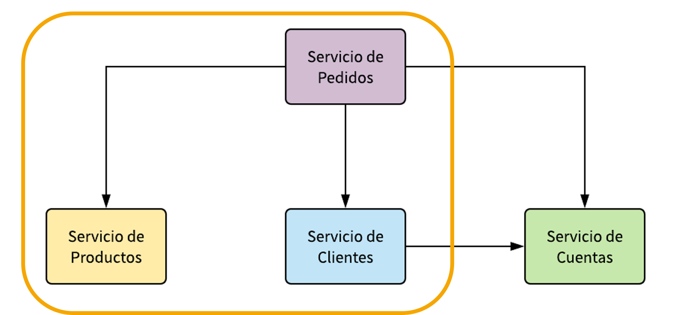
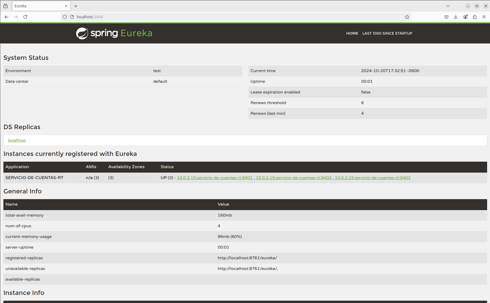
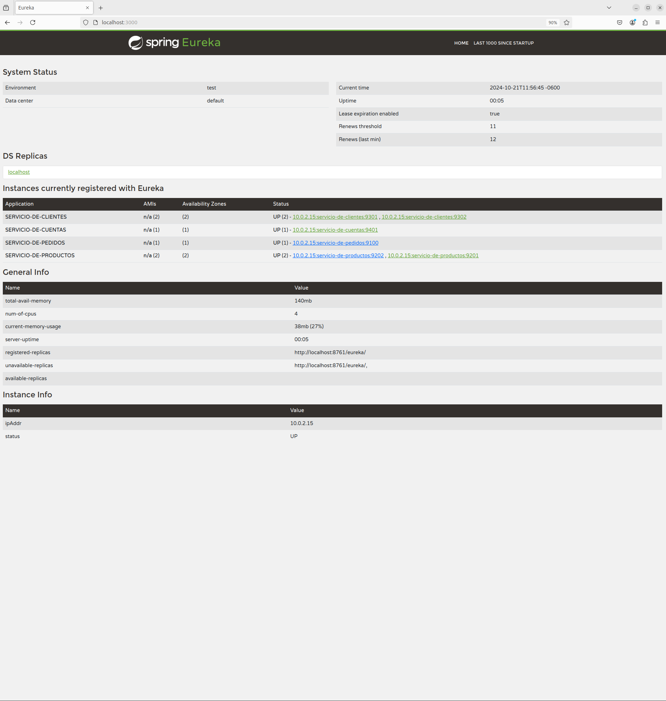
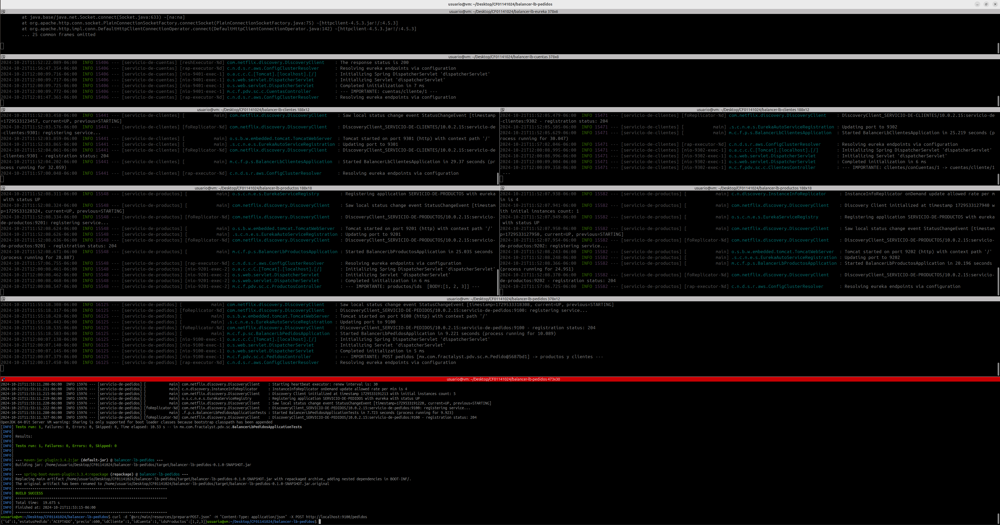

# SPRING CLOUD BALANCER: LoadBalancer

Tiempo aproximado: _15 minutos_

## OBJETIVO

En esta actividad se crea un proyecto que utiliza Spring Cloud Balancer para el consumo (utilizando balanceo de carga) de otro servicio.

### REPOSITORIO

Esta actividad requiere que el repositorio de trabajo este en:

- Rama: `labs/microservices-development`
  - Se recomienda siempre trabajar sobre una rama _feature_.
    - Por ejemplo: `git checkout -b labs/microservices-development_cazucito`
- Carpeta: `/home/usuario/Desktop/CF01141024/balancer`

## DESARROLLO



### PROYECTO: EUREKA SERVER

Para esta actividad se proporciona un servidor de descubrimiento (ubicado en `/home/usuario/CF01141024/balancer/balancer-lb-eureka`) que se debe construir y ejecutar.

Los pasos generales son los siguientes:

1. En una terminal de comandos construya el proyecto:
   1. `mvn clean package`
2. Ejecute el servidor de descubrimiento:
   1. `java -jar target/balancer-lb-eureka-0.1.0-SNAPSHOT.jar`

### PROYECTO: SERVICIO DE CUENTAS

Para esta actividad se proporciona un servicio (ubicado en `/home/usuario/CF01141024/balancer/balancer-lb-cuentas`) que se debe construir y ejecutar.

Los pasos generales son los siguientes:

1. En una terminal de comandos construya el proyecto:
   1. `mvn clean package`
2. Ejecute el servicio:
   1. `java -D"spring.profiles.active=nodo1" -jar target/balancer-lb-cuentas-0.1.0-SNAPSHOT.jar`

### PROYECTO: SERVICIO DE CLIENTES

Para esta actividad se proporciona un servicio (ubicado en `/home/usuario/CF01141024/balancer/balancer-lb-clientes`) que se debe construir y ejecutar.

Los pasos generales son los siguientes:

1. En una terminal de comandos construya el proyecto:
   1. `mvn clean package`
2. Ejecute dos instancias del servicio:
   1. `java -D"spring.profiles.active=nodo1" -jar target/balancer-lb-clientes-0.1.0-SNAPSHOT.jar`
   2. `java -D"spring.profiles.active=nodo2" -jar target/balancer-lb-clientes-0.1.0-SNAPSHOT.jar`



### PROYECTO: SERVICIO DE PRODUCTOS

Para esta actividad se proporciona un servicio (ubicado en `/home/usuario/CF01141024/balancer/balancer-lb-productos`) que se debe construir y ejecutar.

Los pasos generales son los siguientes:

1. En una terminal de comandos construya el proyecto:
   1. `mvn clean package`
2. Ejecute dos instancias del servicio:
   1. `java -D"spring.profiles.active=nodo1" -jar target/balancer-lb-productos-0.1.0-SNAPSHOT.jar`
   2. `java -D"spring.profiles.active=nodo2" -jar target/balancer-lb-productos-0.1.0-SNAPSHOT.jar`


### PROYECTO: PEDIDOS

Para crear una aplicación _Spring Boot_ con _Spring Tool Suite_, entre al editor y seleccione la opción `File → New → Spring Starter Project`.

En la ventana ingrese la siguiente información:

- Name: **balancer-lb-pedidos**
- Type: **Maven Project**
- Packaging: **Jar**
- Java (versión): **17**
- Language: **Java**
- Group: **mx.com.fractalyst.pdv**
- Artifact: **balancer-lb-pedidos**
- Version: **0.1.0-SNAPSHOT**
- Description: **Spring Cloud - Load Balancer - Pedidos**
- Package Name: **mx.com.fractalyst.pdv.sc**

De clic en `Next`:

- Spring Boot Version: **3.3.4**
  - Se recomienda utilizar las versiones estables
- Dependencias: `Cloud LoadBalancer`, `Spring Reactive Web`, `Eureka Discovery Client`, `Spring Boot Actuator` y `Spring Web`.

De clic en `Next`:

- No realice cambios.
  
De clic en `Finish`.

Este último paso solicita la creación y apertura del proyecto Maven en el STS.

#### SPRING BOOT ACTUATOR: INFO

Para visualizar información en el _endpoint_ `actuator/info` se debe adicionar la ejecución del _goal_ `build-info` en el _plug-in_ `spring-boot-maven-plugin`.
Haga que la sección del plug-in se vea como el bloque de pom.xml que se muestra a continuación:

``` xml
          <plugin>
                <groupId>org.springframework.boot</groupId>
                <artifactId>spring-boot-maven-plugin</artifactId>
                <executions>
                    <execution>
                        <goals>
                            <goal>build-info</goal>
                        </goals>
                    </execution>
                </executions>
            </plugin>
```

#### SPRING BOOT APPLICATION

La aplicación además de su lógica de negocio debe comunicarse con el servidor _Eureka_, para lo cual debe registrarse y enviar información de metadatos como _host_, puerto, URL de indicador de estado y página de inicio.

_Eureka Server_ recibe mensajes de _heartbeat_ de cada instancia perteneciente a un servicio. Si el latido no se recibe después de un período de tiempo configurado, la instancia se elimina del registro.

Para lograr lo anterior se debe adicionar la anotación `@EnableDiscoveryClient` a la clase ya anotada con `@SpringBootApplication`.

La clase debe quedar como se muestra a continuación:

``` java
package mx.com.fractalyst.pdv.sc;

import org.springframework.boot.SpringApplication;
import org.springframework.boot.autoconfigure.SpringBootApplication;
import org.springframework.cloud.client.discovery.EnableDiscoveryClient;
import org.springframework.context.annotation.Bean;

import mx.com.fractalyst.pdv.sc.m.PedidosRepository;

@SpringBootApplication
@EnableDiscoveryClient
public class BalancerLbPedidosApplication {

	public static void main(String[] args) {
		SpringApplication.run(BalancerLbPedidosApplication.class, args);
	}

	@Bean
	PedidosRepository repository() {
		return new PedidosRepository();
	}
}
```

#### CONTROLADOR: PedidosController.java

Cree la clase `src/main/java/mx/com/fractalyst/pdv/sc/c/PedidosController.java` con el siguiente contenido:

La clase debe quedar como se muestra a continuación:

``` java
package mx.com.fractalyst.pdv.sc.c;

import java.util.List;
import java.util.Optional;

import org.slf4j.LoggerFactory;
import org.springframework.beans.factory.annotation.Autowired;
import org.springframework.cloud.client.loadbalancer.reactive.ReactorLoadBalancerExchangeFilterFunction;
import org.springframework.core.ParameterizedTypeReference;
import org.springframework.http.HttpHeaders;
import org.springframework.http.MediaType;
import org.springframework.web.bind.annotation.PathVariable;
import org.springframework.web.bind.annotation.PostMapping;
import org.springframework.web.bind.annotation.PutMapping;
import org.springframework.web.bind.annotation.RequestBody;
import org.springframework.web.bind.annotation.RequestMapping;
import org.springframework.web.bind.annotation.RestController;
import org.springframework.web.reactive.function.client.WebClient;

import mx.com.fractalyst.pdv.sc.m.Cliente;
import mx.com.fractalyst.pdv.sc.m.Cuenta;
import mx.com.fractalyst.pdv.sc.m.EstatusPedido;
import mx.com.fractalyst.pdv.sc.m.Pedido;
import mx.com.fractalyst.pdv.sc.m.PedidosRepository;
import mx.com.fractalyst.pdv.sc.m.Producto;
import reactor.core.publisher.Mono;

@RestController()
@RequestMapping("/pedidos")
public class PedidosController {

	private final WebClient.Builder loadBalancedWebClientBuilder;
	private final ReactorLoadBalancerExchangeFilterFunction lbFunction;

	public PedidosController(WebClient.Builder webClientBuilder, ReactorLoadBalancerExchangeFilterFunction lbFunction) {
		this.loadBalancedWebClientBuilder = webClientBuilder;
		this.lbFunction = lbFunction;
	}

	@Autowired
	PedidosRepository pedidosRepo;

	@PostMapping
	public Pedido preparar(@RequestBody Pedido pedido) {
		LoggerFactory.getLogger(getClass())
				.info("--- IMPORTANTE: POST pedidos [" + pedido + "] -> productos y clientes ---");
		List<Producto> productos = loadBalancedWebClientBuilder.build().post()
				.uri("http://servicio-de-productos/productos/ids")
				.header(HttpHeaders.CONTENT_TYPE, MediaType.APPLICATION_JSON_VALUE)
				.body(Mono.just(pedido.getIdsProductos()), List.class).retrieve()
				.bodyToMono(new ParameterizedTypeReference<List<Producto>>() {
				}).block();
		Cliente cliente = loadBalancedWebClientBuilder.build().get()
				.uri("http://servicio-de-clientes/clientes/conCuentas/" + pedido.getIdCliente()).retrieve()
				.bodyToMono(Cliente.class).block();
		//
		int precioTotal = productos.stream().mapToInt(p -> p.getPrecio()).sum();
		final int precioConDescuento = obtenPrecioConDescuento(precioTotal, cliente);
		//
		Optional<Cuenta> cuenta = cliente.getCuentas().stream().filter(a -> (a.getBalance() > precioConDescuento))
				.findFirst();
		if (cuenta.isPresent()) {
			pedido.setIdCuenta(cuenta.get().getId());
			pedido.setEstatusPedido(EstatusPedido.ACEPTADO);
			pedido.setPrecio(precioConDescuento);
		} else {
			pedido.setEstatusPedido(EstatusPedido.RECHAZADO);
		}
		return pedidosRepo.add(pedido);
	}

	@PutMapping("/{id}")
	public Pedido aceptar(@PathVariable("id") Long id) {
		LoggerFactory.getLogger(getClass())
				.info("--- IMPORTANTE: PUT pedidos/" + id + " -> cuentas/retiro/{id}/{cantidad} ---");
		final Pedido pedido = pedidosRepo.findById(id);
		Cuenta cuenta = loadBalancedWebClientBuilder.build().put()
				.uri("http://servicio-de-cuentas/cuentas/retiro/" + pedido.getIdCuenta() + "/" + pedido.getPrecio())
				.retrieve().bodyToMono(Cuenta.class).block();
		pedido.setEstatusPedido(EstatusPedido.HECHO);
		pedidosRepo.update(pedido);
		return pedido;
	}

	private int obtenPrecioConDescuento(int precio, Cliente cliente) {
		double descuento = 0;
		switch (cliente.getTipoCliente()) {
		case REGULAR:
			descuento += 0.05;
			break;
		case VIP:
			descuento += 0.1;
			break;

		default:
			break;
		}
		int cantidadPedidos = pedidosRepo.countByCustomerId(cliente.getId());
		descuento += (cantidadPedidos * 0.01);
		return (int) (precio - (precio * descuento));
	}
}
```

#### MODELO: Cliente.java

Cree la clase `src/main/java/mx/com/fractalyst/pdv/sc/m/Cliente.java` con el siguiente contenido:

La clase debe quedar como se muestra a continuación:

``` java
package mx.com.fractalyst.pdv.sc.m;

import java.util.ArrayList;
import java.util.List;

public class Cliente {

    private Long id;
    private String nombre;
    private TipoCliente tipoCliente;
    private List<Cuenta> cuentas = new ArrayList<>();
    public Long getId() {
        return id;
    }
    public void setId(Long id) {
        this.id = id;
    }
    public String getNombre() {
        return nombre;
    }
    public void setNombre(String nombre) {
        this.nombre = nombre;
    }
    public TipoCliente getTipoCliente() {
        return tipoCliente;
    }
    public void setTipoCliente(TipoCliente tipoCliente) {
        this.tipoCliente = tipoCliente;
    }
    public List<Cuenta> getCuentas() {
        return cuentas;
    }
    public void setCuentas(List<Cuenta> cuentas) {
        this.cuentas = cuentas;
    }

}
```

#### MODELO: Cuenta.java

Cree la clase `src/main/java/mx/com/fractalyst/pdv/sc/m/Cuenta.java` con el siguiente contenido:

La clase debe quedar como se muestra a continuación:

``` java
package mx.com.fractalyst.pdv.sc.m;


public class Cuenta {

    private Long id;
    private String numeroCuenta;
    private int balance;

    public Cuenta() {

    }

    public Cuenta(Long id, String numeroCuenta, int balance) {
        super();
        this.id = id;
        this.numeroCuenta = numeroCuenta;
        this.balance = balance;
    }

    public Long getId() {
        return id;
    }

    public void setId(Long id) {
        this.id = id;
    }

    public String getNumeroCuenta() {
        return numeroCuenta;
    }

    public void setNumeroCuenta(String numeroCuenta) {
        this.numeroCuenta = numeroCuenta;
    }

    public int getBalance() {
        return balance;
    }

    public void setBalance(int balance) {
        this.balance = balance;
    }

}

```

#### MODELO: EstatusPedido.java

Cree la clase `src/main/java/mx/com/fractalyst/pdv/sc/m/EstatusPedido.java` con el siguiente contenido:

La clase debe quedar como se muestra a continuación:

``` java
package mx.com.fractalyst.pdv.sc.m;

public enum EstatusPedido {

    NUEVO, PROCESANDO, ACEPTADO, HECHO, RECHAZADO;

}

```

#### MODELO: Pedido.java

Cree la clase `src/main/java/mx/com/fractalyst/pdv/sc/m/Pedido.java` con el siguiente contenido:

La clase debe quedar como se muestra a continuación:

``` java
package mx.com.fractalyst.pdv.sc.m;

import java.util.List;

public class Pedido {

	private Long id;
	private EstatusPedido estatusPedido;
	private int precio;
	private Long idCliente;
	private Long idCuenta;
	private List<Long> idsProductos;

	public Pedido() {
	}

	public Pedido(Long id, EstatusPedido estatusPedido, int precio, Long idCliente, Long idCuenta,
			List<Long> idsProductos) {
		super();
		this.id = id;
		this.estatusPedido = estatusPedido;
		this.precio = precio;
		this.idCliente = idCliente;
		this.idCuenta = idCuenta;
		this.idsProductos = idsProductos;
	}

	public Long getId() {
		return id;
	}

	public void setId(Long id) {
		this.id = id;
	}

	public EstatusPedido getEstatusPedido() {
		return estatusPedido;
	}

	public void setEstatusPedido(EstatusPedido estatusPedido) {
		this.estatusPedido = estatusPedido;
	}

	public int getPrecio() {
		return precio;
	}

	public void setPrecio(int precio) {
		this.precio = precio;
	}

	public Long getIdCliente() {
		return idCliente;
	}

	public void setIdCliente(Long idCliente) {
		this.idCliente = idCliente;
	}

	public Long getIdCuenta() {
		return idCuenta;
	}

	public void setIdCuenta(Long idCuenta) {
		this.idCuenta = idCuenta;
	}

	public List<Long> getIdsProductos() {
		return idsProductos;
	}

	public void setIdsProductos(List<Long> idsProductos) {
		this.idsProductos = idsProductos;
	}

}

```

#### MODELO: Producto.java

Cree la clase `src/main/java/mx/com/fractalyst/pdv/sc/m/Producto.java` con el siguiente contenido:

La clase debe quedar como se muestra a continuación:

``` java
package mx.com.fractalyst.pdv.sc.m;


public class Producto {

    private Long id;
    private String nombre;
    private int precio;

    public Producto() {

    }

    public Producto(String nombre, int precio) {
        super();
        this.nombre = nombre;
        this.precio = precio;
    }

    public Long getId() {
        return id;
    }

    public void setId(Long id) {
        this.id = id;
    }

    public String getNombre() {
        return nombre;
    }

    public void setNombre(String nombre) {
        this.nombre = nombre;
    }

    public int getPrecio() {
        return precio;
    }

    public void setPrecio(int precio) {
        this.precio = precio;
    }


}

```

#### MODELO: TipoCliente.java

Cree la clase `src/main/java/mx/com/fractalyst/pdv/sc/m/TipoCliente.java` con el siguiente contenido:

La clase debe quedar como se muestra a continuación:

``` java
package mx.com.fractalyst.pdv.sc.m;

public enum TipoCliente {

    NUEVO, REGULAR, VIP;

}

```

#### CONFIGURACIÓN: application.yml

El siguiente paso es configurar la información del servicio. Para lo anterior se debe crear el archivo de configuración de la aplicación `src/main/resources/application.yml` con el siguiente contenido:

``` yaml
spring:
  application:
    name: servicio-de-pedidos

server:
  port: ${PORT:9100}
  error:
    include-exception: true
    include-stacktrace: always
    include-binding-errors: always
    include-message: always

eureka:
  client:
    service-url:
      defaultZone: ${EUREKA_URL:http://localhost:3000/eureka/}

management:
  endpoint:
    shutdown:
      enabled: true
  endpoints:
    web:
      exposure:
        include: "*"


---
# Para utilizar este perfil
# java -D"spring.profiles.active=nodo1" -jar target/balancer-lb-pedidos-0.1.0-SNAPSHOT.jar
spring:
  config:
    activate:
      on-profile: nodo1

eureka:
  instance:
    hostname: localhost
    metadataMap:
      zone: zona1
  client:
    serviceUrl:
      defaultZone: ${EUREKA_URL:http://localhost:3000/eureka/}

server:
  port: ${PORT:9101}

---
# Para utilizar este perfil
# java -D"spring.profiles.active=nodo2" -jar target/balancer-lb-pedidos-0.1.0-SNAPSHOT.jar
spring:
  config:
    activate:
      on-profile: nodo2

eureka:
  instance:
    hostname: localhost
    metadataMap:
      zone: zona2
  client:
    serviceUrl:
      defaultZone: ${EUREKA_URL:http://localhost:3000/eureka/}

server:
  port: ${PORT:9102}

---
# Para utilizar este perfil
# java -D"spring.profiles.active=nodo3" -jar target/balancer-lb-pedidos-0.1.0-SNAPSHOT.jar
spring:
  config:
    activate:
      on-profile: nodo3

eureka:
  instance:
    hostname: localhost
    metadataMap:
      zone: zona3
  client:
    serviceUrl:
      defaultZone: ${EUREKA_URL:http://localhost:3000/eureka/}

server:
  port: ${PORT:9103}
```

#### CONFIGURACIÓN: WebClientConfig.java

Cree la clase `src/main/java/mx/com/fractalyst/pdv/sc/WebClientConfig.java` con el siguiente contenido:

La clase debe quedar como se muestra a continuación:

``` java
package mx.com.fractalyst.pdv.sc;

import org.springframework.cloud.client.loadbalancer.LoadBalanced;
import org.springframework.cloud.loadbalancer.annotation.LoadBalancerClient;
import org.springframework.cloud.loadbalancer.annotation.LoadBalancerClients;
import org.springframework.context.annotation.Bean;
import org.springframework.context.annotation.Configuration;
import org.springframework.web.reactive.function.client.WebClient;

@Configuration
@LoadBalancerClients({ @LoadBalancerClient("servicio-de-productos"), @LoadBalancerClient("servicio-de-clientes"),
		@LoadBalancerClient("servicio-de-cuentas") })
public class WebClientConfig {

	@LoadBalanced
	@Bean
	WebClient.Builder webClientBuilder() {
		return WebClient.builder();
	}

}
```

#### PAYLOAD: prepararPOST.json

Para el consumo se requieren datos de entrada por lo que se recomienda crear el archivo siguiente: `src/main/resources/prepararPOST.json`.

``` json
{
    "idsProductos": [
        1,
        2,
        3
    ],
    "idCliente": 1,
    "estatusPedido": "NUEVO"
}
```

#### CONSTRUCCIÓN

Para construir el servicio ejecute el siguiente comando Maven en una terminal en la raíz del proyecto:

``` shell
mvn clean package
```

Debería ver un resultado similar al siguiente:

``` shell
[INFO] Scanning for projects...
[INFO] 
[INFO] -------------< mx.com.fractalyst.pdv:balancer-lb-pedidos >--------------
[INFO] Building balancer-lb-pedidos 0.1.0-SNAPSHOT
[INFO] --------------------------------[ jar ]---------------------------------
[INFO] 
[INFO] --- maven-clean-plugin:3.3.2:clean (default-clean) @ balancer-lb-pedidos ---
[INFO] Deleting /home/usuario/Desktop/CF01141024/balancer-lb-pedidos/target
[INFO] 
[INFO] --- spring-boot-maven-plugin:3.3.4:build-info (default) @ balancer-lb-pedidos ---
[INFO] 
[INFO] --- maven-resources-plugin:3.3.1:resources (default-resources) @ balancer-lb-pedidos ---
[INFO] Copying 1 resource from src/main/resources to target/classes
[INFO] Copying 1 resource from src/main/resources to target/classes
[INFO] 
[INFO] --- maven-compiler-plugin:3.13.0:compile (default-compile) @ balancer-lb-pedidos ---
[INFO] Recompiling the module because of changed source code.
[INFO] Compiling 10 source files with javac [debug parameters release 17] to target/classes
[INFO] 
[INFO] --- maven-resources-plugin:3.3.1:testResources (default-testResources) @ balancer-lb-pedidos ---
[INFO] skip non existing resourceDirectory /home/usuario/Desktop/CF01141024/balancer-lb-pedidos/src/test/resources
[INFO] 
[INFO] --- maven-compiler-plugin:3.13.0:testCompile (default-testCompile) @ balancer-lb-pedidos ---
[INFO] Recompiling the module because of changed dependency.
[INFO] Compiling 1 source file with javac [debug parameters release 17] to target/test-classes
[INFO] 
[INFO] --- maven-surefire-plugin:3.2.5:test (default-test) @ balancer-lb-pedidos ---
[INFO] Using auto detected provider org.apache.maven.surefire.junitplatform.JUnitPlatformProvider
[INFO] 
[INFO] -------------------------------------------------------
[INFO]  T E S T S
[INFO] -------------------------------------------------------
[INFO] Running mx.com.fractalyst.pdv.sc.BalancerLbPedidosApplicationTests
11:53:03.110 [main] INFO org.springframework.test.context.support.AnnotationConfigContextLoaderUtils -- Could not detect default configuration classes for test class [mx.com.fractalyst.pdv.sc.BalancerLbPedidosApplicationTests]: BalancerLbPedidosApplicationTests does not declare any static, non-private, non-final, nested classes annotated with @Configuration.
11:53:03.300 [main] INFO org.springframework.boot.test.context.SpringBootTestContextBootstrapper -- Found @SpringBootConfiguration mx.com.fractalyst.pdv.sc.BalancerLbPedidosApplication for test class mx.com.fractalyst.pdv.sc.BalancerLbPedidosApplicationTests

  .   ____          _            __ _ _
 /\\ / ___'_ __ _ _(_)_ __  __ _ \ \ \ \
( ( )\___ | '_ | '_| | '_ \/ _` | \ \ \ \
 \\/  ___)| |_)| | | | | || (_| |  ) ) ) )
  '  |____| .__|_| |_|_| |_\__, | / / / /
 =========|_|==============|___/=/_/_/_/

 :: Spring Boot ::                (v3.3.4)

2024-10-21T11:53:04.217-06:00  INFO 15976 --- [servicio-de-pedidos] [           main] .f.p.s.BalancerLbPedidosApplicationTests : Starting BalancerLbPedidosApplicationTests using Java 17.0.12 with PID 15976 (started by usuario in /home/usuario/Desktop/CF01141024/balancer-lb-pedidos)
2024-10-21T11:53:04.222-06:00  INFO 15976 --- [servicio-de-pedidos] [           main] .f.p.s.BalancerLbPedidosApplicationTests : No active profile set, falling back to 1 default profile: "default"
2024-10-21T11:53:07.125-06:00  INFO 15976 --- [servicio-de-pedidos] [           main] o.s.cloud.context.scope.GenericScope     : BeanFactory id=1c527f95-624d-315e-9d3f-aa3a2ee51c05
2024-10-21T11:53:07.270-06:00  WARN 15976 --- [servicio-de-pedidos] [           main] trationDelegate$BeanPostProcessorChecker : Bean 'org.springframework.cloud.client.loadbalancer.LoadBalancerAutoConfiguration$DeferringLoadBalancerInterceptorConfig' of type [org.springframework.cloud.client.loadbalancer.LoadBalancerAutoConfiguration$DeferringLoadBalancerInterceptorConfig] is not eligible for getting processed by all BeanPostProcessors (for example: not eligible for auto-proxying). The currently created BeanPostProcessor [lbRestClientPostProcessor] is declared through a non-static factory method on that class; consider declaring it as static instead.
2024-10-21T11:53:07.276-06:00  WARN 15976 --- [servicio-de-pedidos] [           main] trationDelegate$BeanPostProcessorChecker : Bean 'deferringLoadBalancerInterceptor' of type [org.springframework.cloud.client.loadbalancer.DeferringLoadBalancerInterceptor] is not eligible for getting processed by all BeanPostProcessors (for example: not eligible for auto-proxying). Is this bean getting eagerly injected into a currently created BeanPostProcessor [lbRestClientPostProcessor]? Check the corresponding BeanPostProcessor declaration and its dependencies.
2024-10-21T11:53:07.279-06:00  WARN 15976 --- [servicio-de-pedidos] [           main] trationDelegate$BeanPostProcessorChecker : Bean 'org.springframework.cloud.client.loadbalancer.reactive.LoadBalancerBeanPostProcessorAutoConfiguration' of type [org.springframework.cloud.client.loadbalancer.reactive.LoadBalancerBeanPostProcessorAutoConfiguration] is not eligible for getting processed by all BeanPostProcessors (for example: not eligible for auto-proxying). The currently created BeanPostProcessor [loadBalancerWebClientBuilderBeanPostProcessor] is declared through a non-static factory method on that class; consider declaring it as static instead.
2024-10-21T11:53:07.282-06:00  WARN 15976 --- [servicio-de-pedidos] [           main] trationDelegate$BeanPostProcessorChecker : Bean 'org.springframework.cloud.client.loadbalancer.reactive.LoadBalancerBeanPostProcessorAutoConfiguration$ReactorDeferringLoadBalancerFilterConfig' of type [org.springframework.cloud.client.loadbalancer.reactive.LoadBalancerBeanPostProcessorAutoConfiguration$ReactorDeferringLoadBalancerFilterConfig] is not eligible for getting processed by all BeanPostProcessors (for example: not eligible for auto-proxying). Is this bean getting eagerly injected into a currently created BeanPostProcessor [loadBalancerWebClientBuilderBeanPostProcessor]? Check the corresponding BeanPostProcessor declaration and its dependencies.
2024-10-21T11:53:07.284-06:00  WARN 15976 --- [servicio-de-pedidos] [           main] trationDelegate$BeanPostProcessorChecker : Bean 'reactorDeferringLoadBalancerExchangeFilterFunction' of type [org.springframework.cloud.client.loadbalancer.reactive.DeferringLoadBalancerExchangeFilterFunction] is not eligible for getting processed by all BeanPostProcessors (for example: not eligible for auto-proxying). Is this bean getting eagerly injected into a currently created BeanPostProcessor [loadBalancerWebClientBuilderBeanPostProcessor]? Check the corresponding BeanPostProcessor declaration and its dependencies.
2024-10-21T11:53:09.558-06:00  INFO 15976 --- [servicio-de-pedidos] [           main] DiscoveryClientOptionalArgsConfiguration : Eureka HTTP Client uses RestTemplate.
2024-10-21T11:53:09.602-06:00  WARN 15976 --- [servicio-de-pedidos] [           main] iguration$LoadBalancerCaffeineWarnLogger : Spring Cloud LoadBalancer is currently working with the default cache. While this cache implementation is useful for development and tests, it's recommended to use Caffeine cache in production.You can switch to using Caffeine cache, by adding it and org.springframework.cache.caffeine.CaffeineCacheManager to the classpath.
2024-10-21T11:53:09.613-06:00  INFO 15976 --- [servicio-de-pedidos] [           main] o.s.b.a.e.web.EndpointLinksResolver      : Exposing 18 endpoints beneath base path '/actuator'
2024-10-21T11:53:09.833-06:00  INFO 15976 --- [servicio-de-pedidos] [           main] o.s.c.n.eureka.InstanceInfoFactory       : Setting initial instance status as: STARTING
2024-10-21T11:53:09.870-06:00  INFO 15976 --- [servicio-de-pedidos] [           main] com.netflix.discovery.DiscoveryClient    : Initializing Eureka in region us-east-1
2024-10-21T11:53:09.874-06:00  INFO 15976 --- [servicio-de-pedidos] [           main] c.n.d.s.r.aws.ConfigClusterResolver      : Resolving eureka endpoints via configuration
2024-10-21T11:53:09.883-06:00  INFO 15976 --- [servicio-de-pedidos] [           main] com.netflix.discovery.DiscoveryClient    : Disable delta property : false
2024-10-21T11:53:09.884-06:00  INFO 15976 --- [servicio-de-pedidos] [           main] com.netflix.discovery.DiscoveryClient    : Single vip registry refresh property : null
2024-10-21T11:53:09.885-06:00  INFO 15976 --- [servicio-de-pedidos] [           main] com.netflix.discovery.DiscoveryClient    : Force full registry fetch : false
2024-10-21T11:53:09.885-06:00  INFO 15976 --- [servicio-de-pedidos] [           main] com.netflix.discovery.DiscoveryClient    : Application is null : false
2024-10-21T11:53:09.886-06:00  INFO 15976 --- [servicio-de-pedidos] [           main] com.netflix.discovery.DiscoveryClient    : Registered Applications size is zero : true
2024-10-21T11:53:09.886-06:00  INFO 15976 --- [servicio-de-pedidos] [           main] com.netflix.discovery.DiscoveryClient    : Application version is -1: true
2024-10-21T11:53:09.886-06:00  INFO 15976 --- [servicio-de-pedidos] [           main] com.netflix.discovery.DiscoveryClient    : Getting all instance registry info from the eureka server
2024-10-21T11:53:11.198-06:00  INFO 15976 --- [servicio-de-pedidos] [           main] com.netflix.discovery.DiscoveryClient    : The response status is 200
2024-10-21T11:53:11.208-06:00  INFO 15976 --- [servicio-de-pedidos] [           main] com.netflix.discovery.DiscoveryClient    : Starting heartbeat executor: renew interval is: 30
2024-10-21T11:53:11.211-06:00  INFO 15976 --- [servicio-de-pedidos] [           main] c.n.discovery.InstanceInfoReplicator     : InstanceInfoReplicator onDemand update allowed rate per min is 4
2024-10-21T11:53:11.215-06:00  INFO 15976 --- [servicio-de-pedidos] [           main] com.netflix.discovery.DiscoveryClient    : Discovery Client initialized at timestamp 1729533191213 with initial instances count: 5
2024-10-21T11:53:11.219-06:00  INFO 15976 --- [servicio-de-pedidos] [           main] o.s.c.n.e.s.EurekaServiceRegistry        : Registering application SERVICIO-DE-PEDIDOS with eureka with status UP
2024-10-21T11:53:11.220-06:00  INFO 15976 --- [servicio-de-pedidos] [           main] com.netflix.discovery.DiscoveryClient    : Saw local status change event StatusChangeEvent [timestamp=1729533191220, current=UP, previous=STARTING]
2024-10-21T11:53:11.222-06:00  INFO 15976 --- [servicio-de-pedidos] [foReplicator-%d] com.netflix.discovery.DiscoveryClient    : DiscoveryClient_SERVICIO-DE-PEDIDOS/10.0.2.15:servicio-de-pedidos:9100: registering service...
2024-10-21T11:53:11.280-06:00  INFO 15976 --- [servicio-de-pedidos] [           main] .f.p.s.BalancerLbPedidosApplicationTests : Started BalancerLbPedidosApplicationTests in 7.723 seconds (process running for 9.923)
2024-10-21T11:53:11.327-06:00  INFO 15976 --- [servicio-de-pedidos] [foReplicator-%d] com.netflix.discovery.DiscoveryClient    : DiscoveryClient_SERVICIO-DE-PEDIDOS/10.0.2.15:servicio-de-pedidos:9100 - registration status: 204
OpenJDK 64-Bit Server VM warning: Sharing is only supported for boot loader classes because bootstrap classpath has been appended
[INFO] Tests run: 1, Failures: 0, Errors: 0, Skipped: 0, Time elapsed: 10.53 s -- in mx.com.fractalyst.pdv.sc.BalancerLbPedidosApplicationTests
[INFO] 
[INFO] Results:
[INFO] 
[INFO] Tests run: 1, Failures: 0, Errors: 0, Skipped: 0
[INFO] 
[INFO] 
[INFO] --- maven-jar-plugin:3.4.2:jar (default-jar) @ balancer-lb-pedidos ---
[INFO] Building jar: /home/usuario/Desktop/CF01141024/balancer-lb-pedidos/target/balancer-lb-pedidos-0.1.0-SNAPSHOT.jar
[INFO] 
[INFO] --- spring-boot-maven-plugin:3.3.4:repackage (repackage) @ balancer-lb-pedidos ---
[INFO] Replacing main artifact /home/usuario/Desktop/CF01141024/balancer-lb-pedidos/target/balancer-lb-pedidos-0.1.0-SNAPSHOT.jar with repackaged archive, adding nested dependencies in BOOT-INF/.
[INFO] The original artifact has been renamed to /home/usuario/Desktop/CF01141024/balancer-lb-pedidos/target/balancer-lb-pedidos-0.1.0-SNAPSHOT.jar.original
[INFO] ------------------------------------------------------------------------
[INFO] BUILD SUCCESS
[INFO] ------------------------------------------------------------------------
[INFO] Total time:  19.675 s
[INFO] Finished at: 2024-10-21T11:53:15-06:00
[INFO] ------------------------------------------------------------------------
```

#### EJECUCIÓN

Para ejecutar el servicio se puede lanzar el _jar_ ubicado en la carpeta `target` del proyecto con los tres perfiles como se muestra a continuación:

``` shell
java -jar target/balancer-lb-pedidos-0.1.0-SNAPSHOT.jar
```

Se debe ver un resultado similar al siguiente en todas las terminales:

```  shell

  .   ____          _            __ _ _
 /\\ / ___'_ __ _ _(_)_ __  __ _ \ \ \ \
( ( )\___ | '_ | '_| | '_ \/ _` | \ \ \ \
 \\/  ___)| |_)| | | | | || (_| |  ) ) ) )
  '  |____| .__|_| |_|_| |_\__, | / / / /
 =========|_|==============|___/=/_/_/_/

 :: Spring Boot ::                (v3.3.4)

2024-10-21T11:55:10.178-06:00  INFO 16125 --- [servicio-de-pedidos] [           main] m.c.f.p.sc.BalancerLbPedidosApplication  : Starting BalancerLbPedidosApplication v0.1.0-SNAPSHOT using Java 17.0.12 with PID 16125 (/home/usuario/Desktop/CF01141024/balancer-lb-pedidos/target/balancer-lb-pedidos-0.1.0-SNAPSHOT.jar started by usuario in /home/usuario/Desktop/CF01141024/balancer-lb-pedidos)
2024-10-21T11:55:10.180-06:00  INFO 16125 --- [servicio-de-pedidos] [           main] m.c.f.p.sc.BalancerLbPedidosApplication  : No active profile set, falling back to 1 default profile: "default"
2024-10-21T11:55:13.219-06:00  INFO 16125 --- [servicio-de-pedidos] [           main] o.s.cloud.context.scope.GenericScope     : BeanFactory id=64f58c45-6209-384a-920f-32580e978f0d
2024-10-21T11:55:13.405-06:00  WARN 16125 --- [servicio-de-pedidos] [           main] trationDelegate$BeanPostProcessorChecker : Bean 'org.springframework.cloud.client.loadbalancer.LoadBalancerAutoConfiguration$DeferringLoadBalancerInterceptorConfig' of type [org.springframework.cloud.client.loadbalancer.LoadBalancerAutoConfiguration$DeferringLoadBalancerInterceptorConfig] is not eligible for getting processed by all BeanPostProcessors (for example: not eligible for auto-proxying). The currently created BeanPostProcessor [lbRestClientPostProcessor] is declared through a non-static factory method on that class; consider declaring it as static instead.
2024-10-21T11:55:13.419-06:00  WARN 16125 --- [servicio-de-pedidos] [           main] trationDelegate$BeanPostProcessorChecker : Bean 'deferringLoadBalancerInterceptor' of type [org.springframework.cloud.client.loadbalancer.DeferringLoadBalancerInterceptor] is not eligible for getting processed by all BeanPostProcessors (for example: not eligible for auto-proxying). Is this bean getting eagerly injected into a currently created BeanPostProcessor [lbRestClientPostProcessor]? Check the corresponding BeanPostProcessor declaration and its dependencies.
2024-10-21T11:55:13.429-06:00  WARN 16125 --- [servicio-de-pedidos] [           main] trationDelegate$BeanPostProcessorChecker : Bean 'org.springframework.cloud.client.loadbalancer.reactive.LoadBalancerBeanPostProcessorAutoConfiguration' of type [org.springframework.cloud.client.loadbalancer.reactive.LoadBalancerBeanPostProcessorAutoConfiguration] is not eligible for getting processed by all BeanPostProcessors (for example: not eligible for auto-proxying). The currently created BeanPostProcessor [loadBalancerWebClientBuilderBeanPostProcessor] is declared through a non-static factory method on that class; consider declaring it as static instead.
2024-10-21T11:55:13.436-06:00  WARN 16125 --- [servicio-de-pedidos] [           main] trationDelegate$BeanPostProcessorChecker : Bean 'org.springframework.cloud.client.loadbalancer.reactive.LoadBalancerBeanPostProcessorAutoConfiguration$ReactorDeferringLoadBalancerFilterConfig' of type [org.springframework.cloud.client.loadbalancer.reactive.LoadBalancerBeanPostProcessorAutoConfiguration$ReactorDeferringLoadBalancerFilterConfig] is not eligible for getting processed by all BeanPostProcessors (for example: not eligible for auto-proxying). Is this bean getting eagerly injected into a currently created BeanPostProcessor [loadBalancerWebClientBuilderBeanPostProcessor]? Check the corresponding BeanPostProcessor declaration and its dependencies.
2024-10-21T11:55:13.470-06:00  WARN 16125 --- [servicio-de-pedidos] [           main] trationDelegate$BeanPostProcessorChecker : Bean 'reactorDeferringLoadBalancerExchangeFilterFunction' of type [org.springframework.cloud.client.loadbalancer.reactive.DeferringLoadBalancerExchangeFilterFunction] is not eligible for getting processed by all BeanPostProcessors (for example: not eligible for auto-proxying). Is this bean getting eagerly injected into a currently created BeanPostProcessor [loadBalancerWebClientBuilderBeanPostProcessor]? Check the corresponding BeanPostProcessor declaration and its dependencies.
2024-10-21T11:55:13.917-06:00  INFO 16125 --- [servicio-de-pedidos] [           main] o.s.b.w.embedded.tomcat.TomcatWebServer  : Tomcat initialized with port 9100 (http)
2024-10-21T11:55:14.045-06:00  INFO 16125 --- [servicio-de-pedidos] [           main] o.apache.catalina.core.StandardService   : Starting service [Tomcat]
2024-10-21T11:55:14.047-06:00  INFO 16125 --- [servicio-de-pedidos] [           main] o.apache.catalina.core.StandardEngine    : Starting Servlet engine: [Apache Tomcat/10.1.30]
2024-10-21T11:55:14.151-06:00  INFO 16125 --- [servicio-de-pedidos] [           main] o.a.c.c.C.[Tomcat].[localhost].[/]       : Initializing Spring embedded WebApplicationContext
2024-10-21T11:55:14.154-06:00  INFO 16125 --- [servicio-de-pedidos] [           main] w.s.c.ServletWebServerApplicationContext : Root WebApplicationContext: initialization completed in 3670 ms
2024-10-21T11:55:16.961-06:00  INFO 16125 --- [servicio-de-pedidos] [           main] DiscoveryClientOptionalArgsConfiguration : Eureka HTTP Client uses RestTemplate.
2024-10-21T11:55:17.024-06:00  WARN 16125 --- [servicio-de-pedidos] [           main] iguration$LoadBalancerCaffeineWarnLogger : Spring Cloud LoadBalancer is currently working with the default cache. While this cache implementation is useful for development and tests, it's recommended to use Caffeine cache in production.You can switch to using Caffeine cache, by adding it and org.springframework.cache.caffeine.CaffeineCacheManager to the classpath.
2024-10-21T11:55:17.054-06:00  INFO 16125 --- [servicio-de-pedidos] [           main] o.s.b.a.e.web.EndpointLinksResolver      : Exposing 18 endpoints beneath base path '/actuator'
2024-10-21T11:55:17.239-06:00  INFO 16125 --- [servicio-de-pedidos] [           main] o.s.c.n.eureka.InstanceInfoFactory       : Setting initial instance status as: STARTING
2024-10-21T11:55:17.285-06:00  INFO 16125 --- [servicio-de-pedidos] [           main] com.netflix.discovery.DiscoveryClient    : Initializing Eureka in region us-east-1
2024-10-21T11:55:17.338-06:00  INFO 16125 --- [servicio-de-pedidos] [           main] c.n.d.s.r.aws.ConfigClusterResolver      : Resolving eureka endpoints via configuration
2024-10-21T11:55:17.439-06:00  INFO 16125 --- [servicio-de-pedidos] [           main] com.netflix.discovery.DiscoveryClient    : Disable delta property : false
2024-10-21T11:55:17.441-06:00  INFO 16125 --- [servicio-de-pedidos] [           main] com.netflix.discovery.DiscoveryClient    : Single vip registry refresh property : null
2024-10-21T11:55:17.442-06:00  INFO 16125 --- [servicio-de-pedidos] [           main] com.netflix.discovery.DiscoveryClient    : Force full registry fetch : false
2024-10-21T11:55:17.442-06:00  INFO 16125 --- [servicio-de-pedidos] [           main] com.netflix.discovery.DiscoveryClient    : Application is null : false
2024-10-21T11:55:17.442-06:00  INFO 16125 --- [servicio-de-pedidos] [           main] com.netflix.discovery.DiscoveryClient    : Registered Applications size is zero : true
2024-10-21T11:55:17.444-06:00  INFO 16125 --- [servicio-de-pedidos] [           main] com.netflix.discovery.DiscoveryClient    : Application version is -1: true
2024-10-21T11:55:17.445-06:00  INFO 16125 --- [servicio-de-pedidos] [           main] com.netflix.discovery.DiscoveryClient    : Getting all instance registry info from the eureka server
2024-10-21T11:55:18.236-06:00  INFO 16125 --- [servicio-de-pedidos] [           main] com.netflix.discovery.DiscoveryClient    : The response status is 200
2024-10-21T11:55:18.241-06:00  INFO 16125 --- [servicio-de-pedidos] [           main] com.netflix.discovery.DiscoveryClient    : Starting heartbeat executor: renew interval is: 30
2024-10-21T11:55:18.244-06:00  INFO 16125 --- [servicio-de-pedidos] [           main] c.n.discovery.InstanceInfoReplicator     : InstanceInfoReplicator onDemand update allowed rate per min is 4
2024-10-21T11:55:18.248-06:00  INFO 16125 --- [servicio-de-pedidos] [           main] com.netflix.discovery.DiscoveryClient    : Discovery Client initialized at timestamp 1729533318247 with initial instances count: 5
2024-10-21T11:55:18.306-06:00  INFO 16125 --- [servicio-de-pedidos] [           main] o.s.c.n.e.s.EurekaServiceRegistry        : Registering application SERVICIO-DE-PEDIDOS with eureka with status UP
2024-10-21T11:55:18.308-06:00  INFO 16125 --- [servicio-de-pedidos] [           main] com.netflix.discovery.DiscoveryClient    : Saw local status change event StatusChangeEvent [timestamp=1729533318308, current=UP, previous=STARTING]
2024-10-21T11:55:18.317-06:00  INFO 16125 --- [servicio-de-pedidos] [foReplicator-%d] com.netflix.discovery.DiscoveryClient    : DiscoveryClient_SERVICIO-DE-PEDIDOS/10.0.2.15:servicio-de-pedidos:9100: registering service...
2024-10-21T11:55:18.428-06:00  INFO 16125 --- [servicio-de-pedidos] [           main] o.s.b.w.embedded.tomcat.TomcatWebServer  : Tomcat started on port 9100 (http) with context path '/'
2024-10-21T11:55:18.443-06:00  INFO 16125 --- [servicio-de-pedidos] [           main] .s.c.n.e.s.EurekaAutoServiceRegistration : Updating port to 9100
2024-10-21T11:55:18.535-06:00  INFO 16125 --- [servicio-de-pedidos] [foReplicator-%d] com.netflix.discovery.DiscoveryClient    : DiscoveryClient_SERVICIO-DE-PEDIDOS/10.0.2.15:servicio-de-pedidos:9100 - registration status: 204
2024-10-21T11:55:18.583-06:00  INFO 16125 --- [servicio-de-pedidos] [           main] m.c.f.p.sc.BalancerLbPedidosApplication  : Started BalancerLbPedidosApplication in 9.221 seconds (process running for 10.089)
```

Esta ejecución hace disponible el servicio (en tres instancias) que utiliza al servidor Eureka. La terminal de comandos se bloquea por lo que las siguientes acciones deben ser realizadas en otra terminal y de requerir detener el servidor debe ejecutar `Ctrl+C` en la terminal en la que se haya iniciado.

#### EUREKA DASHBOARD

El servidor de descubrimiento Eureka brinda un dashboard que puede ser accesible mediante un cliente web en el url: localhost:3000 y en el cual podemos observar que están registradas las instancias del `servicio-de-cuentas`, `servicio-de-clientes`, `servicio-de-productos` y el `servicio-de-pedidos`.

Visite el _dashboard_ ingresando las siguientes URLs en un navegador web:

1. <http://localhost:3000/>



Adicionalmente si da clic en la columna `Status` en la sección de `Instances currently registered with Eureka` se obtiene la información del _endpoint_ `actuator/info` de cada servicio.

#### CONSUMO

Para observar que se realiza una distribución de carga **ejecute el siguiente comando en repetidas ocasiones mientras se observan las terminales donde se han ejecutado los servicios**.

``` shell
curl -d "@src/main/resources/prepararPOST.json" -H "Content-Type: application/json" -X POST http://localhost:9100/pedidos
```

La salida de cada ejecución debe ser semejante a:

``` json
{
    "id": 1,
    "estatusPedido": "ACEPTADO",
    "precio": 600,
    "idCliente": 1,
    "idCuenta": 1,
    "idsProductos": [
        1,
        2,
        3
    ]
}
```

##### DISCUSIÓN

Comente el comportamiento mostrado en la siguiente imagen en la que se han realizado tres peticiones al `servicio-de-pedidos`.



### RESTABLECIMIENTO

Para restablecer el ambiente de trabajo se debe detener la ejecución haciendo `Ctrl+C` en la terminal de comandos en la que se haya iniciado dicha ejecución.

## RESULTADO

Comente los puntos más relevantes de las actividades.

## REFERENCIAS

- [Web on Reactive Stack - WebClient](https://docs.spring.io/spring-framework/docs/current/reference/html/web-reactive.html#webflux-client)
- [Client-Side Load-Balancing with Spring Cloud LoadBalancer](https://spring.io/guides/gs/spring-cloud-loadbalancer/)

---

[DESARROLLO DE MICROSERVICIOS](../../M04.md)
