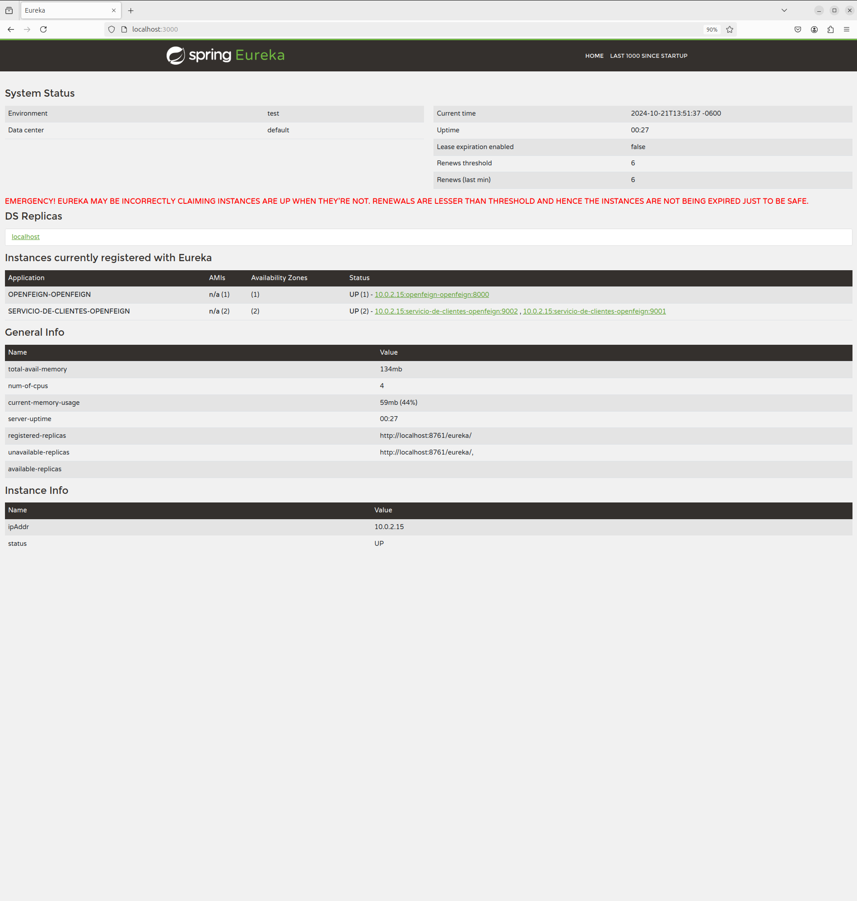

# SPRING CLOUD OPEN FEIGN

Tiempo aproximado: _15 minutos_

## OBJETIVO

En esta actividad se crea un proyecto que utiliza Spring Cloud OpenFeign para consumir otro servicio.

### REPOSITORIO

Esta actividad requiere que el repositorio de trabajo este en:

- Rama: `labs/microservices-development`
  - Se recomienda siempre trabajar sobre una rama _feature_.
    - Por ejemplo: `git checkout -b labs/microservices-development_cazucito`
- Carpeta: `/home/usuario/Desktop/CF01141024/openfeign`

## DESARROLLO

### PROYECTO: EUREKA SERVER

Para esta actividad se proporciona un servidor de descubrimiento (ubicado en `/home/usuario/CF01141024/openfeign/openfeign-eureka`) que se debe construir y ejecutar.

Los pasos generales son los siguientes:

1. En una terminal de comandos construya el proyecto:
   1. `mvn clean package`
2. Ejecute el servidor de descubrimiento:
   1. `java -jar target/openfeign-eureka-0.1.0-SNAPSHOT.jar`

### PROYECTO: SERVICIO DE CLIENTES

Para esta actividad se proporciona un servicio (ubicado en `/home/usuario/CF01141024/openfeign/openfeign-clientes`) que se debe construir y ejecutar.

Los pasos generales son los siguientes:

1. En una terminal de comandos construya el proyecto:
   1. `mvn clean package`
2. Ejecute dos instancias del servicio:
   1. `java -D"spring.profiles.active=nodo1" -jar target/openfeign-clientes-0.1.0-SNAPSHOT.jar`
   2. `java -D"spring.profiles.active=nodo2" -jar target/openfeign-clientes-0.1.0-SNAPSHOT.jar`

### PROYECTO: OPENFEIGN

Para crear una aplicación _Spring Boot_ con _Spring Tool Suite_, entre al editor y seleccione la opción `File → New → Spring Starter Project`.

En la ventana ingrese la siguiente información:

- Name: **openfeign-openfeign**
- Type: **Maven Project**
- Packaging: **Jar**
- Java (versión): **17**
- Language: **Java**
- Group: **mx.com.fractalyst.pdv**
- Artifact: **openfeign-openfeign**
- Version: **0.1.0-SNAPSHOT**
- Description: **Spring Cloud OpenFeign - PoC**
- Package Name: **mx.com.fractalyst.pdv.sc**

De clic en `Next`:

- Spring Boot Version: **3.3.4**
  - Se recomienda utilizar las versiones estables
- Dependencias: `OpenFeign`, `Eureka Discovery Client`, `Spring Boot Actuator` y `Spring Web`.

De clic en `Next`:

- No realice cambios.
  
De clic en `Finish`.

Este último paso solicita la creación y apertura del proyecto Maven en el STS.

#### SPRING BOOT ACTUATOR: INFO

Para visualizar información en el _endpoint_ `actuator/info` se debe adicionar la ejecución del _goal_ `build-info` en el _plug-in_ `spring-boot-maven-plugin`.
Haga que la sección del plug-in se vea como el bloque de pom.xml que se muestra a continuación:

``` xml
          <plugin>
                <groupId>org.springframework.boot</groupId>
                <artifactId>spring-boot-maven-plugin</artifactId>
                <executions>
                    <execution>
                        <goals>
                            <goal>build-info</goal>
                        </goals>
                    </execution>
                </executions>
            </plugin>
```

#### SPRING BOOT APPLICATION

La aplicación además de su lógica de negocio debe comunicarse con el servidor _Eureka_, para lo cual debe registrarse y enviar información de metadatos como _host_, puerto, URL de indicador de estado y página de inicio.

_Eureka Server_ recibe mensajes de _heartbeat_ de cada instancia perteneciente a un servicio. Si el latido no se recibe después de un período de tiempo configurado, la instancia se elimina del registro.

Para lograr lo anterior se debe adicionar la anotación `@EnableDiscoveryClient` a la clase ya anotada con `@SpringBootApplication`.

La clase debe quedar como se muestra a continuación:

``` java
package mx.com.fractalyst.pdv.sc;

import org.springframework.boot.SpringApplication;
import org.springframework.boot.autoconfigure.SpringBootApplication;
import org.springframework.cloud.client.discovery.EnableDiscoveryClient;
import org.springframework.cloud.openfeign.EnableFeignClients;

@SpringBootApplication
@EnableDiscoveryClient
@EnableFeignClients
public class OpenfeignOpenfeignApplication {

	public static void main(String[] args) {
		SpringApplication.run(OpenfeignOpenfeignApplication.class, args);
	}

}
```

#### CLIENTE OPENFEIGN

Para utilizar _OpenFeign_ se debe crear una interfaz, anotarla con `@FeignClient` e indicarle el nombre del servicio al que consumirá.

Cree la clase `src/main/java/mx/com/fractalyst/pdv/sc/c/ClienteOpenFeign.java` con el siguiente contenido:

La clase debe quedar como se muestra a continuación:

``` java
package mx.com.fractalyst.pdv.sc.c;

import org.springframework.cloud.openfeign.FeignClient;
import org.springframework.web.bind.annotation.GetMapping;
import org.springframework.web.bind.annotation.PathVariable;

import mx.com.fractalyst.pdv.sc.m.Cliente;

@FeignClient(name = "servicio-de-clientes-openfeign")
public interface ClienteOpenFeign {

    @GetMapping("/{id-cliente}")
    Cliente obtenCliente(@PathVariable("id-cliente") Long idCliente);

}
```

#### CONTROLADOR: OpenFeignController.java

Cree la clase `src/main/java/mx/com/fractalyst/pdv/sc/m/OpenFeignController.java` con el siguiente contenido:

La clase debe quedar como se muestra a continuación:

``` java
package mx.com.fractalyst.pdv.sc.c;


import org.springframework.beans.factory.annotation.Autowired;
import org.springframework.web.bind.annotation.GetMapping;
import org.springframework.web.bind.annotation.PathVariable;
import org.springframework.web.bind.annotation.RestController;

import mx.com.fractalyst.pdv.sc.m.Cliente;

@RestController
public class OpenFeignController {

    @Autowired
    ClienteOpenFeign clienteOpenFeign;

    @GetMapping("/{id-cliente}")
    public Cliente obtenClientePorId(@PathVariable("id-cliente") Long idCliente) {
        return clienteOpenFeign.obtenCliente(idCliente);
    }

}
```

#### MODELO: Cliente.java

Cree la clase `src/main/java/mx/com/fractalyst/pdv/sc/m/Cliente.java` con el siguiente contenido:

La clase debe quedar como se muestra a continuación:

``` java
package mx.com.fractalyst.pdv.sc.m;

import java.util.ArrayList;
import java.util.List;

public class Cliente {

    private Long id;
    private String nombre;
    private TipoCliente tipoCliente;
    private List<Cuenta> cuentas = new ArrayList<>();

    public List<Cuenta> getCuentas() {
        return cuentas;
    }

    public void setCuentas(List<Cuenta> cuentas) {
        this.cuentas = cuentas;
    }

    public Cliente(Long id, String nombre, TipoCliente tipoCliente) {
        super();
        this.id = id;
        this.nombre = nombre;
        this.tipoCliente = tipoCliente;
    }

    public Cliente(Long id, String nombre, TipoCliente tipoCliente, Cuenta cuenta) {
        this.id = id;
        this.nombre = nombre;
        this.tipoCliente = tipoCliente;
        this.cuentas.add(cuenta);
    }

    public Cliente(String nombre, TipoCliente tipoCliente) {
        this.nombre = nombre;
        this.tipoCliente = tipoCliente;
    }

    public Long getId() {
        return id;
    }

    public void setId(Long id) {
        this.id = id;
    }

    public String getNombre() {
        return nombre;
    }

    public void setNombre(String nombre) {
        this.nombre = nombre;
    }

    public TipoCliente getTipoCliente() {
        return tipoCliente;
    }

    public void setTipoCliente(TipoCliente tipoCliente) {
        this.tipoCliente = tipoCliente;
    }

    public Cliente() {

    }
}


```

#### MODELO: Cuenta.java

Cree la clase `src/main/java/mx/com/fractalyst/pdv/sc/m/Cuenta.java` con el siguiente contenido:

La clase debe quedar como se muestra a continuación:

``` java
package mx.com.fractalyst.pdv.sc.m;

public class Cuenta {

    private Long id;
    private String numeroCuenta;
    private int balance;

    public Cuenta() {

    }

    public Cuenta(Long id, String numeroCuenta, int balance) {
        this.id = id;
        this.numeroCuenta = numeroCuenta;
        this.balance = balance;
    }

    public Long getId() {
        return id;
    }

    public void setId(Long id) {
        this.id = id;
    }

    public String getNumeroCuenta() {
        return numeroCuenta;
    }

    public void setNumeroCuenta(String numeroCuenta) {
        this.numeroCuenta = numeroCuenta;
    }

    public int getBalance() {
        return balance;
    }

    public void setBalance(int balance) {
        this.balance = balance;
    }

}

```

#### MODELO: TipoCliente.java

Cree la clase `src/main/java/mx/com/fractalyst/pdv/sc/m/TipoCliente.java` con el siguiente contenido:

La clase debe quedar como se muestra a continuación:

``` java
package mx.com.fractalyst.pdv.sc.m;

public enum TipoCliente {

    NUEVO, REGULAR, VIP;

}
```

#### CONFIGURACIÓN: application.yml

El siguiente paso es configurar la información del servicio. Para lo anterior se debe crear el archivo de configuración de la aplicación `src/main/resources/application.yml` con el siguiente contenido:

``` yaml
spring:
  application:
    name: openfeign-openfeign

server:
  port: ${PORT:8000}

eureka:
  client:
    serviceUrl:
      defaultZone: ${EUREKA_URL:http://localhost:3000/eureka/}

management:
  endpoint:
    shutdown:
      enabled: true
  endpoints:
    web:
      exposure:
        include: "*"
```

#### CONSTRUCCIÓN

Para construir el servicio ejecute el siguiente comando Maven en una terminal en la raíz del proyecto:

``` shell
mvn clean package
```

Debería ver un resultado similar al siguiente:

``` shell
[INFO] Scanning for projects...
[INFO] 
[INFO] -------------< mx.com.fractalyst.pdv:openfeign-openfeign >--------------
[INFO] Building openfeign-openfeign 0.1.0-SNAPSHOT
[INFO] --------------------------------[ jar ]---------------------------------
[INFO] 
[INFO] --- maven-clean-plugin:3.3.2:clean (default-clean) @ openfeign-openfeign ---
[INFO] Deleting /home/usuario/Desktop/CF01141024/openfeign-openfeign/target
[INFO] 
[INFO] --- spring-boot-maven-plugin:3.3.4:build-info (default) @ openfeign-openfeign ---
[INFO] 
[INFO] --- maven-resources-plugin:3.3.1:resources (default-resources) @ openfeign-openfeign ---
[INFO] Copying 1 resource from src/main/resources to target/classes
[INFO] Copying 0 resource from src/main/resources to target/classes
[INFO] 
[INFO] --- maven-compiler-plugin:3.13.0:compile (default-compile) @ openfeign-openfeign ---
[INFO] Recompiling the module because of changed source code.
[INFO] Compiling 6 source files with javac [debug parameters release 17] to target/classes
[INFO] 
[INFO] --- maven-resources-plugin:3.3.1:testResources (default-testResources) @ openfeign-openfeign ---
[INFO] skip non existing resourceDirectory /home/usuario/Desktop/CF01141024/openfeign-openfeign/src/test/resources
[INFO] 
[INFO] --- maven-compiler-plugin:3.13.0:testCompile (default-testCompile) @ openfeign-openfeign ---
[INFO] Recompiling the module because of changed dependency.
[INFO] Compiling 1 source file with javac [debug parameters release 17] to target/test-classes
[INFO] 
[INFO] --- maven-surefire-plugin:3.2.5:test (default-test) @ openfeign-openfeign ---
[INFO] Using auto detected provider org.apache.maven.surefire.junitplatform.JUnitPlatformProvider
[INFO] 
[INFO] -------------------------------------------------------
[INFO]  T E S T S
[INFO] -------------------------------------------------------
[INFO] Running mx.com.fractalyst.pdv.sc.OpenfeignOpenfeignApplicationTests
13:45:52.216 [main] INFO org.springframework.test.context.support.AnnotationConfigContextLoaderUtils -- Could not detect default configuration classes for test class [mx.com.fractalyst.pdv.sc.OpenfeignOpenfeignApplicationTests]: OpenfeignOpenfeignApplicationTests does not declare any static, non-private, non-final, nested classes annotated with @Configuration.
13:45:52.531 [main] INFO org.springframework.boot.test.context.SpringBootTestContextBootstrapper -- Found @SpringBootConfiguration mx.com.fractalyst.pdv.sc.OpenfeignOpenfeignApplication for test class mx.com.fractalyst.pdv.sc.OpenfeignOpenfeignApplicationTests

  .   ____          _            __ _ _
 /\\ / ___'_ __ _ _(_)_ __  __ _ \ \ \ \
( ( )\___ | '_ | '_| | '_ \/ _` | \ \ \ \
 \\/  ___)| |_)| | | | | || (_| |  ) ) ) )
  '  |____| .__|_| |_|_| |_\__, | / / / /
 =========|_|==============|___/=/_/_/_/

 :: Spring Boot ::                (v3.3.4)

2024-10-21T13:45:53.699-06:00  INFO 9182 --- [openfeign-openfeign] [           main] f.p.s.OpenfeignOpenfeignApplicationTests : Starting OpenfeignOpenfeignApplicationTests using Java 17.0.12 with PID 9182 (started by usuario in /home/usuario/Desktop/CF01141024/openfeign-openfeign)
2024-10-21T13:45:53.702-06:00  INFO 9182 --- [openfeign-openfeign] [           main] f.p.s.OpenfeignOpenfeignApplicationTests : No active profile set, falling back to 1 default profile: "default"
2024-10-21T13:45:55.910-06:00  INFO 9182 --- [openfeign-openfeign] [           main] o.s.cloud.context.scope.GenericScope     : BeanFactory id=0d51417b-84a3-3eac-8668-83d0586a67c9
2024-10-21T13:45:56.040-06:00  WARN 9182 --- [openfeign-openfeign] [           main] trationDelegate$BeanPostProcessorChecker : Bean 'org.springframework.cloud.client.loadbalancer.LoadBalancerAutoConfiguration$DeferringLoadBalancerInterceptorConfig' of type [org.springframework.cloud.client.loadbalancer.LoadBalancerAutoConfiguration$DeferringLoadBalancerInterceptorConfig] is not eligible for getting processed by all BeanPostProcessors (for example: not eligible for auto-proxying). The currently created BeanPostProcessor [lbRestClientPostProcessor] is declared through a non-static factory method on that class; consider declaring it as static instead.
2024-10-21T13:45:56.045-06:00  WARN 9182 --- [openfeign-openfeign] [           main] trationDelegate$BeanPostProcessorChecker : Bean 'deferringLoadBalancerInterceptor' of type [org.springframework.cloud.client.loadbalancer.DeferringLoadBalancerInterceptor] is not eligible for getting processed by all BeanPostProcessors (for example: not eligible for auto-proxying). Is this bean getting eagerly injected into a currently created BeanPostProcessor [lbRestClientPostProcessor]? Check the corresponding BeanPostProcessor declaration and its dependencies.
2024-10-21T13:45:56.560-06:00  INFO 9182 --- [openfeign-openfeign] [           main] o.s.c.openfeign.FeignClientFactoryBean   : For 'servicio-de-clientes-openfeign' URL not provided. Will try picking an instance via load-balancing.
2024-10-21T13:45:58.036-06:00  INFO 9182 --- [openfeign-openfeign] [           main] DiscoveryClientOptionalArgsConfiguration : Eureka HTTP Client uses RestTemplate.
2024-10-21T13:45:58.063-06:00  WARN 9182 --- [openfeign-openfeign] [           main] iguration$LoadBalancerCaffeineWarnLogger : Spring Cloud LoadBalancer is currently working with the default cache. While this cache implementation is useful for development and tests, it's recommended to use Caffeine cache in production.You can switch to using Caffeine cache, by adding it and org.springframework.cache.caffeine.CaffeineCacheManager to the classpath.
2024-10-21T13:45:58.080-06:00  INFO 9182 --- [openfeign-openfeign] [           main] o.s.b.a.e.web.EndpointLinksResolver      : Exposing 18 endpoints beneath base path '/actuator'
2024-10-21T13:45:58.169-06:00  INFO 9182 --- [openfeign-openfeign] [           main] o.s.c.n.eureka.InstanceInfoFactory       : Setting initial instance status as: STARTING
2024-10-21T13:45:58.396-06:00  INFO 9182 --- [openfeign-openfeign] [           main] com.netflix.discovery.DiscoveryClient    : Initializing Eureka in region us-east-1
2024-10-21T13:45:58.418-06:00  INFO 9182 --- [openfeign-openfeign] [           main] c.n.d.s.r.aws.ConfigClusterResolver      : Resolving eureka endpoints via configuration
2024-10-21T13:45:58.438-06:00  INFO 9182 --- [openfeign-openfeign] [           main] com.netflix.discovery.DiscoveryClient    : Disable delta property : false
2024-10-21T13:45:58.439-06:00  INFO 9182 --- [openfeign-openfeign] [           main] com.netflix.discovery.DiscoveryClient    : Single vip registry refresh property : null
2024-10-21T13:45:58.439-06:00  INFO 9182 --- [openfeign-openfeign] [           main] com.netflix.discovery.DiscoveryClient    : Force full registry fetch : false
2024-10-21T13:45:58.439-06:00  INFO 9182 --- [openfeign-openfeign] [           main] com.netflix.discovery.DiscoveryClient    : Application is null : false
2024-10-21T13:45:58.439-06:00  INFO 9182 --- [openfeign-openfeign] [           main] com.netflix.discovery.DiscoveryClient    : Registered Applications size is zero : true
2024-10-21T13:45:58.439-06:00  INFO 9182 --- [openfeign-openfeign] [           main] com.netflix.discovery.DiscoveryClient    : Application version is -1: true
2024-10-21T13:45:58.439-06:00  INFO 9182 --- [openfeign-openfeign] [           main] com.netflix.discovery.DiscoveryClient    : Getting all instance registry info from the eureka server
2024-10-21T13:45:59.177-06:00  INFO 9182 --- [openfeign-openfeign] [           main] com.netflix.discovery.DiscoveryClient    : The response status is 200
2024-10-21T13:45:59.180-06:00  INFO 9182 --- [openfeign-openfeign] [           main] com.netflix.discovery.DiscoveryClient    : Starting heartbeat executor: renew interval is: 30
2024-10-21T13:45:59.184-06:00  INFO 9182 --- [openfeign-openfeign] [           main] c.n.discovery.InstanceInfoReplicator     : InstanceInfoReplicator onDemand update allowed rate per min is 4
2024-10-21T13:45:59.188-06:00  INFO 9182 --- [openfeign-openfeign] [           main] com.netflix.discovery.DiscoveryClient    : Discovery Client initialized at timestamp 1729539959186 with initial instances count: 2
2024-10-21T13:45:59.191-06:00  INFO 9182 --- [openfeign-openfeign] [           main] o.s.c.n.e.s.EurekaServiceRegistry        : Registering application OPENFEIGN-OPENFEIGN with eureka with status UP
2024-10-21T13:45:59.192-06:00  INFO 9182 --- [openfeign-openfeign] [           main] com.netflix.discovery.DiscoveryClient    : Saw local status change event StatusChangeEvent [timestamp=1729539959192, current=UP, previous=STARTING]
2024-10-21T13:45:59.194-06:00  INFO 9182 --- [openfeign-openfeign] [foReplicator-%d] com.netflix.discovery.DiscoveryClient    : DiscoveryClient_OPENFEIGN-OPENFEIGN/10.0.2.15:openfeign-openfeign:8000: registering service...
2024-10-21T13:45:59.232-06:00  INFO 9182 --- [openfeign-openfeign] [           main] f.p.s.OpenfeignOpenfeignApplicationTests : Started OpenfeignOpenfeignApplicationTests in 6.28 seconds (process running for 8.577)
2024-10-21T13:45:59.251-06:00  INFO 9182 --- [openfeign-openfeign] [foReplicator-%d] com.netflix.discovery.DiscoveryClient    : DiscoveryClient_OPENFEIGN-OPENFEIGN/10.0.2.15:openfeign-openfeign:8000 - registration status: 204
OpenJDK 64-Bit Server VM warning: Sharing is only supported for boot loader classes because bootstrap classpath has been appended
[INFO] Tests run: 1, Failures: 0, Errors: 0, Skipped: 0, Time elapsed: 8.729 s -- in mx.com.fractalyst.pdv.sc.OpenfeignOpenfeignApplicationTests
[INFO] 
[INFO] Results:
[INFO] 
[INFO] Tests run: 1, Failures: 0, Errors: 0, Skipped: 0
[INFO] 
[INFO] 
[INFO] --- maven-jar-plugin:3.4.2:jar (default-jar) @ openfeign-openfeign ---
[INFO] Building jar: /home/usuario/Desktop/CF01141024/openfeign-openfeign/target/openfeign-openfeign-0.1.0-SNAPSHOT.jar
[INFO] 
[INFO] --- spring-boot-maven-plugin:3.3.4:repackage (repackage) @ openfeign-openfeign ---
[INFO] Replacing main artifact /home/usuario/Desktop/CF01141024/openfeign-openfeign/target/openfeign-openfeign-0.1.0-SNAPSHOT.jar with repackaged archive, adding nested dependencies in BOOT-INF/.
[INFO] The original artifact has been renamed to /home/usuario/Desktop/CF01141024/openfeign-openfeign/target/openfeign-openfeign-0.1.0-SNAPSHOT.jar.original
[INFO] ------------------------------------------------------------------------
[INFO] BUILD SUCCESS
[INFO] ------------------------------------------------------------------------
[INFO] Total time:  18.874 s
[INFO] Finished at: 2024-10-21T13:46:02-06:00
[INFO] ------------------------------------------------------------------------

```

#### EJECUCIÓN

Para ejecutar el servicio se puede lanzar el _jar_ ubicado en la carpeta `target` del proyecto con los tres perfiles como se muestra a continuación:

``` shell
java -jar target/openfeign-openfeign-0.1.0-SNAPSHOT.jar
```

Se debe ver un resultado similar al siguiente en todas las terminales:

```  shell

  .   ____          _            __ _ _
 /\\ / ___'_ __ _ _(_)_ __  __ _ \ \ \ \
( ( )\___ | '_ | '_| | '_ \/ _` | \ \ \ \
 \\/  ___)| |_)| | | | | || (_| |  ) ) ) )
  '  |____| .__|_| |_|_| |_\__, | / / / /
 =========|_|==============|___/=/_/_/_/

 :: Spring Boot ::                (v3.3.4)

2024-10-21T13:46:49.012-06:00  INFO 9311 --- [openfeign-openfeign] [           main] m.c.f.p.s.OpenfeignOpenfeignApplication  : Starting OpenfeignOpenfeignApplication v0.1.0-SNAPSHOT using Java 17.0.12 with PID 9311 (/home/usuario/Desktop/CF01141024/openfeign-openfeign/target/openfeign-openfeign-0.1.0-SNAPSHOT.jar started by usuario in /home/usuario/Desktop/CF01141024/openfeign-openfeign)
2024-10-21T13:46:49.019-06:00  INFO 9311 --- [openfeign-openfeign] [           main] m.c.f.p.s.OpenfeignOpenfeignApplication  : No active profile set, falling back to 1 default profile: "default"
2024-10-21T13:46:50.755-06:00  INFO 9311 --- [openfeign-openfeign] [           main] o.s.cloud.context.scope.GenericScope     : BeanFactory id=bd13c7c7-9ace-3b7e-ab3e-08e4e3106fc3
2024-10-21T13:46:50.842-06:00  WARN 9311 --- [openfeign-openfeign] [           main] trationDelegate$BeanPostProcessorChecker : Bean 'org.springframework.cloud.client.loadbalancer.LoadBalancerAutoConfiguration$DeferringLoadBalancerInterceptorConfig' of type [org.springframework.cloud.client.loadbalancer.LoadBalancerAutoConfiguration$DeferringLoadBalancerInterceptorConfig] is not eligible for getting processed by all BeanPostProcessors (for example: not eligible for auto-proxying). The currently created BeanPostProcessor [lbRestClientPostProcessor] is declared through a non-static factory method on that class; consider declaring it as static instead.
2024-10-21T13:46:50.847-06:00  WARN 9311 --- [openfeign-openfeign] [           main] trationDelegate$BeanPostProcessorChecker : Bean 'deferringLoadBalancerInterceptor' of type [org.springframework.cloud.client.loadbalancer.DeferringLoadBalancerInterceptor] is not eligible for getting processed by all BeanPostProcessors (for example: not eligible for auto-proxying). Is this bean getting eagerly injected into a currently created BeanPostProcessor [lbRestClientPostProcessor]? Check the corresponding BeanPostProcessor declaration and its dependencies.
2024-10-21T13:46:51.219-06:00  INFO 9311 --- [openfeign-openfeign] [           main] o.s.b.w.embedded.tomcat.TomcatWebServer  : Tomcat initialized with port 8000 (http)
2024-10-21T13:46:51.235-06:00  INFO 9311 --- [openfeign-openfeign] [           main] o.apache.catalina.core.StandardService   : Starting service [Tomcat]
2024-10-21T13:46:51.236-06:00  INFO 9311 --- [openfeign-openfeign] [           main] o.apache.catalina.core.StandardEngine    : Starting Servlet engine: [Apache Tomcat/10.1.30]
2024-10-21T13:46:51.325-06:00  INFO 9311 --- [openfeign-openfeign] [           main] o.a.c.c.C.[Tomcat].[localhost].[/]       : Initializing Spring embedded WebApplicationContext
2024-10-21T13:46:51.339-06:00  INFO 9311 --- [openfeign-openfeign] [           main] w.s.c.ServletWebServerApplicationContext : Root WebApplicationContext: initialization completed in 2237 ms
2024-10-21T13:46:52.085-06:00  INFO 9311 --- [openfeign-openfeign] [           main] o.s.c.openfeign.FeignClientFactoryBean   : For 'servicio-de-clientes-openfeign' URL not provided. Will try picking an instance via load-balancing.
2024-10-21T13:46:53.124-06:00  INFO 9311 --- [openfeign-openfeign] [           main] DiscoveryClientOptionalArgsConfiguration : Eureka HTTP Client uses RestTemplate.
2024-10-21T13:46:53.156-06:00  WARN 9311 --- [openfeign-openfeign] [           main] iguration$LoadBalancerCaffeineWarnLogger : Spring Cloud LoadBalancer is currently working with the default cache. While this cache implementation is useful for development and tests, it's recommended to use Caffeine cache in production.You can switch to using Caffeine cache, by adding it and org.springframework.cache.caffeine.CaffeineCacheManager to the classpath.
2024-10-21T13:46:53.170-06:00  INFO 9311 --- [openfeign-openfeign] [           main] o.s.b.a.e.web.EndpointLinksResolver      : Exposing 18 endpoints beneath base path '/actuator'
2024-10-21T13:46:53.553-06:00  INFO 9311 --- [openfeign-openfeign] [           main] o.s.c.n.eureka.InstanceInfoFactory       : Setting initial instance status as: STARTING
2024-10-21T13:46:53.586-06:00  INFO 9311 --- [openfeign-openfeign] [           main] com.netflix.discovery.DiscoveryClient    : Initializing Eureka in region us-east-1
2024-10-21T13:46:53.610-06:00  INFO 9311 --- [openfeign-openfeign] [           main] c.n.d.s.r.aws.ConfigClusterResolver      : Resolving eureka endpoints via configuration
2024-10-21T13:46:53.634-06:00  INFO 9311 --- [openfeign-openfeign] [           main] com.netflix.discovery.DiscoveryClient    : Disable delta property : false
2024-10-21T13:46:53.635-06:00  INFO 9311 --- [openfeign-openfeign] [           main] com.netflix.discovery.DiscoveryClient    : Single vip registry refresh property : null
2024-10-21T13:46:53.635-06:00  INFO 9311 --- [openfeign-openfeign] [           main] com.netflix.discovery.DiscoveryClient    : Force full registry fetch : false
2024-10-21T13:46:53.635-06:00  INFO 9311 --- [openfeign-openfeign] [           main] com.netflix.discovery.DiscoveryClient    : Application is null : false
2024-10-21T13:46:53.635-06:00  INFO 9311 --- [openfeign-openfeign] [           main] com.netflix.discovery.DiscoveryClient    : Registered Applications size is zero : true
2024-10-21T13:46:53.636-06:00  INFO 9311 --- [openfeign-openfeign] [           main] com.netflix.discovery.DiscoveryClient    : Application version is -1: true
2024-10-21T13:46:53.636-06:00  INFO 9311 --- [openfeign-openfeign] [           main] com.netflix.discovery.DiscoveryClient    : Getting all instance registry info from the eureka server
2024-10-21T13:46:54.421-06:00  INFO 9311 --- [openfeign-openfeign] [           main] com.netflix.discovery.DiscoveryClient    : The response status is 200
2024-10-21T13:46:54.428-06:00  INFO 9311 --- [openfeign-openfeign] [           main] com.netflix.discovery.DiscoveryClient    : Starting heartbeat executor: renew interval is: 30
2024-10-21T13:46:54.431-06:00  INFO 9311 --- [openfeign-openfeign] [           main] c.n.discovery.InstanceInfoReplicator     : InstanceInfoReplicator onDemand update allowed rate per min is 4
2024-10-21T13:46:54.434-06:00  INFO 9311 --- [openfeign-openfeign] [           main] com.netflix.discovery.DiscoveryClient    : Discovery Client initialized at timestamp 1729540014433 with initial instances count: 2
2024-10-21T13:46:54.439-06:00  INFO 9311 --- [openfeign-openfeign] [           main] o.s.c.n.e.s.EurekaServiceRegistry        : Registering application OPENFEIGN-OPENFEIGN with eureka with status UP
2024-10-21T13:46:54.440-06:00  INFO 9311 --- [openfeign-openfeign] [           main] com.netflix.discovery.DiscoveryClient    : Saw local status change event StatusChangeEvent [timestamp=1729540014440, current=UP, previous=STARTING]
2024-10-21T13:46:54.451-06:00  INFO 9311 --- [openfeign-openfeign] [foReplicator-%d] com.netflix.discovery.DiscoveryClient    : DiscoveryClient_OPENFEIGN-OPENFEIGN/10.0.2.15:openfeign-openfeign:8000: registering service...
2024-10-21T13:46:54.499-06:00  INFO 9311 --- [openfeign-openfeign] [           main] o.s.b.w.embedded.tomcat.TomcatWebServer  : Tomcat started on port 8000 (http) with context path '/'
2024-10-21T13:46:54.549-06:00  INFO 9311 --- [openfeign-openfeign] [           main] .s.c.n.e.s.EurekaAutoServiceRegistration : Updating port to 8000
2024-10-21T13:46:54.688-06:00  INFO 9311 --- [openfeign-openfeign] [foReplicator-%d] com.netflix.discovery.DiscoveryClient    : DiscoveryClient_OPENFEIGN-OPENFEIGN/10.0.2.15:openfeign-openfeign:8000 - registration status: 204
2024-10-21T13:46:54.694-06:00  INFO 9311 --- [openfeign-openfeign] [           main] m.c.f.p.s.OpenfeignOpenfeignApplication  : Started OpenfeignOpenfeignApplication in 6.509 seconds (process running for 7.323)
```

Esta ejecución hace disponible el servicio que define y utiliza el cliente `OpenFeign`. La terminal de comandos se bloquea por lo que las siguientes acciones deben ser realizadas en otra terminal y de requerir detener el servidor debe ejecutar `Ctrl+C` en la terminal en la que se haya iniciado.

Para validar que el servicio se encuentra funcionando se puede llamar al _endpoint_ publicado en `/actuator/health` como se muestra a continuación:

``` shell
curl http://localhost:8000/actuator/health
```

La salida debe ser similar a:

``` json
{
  "status":"UP"
}
```

Además, puede llamar al endpoint /actuator/info para obtener información del servicio:

``` shell
curl http://localhost:8000/actuator/info
```

La salida debe ser similar a:

``` json
{
    "build": {
        "artifact": "openfeign-openfeign",
        "name": "openfeign-openfeign",
        "time": "2024-10-21T19:45:43.571Z",
        "version": "0.1.0-SNAPSHOT",
        "group": "mx.com.fractalyst.pdv"
    }
}
```

Con lo anterior podemos está seguros de que está operativo.

#### EUREKA DASHBOARD

El servidor de descubrimiento Eureka brinda un dashboard que puede ser accesible mediante un cliente web en el url: localhost:3000 y en el cual podemos observar que están registradas las instancias del `servicio-de-clientes`, y el `openfeign-openfeign` que consume al primero.

Visite el _dashboard_ ingresando las siguientes URLs en un navegador web:

1. <http://localhost:3000/>



Adicionalmente si da clic en la columna `Status` en la sección de `Instances currently registered with Eureka` se obtiene la información del _endpoint_ `actuator/info` de cada servicio.

#### CONSUMO

Para probar que el cliente `OpenFeign` se está comunicando con el `servicio-de-clientes-openfeign` consuma el único endpoint que expone:

``` shell
curl localhost:8000/1
```

La salida de cada ejecución debe ser semejante a:

``` json
{
  "id": 1,
  "nombre": "Juan López",
  "tipoCliente": "NUEVO",
  "cuentas": [
    {
      "id": 1,
      "numeroCuenta": "111111",
      "balance": 1000
    }
  ]
}
```

##### OPCIONAL

Analice la clase controladora del servicio-de-clientes-openfeign que se muestra a continuación:

``` java
package mx.com.fractalyst.pdv.sc.c;

import java.util.List;

import mx.com.fractalyst.pdv.m.Cliente;
import mx.com.fractalyst.pdv.m.ClienteRepository;

import org.springframework.beans.factory.annotation.Autowired;
import org.springframework.web.bind.annotation.DeleteMapping;
import org.springframework.web.bind.annotation.GetMapping;
import org.springframework.web.bind.annotation.PathVariable;
import org.springframework.web.bind.annotation.PostMapping;
import org.springframework.web.bind.annotation.PutMapping;
import org.springframework.web.bind.annotation.RequestBody;
import org.springframework.web.bind.annotation.RestController;

@RestController
public class ClientesController {

    @Autowired
    ClienteRepository clienteRepo;

    @PostMapping
    public Cliente altaCliente(@RequestBody Cliente cliente) {
        return clienteRepo.add(cliente);
    }

    @DeleteMapping("/{id}")
    public void eliminaCliente(@PathVariable("id") Long id) {
        clienteRepo.delete(id);
    }

    @PutMapping
    public Cliente actualizaCliente(@RequestBody Cliente cliente) {
        return clienteRepo.update(cliente);
    }

    @GetMapping("/{id-cliente}")
    public Cliente obtenClientePorId(@PathVariable("id-cliente") Long idCliente) {
        return clienteRepo.findById(idCliente);
    }


    @PostMapping("/ids")
    public List<Cliente> obtenClientes(@RequestBody List<Long> ids) {
        return clienteRepo.find(ids);
    }

    @GetMapping
    public List<Cliente> obtenClientes() {
        return clienteRepo.findAll();
    }

}
```

El método que se está consumiendo mediante el cliente `OpenFeign` es `obtenClientePorId`.

- Realice los cambios necesarios en el cliente OpenFeign para consumir más métodos.

### RESTABLECIMIENTO

Para restablecer el ambiente de trabajo se debe detener la ejecución haciendo `Ctrl+C` en la terminal de comandos en la que se haya iniciado dicha ejecución.

## RESULTADO

Comente los puntos más relevantes de las actividades.

## REFERENCIAS

- [Spring Cloud OpenFeign](https://spring.io/projects/spring-cloud-openfeign)

---

[DESARROLLO DE MICROSERVICIOS](../../M04.md)
