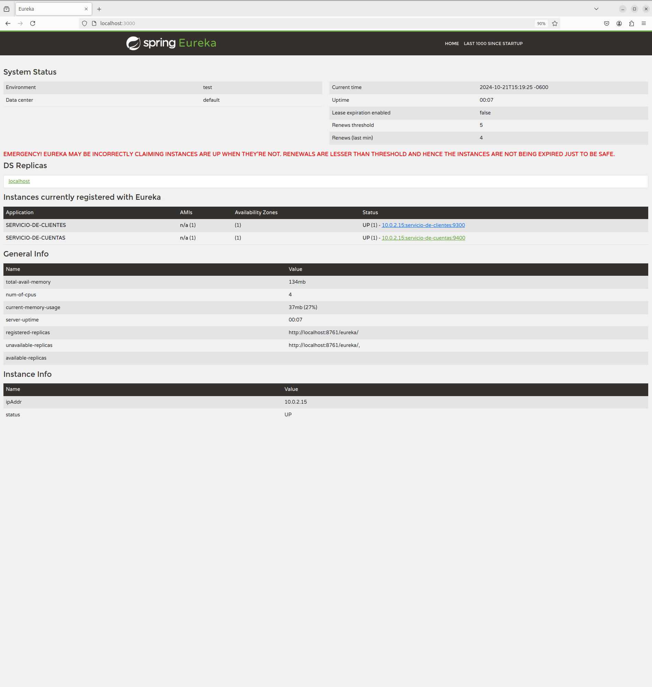
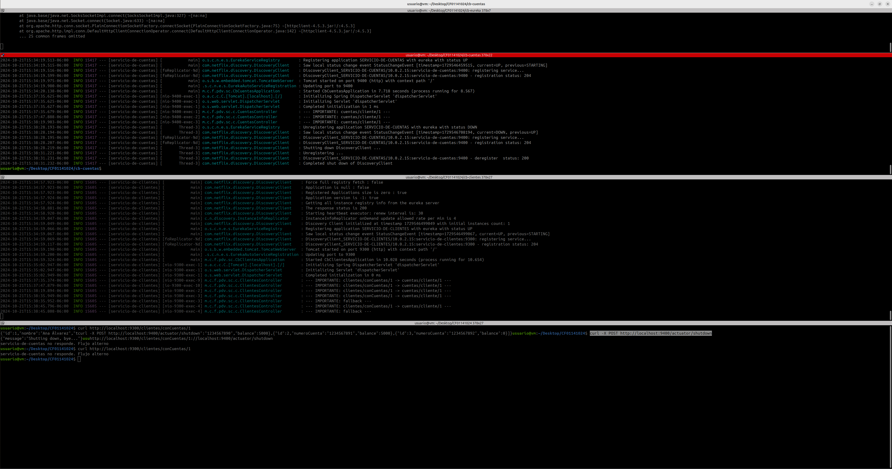
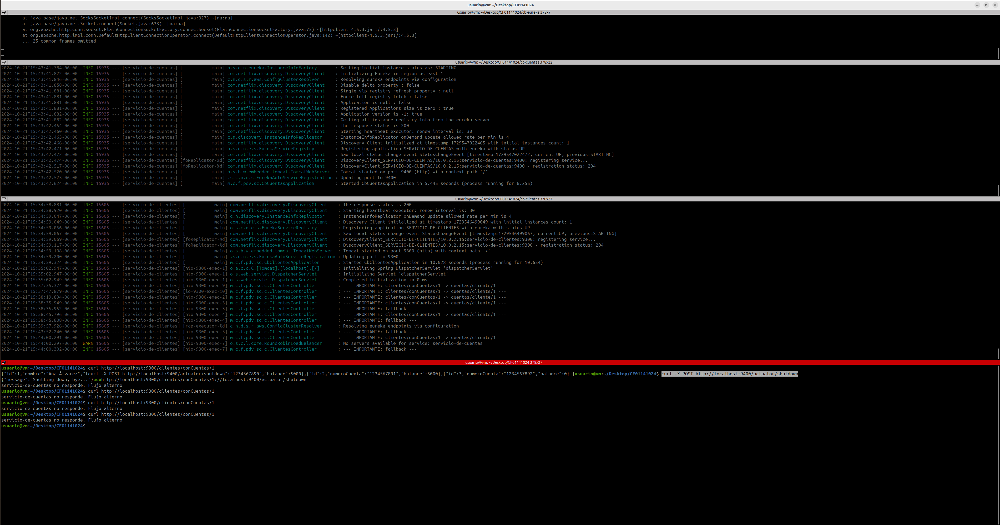
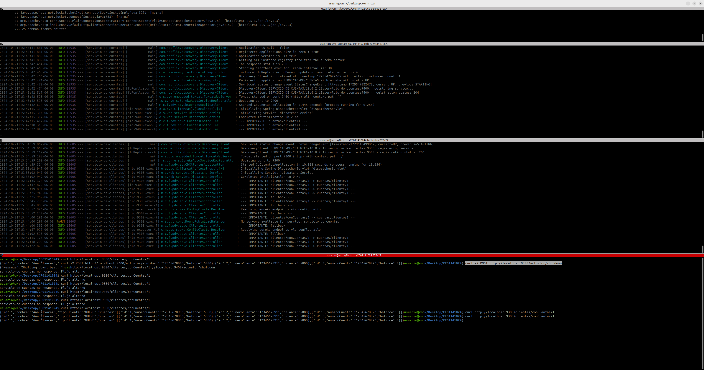

# SPRING CLOUD CIRCUIT BREAKER

Tiempo aproximado: _15 minutos_

## OBJETIVO

En esta actividad se ponen en marcha varios servicios y se crea un proyecto en Spring Boot para la utilización de Spring Cloud Circuit Breaker.

### REPOSITORIO

Esta actividad requiere que el repositorio de trabajo este en:

- Rama: `labs/microservices-development`
  - Se recomienda siempre trabajar sobre una rama _feature_.
    - Por ejemplo: `git checkout -b labs/microservices-development_cazucito`
- Carpeta: `/home/usuario/Desktop/CF01141024/circuit-breaker`

## DESARROLLO

### PROYECTO: EUREKA SERVER

Para esta actividad se proporciona un servidor de descubrimiento (ubicado en `/home/usuario/CF01141024/circuit-breaker/cb-eureka`) que se debe construir y ejecutar.

Los pasos generales son los siguientes:

1. En una terminal de comandos construya el proyecto:
   1. `mvn clean package`
2. Ejecute el servidor de descubrimiento:
   1. `java -jar target/cb-eureka-0.1.0-SNAPSHOT.jar`

### PROYECTO: SERVICIO DE CUENTAS

Para esta actividad se proporciona un servicio (ubicado en `/home/usuario/CF01141024/circuit-breaker/cb-cuentas`) que se debe construir y ejecutar.

Los pasos generales son los siguientes:

1. En una terminal de comandos construya el proyecto:
   1. `mvn clean package`
2. Ejecute la instancia del servicio:
   1. `java -jar target/cb-cuentas-0.1.0-SNAPSHOT.jar`

### PROYECTO: SERVICIO DE CLIENTES

Para crear una aplicación _Spring Boot_ con _Spring Tool Suite_, entre al editor y seleccione la opción `File → New → Spring Starter Project`.

En la ventana ingrese la siguiente información:

- Name: **cb-clientes**
- Type: **Maven Project**
- Packaging: **Jar**
- Java (versión): **17**
- Language: **Java**
- Group: **mx.com.fractalyst.pdv**
- Artifact: **cb-clientes**
- Version: **0.1.0-SNAPSHOT**
- Description: **Spring Cloud Circuit Breaker - Clientes**
- Package Name: **mx.com.fractalyst.pdv.sc**

De clic en `Next`:

- Spring Boot Version: **3.3.4**
  - Se recomienda utilizar las versiones estables
- Dependencias: `Resilience4J`, `Eureka Discovery Client`, `Spring Boot Actuator` y `Spring Web`.

De clic en `Next`:

- No realice cambios.
  
De clic en `Finish`.

Este último paso solicita la creación y apertura del proyecto Maven en el STS.

#### DEPENDENCIAS

Adicionalmente se debe incluir la dependencia del starter para _Spring AOP_ y _AspectJ_:

``` xml
      <dependency>
            <groupId>org.springframework.boot</groupId>
            <artifactId>spring-boot-starter-aop</artifactId>
        </dependency>
```

#### SPRING BOOT ACTUATOR: INFO

Para visualizar información en el _endpoint_ `actuator/info` se debe adicionar la ejecución del _goal_ `build-info` en el _plug-in_ `spring-boot-maven-plugin`.
Haga que la sección del plug-in se vea como el bloque de pom.xml que se muestra a continuación:

``` xml
          <plugin>
                <groupId>org.springframework.boot</groupId>
                <artifactId>spring-boot-maven-plugin</artifactId>
                <executions>
                    <execution>
                        <goals>
                            <goal>build-info</goal>
                        </goals>
                    </execution>
                </executions>
            </plugin>
```

#### SPRING BOOT APPLICATION

La aplicación además de su lógica de negocio debe comunicarse con el servidor _Eureka_, para lo cual debe registrarse y enviar información de metadatos como _host_, puerto, URL de indicador de estado y página de inicio.

_Eureka Server_ recibe mensajes de _heartbeat_ de cada instancia perteneciente a un servicio. Si el latido no se recibe después de un período de tiempo configurado, la instancia se elimina del registro.

Para lograr lo anterior se debe adicionar la anotación `@EnableDiscoveryClient` a la clase ya anotada con `@SpringBootApplication`.

La clase debe quedar como se muestra a continuación:

``` java
package mx.com.fractalyst.pdv.sc;

import org.springframework.boot.SpringApplication;
import org.springframework.boot.autoconfigure.SpringBootApplication;
import org.springframework.cloud.client.discovery.EnableDiscoveryClient;
import org.springframework.cloud.client.loadbalancer.LoadBalanced;
import org.springframework.context.annotation.Bean;
import org.springframework.web.client.RestTemplate;

import mx.com.fractalyst.pdv.sc.m.Cliente;
import mx.com.fractalyst.pdv.sc.m.ClientesRepository;
import mx.com.fractalyst.pdv.sc.m.TipoCliente;


@SpringBootApplication
@EnableDiscoveryClient
public class CbClientesApplication {

    @LoadBalanced
    @Bean
    RestTemplate restTemplate() {
        return new RestTemplate();
    }

    @Bean
    ClientesRepository repository() {
        ClientesRepository repository = new ClientesRepository();
        repository.add(new Cliente("Ana Álvarez", TipoCliente.NUEVO));
        repository.add(new Cliente("Benito Buendia", TipoCliente.REGULAR));
        repository.add(new Cliente("Carlos Carmona", TipoCliente.VIP));
        return repository;
    }

    public static void main(String[] args) {
        SpringApplication.run(CbClientesApplication.class, args);
    }

}
```

#### CONTROLADOR: ClientesController.java

Cree la clase `src/main/java/mx/com/fractalyst/pdv/sc/c/ClientesController.java` con el siguiente contenido:

La clase debe quedar como se muestra a continuación:

``` java
package mx.com.fractalyst.pdv.sc.c;

import java.util.Arrays;
import java.util.List;
import java.util.stream.Collectors;

import org.slf4j.LoggerFactory;
import org.springframework.beans.factory.annotation.Autowired;
import org.springframework.http.HttpStatus;
import org.springframework.http.ResponseEntity;
import org.springframework.web.bind.annotation.DeleteMapping;
import org.springframework.web.bind.annotation.GetMapping;
import org.springframework.web.bind.annotation.PathVariable;
import org.springframework.web.bind.annotation.PostMapping;
import org.springframework.web.bind.annotation.PutMapping;
import org.springframework.web.bind.annotation.RequestBody;
import org.springframework.web.bind.annotation.RequestMapping;
import org.springframework.web.bind.annotation.RestController;
import org.springframework.web.client.RestTemplate;


import io.github.resilience4j.circuitbreaker.annotation.CircuitBreaker;
import mx.com.fractalyst.pdv.sc.m.Cliente;
import mx.com.fractalyst.pdv.sc.m.ClientesRepository;
import mx.com.fractalyst.pdv.sc.m.Cuenta;

@RestController
@RequestMapping("/clientes")
public class ClientesController {

    @Autowired
    RestTemplate restTemplate;

    @Autowired
    ClientesRepository clienteRepo;

    @PostMapping
    public Cliente altaCliente(@RequestBody Cliente cliente) {
        return clienteRepo.add(cliente);
    }

    @PutMapping
    public Cliente actualizaCliente(@RequestBody Cliente cliente) {
        return clienteRepo.update(cliente);
    }

    @GetMapping("/{id}")
    public ResponseEntity<Cliente> obtenClientePorId(@PathVariable("id") Long id) {
        return new ResponseEntity<Cliente>(clienteRepo.findById(id), HttpStatus.OK);
    }


    @GetMapping("/conCuentas/{id}")
    @CircuitBreaker(name = "servicio-de-clientes", fallbackMethod = "obtenClientePorIdConCuentasFallback")
    public ResponseEntity<Cliente> obtenClientePorIdConCuentas(@PathVariable("id") Long id) {
        LoggerFactory.getLogger(getClass())
                .info("--- IMPORTANTE: clientes/conCuentas/" + id + " -> cuentas/cliente/" + id + " ---");
        Cuenta[] accounts = restTemplate.getForObject("http://servicio-de-cuentas/cuentas/cliente/{cliente-id}",
                Cuenta[].class, id);
        Cliente c = clienteRepo.findById(id);
        c.setCuentas(Arrays.stream(accounts).collect(Collectors.toList()));
        return new ResponseEntity<Cliente>(c, HttpStatus.OK);
    }

    public ResponseEntity<String> obtenClientePorIdConCuentasFallback(@PathVariable("id") Long id, Exception e) {
        LoggerFactory.getLogger(getClass()).info("--- IMPORTANTE: fallback ---");
        return new ResponseEntity<String>("servicio-de-cuentas no responde. Flujo alterno \n", HttpStatus.OK);
    }

    @PostMapping("/ids")
    public List<Cliente> obtenClientes(@RequestBody List<Long> ids) {
        return clienteRepo.find(ids);
    }

    @DeleteMapping("/{id}")
    public void eliminaCliente(@PathVariable("id") Long id) {
        clienteRepo.delete(id);
    }
}
```

#### MODELO: Cliente.java

Cree la clase `src/main/java/mx/com/fractalyst/pdv/sc/m/Cliente.java` con el siguiente contenido:

La clase debe quedar como se muestra a continuación:

``` java
package mx.com.fractalyst.pdv.sc.m;


import java.util.ArrayList;
import java.util.List;

public class Cliente {

    private Long id;
    private String nombre;
    private TipoCliente tipoCliente;
    private List<Cuenta> cuentas = new ArrayList<>();

    public List<Cuenta> getCuentas() {
        return cuentas;
    }

    public void setCuentas(List<Cuenta> cuentas) {
        this.cuentas = cuentas;
    }

    public Cliente(Long id, String nombre, TipoCliente tipoCliente) {
        super();
        this.id = id;
        this.nombre = nombre;
        this.tipoCliente = tipoCliente;
    }

    public Cliente(String nombre, TipoCliente tipoCliente) {
        this.nombre = nombre;
        this.tipoCliente = tipoCliente;
    }

    public Long getId() {
        return id;
    }

    public void setId(Long id) {
        this.id = id;
    }

    public String getNombre() {
        return nombre;
    }

    public void setNombre(String nombre) {
        this.nombre = nombre;
    }

    public TipoCliente getTipoCliente() {
        return tipoCliente;
    }

    public void setTipoCliente(TipoCliente tipoCliente) {
        this.tipoCliente = tipoCliente;
    }

    public Cliente() {

    }

}
```

#### MODELO: ClientesRepository.java

Cree la clase `src/main/java/mx/com/fractalyst/pdv/sc/m/ClientesRepository.java` con el siguiente contenido:

La clase debe quedar como se muestra a continuación:

``` java
package mx.com.fractalyst.pdv.sc.m;


import java.util.ArrayList;
import java.util.List;
import java.util.Optional;
import java.util.stream.Collectors;


public class ClientesRepository {

    private List<Cliente> clientes = new ArrayList<>();

    public Cliente add(Cliente cliente) {
        cliente.setId((long) (clientes.size()+1));
        clientes.add(cliente);
        return cliente;
    }

    public Cliente update(Cliente cliente) {
        clientes.set(cliente.getId().intValue() - 1, cliente);
        return cliente;
    }

    public Cliente findById(Long id) {
        Optional<Cliente> cliente = clientes.stream().filter(p -> p.getId().equals(id)).findFirst();
        if (cliente.isPresent())
            return cliente.get();
        else
            return null;
    }

    public void delete(Long id) {
        clientes.remove(id.intValue());
    }

    public List<Cliente> find(List<Long> ids) {
        return clientes.stream().filter(p -> ids.contains(p.getId())).collect(Collectors.toList());
    }

}
```

#### MODELO: Cuenta.java

Cree la clase `src/main/java/mx/com/fractalyst/pdv/sc/m/Cuenta.java` con el siguiente contenido:

La clase debe quedar como se muestra a continuación:

``` java
package mx.com.fractalyst.pdv.sc.m;


public class Cuenta {

    private Long id;
    private String numeroCuenta;
    private int balance;

    public Cuenta() {

    }

    public Cuenta(Long id, String numeroCuenta, int balance) {
        this.id = id;
        this.numeroCuenta = numeroCuenta;
        this.balance = balance;
    }

    public Long getId() {
        return id;
    }

    public void setId(Long id) {
        this.id = id;
    }

    public String getNumeroCuenta() {
        return numeroCuenta;
    }

    public void setNumeroCuenta(String numeroCuenta) {
        this.numeroCuenta = numeroCuenta;
    }

    public int getBalance() {
        return balance;
    }

    public void setBalance(int balance) {
        this.balance = balance;
    }

}


```

#### MODELO: TipoCliente.java

Cree la clase `src/main/java/mx/com/fractalyst/pdv/sc/m/TipoCliente.java` con el siguiente contenido:

La clase debe quedar como se muestra a continuación:

``` java
package mx.com.fractalyst.pdv.sc.m;

public enum TipoCliente {

	NUEVO, REGULAR, VIP;

}
```

#### CONFIGURACIÓN: application.yml

Para definir los detalles del servicio que utiliza el `Resilience4J` cree el archivo de configuración de la aplicación `application.yml` con el siguiente contenido:

``` yaml
spring:
  application:
    name: servicio-de-clientes

server:
  port: ${PORT:9300}

eureka:
  client:
    service-url:
      defaultZone: ${EUREKA_URL:http://localhost:3000/eureka/}

management:
  health:
    circuitbreakers:
      enabled: true
  endpoint:
    shutdown:
      enabled: true
    health:
      show-details: always
  endpoints:
    web:
      exposure:
        include: "*"

resilience4j:
  circuitbreaker:
    configs:
      shared:
        register-health-indicator: true
        sliding-window-type: COUNT_BASED
        sliding-window-size: 5
        failure-rate-threshold: 40
        permitted-number-of-calls-in-half-open-state: 1
        max-wait-duration-in-half-open-state: 10s
        wait-duration-in-open-state: 10s
        slow-call-rate-threshold: 40
        writable-stack-trace-enabled: true
        automatic-transition-from-open-to-half-open-enabled: true

    instances:
      servicio-de-clientes:
        base-config: shared

---
# Para utilizar este perfil
# java -D"spring.profiles.active=nodo1" -jar target/cb-clientes-0.1.0-SNAPSHOT.jar
spring:
  config:
    activate:
      on-profile: nodo1

eureka:
  instance:
    hostname: localhost
    metadataMap:
      zone: zona1
  client:
    serviceUrl:
      defaultZone: ${EUREKA_URL:http://localhost:3000/eureka/}

server:
  port: ${PORT:9301}

---
# Para utilizar este perfil
# java -D"spring.profiles.active=nodo2" -jar target/cb-clientes-0.1.0-SNAPSHOT.jar
spring:
  config:
    activate:
      on-profile: nodo2

eureka:
  instance:
    hostname: localhost
    metadataMap:
      zone: zona2
  client:
    serviceUrl:
      defaultZone: ${EUREKA_URL:http://localhost:3000/eureka/}

server:
  port: ${PORT:9302}

---
# Para utilizar este perfil
# java -D"spring.profiles.active=nodo3" -jar target/cb-clientes-0.1.0-SNAPSHOT.jar
spring:
  config:
    activate:
      on-profile: nodo3

eureka:
  instance:
    hostname: localhost
    metadataMap:
      zone: zona3
  client:
    serviceUrl:
      defaultZone: ${EUREKA_URL:http://localhost:3000/eureka/}

server:
  port: ${PORT:9303}
```

#### CONSTRUCCIÓN

Para construir el servicio ejecute el siguiente comando Maven en una terminal en la raíz del proyecto:

``` shell
mvn clean package
```

Debería ver un resultado similar al siguiente:

``` shell
[INFO] Scanning for projects...
[INFO] 
[INFO] -----------------< mx.com.fractalyst.pdv:cb-clientes >------------------
[INFO] Building cb-clientes 0.1.0-SNAPSHOT
[INFO] --------------------------------[ jar ]---------------------------------
[INFO] 
[INFO] --- maven-clean-plugin:3.3.2:clean (default-clean) @ cb-clientes ---
[INFO] Deleting /home/usuario/Desktop/CF01141024/cb-clientes/target
[INFO] 
[INFO] --- spring-boot-maven-plugin:3.3.4:build-info (default) @ cb-clientes ---
[INFO] 
[INFO] --- maven-resources-plugin:3.3.1:resources (default-resources) @ cb-clientes ---
[INFO] Copying 1 resource from src/main/resources to target/classes
[INFO] Copying 0 resource from src/main/resources to target/classes
[INFO] 
[INFO] --- maven-compiler-plugin:3.13.0:compile (default-compile) @ cb-clientes ---
[INFO] Recompiling the module because of changed source code.
[INFO] Compiling 6 source files with javac [debug parameters release 17] to target/classes
[INFO] 
[INFO] --- maven-resources-plugin:3.3.1:testResources (default-testResources) @ cb-clientes ---
[INFO] skip non existing resourceDirectory /home/usuario/Desktop/CF01141024/cb-clientes/src/test/resources
[INFO] 
[INFO] --- maven-compiler-plugin:3.13.0:testCompile (default-testCompile) @ cb-clientes ---
[INFO] Recompiling the module because of changed dependency.
[INFO] Compiling 1 source file with javac [debug parameters release 17] to target/test-classes
[INFO] 
[INFO] --- maven-surefire-plugin:3.2.5:test (default-test) @ cb-clientes ---
[INFO] Using auto detected provider org.apache.maven.surefire.junitplatform.JUnitPlatformProvider
[INFO] 
[INFO] -------------------------------------------------------
[INFO]  T E S T S
[INFO] -------------------------------------------------------
[INFO] Running mx.com.fractalyst.pdv.sc.CbClientesApplicationTests
15:12:26.127 [main] INFO org.springframework.test.context.support.AnnotationConfigContextLoaderUtils -- Could not detect default configuration classes for test class [mx.com.fractalyst.pdv.sc.CbClientesApplicationTests]: CbClientesApplicationTests does not declare any static, non-private, non-final, nested classes annotated with @Configuration.
15:12:26.232 [main] INFO org.springframework.boot.test.context.SpringBootTestContextBootstrapper -- Found @SpringBootConfiguration mx.com.fractalyst.pdv.sc.CbClientesApplication for test class mx.com.fractalyst.pdv.sc.CbClientesApplicationTests

  .   ____          _            __ _ _
 /\\ / ___'_ __ _ _(_)_ __  __ _ \ \ \ \
( ( )\___ | '_ | '_| | '_ \/ _` | \ \ \ \
 \\/  ___)| |_)| | | | | || (_| |  ) ) ) )
  '  |____| .__|_| |_|_| |_\__, | / / / /
 =========|_|==============|___/=/_/_/_/

 :: Spring Boot ::                (v3.3.4)

2024-10-21T15:12:26.930-06:00  INFO 14480 --- [servicio-de-clientes] [           main] m.c.f.pdv.sc.CbClientesApplicationTests  : Starting CbClientesApplicationTests using Java 17.0.12 with PID 14480 (started by usuario in /home/usuario/Desktop/CF01141024/cb-clientes)
2024-10-21T15:12:26.931-06:00  INFO 14480 --- [servicio-de-clientes] [           main] m.c.f.pdv.sc.CbClientesApplicationTests  : No active profile set, falling back to 1 default profile: "default"
2024-10-21T15:12:28.514-06:00  INFO 14480 --- [servicio-de-clientes] [           main] o.s.cloud.context.scope.GenericScope     : BeanFactory id=bb9ffc37-cff1-3a35-9088-433176089902
2024-10-21T15:12:28.600-06:00  WARN 14480 --- [servicio-de-clientes] [           main] trationDelegate$BeanPostProcessorChecker : Bean 'org.springframework.cloud.client.loadbalancer.LoadBalancerAutoConfiguration$DeferringLoadBalancerInterceptorConfig' of type [org.springframework.cloud.client.loadbalancer.LoadBalancerAutoConfiguration$DeferringLoadBalancerInterceptorConfig] is not eligible for getting processed by all BeanPostProcessors (for example: not eligible for auto-proxying). The currently created BeanPostProcessor [lbRestClientPostProcessor] is declared through a non-static factory method on that class; consider declaring it as static instead.
2024-10-21T15:12:28.603-06:00  WARN 14480 --- [servicio-de-clientes] [           main] trationDelegate$BeanPostProcessorChecker : Bean 'deferringLoadBalancerInterceptor' of type [org.springframework.cloud.client.loadbalancer.DeferringLoadBalancerInterceptor] is not eligible for getting processed by all BeanPostProcessors (for example: not eligible for auto-proxying). Is this bean getting eagerly injected into a currently created BeanPostProcessor [lbRestClientPostProcessor]? Check the corresponding BeanPostProcessor declaration and its dependencies.
2024-10-21T15:12:29.968-06:00  INFO 14480 --- [servicio-de-clientes] [           main] DiscoveryClientOptionalArgsConfiguration : Eureka HTTP Client uses RestTemplate.
2024-10-21T15:12:30.023-06:00  WARN 14480 --- [servicio-de-clientes] [           main] iguration$LoadBalancerCaffeineWarnLogger : Spring Cloud LoadBalancer is currently working with the default cache. While this cache implementation is useful for development and tests, it's recommended to use Caffeine cache in production.You can switch to using Caffeine cache, by adding it and org.springframework.cache.caffeine.CaffeineCacheManager to the classpath.
2024-10-21T15:12:30.030-06:00  INFO 14480 --- [servicio-de-clientes] [           main] o.s.b.a.e.web.EndpointLinksResolver      : Exposing 26 endpoints beneath base path '/actuator'
2024-10-21T15:12:30.086-06:00  INFO 14480 --- [servicio-de-clientes] [           main] o.s.c.n.eureka.InstanceInfoFactory       : Setting initial instance status as: STARTING
2024-10-21T15:12:30.101-06:00  INFO 14480 --- [servicio-de-clientes] [           main] com.netflix.discovery.DiscoveryClient    : Initializing Eureka in region us-east-1
2024-10-21T15:12:30.104-06:00  INFO 14480 --- [servicio-de-clientes] [           main] c.n.d.s.r.aws.ConfigClusterResolver      : Resolving eureka endpoints via configuration
2024-10-21T15:12:30.122-06:00  INFO 14480 --- [servicio-de-clientes] [           main] com.netflix.discovery.DiscoveryClient    : Disable delta property : false
2024-10-21T15:12:30.122-06:00  INFO 14480 --- [servicio-de-clientes] [           main] com.netflix.discovery.DiscoveryClient    : Single vip registry refresh property : null
2024-10-21T15:12:30.122-06:00  INFO 14480 --- [servicio-de-clientes] [           main] com.netflix.discovery.DiscoveryClient    : Force full registry fetch : false
2024-10-21T15:12:30.122-06:00  INFO 14480 --- [servicio-de-clientes] [           main] com.netflix.discovery.DiscoveryClient    : Application is null : false
2024-10-21T15:12:30.122-06:00  INFO 14480 --- [servicio-de-clientes] [           main] com.netflix.discovery.DiscoveryClient    : Registered Applications size is zero : true
2024-10-21T15:12:30.122-06:00  INFO 14480 --- [servicio-de-clientes] [           main] com.netflix.discovery.DiscoveryClient    : Application version is -1: true
2024-10-21T15:12:30.122-06:00  INFO 14480 --- [servicio-de-clientes] [           main] com.netflix.discovery.DiscoveryClient    : Getting all instance registry info from the eureka server
2024-10-21T15:12:30.788-06:00  INFO 14480 --- [servicio-de-clientes] [           main] com.netflix.discovery.DiscoveryClient    : The response status is 200
2024-10-21T15:12:30.791-06:00  INFO 14480 --- [servicio-de-clientes] [           main] com.netflix.discovery.DiscoveryClient    : Starting heartbeat executor: renew interval is: 30
2024-10-21T15:12:30.793-06:00  INFO 14480 --- [servicio-de-clientes] [           main] c.n.discovery.InstanceInfoReplicator     : InstanceInfoReplicator onDemand update allowed rate per min is 4
2024-10-21T15:12:30.796-06:00  INFO 14480 --- [servicio-de-clientes] [           main] com.netflix.discovery.DiscoveryClient    : Discovery Client initialized at timestamp 1729545150795 with initial instances count: 1
2024-10-21T15:12:30.800-06:00  INFO 14480 --- [servicio-de-clientes] [           main] o.s.c.n.e.s.EurekaServiceRegistry        : Registering application SERVICIO-DE-CLIENTES with eureka with status UP
2024-10-21T15:12:30.801-06:00  INFO 14480 --- [servicio-de-clientes] [           main] com.netflix.discovery.DiscoveryClient    : Saw local status change event StatusChangeEvent [timestamp=1729545150801, current=UP, previous=STARTING]
2024-10-21T15:12:30.802-06:00  INFO 14480 --- [servicio-de-clientes] [foReplicator-%d] com.netflix.discovery.DiscoveryClient    : DiscoveryClient_SERVICIO-DE-CLIENTES/10.0.2.15:servicio-de-clientes:9300: registering service...
2024-10-21T15:12:30.832-06:00  INFO 14480 --- [servicio-de-clientes] [           main] m.c.f.pdv.sc.CbClientesApplicationTests  : Started CbClientesApplicationTests in 4.318 seconds (process running for 5.86)
2024-10-21T15:12:30.834-06:00  INFO 14480 --- [servicio-de-clientes] [foReplicator-%d] com.netflix.discovery.DiscoveryClient    : DiscoveryClient_SERVICIO-DE-CLIENTES/10.0.2.15:servicio-de-clientes:9300 - registration status: 204
OpenJDK 64-Bit Server VM warning: Sharing is only supported for boot loader classes because bootstrap classpath has been appended
[INFO] Tests run: 1, Failures: 0, Errors: 0, Skipped: 0, Time elapsed: 5.992 s -- in mx.com.fractalyst.pdv.sc.CbClientesApplicationTests
2024-10-21T15:12:32.000-06:00  INFO 14480 --- [servicio-de-clientes] [ionShutdownHook] o.s.c.n.e.s.EurekaServiceRegistry        : Unregistering application SERVICIO-DE-CLIENTES with eureka with status DOWN
[INFO] 
[INFO] Results:
[INFO] 
[INFO] Tests run: 1, Failures: 0, Errors: 0, Skipped: 0
[INFO] 
[INFO] 
[INFO] --- maven-jar-plugin:3.4.2:jar (default-jar) @ cb-clientes ---
[INFO] Building jar: /home/usuario/Desktop/CF01141024/cb-clientes/target/cb-clientes-0.1.0-SNAPSHOT.jar
[INFO] 
[INFO] --- spring-boot-maven-plugin:3.3.4:repackage (repackage) @ cb-clientes ---
[INFO] Replacing main artifact /home/usuario/Desktop/CF01141024/cb-clientes/target/cb-clientes-0.1.0-SNAPSHOT.jar with repackaged archive, adding nested dependencies in BOOT-INF/.
[INFO] The original artifact has been renamed to /home/usuario/Desktop/CF01141024/cb-clientes/target/cb-clientes-0.1.0-SNAPSHOT.jar.original
[INFO] ------------------------------------------------------------------------
[INFO] BUILD SUCCESS
[INFO] ------------------------------------------------------------------------
[INFO] Total time:  16.563 s
[INFO] Finished at: 2024-10-21T15:12:33-06:00
[INFO] ------------------------------------------------------------------------
```

#### EJECUCIÓN

Para ejecutar el servicio se puede lanzar el _jar_ ubicado en la carpeta `target` del proyecto con los tres perfiles como se muestra a continuación:

``` shell
java -jar target/cb-clientes-0.1.0-SNAPSHOT.jar
```

Se debe ver un resultado similar al siguiente en todas las terminales:

```  shell

  .   ____          _            __ _ _
 /\\ / ___'_ __ _ _(_)_ __  __ _ \ \ \ \
( ( )\___ | '_ | '_| | '_ \/ _` | \ \ \ \
 \\/  ___)| |_)| | | | | || (_| |  ) ) ) )
  '  |____| .__|_| |_|_| |_\__, | / / / /
 =========|_|==============|___/=/_/_/_/

 :: Spring Boot ::                (v3.3.4)

2024-10-21T15:13:30.567-06:00  INFO 14586 --- [servicio-de-clientes] [           main] m.c.f.pdv.sc.CbClientesApplication       : Starting CbClientesApplication v0.1.0-SNAPSHOT using Java 17.0.12 with PID 14586 (/home/usuario/Desktop/CF01141024/cb-clientes/target/cb-clientes-0.1.0-SNAPSHOT.jar started by usuario in /home/usuario/Desktop/CF01141024/cb-clientes)
2024-10-21T15:13:30.570-06:00  INFO 14586 --- [servicio-de-clientes] [           main] m.c.f.pdv.sc.CbClientesApplication       : No active profile set, falling back to 1 default profile: "default"
2024-10-21T15:13:32.395-06:00  INFO 14586 --- [servicio-de-clientes] [           main] o.s.cloud.context.scope.GenericScope     : BeanFactory id=5e2b3285-d1b8-346a-b8b5-72dfdb930bc2
2024-10-21T15:13:32.486-06:00  WARN 14586 --- [servicio-de-clientes] [           main] trationDelegate$BeanPostProcessorChecker : Bean 'org.springframework.cloud.client.loadbalancer.LoadBalancerAutoConfiguration$DeferringLoadBalancerInterceptorConfig' of type [org.springframework.cloud.client.loadbalancer.LoadBalancerAutoConfiguration$DeferringLoadBalancerInterceptorConfig] is not eligible for getting processed by all BeanPostProcessors (for example: not eligible for auto-proxying). The currently created BeanPostProcessor [lbRestClientPostProcessor] is declared through a non-static factory method on that class; consider declaring it as static instead.
2024-10-21T15:13:32.495-06:00  WARN 14586 --- [servicio-de-clientes] [           main] trationDelegate$BeanPostProcessorChecker : Bean 'deferringLoadBalancerInterceptor' of type [org.springframework.cloud.client.loadbalancer.DeferringLoadBalancerInterceptor] is not eligible for getting processed by all BeanPostProcessors (for example: not eligible for auto-proxying). Is this bean getting eagerly injected into a currently created BeanPostProcessor [lbRestClientPostProcessor]? Check the corresponding BeanPostProcessor declaration and its dependencies.
2024-10-21T15:13:32.905-06:00  INFO 14586 --- [servicio-de-clientes] [           main] o.s.b.w.embedded.tomcat.TomcatWebServer  : Tomcat initialized with port 9300 (http)
2024-10-21T15:13:32.916-06:00  INFO 14586 --- [servicio-de-clientes] [           main] o.apache.catalina.core.StandardService   : Starting service [Tomcat]
2024-10-21T15:13:32.917-06:00  INFO 14586 --- [servicio-de-clientes] [           main] o.apache.catalina.core.StandardEngine    : Starting Servlet engine: [Apache Tomcat/10.1.30]
2024-10-21T15:13:32.960-06:00  INFO 14586 --- [servicio-de-clientes] [           main] o.a.c.c.C.[Tomcat].[localhost].[/]       : Initializing Spring embedded WebApplicationContext
2024-10-21T15:13:32.961-06:00  INFO 14586 --- [servicio-de-clientes] [           main] w.s.c.ServletWebServerApplicationContext : Root WebApplicationContext: initialization completed in 2208 ms
2024-10-21T15:13:34.235-06:00  INFO 14586 --- [servicio-de-clientes] [           main] DiscoveryClientOptionalArgsConfiguration : Eureka HTTP Client uses RestTemplate.
2024-10-21T15:13:34.285-06:00  WARN 14586 --- [servicio-de-clientes] [           main] iguration$LoadBalancerCaffeineWarnLogger : Spring Cloud LoadBalancer is currently working with the default cache. While this cache implementation is useful for development and tests, it's recommended to use Caffeine cache in production.You can switch to using Caffeine cache, by adding it and org.springframework.cache.caffeine.CaffeineCacheManager to the classpath.
2024-10-21T15:13:34.296-06:00  INFO 14586 --- [servicio-de-clientes] [           main] o.s.b.a.e.web.EndpointLinksResolver      : Exposing 26 endpoints beneath base path '/actuator'
2024-10-21T15:13:34.369-06:00  INFO 14586 --- [servicio-de-clientes] [           main] o.s.c.n.eureka.InstanceInfoFactory       : Setting initial instance status as: STARTING
2024-10-21T15:13:34.452-06:00  INFO 14586 --- [servicio-de-clientes] [           main] com.netflix.discovery.DiscoveryClient    : Initializing Eureka in region us-east-1
2024-10-21T15:13:34.463-06:00  INFO 14586 --- [servicio-de-clientes] [           main] c.n.d.s.r.aws.ConfigClusterResolver      : Resolving eureka endpoints via configuration
2024-10-21T15:13:34.496-06:00  INFO 14586 --- [servicio-de-clientes] [           main] com.netflix.discovery.DiscoveryClient    : Disable delta property : false
2024-10-21T15:13:34.497-06:00  INFO 14586 --- [servicio-de-clientes] [           main] com.netflix.discovery.DiscoveryClient    : Single vip registry refresh property : null
2024-10-21T15:13:34.498-06:00  INFO 14586 --- [servicio-de-clientes] [           main] com.netflix.discovery.DiscoveryClient    : Force full registry fetch : false
2024-10-21T15:13:34.498-06:00  INFO 14586 --- [servicio-de-clientes] [           main] com.netflix.discovery.DiscoveryClient    : Application is null : false
2024-10-21T15:13:34.498-06:00  INFO 14586 --- [servicio-de-clientes] [           main] com.netflix.discovery.DiscoveryClient    : Registered Applications size is zero : true
2024-10-21T15:13:34.498-06:00  INFO 14586 --- [servicio-de-clientes] [           main] com.netflix.discovery.DiscoveryClient    : Application version is -1: true
2024-10-21T15:13:34.499-06:00  INFO 14586 --- [servicio-de-clientes] [           main] com.netflix.discovery.DiscoveryClient    : Getting all instance registry info from the eureka server
2024-10-21T15:13:35.050-06:00  INFO 14586 --- [servicio-de-clientes] [           main] com.netflix.discovery.DiscoveryClient    : The response status is 200
2024-10-21T15:13:35.055-06:00  INFO 14586 --- [servicio-de-clientes] [           main] com.netflix.discovery.DiscoveryClient    : Starting heartbeat executor: renew interval is: 30
2024-10-21T15:13:35.058-06:00  INFO 14586 --- [servicio-de-clientes] [           main] c.n.discovery.InstanceInfoReplicator     : InstanceInfoReplicator onDemand update allowed rate per min is 4
2024-10-21T15:13:35.060-06:00  INFO 14586 --- [servicio-de-clientes] [           main] com.netflix.discovery.DiscoveryClient    : Discovery Client initialized at timestamp 1729545215060 with initial instances count: 1
2024-10-21T15:13:35.063-06:00  INFO 14586 --- [servicio-de-clientes] [           main] o.s.c.n.e.s.EurekaServiceRegistry        : Registering application SERVICIO-DE-CLIENTES with eureka with status UP
2024-10-21T15:13:35.064-06:00  INFO 14586 --- [servicio-de-clientes] [           main] com.netflix.discovery.DiscoveryClient    : Saw local status change event StatusChangeEvent [timestamp=1729545215064, current=UP, previous=STARTING]
2024-10-21T15:13:35.067-06:00  INFO 14586 --- [servicio-de-clientes] [foReplicator-%d] com.netflix.discovery.DiscoveryClient    : DiscoveryClient_SERVICIO-DE-CLIENTES/10.0.2.15:servicio-de-clientes:9300: registering service...
2024-10-21T15:13:35.228-06:00  INFO 14586 --- [servicio-de-clientes] [           main] o.s.b.w.embedded.tomcat.TomcatWebServer  : Tomcat started on port 9300 (http) with context path '/'
2024-10-21T15:13:35.231-06:00  INFO 14586 --- [servicio-de-clientes] [           main] .s.c.n.e.s.EurekaAutoServiceRegistration : Updating port to 9300
2024-10-21T15:13:35.272-06:00  INFO 14586 --- [servicio-de-clientes] [foReplicator-%d] com.netflix.discovery.DiscoveryClient    : DiscoveryClient_SERVICIO-DE-CLIENTES/10.0.2.15:servicio-de-clientes:9300 - registration status: 204
2024-10-21T15:13:35.340-06:00  INFO 14586 --- [servicio-de-clientes] [           main] m.c.f.pdv.sc.CbClientesApplication       : Started CbClientesApplication in 5.438 seconds (process running for 6.052)
```

La terminal de comandos se bloquea por lo que las siguientes acciones deben ser realizadas en otra terminal y de requerir detener el servidor debe ejecutar `Ctrl+C` en la terminal en la que se haya iniciado.

#### OBTENER ESTADO

Para validar que el servicio se encuentra funcionando se puede llamar al _endpoint_ publicado en `/actuator/health` como se muestra a continuación:

``` shell
curl http://localhost:9300/actuator/health
```

La salida debe ser similar a:

``` json
{
    "status": "UP",
    "components": {
        "circuitBreakers": {
            "status": "UP",
            "details": {
                "servicio-de-clientes": {
                    "status": "UP",
                    "details": {
                        "failureRate": "-1.0%",
                        "failureRateThreshold": "40.0%",
                        "slowCallRate": "-1.0%",
                        "slowCallRateThreshold": "40.0%",
                        "bufferedCalls": 0,
                        "slowCalls": 0,
                        "slowFailedCalls": 0,
                        "failedCalls": 0,
                        "notPermittedCalls": 0,
                        "state": "CLOSED"
                    }
                }
            }
        },
        "discoveryComposite": {
            "status": "UP",
            "components": {
                "discoveryClient": {
                    "status": "UP",
                    "details": {
                        "services": [
                            "servicio-de-cuentas",
                            "servicio-de-clientes"
                        ]
                    }
                },
                "eureka": {
                    "description": "Remote status from Eureka server",
                    "status": "UP",
                    "details": {
                        "applications": {
                            "SERVICIO-DE-CLIENTES": 1,
                            "SERVICIO-DE-CUENTAS": 1
                        }
                    }
                }
            }
        },
        "diskSpace": {
            "status": "UP",
            "details": {
                "total": 52518420480,
                "free": 14609108992,
                "threshold": 10485760,
                "path": "/home/usuario/Desktop/CF01141024/cb-clientes/.",
                "exists": true
            }
        },
        "ping": {
            "status": "UP"
        },
        "refreshScope": {
            "status": "UP"
        }
    }
}
```

Además, puede llamar al endpoint `/actuator/info` para obtener información del servicio:

``` shell
curl http://localhost:9300/actuator/info
```

La salida debe ser similar a:

``` json
{
    "build": {
        "artifact": "cb-clientes",
        "name": "cb-clientes",
        "time": "2024-10-21T19:45:43.571Z",
        "version": "0.1.0-SNAPSHOT",
        "group": "mx.com.fractalyst.pdv"
    }
}
```

Con lo anterior podemos estar seguros de que está operativo.

#### EUREKA DASHBOARD

El servidor de descubrimiento Eureka brinda un dashboard que puede ser accesible mediante un cliente web, en el cual podemos observar que están registradas las instancias del `servicio-de-clientes`, y el `servicio-de-cuentas` como se muestra en la siguiente imagen.

Visite el _dashboard_ ingresando las siguientes URLs en un navegador web:

1. <http://localhost:3000/>



Adicionalmente si da clic en la columna `Status` en la sección de `Instances currently registered with Eureka` se obtiene la información del _endpoint_ `actuator/info` de cada servicio.

#### CONSUMO

Para probar la funcionalidad del _Circuit Breaker_ observe con atención la salida a la ejecución de los siguientes comandos:

``` shell
curl http://localhost:9300/clientes/conCuentas/1
curl http://localhost:9300/clientes/conCuentas/1
curl -X POST http://localhost:9400/actuator/shutdown
curl http://localhost:9300/clientes/conCuentas/1
curl http://localhost:9300/clientes/conCuentas/1
```

En las terminales de comandos se puede apreciar algo semejante a lo mostrado:



Reinicie el servicio-de-cuentas (ubicado en /home/developer/Downloads/curso/workspace/cb-cuentas):

``` shell
java -jar target/cb-cuentas-0.1.0-SNAPSHOT.jar
```

Ahora ejecute los siguientes consumos:

``` shell
curl http://localhost:9300/clientes/conCuentas/1
curl http://localhost:9300/clientes/conCuentas/1
```

En las terminales de comandos se puede apreciar algo semejante a lo mostrado:



Por último, **después de esperar unos momentos** ejecute los siguientes consumos:

``` shell
curl http://localhost:9300/clientes/conCuentas/1
curl http://localhost:9300/clientes/conCuentas/1
curl http://localhost:9300/clientes/conCuentas/1
curl http://localhost:9300/clientes/conCuentas/1
```

Explique el comportamiento mostrado en estas últimas ejecuciones.



### RESTABLECIMIENTO

Para restablecer el ambiente de trabajo se debe detener la ejecución haciendo `Ctrl+C` en la terminal de comandos en la que se haya iniciado dicha ejecución.

## RESULTADO

Comente los puntos más relevantes de las actividades.

## REFERENCIAS

- [Spring Cloud Circuit Breaker](https://spring.io/projects/spring-cloud-circuitbreaker)

---

[DESARROLLO DE MICROSERVICIOS](../../M04.md)
