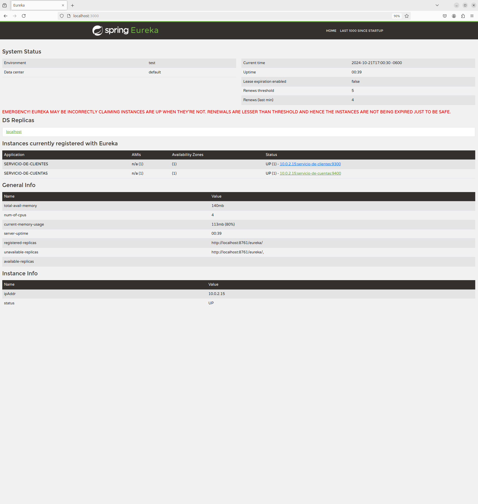
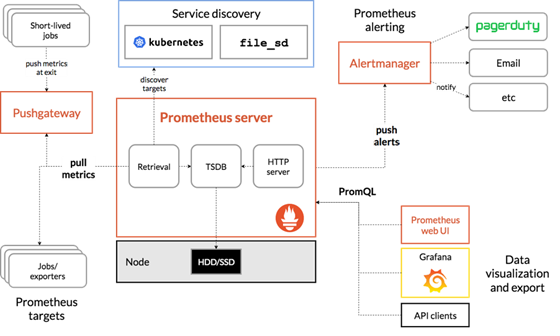
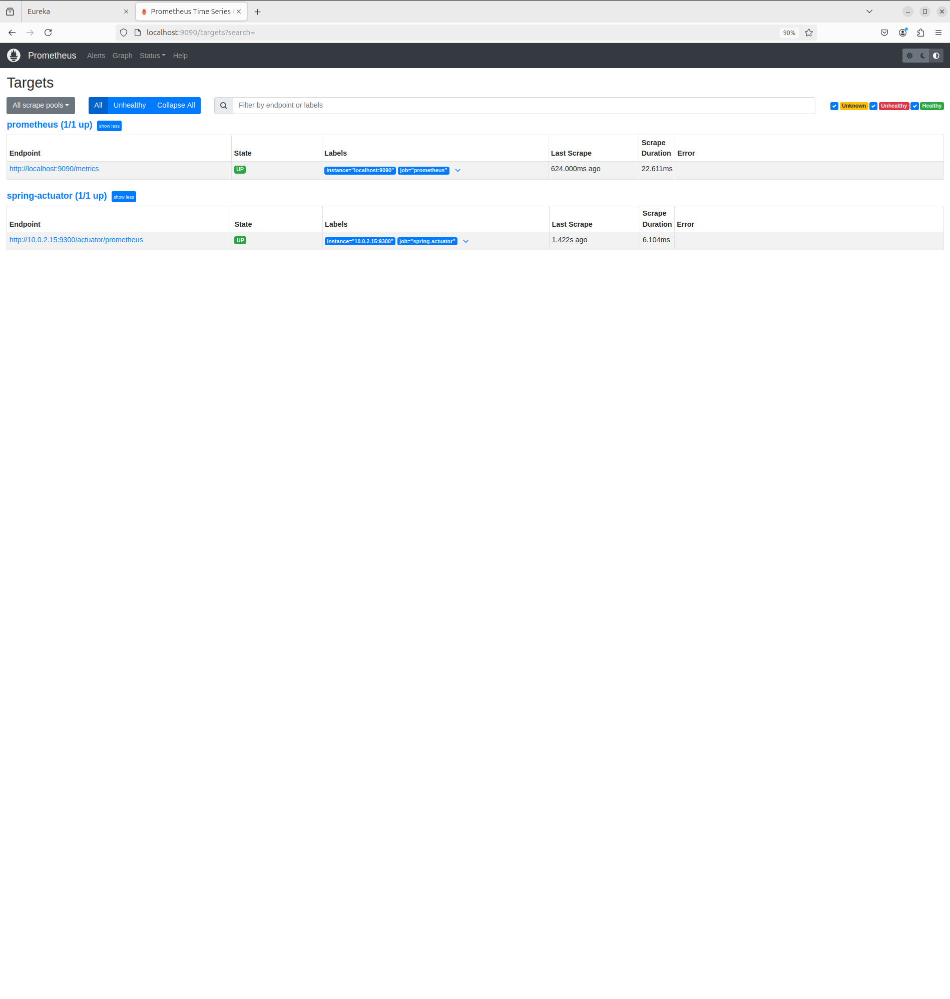
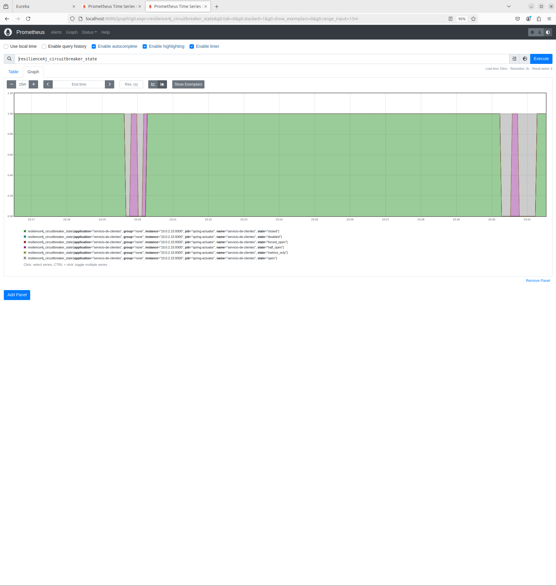
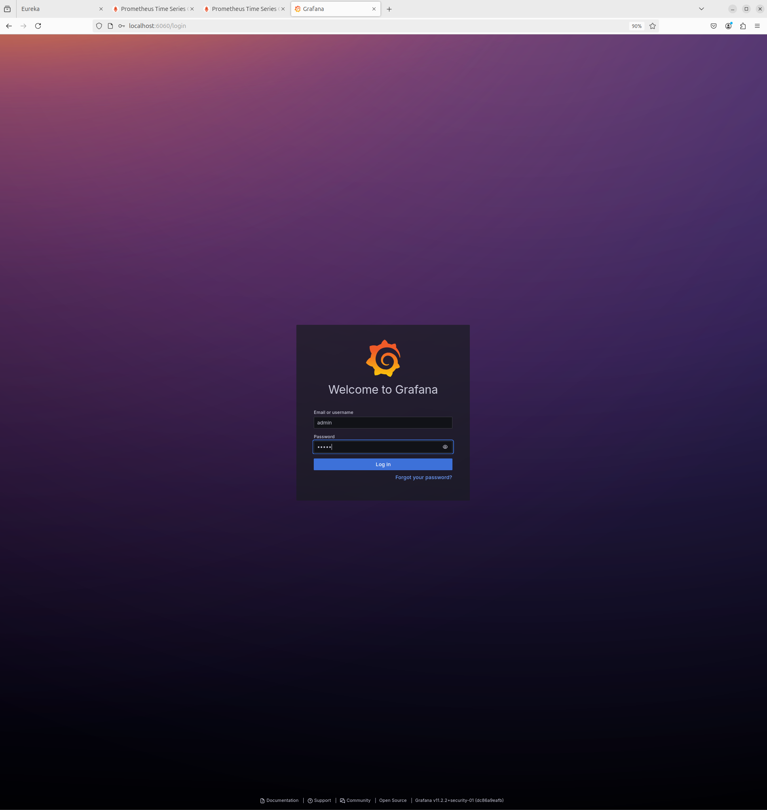
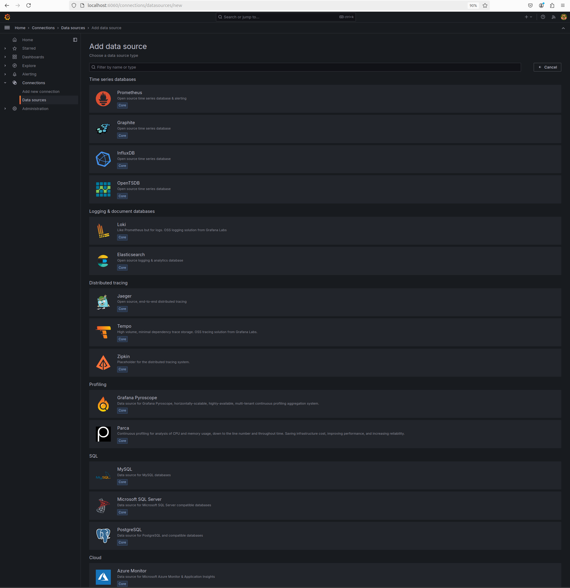
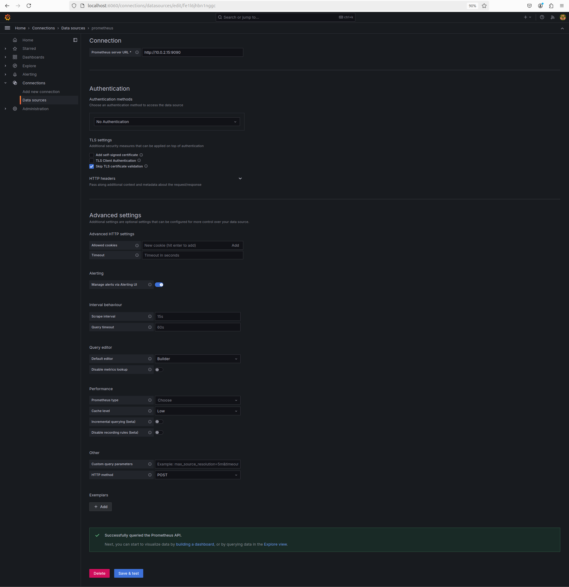

# SPRING CLOUD CIRCUIT BREAKER - VISUALIZACIÓN

Tiempo aproximado: _15 minutos_

## OBJETIVO

En esta actividad se ponen en marcha varios servicios, se configuran las herramientas Prometheus y Grafana para visualizar algunas métricas de los servicios.

### REPOSITORIO

Esta actividad requiere que el repositorio de trabajo este en:

- Rama: `labs/microservices-development`
  - Se recomienda siempre trabajar sobre una rama _feature_.
    - Por ejemplo: `git checkout -b labs/microservices-development_cazucito`
- Carpeta: `/home/usuario/Desktop/CF01141024/circuit-breaker`

## DESARROLLO

### PROYECTO: EUREKA SERVER

Para esta actividad se proporciona un servidor de descubrimiento (ubicado en `/home/usuario/Desktop/CF01141024/circuit-breaker/cbv-eureka`) que se debe construir y ejecutar.

Los pasos generales son los siguientes:

1. En una terminal de comandos construya el proyecto:
   1. `mvn clean package`
2. Ejecute el servidor de descubrimiento:
   1. `java -jar target/cbv-eureka-0.1.0-SNAPSHOT.jar`

### PROYECTO: SERVICIO DE CUENTAS

Para esta actividad se proporciona un servicio (ubicado en `/home/usuario/Desktop/CF01141024/circuit-breaker/cbv-cuentas`) que se debe construir y ejecutar.

Los pasos generales son los siguientes:

1. En una terminal de comandos construya el proyecto:
   1. `mvn clean package`
2. Ejecute la instancia del servicio:
   1. `java -jar target/cbv-cuentas-0.1.0-SNAPSHOT.jar`

### PROYECTO: SERVICIO DE CLIENTES

Para esta actividad se proporciona un servicio de clientes previamente creado (ubicado en `/home/usuario/Desktop/CF01141024/circuit-breaker/cbv-clientes`).

- Ábralo en el editor Spring Tool Suite.
- Analice con detenimiento todos los elementos que conforman el proyecto.
- Realice las siguientes modificaciones al proyecto.

#### DEPENDENCIAS

Asegúrese de que las siguientes dependencias se encuentran incluidas en el proyecto.

- De faltar alguna agréguela.

``` xml
		<dependency>
			<groupId>io.micrometer</groupId>
			<artifactId>micrometer-registry-prometheus</artifactId>
			<scope>runtime</scope>
		</dependency>
```

#### CONFIGURACIÓN: application.yml

Asegúrese de que las siguientes configuraciones se encuentran incluidas en el proyecto.

- De faltar alguna agréguela.

``` yaml
spring:
  application:
    name: servicio-de-clientes

server:
  port: ${PORT:9300}

eureka:
  client:
    service-url:
      defaultZone: ${EUREKA_URL:http://localhost:3000/eureka/}

management:
  health:
    circuitbreakers:
      enabled: true
  endpoint:
    shutdown:
      enabled: true
    health:
      show-details: always
  endpoints:
    web:
      exposure:
        include: "*"
  metrics:
    distribution:
      percentiles-histogram:
        http:
          server:
            request: true
        resilience4j:
          circuitbreaker:
            calls: true
    tags:
      application: servicio-de-clientes

resilience4j:
  circuitbreaker:
    configs:
      shared:
        register-health-indicator: true
        sliding-window-type: COUNT_BASED
        sliding-window-size: 5
        failure-rate-threshold: 40
        permitted-number-of-calls-in-half-open-state: 1
        max-wait-duration-in-half-open-state: 10s
        wait-duration-in-open-state: 10s
        slow-call-rate-threshold: 40
        writable-stack-trace-enabled: true
        automatic-transition-from-open-to-half-open-enabled: true

    instances:
      servicio-de-clientes:
        base-config: shared

---
# Para utilizar este perfil
# java -D"spring.profiles.active=nodo1" -jar target/cbv-clientes-0.1.0-SNAPSHOT.jar
spring:
  config:
    activate:
      on-profile: nodo1

eureka:
  instance:
    hostname: localhost
    metadataMap:
      zone: zona1
  client:
    serviceUrl:
      defaultZone: ${EUREKA_URL:http://localhost:3000/eureka/}

server:
  port: ${PORT:9301}

---
# Para utilizar este perfil
# java -D"spring.profiles.active=nodo2" -jar target/cbv-clientes-0.1.0-SNAPSHOT.jar
spring:
  config:
    activate:
      on-profile: nodo2

eureka:
  instance:
    hostname: localhost
    metadataMap:
      zone: zona2
  client:
    serviceUrl:
      defaultZone: ${EUREKA_URL:http://localhost:3000/eureka/}

server:
  port: ${PORT:9302}

---
# Para utilizar este perfil
# java -D"spring.profiles.active=nodo3" -jar target/cbv-clientes-0.1.0-SNAPSHOT.jar
spring:
  config:
    activate:
      on-profile: nodo3

eureka:
  instance:
    hostname: localhost
    metadataMap:
      zone: zona3
  client:
    serviceUrl:
      defaultZone: ${EUREKA_URL:http://localhost:3000/eureka/}

server:
  port: ${PORT:9303}

```

#### CONSTRUCCIÓN

Para construir el servicio ejecute el siguiente comando Maven en una terminal en la raíz del proyecto:

``` shell
mvn clean package
```

Debería ver un resultado similar al siguiente:

``` shell
[INFO] Scanning for projects...
[INFO] 
[INFO] -----------------< mx.com.fractalyst.pdv:cbv-clientes >-----------------
[INFO] Building cbv-clientes 0.1.0-SNAPSHOT
[INFO] --------------------------------[ jar ]---------------------------------
[INFO] 
[INFO] --- maven-clean-plugin:3.3.2:clean (default-clean) @ cbv-clientes ---
[INFO] Deleting /home/usuario/Desktop/CF01141024/cbv-clientes_sol/target
[INFO] 
[INFO] --- spring-boot-maven-plugin:3.3.4:build-info (default) @ cbv-clientes ---
[INFO] 
[INFO] --- maven-resources-plugin:3.3.1:resources (default-resources) @ cbv-clientes ---
[INFO] Copying 1 resource from src/main/resources to target/classes
[INFO] Copying 0 resource from src/main/resources to target/classes
[INFO] 
[INFO] --- maven-compiler-plugin:3.13.0:compile (default-compile) @ cbv-clientes ---
[INFO] Recompiling the module because of changed source code.
[INFO] Compiling 6 source files with javac [debug parameters release 17] to target/classes
[INFO] 
[INFO] --- maven-resources-plugin:3.3.1:testResources (default-testResources) @ cbv-clientes ---
[INFO] skip non existing resourceDirectory /home/usuario/Desktop/CF01141024/cbv-clientes_sol/src/test/resources
[INFO] 
[INFO] --- maven-compiler-plugin:3.13.0:testCompile (default-testCompile) @ cbv-clientes ---
[INFO] Recompiling the module because of changed dependency.
[INFO] Compiling 1 source file with javac [debug parameters release 17] to target/test-classes
[INFO] 
[INFO] --- maven-surefire-plugin:3.2.5:test (default-test) @ cbv-clientes ---
[INFO] Using auto detected provider org.apache.maven.surefire.junitplatform.JUnitPlatformProvider
[INFO] 
[INFO] -------------------------------------------------------
[INFO]  T E S T S
[INFO] -------------------------------------------------------
[INFO] Running mx.com.fractalyst.pdv.sc.CbvClientesApplicationTests
16:56:37.927 [main] INFO org.springframework.test.context.support.AnnotationConfigContextLoaderUtils -- Could not detect default configuration classes for test class [mx.com.fractalyst.pdv.sc.CbvClientesApplicationTests]: CbvClientesApplicationTests does not declare any static, non-private, non-final, nested classes annotated with @Configuration.
16:56:38.206 [main] INFO org.springframework.boot.test.context.SpringBootTestContextBootstrapper -- Found @SpringBootConfiguration mx.com.fractalyst.pdv.sc.CbvClientesApplication for test class mx.com.fractalyst.pdv.sc.CbvClientesApplicationTests

  .   ____          _            __ _ _
 /\\ / ___'_ __ _ _(_)_ __  __ _ \ \ \ \
( ( )\___ | '_ | '_| | '_ \/ _` | \ \ \ \
 \\/  ___)| |_)| | | | | || (_| |  ) ) ) )
  '  |____| .__|_| |_|_| |_\__, | / / / /
 =========|_|==============|___/=/_/_/_/

 :: Spring Boot ::                (v3.3.4)

2024-10-21T16:56:39.187-06:00  INFO 21317 --- [servicio-de-clientes] [           main] m.c.f.p.sc.CbvClientesApplicationTests   : Starting CbvClientesApplicationTests using Java 17.0.12 with PID 21317 (started by usuario in /home/usuario/Desktop/CF01141024/cbv-clientes_sol)
2024-10-21T16:56:39.188-06:00  INFO 21317 --- [servicio-de-clientes] [           main] m.c.f.p.sc.CbvClientesApplicationTests   : No active profile set, falling back to 1 default profile: "default"
2024-10-21T16:56:41.685-06:00  INFO 21317 --- [servicio-de-clientes] [           main] o.s.cloud.context.scope.GenericScope     : BeanFactory id=42a5c39c-625c-36f0-8240-275cbc006999
2024-10-21T16:56:42.085-06:00  WARN 21317 --- [servicio-de-clientes] [           main] trationDelegate$BeanPostProcessorChecker : Bean 'org.springframework.cloud.client.loadbalancer.LoadBalancerAutoConfiguration$DeferringLoadBalancerInterceptorConfig' of type [org.springframework.cloud.client.loadbalancer.LoadBalancerAutoConfiguration$DeferringLoadBalancerInterceptorConfig] is not eligible for getting processed by all BeanPostProcessors (for example: not eligible for auto-proxying). The currently created BeanPostProcessor [lbRestClientPostProcessor] is declared through a non-static factory method on that class; consider declaring it as static instead.
2024-10-21T16:56:42.136-06:00  WARN 21317 --- [servicio-de-clientes] [           main] trationDelegate$BeanPostProcessorChecker : Bean 'deferringLoadBalancerInterceptor' of type [org.springframework.cloud.client.loadbalancer.DeferringLoadBalancerInterceptor] is not eligible for getting processed by all BeanPostProcessors (for example: not eligible for auto-proxying). Is this bean getting eagerly injected into a currently created BeanPostProcessor [lbRestClientPostProcessor]? Check the corresponding BeanPostProcessor declaration and its dependencies.
2024-10-21T16:56:44.778-06:00  INFO 21317 --- [servicio-de-clientes] [           main] DiscoveryClientOptionalArgsConfiguration : Eureka HTTP Client uses RestTemplate.
2024-10-21T16:56:44.978-06:00  WARN 21317 --- [servicio-de-clientes] [           main] iguration$LoadBalancerCaffeineWarnLogger : Spring Cloud LoadBalancer is currently working with the default cache. While this cache implementation is useful for development and tests, it's recommended to use Caffeine cache in production.You can switch to using Caffeine cache, by adding it and org.springframework.cache.caffeine.CaffeineCacheManager to the classpath.
2024-10-21T16:56:44.990-06:00  INFO 21317 --- [servicio-de-clientes] [           main] o.s.b.a.e.web.EndpointLinksResolver      : Exposing 26 endpoints beneath base path '/actuator'
2024-10-21T16:56:45.054-06:00  INFO 21317 --- [servicio-de-clientes] [           main] o.s.c.n.eureka.InstanceInfoFactory       : Setting initial instance status as: STARTING
2024-10-21T16:56:45.077-06:00  INFO 21317 --- [servicio-de-clientes] [           main] com.netflix.discovery.DiscoveryClient    : Initializing Eureka in region us-east-1
2024-10-21T16:56:45.081-06:00  INFO 21317 --- [servicio-de-clientes] [           main] c.n.d.s.r.aws.ConfigClusterResolver      : Resolving eureka endpoints via configuration
2024-10-21T16:56:45.097-06:00  INFO 21317 --- [servicio-de-clientes] [           main] com.netflix.discovery.DiscoveryClient    : Disable delta property : false
2024-10-21T16:56:45.097-06:00  INFO 21317 --- [servicio-de-clientes] [           main] com.netflix.discovery.DiscoveryClient    : Single vip registry refresh property : null
2024-10-21T16:56:45.097-06:00  INFO 21317 --- [servicio-de-clientes] [           main] com.netflix.discovery.DiscoveryClient    : Force full registry fetch : false
2024-10-21T16:56:45.097-06:00  INFO 21317 --- [servicio-de-clientes] [           main] com.netflix.discovery.DiscoveryClient    : Application is null : false
2024-10-21T16:56:45.097-06:00  INFO 21317 --- [servicio-de-clientes] [           main] com.netflix.discovery.DiscoveryClient    : Registered Applications size is zero : true
2024-10-21T16:56:45.098-06:00  INFO 21317 --- [servicio-de-clientes] [           main] com.netflix.discovery.DiscoveryClient    : Application version is -1: true
2024-10-21T16:56:45.098-06:00  INFO 21317 --- [servicio-de-clientes] [           main] com.netflix.discovery.DiscoveryClient    : Getting all instance registry info from the eureka server
2024-10-21T16:56:45.696-06:00  INFO 21317 --- [servicio-de-clientes] [           main] com.netflix.discovery.DiscoveryClient    : The response status is 200
2024-10-21T16:56:45.699-06:00  INFO 21317 --- [servicio-de-clientes] [           main] com.netflix.discovery.DiscoveryClient    : Starting heartbeat executor: renew interval is: 30
2024-10-21T16:56:45.701-06:00  INFO 21317 --- [servicio-de-clientes] [           main] c.n.discovery.InstanceInfoReplicator     : InstanceInfoReplicator onDemand update allowed rate per min is 4
2024-10-21T16:56:45.704-06:00  INFO 21317 --- [servicio-de-clientes] [           main] com.netflix.discovery.DiscoveryClient    : Discovery Client initialized at timestamp 1729551405703 with initial instances count: 1
2024-10-21T16:56:45.718-06:00  INFO 21317 --- [servicio-de-clientes] [           main] o.s.c.n.e.s.EurekaServiceRegistry        : Registering application SERVICIO-DE-CLIENTES with eureka with status UP
2024-10-21T16:56:45.719-06:00  INFO 21317 --- [servicio-de-clientes] [           main] com.netflix.discovery.DiscoveryClient    : Saw local status change event StatusChangeEvent [timestamp=1729551405719, current=UP, previous=STARTING]
2024-10-21T16:56:45.721-06:00  INFO 21317 --- [servicio-de-clientes] [foReplicator-%d] com.netflix.discovery.DiscoveryClient    : DiscoveryClient_SERVICIO-DE-CLIENTES/10.0.2.15:servicio-de-clientes:9300: registering service...
2024-10-21T16:56:45.742-06:00  INFO 21317 --- [servicio-de-clientes] [           main] m.c.f.p.sc.CbvClientesApplicationTests   : Started CbvClientesApplicationTests in 7.202 seconds (process running for 9.25)
2024-10-21T16:56:45.767-06:00  INFO 21317 --- [servicio-de-clientes] [foReplicator-%d] com.netflix.discovery.DiscoveryClient    : DiscoveryClient_SERVICIO-DE-CLIENTES/10.0.2.15:servicio-de-clientes:9300 - registration status: 204
OpenJDK 64-Bit Server VM warning: Sharing is only supported for boot loader classes because bootstrap classpath has been appended
[INFO] Tests run: 1, Failures: 0, Errors: 0, Skipped: 0, Time elapsed: 9.454 s -- in mx.com.fractalyst.pdv.sc.CbvClientesApplicationTests
[INFO] 
[INFO] Results:
[INFO] 
[INFO] Tests run: 1, Failures: 0, Errors: 0, Skipped: 0
[INFO] 
[INFO] 
[INFO] --- maven-jar-plugin:3.4.2:jar (default-jar) @ cbv-clientes ---
[INFO] Building jar: /home/usuario/Desktop/CF01141024/cbv-clientes_sol/target/cbv-clientes-0.1.0-SNAPSHOT.jar
[INFO] 
[INFO] --- spring-boot-maven-plugin:3.3.4:repackage (repackage) @ cbv-clientes ---
[INFO] Replacing main artifact /home/usuario/Desktop/CF01141024/cbv-clientes_sol/target/cbv-clientes-0.1.0-SNAPSHOT.jar with repackaged archive, adding nested dependencies in BOOT-INF/.
[INFO] The original artifact has been renamed to /home/usuario/Desktop/CF01141024/cbv-clientes_sol/target/cbv-clientes-0.1.0-SNAPSHOT.jar.original
[INFO] ------------------------------------------------------------------------
[INFO] BUILD SUCCESS
[INFO] ------------------------------------------------------------------------
[INFO] Total time:  16.022 s
[INFO] Finished at: 2024-10-21T16:56:48-06:00
[INFO] ------------------------------------------------------------------------
```

#### EJECUCIÓN

Para ejecutar el servicio se puede lanzar el _jar_ ubicado en la carpeta `target` del proyecto con los tres perfiles como se muestra a continuación:

``` shell
java -jar target/cbv-clientes-0.1.0-SNAPSHOT.jar
```

Se debe ver un resultado similar al siguiente en todas las terminales:

```  shell

  .   ____          _            __ _ _
 /\\ / ___'_ __ _ _(_)_ __  __ _ \ \ \ \
( ( )\___ | '_ | '_| | '_ \/ _` | \ \ \ \
 \\/  ___)| |_)| | | | | || (_| |  ) ) ) )
  '  |____| .__|_| |_|_| |_\__, | / / / /
 =========|_|==============|___/=/_/_/_/

 :: Spring Boot ::                (v3.3.4)

2024-10-21T16:57:29.909-06:00  INFO 21423 --- [servicio-de-clientes] [           main] m.c.f.pdv.sc.CbvClientesApplication      : Starting CbvClientesApplication v0.1.0-SNAPSHOT using Java 17.0.12 with PID 21423 (/home/usuario/Desktop/CF01141024/cbv-clientes_sol/target/cbv-clientes-0.1.0-SNAPSHOT.jar started by usuario in /home/usuario/Desktop/CF01141024/cbv-clientes_sol)
2024-10-21T16:57:29.923-06:00  INFO 21423 --- [servicio-de-clientes] [           main] m.c.f.pdv.sc.CbvClientesApplication      : No active profile set, falling back to 1 default profile: "default"
2024-10-21T16:57:32.050-06:00  INFO 21423 --- [servicio-de-clientes] [           main] o.s.cloud.context.scope.GenericScope     : BeanFactory id=4ec5c90b-0563-39b5-b524-036a647d7bb6
2024-10-21T16:57:32.433-06:00  WARN 21423 --- [servicio-de-clientes] [           main] trationDelegate$BeanPostProcessorChecker : Bean 'org.springframework.cloud.client.loadbalancer.LoadBalancerAutoConfiguration$DeferringLoadBalancerInterceptorConfig' of type [org.springframework.cloud.client.loadbalancer.LoadBalancerAutoConfiguration$DeferringLoadBalancerInterceptorConfig] is not eligible for getting processed by all BeanPostProcessors (for example: not eligible for auto-proxying). The currently created BeanPostProcessor [lbRestClientPostProcessor] is declared through a non-static factory method on that class; consider declaring it as static instead.
2024-10-21T16:57:32.472-06:00  WARN 21423 --- [servicio-de-clientes] [           main] trationDelegate$BeanPostProcessorChecker : Bean 'deferringLoadBalancerInterceptor' of type [org.springframework.cloud.client.loadbalancer.DeferringLoadBalancerInterceptor] is not eligible for getting processed by all BeanPostProcessors (for example: not eligible for auto-proxying). Is this bean getting eagerly injected into a currently created BeanPostProcessor [lbRestClientPostProcessor]? Check the corresponding BeanPostProcessor declaration and its dependencies.
2024-10-21T16:57:32.955-06:00  INFO 21423 --- [servicio-de-clientes] [           main] o.s.b.w.embedded.tomcat.TomcatWebServer  : Tomcat initialized with port 9300 (http)
2024-10-21T16:57:32.976-06:00  INFO 21423 --- [servicio-de-clientes] [           main] o.apache.catalina.core.StandardService   : Starting service [Tomcat]
2024-10-21T16:57:32.977-06:00  INFO 21423 --- [servicio-de-clientes] [           main] o.apache.catalina.core.StandardEngine    : Starting Servlet engine: [Apache Tomcat/10.1.30]
2024-10-21T16:57:33.131-06:00  INFO 21423 --- [servicio-de-clientes] [           main] o.a.c.c.C.[Tomcat].[localhost].[/]       : Initializing Spring embedded WebApplicationContext
2024-10-21T16:57:33.133-06:00  INFO 21423 --- [servicio-de-clientes] [           main] w.s.c.ServletWebServerApplicationContext : Root WebApplicationContext: initialization completed in 3134 ms
2024-10-21T16:57:35.462-06:00  INFO 21423 --- [servicio-de-clientes] [           main] DiscoveryClientOptionalArgsConfiguration : Eureka HTTP Client uses RestTemplate.
2024-10-21T16:57:35.665-06:00  WARN 21423 --- [servicio-de-clientes] [           main] iguration$LoadBalancerCaffeineWarnLogger : Spring Cloud LoadBalancer is currently working with the default cache. While this cache implementation is useful for development and tests, it's recommended to use Caffeine cache in production.You can switch to using Caffeine cache, by adding it and org.springframework.cache.caffeine.CaffeineCacheManager to the classpath.
2024-10-21T16:57:35.692-06:00  INFO 21423 --- [servicio-de-clientes] [           main] o.s.b.a.e.web.EndpointLinksResolver      : Exposing 27 endpoints beneath base path '/actuator'
2024-10-21T16:57:35.785-06:00  INFO 21423 --- [servicio-de-clientes] [           main] o.s.c.n.eureka.InstanceInfoFactory       : Setting initial instance status as: STARTING
2024-10-21T16:57:35.845-06:00  INFO 21423 --- [servicio-de-clientes] [           main] com.netflix.discovery.DiscoveryClient    : Initializing Eureka in region us-east-1
2024-10-21T16:57:35.849-06:00  INFO 21423 --- [servicio-de-clientes] [           main] c.n.d.s.r.aws.ConfigClusterResolver      : Resolving eureka endpoints via configuration
2024-10-21T16:57:35.880-06:00  INFO 21423 --- [servicio-de-clientes] [           main] com.netflix.discovery.DiscoveryClient    : Disable delta property : false
2024-10-21T16:57:35.881-06:00  INFO 21423 --- [servicio-de-clientes] [           main] com.netflix.discovery.DiscoveryClient    : Single vip registry refresh property : null
2024-10-21T16:57:35.882-06:00  INFO 21423 --- [servicio-de-clientes] [           main] com.netflix.discovery.DiscoveryClient    : Force full registry fetch : false
2024-10-21T16:57:35.882-06:00  INFO 21423 --- [servicio-de-clientes] [           main] com.netflix.discovery.DiscoveryClient    : Application is null : false
2024-10-21T16:57:35.882-06:00  INFO 21423 --- [servicio-de-clientes] [           main] com.netflix.discovery.DiscoveryClient    : Registered Applications size is zero : true
2024-10-21T16:57:35.882-06:00  INFO 21423 --- [servicio-de-clientes] [           main] com.netflix.discovery.DiscoveryClient    : Application version is -1: true
2024-10-21T16:57:35.883-06:00  INFO 21423 --- [servicio-de-clientes] [           main] com.netflix.discovery.DiscoveryClient    : Getting all instance registry info from the eureka server
2024-10-21T16:57:36.618-06:00  INFO 21423 --- [servicio-de-clientes] [           main] com.netflix.discovery.DiscoveryClient    : The response status is 200
2024-10-21T16:57:36.631-06:00  INFO 21423 --- [servicio-de-clientes] [           main] com.netflix.discovery.DiscoveryClient    : Starting heartbeat executor: renew interval is: 30
2024-10-21T16:57:36.642-06:00  INFO 21423 --- [servicio-de-clientes] [           main] c.n.discovery.InstanceInfoReplicator     : InstanceInfoReplicator onDemand update allowed rate per min is 4
2024-10-21T16:57:36.648-06:00  INFO 21423 --- [servicio-de-clientes] [           main] com.netflix.discovery.DiscoveryClient    : Discovery Client initialized at timestamp 1729551456647 with initial instances count: 1
2024-10-21T16:57:36.704-06:00  INFO 21423 --- [servicio-de-clientes] [           main] o.s.c.n.e.s.EurekaServiceRegistry        : Registering application SERVICIO-DE-CLIENTES with eureka with status UP
2024-10-21T16:57:36.705-06:00  INFO 21423 --- [servicio-de-clientes] [           main] com.netflix.discovery.DiscoveryClient    : Saw local status change event StatusChangeEvent [timestamp=1729551456705, current=UP, previous=STARTING]
2024-10-21T16:57:36.714-06:00  INFO 21423 --- [servicio-de-clientes] [foReplicator-%d] com.netflix.discovery.DiscoveryClient    : DiscoveryClient_SERVICIO-DE-CLIENTES/10.0.2.15:servicio-de-clientes:9300: registering service...
2024-10-21T16:57:36.775-06:00  INFO 21423 --- [servicio-de-clientes] [           main] o.s.b.w.embedded.tomcat.TomcatWebServer  : Tomcat started on port 9300 (http) with context path '/'
2024-10-21T16:57:36.776-06:00  INFO 21423 --- [servicio-de-clientes] [           main] .s.c.n.e.s.EurekaAutoServiceRegistration : Updating port to 9300
2024-10-21T16:57:36.861-06:00  INFO 21423 --- [servicio-de-clientes] [foReplicator-%d] com.netflix.discovery.DiscoveryClient    : DiscoveryClient_SERVICIO-DE-CLIENTES/10.0.2.15:servicio-de-clientes:9300 - registration status: 204
2024-10-21T16:57:36.957-06:00  INFO 21423 --- [servicio-de-clientes] [           main] m.c.f.pdv.sc.CbvClientesApplication      : Started CbvClientesApplication in 7.754 seconds (process running for 8.55)
```

La terminal de comandos se bloquea por lo que las siguientes acciones deben ser realizadas en otra terminal y de requerir detener el servidor debe ejecutar `Ctrl+C` en la terminal en la que se haya iniciado.

#### OBTENER ESTADO

Para validar que el servicio se encuentra funcionando se puede llamar al _endpoint_ publicado en `/actuator/health` como se muestra a continuación:

``` shell
curl http://localhost:9300/actuator/health
```

La salida debe ser similar a:

``` json
{
    "status": "UP",
    "components": {
        "circuitBreakers": {
            "status": "UP",
            "details": {
                "servicio-de-clientes": {
                    "status": "UP",
                    "details": {
                        "failureRate": "-1.0%",
                        "failureRateThreshold": "40.0%",
                        "slowCallRate": "-1.0%",
                        "slowCallRateThreshold": "40.0%",
                        "bufferedCalls": 0,
                        "slowCalls": 0,
                        "slowFailedCalls": 0,
                        "failedCalls": 0,
                        "notPermittedCalls": 0,
                        "state": "CLOSED"
                    }
                }
            }
        },
        "discoveryComposite": {
            "status": "UP",
            "components": {
                "discoveryClient": {
                    "status": "UP",
                    "details": {
                        "services": [
                            "servicio-de-cuentas",
                            "servicio-de-clientes"
                        ]
                    }
                },
                "eureka": {
                    "description": "Remote status from Eureka server",
                    "status": "UP",
                    "details": {
                        "applications": {
                            "SERVICIO-DE-CLIENTES": 1,
                            "SERVICIO-DE-CUENTAS": 1
                        }
                    }
                }
            }
        },
        "diskSpace": {
            "status": "UP",
            "details": {
                "total": 52518420480,
                "free": 14379708416,
                "threshold": 10485760,
                "path": "/home/usuario/Desktop/CF01141024/cbv-clientes_sol/.",
                "exists": true
            }
        },
        "ping": {
            "status": "UP"
        },
        "refreshScope": {
            "status": "UP"
        }
    }
}
```

Además, puede llamar al endpoint `/actuator/info` para obtener información del servicio:

``` shell
curl http://localhost:9300/actuator/info
```

La salida debe ser similar a:

``` json
{
    "build": {
        "artifact": "cbv-clientes",
        "name": "cbv-clientes",
        "time": "2024-10-21T19:45:43.571Z",
        "version": "0.1.0-SNAPSHOT",
        "group": "mx.com.fractalyst.pdv"
    }
}
```

Con lo anterior podemos estar seguros de que está operativo.

#### EUREKA DASHBOARD

El servidor de descubrimiento Eureka brinda un dashboard que puede ser accesible mediante un cliente web, en el cual podemos observar que están registradas las instancias del `servicio-de-clientes`, y el `servicio-de-cuentas` como se muestra en la siguiente imagen.

Visite el _dashboard_ ingresando las siguientes URLs en un navegador web:

1. <http://localhost:3000/>



Adicionalmente si da clic en la columna `Status` en la sección de `Instances currently registered with Eureka` se obtiene la información del _endpoint_ `actuator/info` de cada servicio.

### OBSERVABILIDAD

En la arquitectura de microservicios la _observabilidad_ (que abarca la supervisión, el registro, el seguimiento y las alertas) es una característica relevante debido a que los sistemas distribuidos generan fallas distribuidas.

La _observabilidad_ revela los errores en etapas tempranas, mantiene atento al equipo y reduce el tiempo medio de resolución (Mean Time To Resolution).

Aunque existe una gran cantidad de técnicas y herramientas que aportan al tema, en esta sección se presentan dos: **Prometheus** y **Grafana**.

#### PROMETHEUS

**Prometheus**, un proyecto de **Cloud Native Computing Foundation**, es un sistema de monitoreo de sistemas y servicios. Recopila métricas de objetivos configurados en intervalos determinados, evalúa expresiones de reglas, muestra los resultados y puede activar alertas cuando se observan condiciones específicas.



##### INSTALACIÓN

La manera más sencilla de ejecutar Prometheus es a través de una imagen _Docker_:

``` shell
docker pull prom/prometheus
```

La salida será semejante a:

``` shell
Using default tag: latest
latest: Pulling from prom/prometheus
9fa9226be034: Pull complete 
1617e25568b2: Pull complete 
02203e3d6934: Pull complete 
8be4b7271108: Pull complete 
8becc689631f: Pull complete 
ceaeea15c1bf: Pull complete 
564720d6ed13: Pull complete 
1fd5d47e09da: Pull complete 
1afe4a0d7329: Pull complete 
bd55ccfa5aad: Pull complete 
54f884861fc1: Pull complete 
b09316e948c6: Pull complete 
Digest: sha256:f6639335d34a77d9d9db382b92eeb7fc00934be8eae81dbc03b31cfe90411a94
Status: Downloaded newer image for prom/prometheus:latest
docker.io/prom/prometheus:latest
```

##### CONFIGURACIÓN

Para configurar a la herramienta se debe iniciar un contenedor y editar su archivo de configuración.

###### INICIAR EL CONTENEDOR

``` shell
docker run --detach --publish 9090:9090 --name prometheus prom/prometheus
```

La salida será semejante a:

``` shell
942fce08ce1d9ab7519258ae457ab9a3815985f127f306fd8134209b0c2c3efc
```

Puede mostrar los contenedores en ejecución con el comando:

``` shell
docker container ls
```

La salida debe ser similar a:

``` shell
CONTAINER ID   IMAGE             COMMAND                  CREATED          STATUS          PORTS                                       NAMES
942fce08ce1d   prom/prometheus   "/bin/prometheus --c…"   17 seconds ago   Up 16 seconds   0.0.0.0:9090->9090/tcp, :::9090->9090/tcp   prometheus
```

###### ARCHIVO DE CONFIGURACIÓN

Cree el archivo `prometheus.yml` con el siguiente contenido:

``` shell
global:
    scrape_interval:     15s

scrape_configs:
  - job_name: 'prometheus'
    scrape_interval: 5s

    static_configs:
      - targets: ['localhost:9090']

  - job_name: 'spring-actuator'
    metrics_path: '/actuator/prometheus'
    scrape_interval: 5s
    static_configs:
      - targets: ['10.0.2.15:9300']
```

Para subir el archivo prometheus.yml al contenedor ejecute lo siguiente:

``` shell
docker cp prometheus.yml prometheus:/etc/prometheus/
```

Ahora se debe reiniciar el contenedor:

``` shell
docker restart prometheus
```

La salida debe ser similar a:

``` shell
prometheus
```

Para validar que el contenedor ha sido reiniciado ejecute el siguiente comando:

``` shell
docker container ls
```

La salida debe ser similar a:

``` shell
CONTAINER ID   IMAGE             COMMAND                  CREATED         STATUS          PORTS                                       NAMES
942fce08ce1d   prom/prometheus   "/bin/prometheus --c…"   5 minutes ago   Up 10 seconds   0.0.0.0:9090->9090/tcp, :::9090->9090/tcp   prometheus
```

##### DATOS

Para generar datos respecto a la funcionalidad del _Circuit Breaker_ ejecute los siguientes comandos:

``` shell
curl http://localhost:9300/clientes/conCuentas/1
curl http://localhost:9300/clientes/conCuentas/1
curl -X POST http://localhost:9400/actuator/shutdown
curl http://localhost:9300/clientes/conCuentas/1
curl http://localhost:9300/clientes/conCuentas/1
```

Reinicie el `servicio-de-cuentas` (ubicado en `/home/usuario/Desktop/CF01141024/cbv-cuentas`):

``` shell
java -jar target/cbv-cuentas-0.1.0-SNAPSHOT.jar
```

Ahora ejecute los siguientes consumos:

``` shell
curl http://localhost:9300/clientes/conCuentas/1
curl http://localhost:9300/clientes/conCuentas/1
```

Y por último **después de esperar unos momentos** ejecute los siguientes consumos:

``` shell
curl http://localhost:9300/clientes/conCuentas/1
curl http://localhost:9300/clientes/conCuentas/1
```

##### ENDPOINT PROMETHEUS

Con la configuración añadida en esta actividad el servicio de clientes expone información sobre métricas mediante el actuator en el endpoint: `/actuator/prometheus`.

Consúltelo con:

``` shell
curl http://localhost:9300/actuator/prometheus
```

La salida debe ser similar a:

``` prometheus
# HELP application_ready_time_seconds Time taken for the application to be ready to service requests
# TYPE application_ready_time_seconds gauge
application_ready_time_seconds{application="servicio-de-clientes",main_application_class="mx.com.fractalyst.pdv.sc.CbvClientesApplication"} 7.864
# HELP application_started_time_seconds Time taken to start the application
# TYPE application_started_time_seconds gauge
application_started_time_seconds{application="servicio-de-clientes",main_application_class="mx.com.fractalyst.pdv.sc.CbvClientesApplication"} 7.754
# HELP disk_free_bytes Usable space for path
# TYPE disk_free_bytes gauge
disk_free_bytes{application="servicio-de-clientes",path="/home/usuario/Desktop/CF01141024/cbv-clientes_sol/."} 1.4101102592E10
# HELP disk_total_bytes Total space for path
# TYPE disk_total_bytes gauge
disk_total_bytes{application="servicio-de-clientes",path="/home/usuario/Desktop/CF01141024/cbv-clientes_sol/."} 5.251842048E10
# HELP executor_active_threads The approximate number of threads that are actively executing tasks
# TYPE executor_active_threads gauge
executor_active_threads{application="servicio-de-clientes",name="applicationTaskExecutor"} 0.0
# HELP executor_completed_tasks_total The approximate total number of tasks that have completed execution
# TYPE executor_completed_tasks_total counter
executor_completed_tasks_total{application="servicio-de-clientes",name="applicationTaskExecutor"} 0.0
# HELP executor_pool_core_threads The core number of threads for the pool
# TYPE executor_pool_core_threads gauge
executor_pool_core_threads{application="servicio-de-clientes",name="applicationTaskExecutor"} 8.0
# HELP executor_pool_max_threads The maximum allowed number of threads in the pool
# TYPE executor_pool_max_threads gauge
executor_pool_max_threads{application="servicio-de-clientes",name="applicationTaskExecutor"} 2.147483647E9
# HELP executor_pool_size_threads The current number of threads in the pool
# TYPE executor_pool_size_threads gauge
executor_pool_size_threads{application="servicio-de-clientes",name="applicationTaskExecutor"} 0.0
# HELP executor_queue_remaining_tasks The number of additional elements that this queue can ideally accept without blocking
# TYPE executor_queue_remaining_tasks gauge
executor_queue_remaining_tasks{application="servicio-de-clientes",name="applicationTaskExecutor"} 2.147483647E9
# HELP executor_queued_tasks The approximate number of tasks that are queued for execution
# TYPE executor_queued_tasks gauge
executor_queued_tasks{application="servicio-de-clientes",name="applicationTaskExecutor"} 0.0
# HELP http_client_requests_active_seconds  
# TYPE http_client_requests_active_seconds summary
http_client_requests_active_seconds_count{application="servicio-de-clientes",client_name="localhost",exception="none",method="GET",outcome="UNKNOWN",status="CLIENT_ERROR",uri="/eureka/apps/"} 0
http_client_requests_active_seconds_sum{application="servicio-de-clientes",client_name="localhost",exception="none",method="GET",outcome="UNKNOWN",status="CLIENT_ERROR",uri="/eureka/apps/"} 0.0
http_client_requests_active_seconds_count{application="servicio-de-clientes",client_name="localhost",exception="none",method="GET",outcome="UNKNOWN",status="CLIENT_ERROR",uri="/eureka/apps/delta"} 0
http_client_requests_active_seconds_sum{application="servicio-de-clientes",client_name="localhost",exception="none",method="GET",outcome="UNKNOWN",status="CLIENT_ERROR",uri="/eureka/apps/delta"} 0.0
http_client_requests_active_seconds_count{application="servicio-de-clientes",client_name="localhost",exception="none",method="POST",outcome="UNKNOWN",status="CLIENT_ERROR",uri="/eureka/apps/SERVICIO-DE-CLIENTES"} 0
http_client_requests_active_seconds_sum{application="servicio-de-clientes",client_name="localhost",exception="none",method="POST",outcome="UNKNOWN",status="CLIENT_ERROR",uri="/eureka/apps/SERVICIO-DE-CLIENTES"} 0.0
http_client_requests_active_seconds_count{application="servicio-de-clientes",client_name="localhost",exception="none",method="PUT",outcome="UNKNOWN",status="CLIENT_ERROR",uri="/eureka/apps/SERVICIO-DE-CLIENTES/10.0.2.15:servicio-de-clientes:9300?status=UP&lastDirtyTimestamp=1729551456704"} 0
http_client_requests_active_seconds_sum{application="servicio-de-clientes",client_name="localhost",exception="none",method="PUT",outcome="UNKNOWN",status="CLIENT_ERROR",uri="/eureka/apps/SERVICIO-DE-CLIENTES/10.0.2.15:servicio-de-clientes:9300?status=UP&lastDirtyTimestamp=1729551456704"} 0.0
# HELP http_client_requests_active_seconds_max  
# TYPE http_client_requests_active_seconds_max gauge
http_client_requests_active_seconds_max{application="servicio-de-clientes",client_name="localhost",exception="none",method="GET",outcome="UNKNOWN",status="CLIENT_ERROR",uri="/eureka/apps/"} 0.0
http_client_requests_active_seconds_max{application="servicio-de-clientes",client_name="localhost",exception="none",method="GET",outcome="UNKNOWN",status="CLIENT_ERROR",uri="/eureka/apps/delta"} 0.0
http_client_requests_active_seconds_max{application="servicio-de-clientes",client_name="localhost",exception="none",method="POST",outcome="UNKNOWN",status="CLIENT_ERROR",uri="/eureka/apps/SERVICIO-DE-CLIENTES"} 0.0
http_client_requests_active_seconds_max{application="servicio-de-clientes",client_name="localhost",exception="none",method="PUT",outcome="UNKNOWN",status="CLIENT_ERROR",uri="/eureka/apps/SERVICIO-DE-CLIENTES/10.0.2.15:servicio-de-clientes:9300?status=UP&lastDirtyTimestamp=1729551456704"} 0.0
# HELP http_client_requests_seconds  
# TYPE http_client_requests_seconds summary
http_client_requests_seconds_count{application="servicio-de-clientes",client_name="localhost",error="none",exception="none",method="GET",outcome="SUCCESS",status="200",uri="/eureka/apps/"} 1
http_client_requests_seconds_sum{application="servicio-de-clientes",client_name="localhost",error="none",exception="none",method="GET",outcome="SUCCESS",status="200",uri="/eureka/apps/"} 0.369162408
http_client_requests_seconds_count{application="servicio-de-clientes",client_name="localhost",error="none",exception="none",method="GET",outcome="SUCCESS",status="200",uri="/eureka/apps/delta"} 47
http_client_requests_seconds_sum{application="servicio-de-clientes",client_name="localhost",error="none",exception="none",method="GET",outcome="SUCCESS",status="200",uri="/eureka/apps/delta"} 0.390454222
http_client_requests_seconds_count{application="servicio-de-clientes",client_name="localhost",error="none",exception="none",method="POST",outcome="SUCCESS",status="204",uri="/eureka/apps/SERVICIO-DE-CLIENTES"} 1
http_client_requests_seconds_sum{application="servicio-de-clientes",client_name="localhost",error="none",exception="none",method="POST",outcome="SUCCESS",status="204",uri="/eureka/apps/SERVICIO-DE-CLIENTES"} 0.135326465
http_client_requests_seconds_count{application="servicio-de-clientes",client_name="localhost",error="none",exception="none",method="PUT",outcome="SUCCESS",status="200",uri="/eureka/apps/SERVICIO-DE-CLIENTES/10.0.2.15:servicio-de-clientes:9300?status=UP&lastDirtyTimestamp=1729551456704"} 47
http_client_requests_seconds_sum{application="servicio-de-clientes",client_name="localhost",error="none",exception="none",method="PUT",outcome="SUCCESS",status="200",uri="/eureka/apps/SERVICIO-DE-CLIENTES/10.0.2.15:servicio-de-clientes:9300?status=UP&lastDirtyTimestamp=1729551456704"} 0.367697294
# HELP http_client_requests_seconds_max  
# TYPE http_client_requests_seconds_max gauge
http_client_requests_seconds_max{application="servicio-de-clientes",client_name="localhost",error="none",exception="none",method="GET",outcome="SUCCESS",status="200",uri="/eureka/apps/"} 0.0
http_client_requests_seconds_max{application="servicio-de-clientes",client_name="localhost",error="none",exception="none",method="GET",outcome="SUCCESS",status="200",uri="/eureka/apps/delta"} 0.012310601
http_client_requests_seconds_max{application="servicio-de-clientes",client_name="localhost",error="none",exception="none",method="POST",outcome="SUCCESS",status="204",uri="/eureka/apps/SERVICIO-DE-CLIENTES"} 0.0
http_client_requests_seconds_max{application="servicio-de-clientes",client_name="localhost",error="none",exception="none",method="PUT",outcome="SUCCESS",status="200",uri="/eureka/apps/SERVICIO-DE-CLIENTES/10.0.2.15:servicio-de-clientes:9300?status=UP&lastDirtyTimestamp=1729551456704"} 0.00589808
# HELP http_server_requests_active_seconds  
# TYPE http_server_requests_active_seconds summary
http_server_requests_active_seconds_count{application="servicio-de-clientes",exception="none",method="GET",outcome="SUCCESS",status="200",uri="UNKNOWN"} 1
http_server_requests_active_seconds_sum{application="servicio-de-clientes",exception="none",method="GET",outcome="SUCCESS",status="200",uri="UNKNOWN"} 0.029989659
# HELP http_server_requests_active_seconds_max  
# TYPE http_server_requests_active_seconds_max gauge
http_server_requests_active_seconds_max{application="servicio-de-clientes",exception="none",method="GET",outcome="SUCCESS",status="200",uri="UNKNOWN"} 0.029995583
# HELP http_server_requests_seconds  
# TYPE http_server_requests_seconds summary
http_server_requests_seconds_count{application="servicio-de-clientes",error="none",exception="none",method="GET",outcome="SUCCESS",status="200",uri="/actuator/health"} 1
http_server_requests_seconds_sum{application="servicio-de-clientes",error="none",exception="none",method="GET",outcome="SUCCESS",status="200",uri="/actuator/health"} 0.488003526
http_server_requests_seconds_count{application="servicio-de-clientes",error="none",exception="none",method="GET",outcome="SUCCESS",status="200",uri="/actuator/info"} 1
http_server_requests_seconds_sum{application="servicio-de-clientes",error="none",exception="none",method="GET",outcome="SUCCESS",status="200",uri="/actuator/info"} 0.067479375
http_server_requests_seconds_count{application="servicio-de-clientes",error="none",exception="none",method="GET",outcome="SUCCESS",status="200",uri="/actuator/prometheus"} 67
http_server_requests_seconds_sum{application="servicio-de-clientes",error="none",exception="none",method="GET",outcome="SUCCESS",status="200",uri="/actuator/prometheus"} 0.931248059
http_server_requests_seconds_count{application="servicio-de-clientes",error="none",exception="none",method="GET",outcome="SUCCESS",status="200",uri="/clientes/conCuentas/{id}"} 8
http_server_requests_seconds_sum{application="servicio-de-clientes",error="none",exception="none",method="GET",outcome="SUCCESS",status="200",uri="/clientes/conCuentas/{id}"} 2.216299535
# HELP http_server_requests_seconds_max  
# TYPE http_server_requests_seconds_max gauge
http_server_requests_seconds_max{application="servicio-de-clientes",error="none",exception="none",method="GET",outcome="SUCCESS",status="200",uri="/actuator/health"} 0.0
http_server_requests_seconds_max{application="servicio-de-clientes",error="none",exception="none",method="GET",outcome="SUCCESS",status="200",uri="/actuator/info"} 0.0
http_server_requests_seconds_max{application="servicio-de-clientes",error="none",exception="none",method="GET",outcome="SUCCESS",status="200",uri="/actuator/prometheus"} 0.11098034
http_server_requests_seconds_max{application="servicio-de-clientes",error="none",exception="none",method="GET",outcome="SUCCESS",status="200",uri="/clientes/conCuentas/{id}"} 1.343649566
# HELP jvm_info JVM version info
# TYPE jvm_info gauge
jvm_info{application="servicio-de-clientes",runtime="OpenJDK Runtime Environment",vendor="Ubuntu",version="17.0.12+7-Ubuntu-1ubuntu224.04"} 1
# HELP jvm_buffer_count_buffers An estimate of the number of buffers in the pool
# TYPE jvm_buffer_count_buffers gauge
jvm_buffer_count_buffers{application="servicio-de-clientes",id="direct"} 14.0
jvm_buffer_count_buffers{application="servicio-de-clientes",id="mapped"} 0.0
jvm_buffer_count_buffers{application="servicio-de-clientes",id="mapped - 'non-volatile memory'"} 0.0
# HELP jvm_buffer_memory_used_bytes An estimate of the memory that the Java virtual machine is using for this buffer pool
# TYPE jvm_buffer_memory_used_bytes gauge
jvm_buffer_memory_used_bytes{application="servicio-de-clientes",id="direct"} 116736.0
jvm_buffer_memory_used_bytes{application="servicio-de-clientes",id="mapped"} 0.0
jvm_buffer_memory_used_bytes{application="servicio-de-clientes",id="mapped - 'non-volatile memory'"} 0.0
# HELP jvm_buffer_total_capacity_bytes An estimate of the total capacity of the buffers in this pool
# TYPE jvm_buffer_total_capacity_bytes gauge
jvm_buffer_total_capacity_bytes{application="servicio-de-clientes",id="direct"} 116736.0
jvm_buffer_total_capacity_bytes{application="servicio-de-clientes",id="mapped"} 0.0
jvm_buffer_total_capacity_bytes{application="servicio-de-clientes",id="mapped - 'non-volatile memory'"} 0.0
# HELP jvm_classes_loaded_classes The number of classes that are currently loaded in the Java virtual machine
# TYPE jvm_classes_loaded_classes gauge
jvm_classes_loaded_classes{application="servicio-de-clientes"} 11735.0
# HELP jvm_classes_unloaded_classes_total The total number of classes unloaded since the Java virtual machine has started execution
# TYPE jvm_classes_unloaded_classes_total counter
jvm_classes_unloaded_classes_total{application="servicio-de-clientes"} 0.0
# HELP jvm_compilation_time_ms_total The approximate accumulated elapsed time spent in compilation
# TYPE jvm_compilation_time_ms_total counter
jvm_compilation_time_ms_total{application="servicio-de-clientes",compiler="HotSpot 64-Bit Tiered Compilers"} 22447.0
# HELP jvm_gc_live_data_size_bytes Size of long-lived heap memory pool after reclamation
# TYPE jvm_gc_live_data_size_bytes gauge
jvm_gc_live_data_size_bytes{application="servicio-de-clientes"} 0.0
# HELP jvm_gc_max_data_size_bytes Max size of long-lived heap memory pool
# TYPE jvm_gc_max_data_size_bytes gauge
jvm_gc_max_data_size_bytes{application="servicio-de-clientes"} 3.137339392E9
# HELP jvm_gc_memory_allocated_bytes_total Incremented for an increase in the size of the (young) heap memory pool after one GC to before the next
# TYPE jvm_gc_memory_allocated_bytes_total counter
jvm_gc_memory_allocated_bytes_total{application="servicio-de-clientes"} 2.28589568E8
# HELP jvm_gc_memory_promoted_bytes_total Count of positive increases in the size of the old generation memory pool before GC to after GC
# TYPE jvm_gc_memory_promoted_bytes_total counter
jvm_gc_memory_promoted_bytes_total{application="servicio-de-clientes"} 1356288.0
# HELP jvm_gc_overhead An approximation of the percent of CPU time used by GC activities over the last lookback period or since monitoring began, whichever is shorter, in the range [0..1]
# TYPE jvm_gc_overhead gauge
jvm_gc_overhead{application="servicio-de-clientes"} 5.333333333333333E-5
# HELP jvm_gc_pause_seconds Time spent in GC pause
# TYPE jvm_gc_pause_seconds summary
jvm_gc_pause_seconds_count{action="end of minor GC",application="servicio-de-clientes",cause="G1 Evacuation Pause",gc="G1 Young Generation"} 2
jvm_gc_pause_seconds_sum{action="end of minor GC",application="servicio-de-clientes",cause="G1 Evacuation Pause",gc="G1 Young Generation"} 0.092
# HELP jvm_gc_pause_seconds_max Time spent in GC pause
# TYPE jvm_gc_pause_seconds_max gauge
jvm_gc_pause_seconds_max{action="end of minor GC",application="servicio-de-clientes",cause="G1 Evacuation Pause",gc="G1 Young Generation"} 0.0
# HELP jvm_memory_committed_bytes The amount of memory in bytes that is committed for the Java virtual machine to use
# TYPE jvm_memory_committed_bytes gauge
jvm_memory_committed_bytes{application="servicio-de-clientes",area="heap",id="G1 Eden Space"} 1.59383552E8
jvm_memory_committed_bytes{application="servicio-de-clientes",area="heap",id="G1 Old Gen"} 1.00663296E8
jvm_memory_committed_bytes{application="servicio-de-clientes",area="heap",id="G1 Survivor Space"} 1.2582912E7
jvm_memory_committed_bytes{application="servicio-de-clientes",area="nonheap",id="CodeHeap 'non-nmethods'"} 2555904.0
jvm_memory_committed_bytes{application="servicio-de-clientes",area="nonheap",id="CodeHeap 'non-profiled nmethods'"} 5439488.0
jvm_memory_committed_bytes{application="servicio-de-clientes",area="nonheap",id="CodeHeap 'profiled nmethods'"} 1.4352384E7
jvm_memory_committed_bytes{application="servicio-de-clientes",area="nonheap",id="Compressed Class Space"} 7405568.0
jvm_memory_committed_bytes{application="servicio-de-clientes",area="nonheap",id="Metaspace"} 5.6098816E7
# HELP jvm_memory_max_bytes The maximum amount of memory in bytes that can be used for memory management
# TYPE jvm_memory_max_bytes gauge
jvm_memory_max_bytes{application="servicio-de-clientes",area="heap",id="G1 Eden Space"} -1.0
jvm_memory_max_bytes{application="servicio-de-clientes",area="heap",id="G1 Old Gen"} 3.137339392E9
jvm_memory_max_bytes{application="servicio-de-clientes",area="heap",id="G1 Survivor Space"} -1.0
jvm_memory_max_bytes{application="servicio-de-clientes",area="nonheap",id="CodeHeap 'non-nmethods'"} 5836800.0
jvm_memory_max_bytes{application="servicio-de-clientes",area="nonheap",id="CodeHeap 'non-profiled nmethods'"} 1.22912768E8
jvm_memory_max_bytes{application="servicio-de-clientes",area="nonheap",id="CodeHeap 'profiled nmethods'"} 1.22908672E8
jvm_memory_max_bytes{application="servicio-de-clientes",area="nonheap",id="Compressed Class Space"} 1.073741824E9
jvm_memory_max_bytes{application="servicio-de-clientes",area="nonheap",id="Metaspace"} -1.0
# HELP jvm_memory_usage_after_gc The percentage of long-lived heap pool used after the last GC event, in the range [0..1]
# TYPE jvm_memory_usage_after_gc gauge
jvm_memory_usage_after_gc{application="servicio-de-clientes",area="heap",pool="long-lived"} 0.008310083399481952
# HELP jvm_memory_used_bytes The amount of used memory
# TYPE jvm_memory_used_bytes gauge
jvm_memory_used_bytes{application="servicio-de-clientes",area="heap",id="G1 Eden Space"} 1.38412032E8
jvm_memory_used_bytes{application="servicio-de-clientes",area="heap",id="G1 Old Gen"} 2.6071552E7
jvm_memory_used_bytes{application="servicio-de-clientes",area="heap",id="G1 Survivor Space"} 1.0845832E7
jvm_memory_used_bytes{application="servicio-de-clientes",area="nonheap",id="CodeHeap 'non-nmethods'"} 1327232.0
jvm_memory_used_bytes{application="servicio-de-clientes",area="nonheap",id="CodeHeap 'non-profiled nmethods'"} 5389312.0
jvm_memory_used_bytes{application="servicio-de-clientes",area="nonheap",id="CodeHeap 'profiled nmethods'"} 1.4349824E7
jvm_memory_used_bytes{application="servicio-de-clientes",area="nonheap",id="Compressed Class Space"} 7187920.0
jvm_memory_used_bytes{application="servicio-de-clientes",area="nonheap",id="Metaspace"} 5.5630432E7
# HELP jvm_threads_daemon_threads The current number of live daemon threads
# TYPE jvm_threads_daemon_threads gauge
jvm_threads_daemon_threads{application="servicio-de-clientes"} 31.0
# HELP jvm_threads_live_threads The current number of live threads including both daemon and non-daemon threads
# TYPE jvm_threads_live_threads gauge
jvm_threads_live_threads{application="servicio-de-clientes"} 35.0
# HELP jvm_threads_peak_threads The peak live thread count since the Java virtual machine started or peak was reset
# TYPE jvm_threads_peak_threads gauge
jvm_threads_peak_threads{application="servicio-de-clientes"} 36.0
# HELP jvm_threads_started_threads_total The total number of application threads started in the JVM
# TYPE jvm_threads_started_threads_total counter
jvm_threads_started_threads_total{application="servicio-de-clientes"} 41.0
# HELP jvm_threads_states_threads The current number of threads
# TYPE jvm_threads_states_threads gauge
jvm_threads_states_threads{application="servicio-de-clientes",state="blocked"} 0.0
jvm_threads_states_threads{application="servicio-de-clientes",state="new"} 0.0
jvm_threads_states_threads{application="servicio-de-clientes",state="runnable"} 7.0
jvm_threads_states_threads{application="servicio-de-clientes",state="terminated"} 0.0
jvm_threads_states_threads{application="servicio-de-clientes",state="timed-waiting"} 9.0
jvm_threads_states_threads{application="servicio-de-clientes",state="waiting"} 19.0
# HELP logback_events_total Number of log events that were enabled by the effective log level
# TYPE logback_events_total counter
logback_events_total{application="servicio-de-clientes",level="debug"} 0.0
logback_events_total{application="servicio-de-clientes",level="error"} 0.0
logback_events_total{application="servicio-de-clientes",level="info"} 39.0
logback_events_total{application="servicio-de-clientes",level="trace"} 0.0
logback_events_total{application="servicio-de-clientes",level="warn"} 1.0
# HELP process_cpu_time_ns_total The "cpu time" used by the Java Virtual Machine process
# TYPE process_cpu_time_ns_total counter
process_cpu_time_ns_total{application="servicio-de-clientes"} 3.241E10
# HELP process_cpu_usage The "recent cpu usage" for the Java Virtual Machine process
# TYPE process_cpu_usage gauge
process_cpu_usage{application="servicio-de-clientes"} 0.0136986301369863
# HELP process_files_max_files The maximum file descriptor count
# TYPE process_files_max_files gauge
process_files_max_files{application="servicio-de-clientes"} 1048576.0
# HELP process_files_open_files The open file descriptor count
# TYPE process_files_open_files gauge
process_files_open_files{application="servicio-de-clientes"} 18.0
# HELP process_start_time_seconds Start time of the process since unix epoch.
# TYPE process_start_time_seconds gauge
process_start_time_seconds{application="servicio-de-clientes"} 1.729551448491E9
# HELP process_uptime_seconds The uptime of the Java virtual machine
# TYPE process_uptime_seconds gauge
process_uptime_seconds{application="servicio-de-clientes"} 1443.194
# HELP resilience4j_circuitbreaker_buffered_calls The number of buffered successful calls stored in the ring buffer
# TYPE resilience4j_circuitbreaker_buffered_calls gauge
resilience4j_circuitbreaker_buffered_calls{application="servicio-de-clientes",group="none",kind="failed",name="servicio-de-clientes"} 0.0
resilience4j_circuitbreaker_buffered_calls{application="servicio-de-clientes",group="none",kind="successful",name="servicio-de-clientes"} 1.0
# HELP resilience4j_circuitbreaker_calls_seconds Total number of successful calls
# TYPE resilience4j_circuitbreaker_calls_seconds histogram
resilience4j_circuitbreaker_calls_seconds_bucket{application="servicio-de-clientes",group="none",kind="failed",name="servicio-de-clientes",le="0.001"} 0
resilience4j_circuitbreaker_calls_seconds_bucket{application="servicio-de-clientes",group="none",kind="failed",name="servicio-de-clientes",le="0.001048576"} 0
resilience4j_circuitbreaker_calls_seconds_bucket{application="servicio-de-clientes",group="none",kind="failed",name="servicio-de-clientes",le="0.001398101"} 0
resilience4j_circuitbreaker_calls_seconds_bucket{application="servicio-de-clientes",group="none",kind="failed",name="servicio-de-clientes",le="0.001747626"} 0
resilience4j_circuitbreaker_calls_seconds_bucket{application="servicio-de-clientes",group="none",kind="failed",name="servicio-de-clientes",le="0.002097151"} 0
resilience4j_circuitbreaker_calls_seconds_bucket{application="servicio-de-clientes",group="none",kind="failed",name="servicio-de-clientes",le="0.002446676"} 1
resilience4j_circuitbreaker_calls_seconds_bucket{application="servicio-de-clientes",group="none",kind="failed",name="servicio-de-clientes",le="0.002796201"} 2
resilience4j_circuitbreaker_calls_seconds_bucket{application="servicio-de-clientes",group="none",kind="failed",name="servicio-de-clientes",le="0.003145726"} 2
resilience4j_circuitbreaker_calls_seconds_bucket{application="servicio-de-clientes",group="none",kind="failed",name="servicio-de-clientes",le="0.003495251"} 2
resilience4j_circuitbreaker_calls_seconds_bucket{application="servicio-de-clientes",group="none",kind="failed",name="servicio-de-clientes",le="0.003844776"} 2
resilience4j_circuitbreaker_calls_seconds_bucket{application="servicio-de-clientes",group="none",kind="failed",name="servicio-de-clientes",le="0.004194304"} 2
resilience4j_circuitbreaker_calls_seconds_bucket{application="servicio-de-clientes",group="none",kind="failed",name="servicio-de-clientes",le="0.005592405"} 2
resilience4j_circuitbreaker_calls_seconds_bucket{application="servicio-de-clientes",group="none",kind="failed",name="servicio-de-clientes",le="0.006990506"} 2
resilience4j_circuitbreaker_calls_seconds_bucket{application="servicio-de-clientes",group="none",kind="failed",name="servicio-de-clientes",le="0.008388607"} 2
resilience4j_circuitbreaker_calls_seconds_bucket{application="servicio-de-clientes",group="none",kind="failed",name="servicio-de-clientes",le="0.009786708"} 2
resilience4j_circuitbreaker_calls_seconds_bucket{application="servicio-de-clientes",group="none",kind="failed",name="servicio-de-clientes",le="0.011184809"} 3
resilience4j_circuitbreaker_calls_seconds_bucket{application="servicio-de-clientes",group="none",kind="failed",name="servicio-de-clientes",le="0.01258291"} 3
resilience4j_circuitbreaker_calls_seconds_bucket{application="servicio-de-clientes",group="none",kind="failed",name="servicio-de-clientes",le="0.013981011"} 3
resilience4j_circuitbreaker_calls_seconds_bucket{application="servicio-de-clientes",group="none",kind="failed",name="servicio-de-clientes",le="0.015379112"} 3
resilience4j_circuitbreaker_calls_seconds_bucket{application="servicio-de-clientes",group="none",kind="failed",name="servicio-de-clientes",le="0.016777216"} 3
resilience4j_circuitbreaker_calls_seconds_bucket{application="servicio-de-clientes",group="none",kind="failed",name="servicio-de-clientes",le="0.022369621"} 3
resilience4j_circuitbreaker_calls_seconds_bucket{application="servicio-de-clientes",group="none",kind="failed",name="servicio-de-clientes",le="0.027962026"} 3
resilience4j_circuitbreaker_calls_seconds_bucket{application="servicio-de-clientes",group="none",kind="failed",name="servicio-de-clientes",le="0.033554431"} 3
resilience4j_circuitbreaker_calls_seconds_bucket{application="servicio-de-clientes",group="none",kind="failed",name="servicio-de-clientes",le="0.039146836"} 3
resilience4j_circuitbreaker_calls_seconds_bucket{application="servicio-de-clientes",group="none",kind="failed",name="servicio-de-clientes",le="0.044739241"} 3
resilience4j_circuitbreaker_calls_seconds_bucket{application="servicio-de-clientes",group="none",kind="failed",name="servicio-de-clientes",le="0.050331646"} 3
resilience4j_circuitbreaker_calls_seconds_bucket{application="servicio-de-clientes",group="none",kind="failed",name="servicio-de-clientes",le="0.055924051"} 3
resilience4j_circuitbreaker_calls_seconds_bucket{application="servicio-de-clientes",group="none",kind="failed",name="servicio-de-clientes",le="0.061516456"} 3
resilience4j_circuitbreaker_calls_seconds_bucket{application="servicio-de-clientes",group="none",kind="failed",name="servicio-de-clientes",le="0.067108864"} 3
resilience4j_circuitbreaker_calls_seconds_bucket{application="servicio-de-clientes",group="none",kind="failed",name="servicio-de-clientes",le="0.089478485"} 3
resilience4j_circuitbreaker_calls_seconds_bucket{application="servicio-de-clientes",group="none",kind="failed",name="servicio-de-clientes",le="0.111848106"} 3
resilience4j_circuitbreaker_calls_seconds_bucket{application="servicio-de-clientes",group="none",kind="failed",name="servicio-de-clientes",le="0.134217727"} 3
resilience4j_circuitbreaker_calls_seconds_bucket{application="servicio-de-clientes",group="none",kind="failed",name="servicio-de-clientes",le="0.156587348"} 3
resilience4j_circuitbreaker_calls_seconds_bucket{application="servicio-de-clientes",group="none",kind="failed",name="servicio-de-clientes",le="0.178956969"} 3
resilience4j_circuitbreaker_calls_seconds_bucket{application="servicio-de-clientes",group="none",kind="failed",name="servicio-de-clientes",le="0.20132659"} 3
resilience4j_circuitbreaker_calls_seconds_bucket{application="servicio-de-clientes",group="none",kind="failed",name="servicio-de-clientes",le="0.223696211"} 3
resilience4j_circuitbreaker_calls_seconds_bucket{application="servicio-de-clientes",group="none",kind="failed",name="servicio-de-clientes",le="0.246065832"} 3
resilience4j_circuitbreaker_calls_seconds_bucket{application="servicio-de-clientes",group="none",kind="failed",name="servicio-de-clientes",le="0.268435456"} 3
resilience4j_circuitbreaker_calls_seconds_bucket{application="servicio-de-clientes",group="none",kind="failed",name="servicio-de-clientes",le="0.357913941"} 3
resilience4j_circuitbreaker_calls_seconds_bucket{application="servicio-de-clientes",group="none",kind="failed",name="servicio-de-clientes",le="0.447392426"} 3
resilience4j_circuitbreaker_calls_seconds_bucket{application="servicio-de-clientes",group="none",kind="failed",name="servicio-de-clientes",le="0.536870911"} 3
resilience4j_circuitbreaker_calls_seconds_bucket{application="servicio-de-clientes",group="none",kind="failed",name="servicio-de-clientes",le="0.626349396"} 3
resilience4j_circuitbreaker_calls_seconds_bucket{application="servicio-de-clientes",group="none",kind="failed",name="servicio-de-clientes",le="0.715827881"} 3
resilience4j_circuitbreaker_calls_seconds_bucket{application="servicio-de-clientes",group="none",kind="failed",name="servicio-de-clientes",le="0.805306366"} 3
resilience4j_circuitbreaker_calls_seconds_bucket{application="servicio-de-clientes",group="none",kind="failed",name="servicio-de-clientes",le="0.894784851"} 3
resilience4j_circuitbreaker_calls_seconds_bucket{application="servicio-de-clientes",group="none",kind="failed",name="servicio-de-clientes",le="0.984263336"} 3
resilience4j_circuitbreaker_calls_seconds_bucket{application="servicio-de-clientes",group="none",kind="failed",name="servicio-de-clientes",le="1.073741824"} 3
resilience4j_circuitbreaker_calls_seconds_bucket{application="servicio-de-clientes",group="none",kind="failed",name="servicio-de-clientes",le="1.431655765"} 3
resilience4j_circuitbreaker_calls_seconds_bucket{application="servicio-de-clientes",group="none",kind="failed",name="servicio-de-clientes",le="1.789569706"} 3
resilience4j_circuitbreaker_calls_seconds_bucket{application="servicio-de-clientes",group="none",kind="failed",name="servicio-de-clientes",le="2.147483647"} 3
resilience4j_circuitbreaker_calls_seconds_bucket{application="servicio-de-clientes",group="none",kind="failed",name="servicio-de-clientes",le="2.505397588"} 3
resilience4j_circuitbreaker_calls_seconds_bucket{application="servicio-de-clientes",group="none",kind="failed",name="servicio-de-clientes",le="2.863311529"} 3
resilience4j_circuitbreaker_calls_seconds_bucket{application="servicio-de-clientes",group="none",kind="failed",name="servicio-de-clientes",le="3.22122547"} 3
resilience4j_circuitbreaker_calls_seconds_bucket{application="servicio-de-clientes",group="none",kind="failed",name="servicio-de-clientes",le="3.579139411"} 3
resilience4j_circuitbreaker_calls_seconds_bucket{application="servicio-de-clientes",group="none",kind="failed",name="servicio-de-clientes",le="3.937053352"} 3
resilience4j_circuitbreaker_calls_seconds_bucket{application="servicio-de-clientes",group="none",kind="failed",name="servicio-de-clientes",le="4.294967296"} 3
resilience4j_circuitbreaker_calls_seconds_bucket{application="servicio-de-clientes",group="none",kind="failed",name="servicio-de-clientes",le="5.726623061"} 3
resilience4j_circuitbreaker_calls_seconds_bucket{application="servicio-de-clientes",group="none",kind="failed",name="servicio-de-clientes",le="7.158278826"} 3
resilience4j_circuitbreaker_calls_seconds_bucket{application="servicio-de-clientes",group="none",kind="failed",name="servicio-de-clientes",le="8.589934591"} 3
resilience4j_circuitbreaker_calls_seconds_bucket{application="servicio-de-clientes",group="none",kind="failed",name="servicio-de-clientes",le="10.021590356"} 3
resilience4j_circuitbreaker_calls_seconds_bucket{application="servicio-de-clientes",group="none",kind="failed",name="servicio-de-clientes",le="11.453246121"} 3
resilience4j_circuitbreaker_calls_seconds_bucket{application="servicio-de-clientes",group="none",kind="failed",name="servicio-de-clientes",le="12.884901886"} 3
resilience4j_circuitbreaker_calls_seconds_bucket{application="servicio-de-clientes",group="none",kind="failed",name="servicio-de-clientes",le="14.316557651"} 3
resilience4j_circuitbreaker_calls_seconds_bucket{application="servicio-de-clientes",group="none",kind="failed",name="servicio-de-clientes",le="15.748213416"} 3
resilience4j_circuitbreaker_calls_seconds_bucket{application="servicio-de-clientes",group="none",kind="failed",name="servicio-de-clientes",le="17.179869184"} 3
resilience4j_circuitbreaker_calls_seconds_bucket{application="servicio-de-clientes",group="none",kind="failed",name="servicio-de-clientes",le="22.906492245"} 3
resilience4j_circuitbreaker_calls_seconds_bucket{application="servicio-de-clientes",group="none",kind="failed",name="servicio-de-clientes",le="28.633115306"} 3
resilience4j_circuitbreaker_calls_seconds_bucket{application="servicio-de-clientes",group="none",kind="failed",name="servicio-de-clientes",le="30.0"} 3
resilience4j_circuitbreaker_calls_seconds_bucket{application="servicio-de-clientes",group="none",kind="failed",name="servicio-de-clientes",le="+Inf"} 3
resilience4j_circuitbreaker_calls_seconds_count{application="servicio-de-clientes",group="none",kind="failed",name="servicio-de-clientes"} 3
resilience4j_circuitbreaker_calls_seconds_sum{application="servicio-de-clientes",group="none",kind="failed",name="servicio-de-clientes"} 0.015225145
resilience4j_circuitbreaker_calls_seconds_bucket{application="servicio-de-clientes",group="none",kind="ignored",name="servicio-de-clientes",le="0.001"} 0
resilience4j_circuitbreaker_calls_seconds_bucket{application="servicio-de-clientes",group="none",kind="ignored",name="servicio-de-clientes",le="0.001048576"} 0
resilience4j_circuitbreaker_calls_seconds_bucket{application="servicio-de-clientes",group="none",kind="ignored",name="servicio-de-clientes",le="0.001398101"} 0
resilience4j_circuitbreaker_calls_seconds_bucket{application="servicio-de-clientes",group="none",kind="ignored",name="servicio-de-clientes",le="0.001747626"} 0
resilience4j_circuitbreaker_calls_seconds_bucket{application="servicio-de-clientes",group="none",kind="ignored",name="servicio-de-clientes",le="0.002097151"} 0
resilience4j_circuitbreaker_calls_seconds_bucket{application="servicio-de-clientes",group="none",kind="ignored",name="servicio-de-clientes",le="0.002446676"} 0
resilience4j_circuitbreaker_calls_seconds_bucket{application="servicio-de-clientes",group="none",kind="ignored",name="servicio-de-clientes",le="0.002796201"} 0
resilience4j_circuitbreaker_calls_seconds_bucket{application="servicio-de-clientes",group="none",kind="ignored",name="servicio-de-clientes",le="0.003145726"} 0
resilience4j_circuitbreaker_calls_seconds_bucket{application="servicio-de-clientes",group="none",kind="ignored",name="servicio-de-clientes",le="0.003495251"} 0
resilience4j_circuitbreaker_calls_seconds_bucket{application="servicio-de-clientes",group="none",kind="ignored",name="servicio-de-clientes",le="0.003844776"} 0
resilience4j_circuitbreaker_calls_seconds_bucket{application="servicio-de-clientes",group="none",kind="ignored",name="servicio-de-clientes",le="0.004194304"} 0
resilience4j_circuitbreaker_calls_seconds_bucket{application="servicio-de-clientes",group="none",kind="ignored",name="servicio-de-clientes",le="0.005592405"} 0
resilience4j_circuitbreaker_calls_seconds_bucket{application="servicio-de-clientes",group="none",kind="ignored",name="servicio-de-clientes",le="0.006990506"} 0
resilience4j_circuitbreaker_calls_seconds_bucket{application="servicio-de-clientes",group="none",kind="ignored",name="servicio-de-clientes",le="0.008388607"} 0
resilience4j_circuitbreaker_calls_seconds_bucket{application="servicio-de-clientes",group="none",kind="ignored",name="servicio-de-clientes",le="0.009786708"} 0
resilience4j_circuitbreaker_calls_seconds_bucket{application="servicio-de-clientes",group="none",kind="ignored",name="servicio-de-clientes",le="0.011184809"} 0
resilience4j_circuitbreaker_calls_seconds_bucket{application="servicio-de-clientes",group="none",kind="ignored",name="servicio-de-clientes",le="0.01258291"} 0
resilience4j_circuitbreaker_calls_seconds_bucket{application="servicio-de-clientes",group="none",kind="ignored",name="servicio-de-clientes",le="0.013981011"} 0
resilience4j_circuitbreaker_calls_seconds_bucket{application="servicio-de-clientes",group="none",kind="ignored",name="servicio-de-clientes",le="0.015379112"} 0
resilience4j_circuitbreaker_calls_seconds_bucket{application="servicio-de-clientes",group="none",kind="ignored",name="servicio-de-clientes",le="0.016777216"} 0
resilience4j_circuitbreaker_calls_seconds_bucket{application="servicio-de-clientes",group="none",kind="ignored",name="servicio-de-clientes",le="0.022369621"} 0
resilience4j_circuitbreaker_calls_seconds_bucket{application="servicio-de-clientes",group="none",kind="ignored",name="servicio-de-clientes",le="0.027962026"} 0
resilience4j_circuitbreaker_calls_seconds_bucket{application="servicio-de-clientes",group="none",kind="ignored",name="servicio-de-clientes",le="0.033554431"} 0
resilience4j_circuitbreaker_calls_seconds_bucket{application="servicio-de-clientes",group="none",kind="ignored",name="servicio-de-clientes",le="0.039146836"} 0
resilience4j_circuitbreaker_calls_seconds_bucket{application="servicio-de-clientes",group="none",kind="ignored",name="servicio-de-clientes",le="0.044739241"} 0
resilience4j_circuitbreaker_calls_seconds_bucket{application="servicio-de-clientes",group="none",kind="ignored",name="servicio-de-clientes",le="0.050331646"} 0
resilience4j_circuitbreaker_calls_seconds_bucket{application="servicio-de-clientes",group="none",kind="ignored",name="servicio-de-clientes",le="0.055924051"} 0
resilience4j_circuitbreaker_calls_seconds_bucket{application="servicio-de-clientes",group="none",kind="ignored",name="servicio-de-clientes",le="0.061516456"} 0
resilience4j_circuitbreaker_calls_seconds_bucket{application="servicio-de-clientes",group="none",kind="ignored",name="servicio-de-clientes",le="0.067108864"} 0
resilience4j_circuitbreaker_calls_seconds_bucket{application="servicio-de-clientes",group="none",kind="ignored",name="servicio-de-clientes",le="0.089478485"} 0
resilience4j_circuitbreaker_calls_seconds_bucket{application="servicio-de-clientes",group="none",kind="ignored",name="servicio-de-clientes",le="0.111848106"} 0
resilience4j_circuitbreaker_calls_seconds_bucket{application="servicio-de-clientes",group="none",kind="ignored",name="servicio-de-clientes",le="0.134217727"} 0
resilience4j_circuitbreaker_calls_seconds_bucket{application="servicio-de-clientes",group="none",kind="ignored",name="servicio-de-clientes",le="0.156587348"} 0
resilience4j_circuitbreaker_calls_seconds_bucket{application="servicio-de-clientes",group="none",kind="ignored",name="servicio-de-clientes",le="0.178956969"} 0
resilience4j_circuitbreaker_calls_seconds_bucket{application="servicio-de-clientes",group="none",kind="ignored",name="servicio-de-clientes",le="0.20132659"} 0
resilience4j_circuitbreaker_calls_seconds_bucket{application="servicio-de-clientes",group="none",kind="ignored",name="servicio-de-clientes",le="0.223696211"} 0
resilience4j_circuitbreaker_calls_seconds_bucket{application="servicio-de-clientes",group="none",kind="ignored",name="servicio-de-clientes",le="0.246065832"} 0
resilience4j_circuitbreaker_calls_seconds_bucket{application="servicio-de-clientes",group="none",kind="ignored",name="servicio-de-clientes",le="0.268435456"} 0
resilience4j_circuitbreaker_calls_seconds_bucket{application="servicio-de-clientes",group="none",kind="ignored",name="servicio-de-clientes",le="0.357913941"} 0
resilience4j_circuitbreaker_calls_seconds_bucket{application="servicio-de-clientes",group="none",kind="ignored",name="servicio-de-clientes",le="0.447392426"} 0
resilience4j_circuitbreaker_calls_seconds_bucket{application="servicio-de-clientes",group="none",kind="ignored",name="servicio-de-clientes",le="0.536870911"} 0
resilience4j_circuitbreaker_calls_seconds_bucket{application="servicio-de-clientes",group="none",kind="ignored",name="servicio-de-clientes",le="0.626349396"} 0
resilience4j_circuitbreaker_calls_seconds_bucket{application="servicio-de-clientes",group="none",kind="ignored",name="servicio-de-clientes",le="0.715827881"} 0
resilience4j_circuitbreaker_calls_seconds_bucket{application="servicio-de-clientes",group="none",kind="ignored",name="servicio-de-clientes",le="0.805306366"} 0
resilience4j_circuitbreaker_calls_seconds_bucket{application="servicio-de-clientes",group="none",kind="ignored",name="servicio-de-clientes",le="0.894784851"} 0
resilience4j_circuitbreaker_calls_seconds_bucket{application="servicio-de-clientes",group="none",kind="ignored",name="servicio-de-clientes",le="0.984263336"} 0
resilience4j_circuitbreaker_calls_seconds_bucket{application="servicio-de-clientes",group="none",kind="ignored",name="servicio-de-clientes",le="1.073741824"} 0
resilience4j_circuitbreaker_calls_seconds_bucket{application="servicio-de-clientes",group="none",kind="ignored",name="servicio-de-clientes",le="1.431655765"} 0
resilience4j_circuitbreaker_calls_seconds_bucket{application="servicio-de-clientes",group="none",kind="ignored",name="servicio-de-clientes",le="1.789569706"} 0
resilience4j_circuitbreaker_calls_seconds_bucket{application="servicio-de-clientes",group="none",kind="ignored",name="servicio-de-clientes",le="2.147483647"} 0
resilience4j_circuitbreaker_calls_seconds_bucket{application="servicio-de-clientes",group="none",kind="ignored",name="servicio-de-clientes",le="2.505397588"} 0
resilience4j_circuitbreaker_calls_seconds_bucket{application="servicio-de-clientes",group="none",kind="ignored",name="servicio-de-clientes",le="2.863311529"} 0
resilience4j_circuitbreaker_calls_seconds_bucket{application="servicio-de-clientes",group="none",kind="ignored",name="servicio-de-clientes",le="3.22122547"} 0
resilience4j_circuitbreaker_calls_seconds_bucket{application="servicio-de-clientes",group="none",kind="ignored",name="servicio-de-clientes",le="3.579139411"} 0
resilience4j_circuitbreaker_calls_seconds_bucket{application="servicio-de-clientes",group="none",kind="ignored",name="servicio-de-clientes",le="3.937053352"} 0
resilience4j_circuitbreaker_calls_seconds_bucket{application="servicio-de-clientes",group="none",kind="ignored",name="servicio-de-clientes",le="4.294967296"} 0
resilience4j_circuitbreaker_calls_seconds_bucket{application="servicio-de-clientes",group="none",kind="ignored",name="servicio-de-clientes",le="5.726623061"} 0
resilience4j_circuitbreaker_calls_seconds_bucket{application="servicio-de-clientes",group="none",kind="ignored",name="servicio-de-clientes",le="7.158278826"} 0
resilience4j_circuitbreaker_calls_seconds_bucket{application="servicio-de-clientes",group="none",kind="ignored",name="servicio-de-clientes",le="8.589934591"} 0
resilience4j_circuitbreaker_calls_seconds_bucket{application="servicio-de-clientes",group="none",kind="ignored",name="servicio-de-clientes",le="10.021590356"} 0
resilience4j_circuitbreaker_calls_seconds_bucket{application="servicio-de-clientes",group="none",kind="ignored",name="servicio-de-clientes",le="11.453246121"} 0
resilience4j_circuitbreaker_calls_seconds_bucket{application="servicio-de-clientes",group="none",kind="ignored",name="servicio-de-clientes",le="12.884901886"} 0
resilience4j_circuitbreaker_calls_seconds_bucket{application="servicio-de-clientes",group="none",kind="ignored",name="servicio-de-clientes",le="14.316557651"} 0
resilience4j_circuitbreaker_calls_seconds_bucket{application="servicio-de-clientes",group="none",kind="ignored",name="servicio-de-clientes",le="15.748213416"} 0
resilience4j_circuitbreaker_calls_seconds_bucket{application="servicio-de-clientes",group="none",kind="ignored",name="servicio-de-clientes",le="17.179869184"} 0
resilience4j_circuitbreaker_calls_seconds_bucket{application="servicio-de-clientes",group="none",kind="ignored",name="servicio-de-clientes",le="22.906492245"} 0
resilience4j_circuitbreaker_calls_seconds_bucket{application="servicio-de-clientes",group="none",kind="ignored",name="servicio-de-clientes",le="28.633115306"} 0
resilience4j_circuitbreaker_calls_seconds_bucket{application="servicio-de-clientes",group="none",kind="ignored",name="servicio-de-clientes",le="30.0"} 0
resilience4j_circuitbreaker_calls_seconds_bucket{application="servicio-de-clientes",group="none",kind="ignored",name="servicio-de-clientes",le="+Inf"} 0
resilience4j_circuitbreaker_calls_seconds_count{application="servicio-de-clientes",group="none",kind="ignored",name="servicio-de-clientes"} 0
resilience4j_circuitbreaker_calls_seconds_sum{application="servicio-de-clientes",group="none",kind="ignored",name="servicio-de-clientes"} 0.0
resilience4j_circuitbreaker_calls_seconds_bucket{application="servicio-de-clientes",group="none",kind="successful",name="servicio-de-clientes",le="0.001"} 0
resilience4j_circuitbreaker_calls_seconds_bucket{application="servicio-de-clientes",group="none",kind="successful",name="servicio-de-clientes",le="0.001048576"} 0
resilience4j_circuitbreaker_calls_seconds_bucket{application="servicio-de-clientes",group="none",kind="successful",name="servicio-de-clientes",le="0.001398101"} 0
resilience4j_circuitbreaker_calls_seconds_bucket{application="servicio-de-clientes",group="none",kind="successful",name="servicio-de-clientes",le="0.001747626"} 0
resilience4j_circuitbreaker_calls_seconds_bucket{application="servicio-de-clientes",group="none",kind="successful",name="servicio-de-clientes",le="0.002097151"} 0
resilience4j_circuitbreaker_calls_seconds_bucket{application="servicio-de-clientes",group="none",kind="successful",name="servicio-de-clientes",le="0.002446676"} 0
resilience4j_circuitbreaker_calls_seconds_bucket{application="servicio-de-clientes",group="none",kind="successful",name="servicio-de-clientes",le="0.002796201"} 0
resilience4j_circuitbreaker_calls_seconds_bucket{application="servicio-de-clientes",group="none",kind="successful",name="servicio-de-clientes",le="0.003145726"} 0
resilience4j_circuitbreaker_calls_seconds_bucket{application="servicio-de-clientes",group="none",kind="successful",name="servicio-de-clientes",le="0.003495251"} 0
resilience4j_circuitbreaker_calls_seconds_bucket{application="servicio-de-clientes",group="none",kind="successful",name="servicio-de-clientes",le="0.003844776"} 0
resilience4j_circuitbreaker_calls_seconds_bucket{application="servicio-de-clientes",group="none",kind="successful",name="servicio-de-clientes",le="0.004194304"} 0
resilience4j_circuitbreaker_calls_seconds_bucket{application="servicio-de-clientes",group="none",kind="successful",name="servicio-de-clientes",le="0.005592405"} 0
resilience4j_circuitbreaker_calls_seconds_bucket{application="servicio-de-clientes",group="none",kind="successful",name="servicio-de-clientes",le="0.006990506"} 0
resilience4j_circuitbreaker_calls_seconds_bucket{application="servicio-de-clientes",group="none",kind="successful",name="servicio-de-clientes",le="0.008388607"} 0
resilience4j_circuitbreaker_calls_seconds_bucket{application="servicio-de-clientes",group="none",kind="successful",name="servicio-de-clientes",le="0.009786708"} 0
resilience4j_circuitbreaker_calls_seconds_bucket{application="servicio-de-clientes",group="none",kind="successful",name="servicio-de-clientes",le="0.011184809"} 0
resilience4j_circuitbreaker_calls_seconds_bucket{application="servicio-de-clientes",group="none",kind="successful",name="servicio-de-clientes",le="0.01258291"} 0
resilience4j_circuitbreaker_calls_seconds_bucket{application="servicio-de-clientes",group="none",kind="successful",name="servicio-de-clientes",le="0.013981011"} 0
resilience4j_circuitbreaker_calls_seconds_bucket{application="servicio-de-clientes",group="none",kind="successful",name="servicio-de-clientes",le="0.015379112"} 0
resilience4j_circuitbreaker_calls_seconds_bucket{application="servicio-de-clientes",group="none",kind="successful",name="servicio-de-clientes",le="0.016777216"} 0
resilience4j_circuitbreaker_calls_seconds_bucket{application="servicio-de-clientes",group="none",kind="successful",name="servicio-de-clientes",le="0.022369621"} 0
resilience4j_circuitbreaker_calls_seconds_bucket{application="servicio-de-clientes",group="none",kind="successful",name="servicio-de-clientes",le="0.027962026"} 0
resilience4j_circuitbreaker_calls_seconds_bucket{application="servicio-de-clientes",group="none",kind="successful",name="servicio-de-clientes",le="0.033554431"} 0
resilience4j_circuitbreaker_calls_seconds_bucket{application="servicio-de-clientes",group="none",kind="successful",name="servicio-de-clientes",le="0.039146836"} 0
resilience4j_circuitbreaker_calls_seconds_bucket{application="servicio-de-clientes",group="none",kind="successful",name="servicio-de-clientes",le="0.044739241"} 1
resilience4j_circuitbreaker_calls_seconds_bucket{application="servicio-de-clientes",group="none",kind="successful",name="servicio-de-clientes",le="0.050331646"} 1
resilience4j_circuitbreaker_calls_seconds_bucket{application="servicio-de-clientes",group="none",kind="successful",name="servicio-de-clientes",le="0.055924051"} 1
resilience4j_circuitbreaker_calls_seconds_bucket{application="servicio-de-clientes",group="none",kind="successful",name="servicio-de-clientes",le="0.061516456"} 1
resilience4j_circuitbreaker_calls_seconds_bucket{application="servicio-de-clientes",group="none",kind="successful",name="servicio-de-clientes",le="0.067108864"} 1
resilience4j_circuitbreaker_calls_seconds_bucket{application="servicio-de-clientes",group="none",kind="successful",name="servicio-de-clientes",le="0.089478485"} 1
resilience4j_circuitbreaker_calls_seconds_bucket{application="servicio-de-clientes",group="none",kind="successful",name="servicio-de-clientes",le="0.111848106"} 1
resilience4j_circuitbreaker_calls_seconds_bucket{application="servicio-de-clientes",group="none",kind="successful",name="servicio-de-clientes",le="0.134217727"} 1
resilience4j_circuitbreaker_calls_seconds_bucket{application="servicio-de-clientes",group="none",kind="successful",name="servicio-de-clientes",le="0.156587348"} 1
resilience4j_circuitbreaker_calls_seconds_bucket{application="servicio-de-clientes",group="none",kind="successful",name="servicio-de-clientes",le="0.178956969"} 2
resilience4j_circuitbreaker_calls_seconds_bucket{application="servicio-de-clientes",group="none",kind="successful",name="servicio-de-clientes",le="0.20132659"} 2
resilience4j_circuitbreaker_calls_seconds_bucket{application="servicio-de-clientes",group="none",kind="successful",name="servicio-de-clientes",le="0.223696211"} 2
resilience4j_circuitbreaker_calls_seconds_bucket{application="servicio-de-clientes",group="none",kind="successful",name="servicio-de-clientes",le="0.246065832"} 2
resilience4j_circuitbreaker_calls_seconds_bucket{application="servicio-de-clientes",group="none",kind="successful",name="servicio-de-clientes",le="0.268435456"} 2
resilience4j_circuitbreaker_calls_seconds_bucket{application="servicio-de-clientes",group="none",kind="successful",name="servicio-de-clientes",le="0.357913941"} 2
resilience4j_circuitbreaker_calls_seconds_bucket{application="servicio-de-clientes",group="none",kind="successful",name="servicio-de-clientes",le="0.447392426"} 3
resilience4j_circuitbreaker_calls_seconds_bucket{application="servicio-de-clientes",group="none",kind="successful",name="servicio-de-clientes",le="0.536870911"} 3
resilience4j_circuitbreaker_calls_seconds_bucket{application="servicio-de-clientes",group="none",kind="successful",name="servicio-de-clientes",le="0.626349396"} 3
resilience4j_circuitbreaker_calls_seconds_bucket{application="servicio-de-clientes",group="none",kind="successful",name="servicio-de-clientes",le="0.715827881"} 3
resilience4j_circuitbreaker_calls_seconds_bucket{application="servicio-de-clientes",group="none",kind="successful",name="servicio-de-clientes",le="0.805306366"} 3
resilience4j_circuitbreaker_calls_seconds_bucket{application="servicio-de-clientes",group="none",kind="successful",name="servicio-de-clientes",le="0.894784851"} 3
resilience4j_circuitbreaker_calls_seconds_bucket{application="servicio-de-clientes",group="none",kind="successful",name="servicio-de-clientes",le="0.984263336"} 3
resilience4j_circuitbreaker_calls_seconds_bucket{application="servicio-de-clientes",group="none",kind="successful",name="servicio-de-clientes",le="1.073741824"} 3
resilience4j_circuitbreaker_calls_seconds_bucket{application="servicio-de-clientes",group="none",kind="successful",name="servicio-de-clientes",le="1.431655765"} 4
resilience4j_circuitbreaker_calls_seconds_bucket{application="servicio-de-clientes",group="none",kind="successful",name="servicio-de-clientes",le="1.789569706"} 4
resilience4j_circuitbreaker_calls_seconds_bucket{application="servicio-de-clientes",group="none",kind="successful",name="servicio-de-clientes",le="2.147483647"} 4
resilience4j_circuitbreaker_calls_seconds_bucket{application="servicio-de-clientes",group="none",kind="successful",name="servicio-de-clientes",le="2.505397588"} 4
resilience4j_circuitbreaker_calls_seconds_bucket{application="servicio-de-clientes",group="none",kind="successful",name="servicio-de-clientes",le="2.863311529"} 4
resilience4j_circuitbreaker_calls_seconds_bucket{application="servicio-de-clientes",group="none",kind="successful",name="servicio-de-clientes",le="3.22122547"} 4
resilience4j_circuitbreaker_calls_seconds_bucket{application="servicio-de-clientes",group="none",kind="successful",name="servicio-de-clientes",le="3.579139411"} 4
resilience4j_circuitbreaker_calls_seconds_bucket{application="servicio-de-clientes",group="none",kind="successful",name="servicio-de-clientes",le="3.937053352"} 4
resilience4j_circuitbreaker_calls_seconds_bucket{application="servicio-de-clientes",group="none",kind="successful",name="servicio-de-clientes",le="4.294967296"} 4
resilience4j_circuitbreaker_calls_seconds_bucket{application="servicio-de-clientes",group="none",kind="successful",name="servicio-de-clientes",le="5.726623061"} 4
resilience4j_circuitbreaker_calls_seconds_bucket{application="servicio-de-clientes",group="none",kind="successful",name="servicio-de-clientes",le="7.158278826"} 4
resilience4j_circuitbreaker_calls_seconds_bucket{application="servicio-de-clientes",group="none",kind="successful",name="servicio-de-clientes",le="8.589934591"} 4
resilience4j_circuitbreaker_calls_seconds_bucket{application="servicio-de-clientes",group="none",kind="successful",name="servicio-de-clientes",le="10.021590356"} 4
resilience4j_circuitbreaker_calls_seconds_bucket{application="servicio-de-clientes",group="none",kind="successful",name="servicio-de-clientes",le="11.453246121"} 4
resilience4j_circuitbreaker_calls_seconds_bucket{application="servicio-de-clientes",group="none",kind="successful",name="servicio-de-clientes",le="12.884901886"} 4
resilience4j_circuitbreaker_calls_seconds_bucket{application="servicio-de-clientes",group="none",kind="successful",name="servicio-de-clientes",le="14.316557651"} 4
resilience4j_circuitbreaker_calls_seconds_bucket{application="servicio-de-clientes",group="none",kind="successful",name="servicio-de-clientes",le="15.748213416"} 4
resilience4j_circuitbreaker_calls_seconds_bucket{application="servicio-de-clientes",group="none",kind="successful",name="servicio-de-clientes",le="17.179869184"} 4
resilience4j_circuitbreaker_calls_seconds_bucket{application="servicio-de-clientes",group="none",kind="successful",name="servicio-de-clientes",le="22.906492245"} 4
resilience4j_circuitbreaker_calls_seconds_bucket{application="servicio-de-clientes",group="none",kind="successful",name="servicio-de-clientes",le="28.633115306"} 4
resilience4j_circuitbreaker_calls_seconds_bucket{application="servicio-de-clientes",group="none",kind="successful",name="servicio-de-clientes",le="30.0"} 4
resilience4j_circuitbreaker_calls_seconds_bucket{application="servicio-de-clientes",group="none",kind="successful",name="servicio-de-clientes",le="+Inf"} 4
resilience4j_circuitbreaker_calls_seconds_count{application="servicio-de-clientes",group="none",kind="successful",name="servicio-de-clientes"} 4
resilience4j_circuitbreaker_calls_seconds_sum{application="servicio-de-clientes",group="none",kind="successful",name="servicio-de-clientes"} 1.821724501
# HELP resilience4j_circuitbreaker_calls_seconds_max Total number of successful calls
# TYPE resilience4j_circuitbreaker_calls_seconds_max gauge
resilience4j_circuitbreaker_calls_seconds_max{application="servicio-de-clientes",group="none",kind="failed",name="servicio-de-clientes"} 0.010298028
resilience4j_circuitbreaker_calls_seconds_max{application="servicio-de-clientes",group="none",kind="ignored",name="servicio-de-clientes"} 0.0
resilience4j_circuitbreaker_calls_seconds_max{application="servicio-de-clientes",group="none",kind="successful",name="servicio-de-clientes"} 1.187019219
# HELP resilience4j_circuitbreaker_failure_rate The failure rate of the circuit breaker
# TYPE resilience4j_circuitbreaker_failure_rate gauge
resilience4j_circuitbreaker_failure_rate{application="servicio-de-clientes",group="none",name="servicio-de-clientes"} -1.0
# HELP resilience4j_circuitbreaker_not_permitted_calls_total Total number of not permitted calls
# TYPE resilience4j_circuitbreaker_not_permitted_calls_total counter
resilience4j_circuitbreaker_not_permitted_calls_total{application="servicio-de-clientes",group="none",kind="not_permitted",name="servicio-de-clientes"} 1.0
# HELP resilience4j_circuitbreaker_slow_call_rate The slow call of the circuit breaker
# TYPE resilience4j_circuitbreaker_slow_call_rate gauge
resilience4j_circuitbreaker_slow_call_rate{application="servicio-de-clientes",group="none",name="servicio-de-clientes"} -1.0
# HELP resilience4j_circuitbreaker_slow_calls The number of slow successful which were slower than a certain threshold
# TYPE resilience4j_circuitbreaker_slow_calls gauge
resilience4j_circuitbreaker_slow_calls{application="servicio-de-clientes",group="none",kind="failed",name="servicio-de-clientes"} 0.0
resilience4j_circuitbreaker_slow_calls{application="servicio-de-clientes",group="none",kind="successful",name="servicio-de-clientes"} 0.0
# HELP resilience4j_circuitbreaker_state The states of the circuit breaker
# TYPE resilience4j_circuitbreaker_state gauge
resilience4j_circuitbreaker_state{application="servicio-de-clientes",group="none",name="servicio-de-clientes",state="closed"} 1.0
resilience4j_circuitbreaker_state{application="servicio-de-clientes",group="none",name="servicio-de-clientes",state="disabled"} 0.0
resilience4j_circuitbreaker_state{application="servicio-de-clientes",group="none",name="servicio-de-clientes",state="forced_open"} 0.0
resilience4j_circuitbreaker_state{application="servicio-de-clientes",group="none",name="servicio-de-clientes",state="half_open"} 0.0
resilience4j_circuitbreaker_state{application="servicio-de-clientes",group="none",name="servicio-de-clientes",state="metrics_only"} 0.0
resilience4j_circuitbreaker_state{application="servicio-de-clientes",group="none",name="servicio-de-clientes",state="open"} 0.0
# HELP system_cpu_count The number of processors available to the Java virtual machine
# TYPE system_cpu_count gauge
system_cpu_count{application="servicio-de-clientes"} 4.0
# HELP system_cpu_usage The "recent cpu usage" of the system the application is running in
# TYPE system_cpu_usage gauge
system_cpu_usage{application="servicio-de-clientes"} 0.2054794520547945
# HELP system_load_average_1m The sum of the number of runnable entities queued to available processors and the number of runnable entities running on the available processors averaged over a period of time
# TYPE system_load_average_1m gauge
system_load_average_1m{application="servicio-de-clientes"} 0.33447265625
# HELP tomcat_sessions_active_current_sessions  
# TYPE tomcat_sessions_active_current_sessions gauge
tomcat_sessions_active_current_sessions{application="servicio-de-clientes"} 0.0
# HELP tomcat_sessions_active_max_sessions  
# TYPE tomcat_sessions_active_max_sessions gauge
tomcat_sessions_active_max_sessions{application="servicio-de-clientes"} 0.0
# HELP tomcat_sessions_alive_max_seconds  
# TYPE tomcat_sessions_alive_max_seconds gauge
tomcat_sessions_alive_max_seconds{application="servicio-de-clientes"} 0.0
# HELP tomcat_sessions_created_sessions_total  
# TYPE tomcat_sessions_created_sessions_total counter
tomcat_sessions_created_sessions_total{application="servicio-de-clientes"} 0.0
# HELP tomcat_sessions_expired_sessions_total  
# TYPE tomcat_sessions_expired_sessions_total counter
tomcat_sessions_expired_sessions_total{application="servicio-de-clientes"} 0.0
# HELP tomcat_sessions_rejected_sessions_total  
# TYPE tomcat_sessions_rejected_sessions_total counter
tomcat_sessions_rejected_sessions_total{application="servicio-de-clientes"} 0.0
```

El formato de la salida sigue la siguiente estructura:

- `# HELP`
  - Describe cuál es la métrica.
- `# TYPE`
  - Uno de cuatro tipos de métrica.
    - Counter: cuantas veces sucedió X (excepciones).
    - Gauge: ¿cuál es el valor actual de X? (uso de disco, CPU, etc.).
    - Histogram: ¿cuán largo o grande es el valor?
    - Summary: similar al histograma, monitorea la duración de las solicitudes y el tamaño de las respuestas.

##### INTERFAZ WEB

La herramienta **Prometheus** provee una interfaz web que permite visualizar los datos recopilados desde el endpoint del actuator.

- Visite: <http://localhost:9090/targets>



Después de dedicar unos minutos a navegar en la interfaz web, visite el siguiente enlace y comente sus observaciones al respecto.

- <http://localhost:9090/graph?g0.expr=resilience4j_circuitbreaker_state&g0.tab=0&g0.stacked=1&g0.show_exemplars=0&g0.range_input=15m>



#### GRAFANA

Grafana es un software libre para la visualización interactiva de datos métricos.

- Proporciona tablas, gráficos y alertas
- Se pueden crear paneles de monitoreo personalizados
- Es un componente popular en las pilas de software de monitoreo
  - Bases de datos de series temporales como InfluxDB , Prometheus y Graphite
  - Plataformas de monitoreo como Sensu, Icinga, Checkmk, Zabbix, Netdata, y PRTG;
  - Sistemas de Gestión de información y eventos de seguridad (SIEM) como Elasticsearch y Splunk
  - La interfaz de usuario se basó originalmente en la versión 3 de Kibana

##### EJECUCIÓN

La forma más sencilla de ejecutar Grafana es a través de una imagen de Docker:

``` shell
docker run --detach --publish 6060:3000 --name grafana grafana/grafana
```

La salida será semejante a:

``` shell
Unable to find image 'grafana/grafana:latest' locally
latest: Pulling from grafana/grafana
43c4264eed91: Pull complete 
8e8fefe13501: Pull complete 
fdf32aa02a75: Pull complete 
c4d1a50e5e2a: Pull complete 
f8c1fcb34e37: Pull complete 
96bccd684189: Pull complete 
c000d93beb9f: Pull complete 
65b14f7ad09a: Pull complete 
8283eb5740e8: Pull complete 
4a6f57177684: Pull complete 
Digest: sha256:464eac539793a183381ae198cb3bfcee137f17888ee192b8ac1ae2e867f72a9d
Status: Downloaded newer image for grafana/grafana:latest
5a0d66b3358c9d304d0a7019cd67fb4646bf03c884198b361c5f96981ca50531
```

Puede mostrar los contenedores en ejecución con el comando:

``` shell
docker container ls
```

La salida debe ser similar a:

``` shell
CONTAINER ID   IMAGE             COMMAND                  CREATED          STATUS          PORTS                                         NAMES
5a0d66b3358c   grafana/grafana   "/run.sh"                35 seconds ago   Up 33 seconds   0.0.0.0:6060->3000/tcp, [::]:6060->3000/tcp   grafana
942fce08ce1d   prom/prometheus   "/bin/prometheus --c…"   26 minutes ago   Up 21 minutes   0.0.0.0:9090->9090/tcp, :::9090->9090/tcp     prometheus
```

##### INTERFAZ WEB

Grafana provee una interfaz web para interactuar con su funcionalidad.

###### AUTENTICACIÓN

Visite el siguiente URL e ingrese los valores que se indican:

- <http://localhost:6060/login>
  - Usuario: `admin`
  - Contraseña: `admin`

De aparecer la pantalla para cambio de contraseña de clic en `skip`.



##### CONFIGURACIÓN: DATASOURCE

Visite el siguiente URL y en el seleccione la opción **Prometheus**:

- <http://localhost:6060/datasources/new>



A continuación, ingrese la siguiente información:

- Name: `Prometheus`
- URL: `http://10.0.2.15:9090`
- Access: <Browser>
- Save & test: _De clic_



_Nota: Para descubrir la dirección IP puede ejecutar: `hostname -I`._

##### CONFIGURACIÓN: DASHBOARD

Existe una gran variedad de _dashboards_ para la visualización de la información generada.

Se recomienda visitar:

- [Repositorio oficial: proyecto resilience4j](https://github.com/resilience4j/resilience4j/blob/master/grafana_dashboard.json)
- [Grafana dashboards](https://grafana.com/grafana/dashboards/)
  - [Spring Boot Resilience4j Circuit Breaker (3.x)](https://grafana.com/grafana/dashboards/21307-circuit-breaker/)

Para esta actividad visite <http://localhost:6060/dashboard/import> y:

- Utilice el contenido del archivo `/home/usuario/Desktop/CF01141024/circuit-breaker/dashboard.json`
  - Copie el contenido y péguelo en el campo de texto (`Import via dashboard JSON model`)
  - De clic en el botón `Load`
  - Seleccione: `Prometheus` (`circuit-breaker`)
  - Después en `Import`

")

Dedique unos minutos a analizar el dashboard.

- Comente sus impresiones.

### RESTABLECIMIENTO

Para restablecer el ambiente de trabajo se debe detener la ejecución haciendo `Ctrl+C` en la terminal de comandos en la que se haya iniciado dicha ejecución.

Para detener los contenedores de Prometheus y Grafana ejecute en una terminal:

``` shell
docker stop grafana
docker stop prometheus
```

## RESULTADO

Comente los puntos más relevantes de las actividades.

## REFERENCIAS

- [Spring Cloud Circuit Breaker](https://spring.io/projects/spring-cloud-circuitbreaker)
- [Prometheus](https://prometheus.io/)
- [Grafana](https://grafana.com/)

---

[DESARROLLO DE MICROSERVICIOS](../../M04.md)
