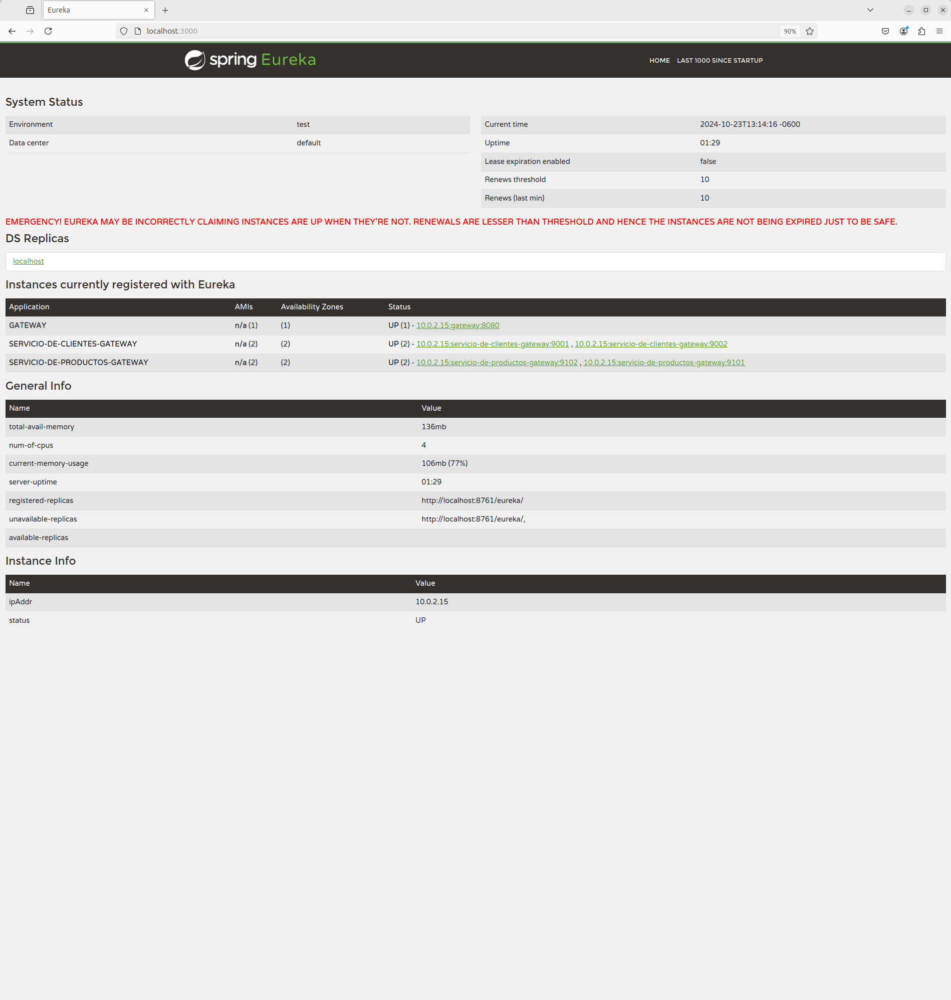

# SPRING CLOUD CIRCUIT BREAKER - VISUALIZACIÓN

Tiempo aproximado: _15 minutos_

## OBJETIVO

En esta actividad se ponen en marcha varios servicios y para mostrar un ejemplo simple de Spring Cloud Gateway.

### REPOSITORIO

Esta actividad requiere que el repositorio de trabajo este en:

- Rama: `labs/microservices-development`
  - Se recomienda siempre trabajar sobre una rama _feature_.
    - Por ejemplo: `git checkout -b labs/microservices-development_cazucito`
- Carpeta: `/home/usuario/Desktop/CF01141024/gateway`

## DESARROLLO

### PROYECTO: EUREKA SERVER

Para esta actividad se proporciona un servidor de descubrimiento (ubicado en `/home/usuario/Desktop/CF01141024/gateway/gateway-eureka`) que se debe construir y ejecutar.

Los pasos generales son los siguientes:

1. En una terminal de comandos construya el proyecto:
   1. `mvn clean package`
2. Ejecute el servidor de descubrimiento:
   1. `java -jar target/gateway-eureka-0.1.0-SNAPSHOT.jar`

### PROYECTO: SERVICIO DE PRODUCTOS

Para esta actividad se proporciona un servicio (ubicado en `/home/usuario/Desktop/CF01141024/gateway/gateway-productos`) que se debe construir y ejecutar.

Los pasos generales son los siguientes:

1. En una terminal de comandos construya el proyecto:
   1. `mvn clean package`
2. Ejecute la instancia del servicio:
   1. `java -D"spring.profiles.active=nodo1" -jar target/gateway-productos-0.1.0-SNAPSHOT.jar`
   2. `java -D"spring.profiles.active=nodo2" -jar target/gateway-productos-0.1.0-SNAPSHOT.jar`

### PROYECTO: SERVICIO DE CLIENTES

Para esta actividad se proporciona un servicio (ubicado en `/home/usuario/Desktop/CF01141024/gateway/gateway-clientes`) que se debe construir y ejecutar.

Los pasos generales son los siguientes:

1. En una terminal de comandos construya el proyecto:
   1. `mvn clean package`
2. Ejecute la instancia del servicio:
   1. `java -D"spring.profiles.active=nodo1" -jar target/gateway-clientes-0.1.0-SNAPSHOT.jar`
   2. `java -D"spring.profiles.active=nodo2" -jar target/gateway-clientes-0.1.0-SNAPSHOT.jar`

### PROYECTO: GATEWAY

Para crear una aplicación _Spring Boot_ con _Spring Tool Suite_, entre al editor y seleccione la opción `File → New → Spring Starter Project`.

En la ventana ingrese la siguiente información:

- Name: **gateway-gateway**
- Type: **Maven Project**
- Packaging: **Jar**
- Java (versión): **17**
- Language: **Java**
- Group: **mx.com.fractalyst.pdv**
- Artifact: **gateway-gateway**
- Version: **0.1.0-SNAPSHOT**
- Description: **Spring Cloud Gateway - gateway**
- Package Name: **mx.com.fractalyst.pdv.sc**

De clic en `Next`:

- Spring Boot Version: **3.3.4**
  - Se recomienda utilizar las versiones estables
- Dependencias: `Gateway`, `Spring Reactive Web`, `Eureka Discovery Client` y `Spring Boot Actuator`.

De clic en `Next`:

- No realice cambios.
  
De clic en `Finish`.

Este último paso solicita la creación y apertura del proyecto Maven en el STS.

#### DEPENDENCIAS

Valide que en el POM se encuentran las siguientes dependencias:

``` shell
      <dependency>
            <groupId>org.springframework.boot</groupId>
            <artifactId>spring-boot-starter-actuator</artifactId>
        </dependency>
        <dependency>
            <groupId>org.springframework.cloud</groupId>
            <artifactId>spring-cloud-starter-gateway</artifactId>
        </dependency>
        <dependency>
            <groupId>org.springframework.cloud</groupId>
            <artifactId>spring-cloud-starter-netflix-eureka-client</artifactId>
        </dependency>
        <dependency>
            <groupId>org.springframework.boot</groupId>
            <artifactId>spring-boot-starter-test</artifactId>
            <scope>test</scope>
        </dependency>
        <dependency>
            <groupId>org.springframework.boot</groupId>
            <artifactId>spring-boot-starter-webflux</artifactId>
        </dependency>
        <dependency>
            <groupId>io.projectreactor</groupId>
            <artifactId>reactor-test</artifactId>
            <scope>test</scope>
        </dependency>
```

#### SPRING BOOT ACTUATOR: INFO

Para visualizar información en el _endpoint_ `actuator/info` se debe adicionar la ejecución del _goal_ `build-info` en el _plug-in_ `spring-boot-maven-plugin`.
Haga que la sección del plug-in se vea como el bloque de pom.xml que se muestra a continuación:

``` xml
          <plugin>
                <groupId>org.springframework.boot</groupId>
                <artifactId>spring-boot-maven-plugin</artifactId>
                <executions>
                    <execution>
                        <goals>
                            <goal>build-info</goal>
                        </goals>
                    </execution>
                </executions>
            </plugin>
```

#### SPRING BOOT APPLICATION

La aplicación además de su lógica de negocio debe comunicarse con el servidor _Eureka_, para lo cual debe registrarse y enviar información de metadatos como _host_, puerto, URL de indicador de estado y página de inicio.

_Eureka Server_ recibe mensajes de _heartbeat_ de cada instancia perteneciente a un servicio. Si el latido no se recibe después de un período de tiempo configurado, la instancia se elimina del registro.

Para lograr lo anterior se debe adicionar la anotación `@EnableDiscoveryClient` a la clase ya anotada con `@SpringBootApplication`.

La clase debe quedar como se muestra a continuación:

``` java
package mx.com.fractalyst.pdv.sc;

import org.springframework.boot.SpringApplication;
import org.springframework.boot.autoconfigure.SpringBootApplication;
import org.springframework.cloud.client.discovery.EnableDiscoveryClient;

@SpringBootApplication
@EnableDiscoveryClient
public class GatewayGatewayApplication {

    public static void main(String[] args) {
        SpringApplication.run(GatewayGatewayApplication.class, args);
    }

}
```

#### CONTROLADOR (OPCIONAL)

Cree la clase `src/main/java/mx/com/fractalyst/pdv/sc/c/ActiveRoutesController.java` con el siguiente contenido:

``` java
package mx.com.fractalyst.pdv.sc.c;

import org.springframework.cloud.gateway.route.Route;
import org.springframework.cloud.gateway.route.RouteLocator;
import org.springframework.web.bind.annotation.GetMapping;
import org.springframework.web.bind.annotation.RestController;
import reactor.core.publisher.Flux;

@RestController
public class ActiveRoutesController {

	private final RouteLocator routeLocator;

	public ActiveRoutesController(RouteLocator routeLocator) {
		this.routeLocator = routeLocator;
	}

	@GetMapping("/active-routes")
	public Flux<Route> getActiveRoutes() {
		return routeLocator.getRoutes();
	}
}

```

Esta clase responde la información relacionada a las rutas definidas en el _gateway_.

#### CONFIGURACIÓN: application.yml

Para definir los detalles del servicio cree el archivo de configuración de la aplicación `application.yml` con el siguiente contenido:

``` yaml
spring:
  application:
    name: gateway
  cloud:
    gateway:
      routes:
      - id: moduloClientes
        uri: lb://SERVICIO-DE-CLIENTES-GATEWAY
        predicates:
        - Path=/clientes/**
      - id: moduloProductos
        uri: lb://SERVICIO-DE-PRODUCTOS-GATEWAY
        predicates:
        - Path=/productos/**

server:
  port: ${PORT:8080}

eureka:
  client:
    serviceUrl:
      defaultZone: ${EUREKA_URL:http://localhost:3000/eureka/}

management:
  endpoint:
    shutdown:
      enabled: true
  endpoints:
    web:
      exposure:
        include: "*"
```

#### CONSTRUCCIÓN

Para construir el servicio ejecute el siguiente comando Maven en una terminal en la raíz del proyecto:

``` shell
mvn clean package
```

Debería ver un resultado similar al siguiente:

``` shell
[INFO] Scanning for projects...
[INFO] 
[INFO] ---------------< mx.com.fractalyst.pdv:gateway-gateway >----------------
[INFO] Building gateway-gateway 0.1.0-SNAPSHOT
[INFO] --------------------------------[ jar ]---------------------------------
[INFO] 
[INFO] --- maven-clean-plugin:3.3.2:clean (default-clean) @ gateway-gateway ---
[INFO] Deleting /home/usuario/Desktop/CF01141024/gateway/gateway-gateway/target
[INFO] 
[INFO] --- maven-resources-plugin:3.3.1:resources (default-resources) @ gateway-gateway ---
[INFO] Copying 1 resource from src/main/resources to target/classes
[INFO] Copying 0 resource from src/main/resources to target/classes
[INFO] 
[INFO] --- maven-compiler-plugin:3.13.0:compile (default-compile) @ gateway-gateway ---
[INFO] Recompiling the module because of changed source code.
[INFO] Compiling 1 source file with javac [debug parameters release 17] to target/classes
[INFO] 
[INFO] --- maven-resources-plugin:3.3.1:testResources (default-testResources) @ gateway-gateway ---
[INFO] skip non existing resourceDirectory /home/usuario/Desktop/CF01141024/gateway/gateway-gateway/src/test/resources
[INFO] 
[INFO] --- maven-compiler-plugin:3.13.0:testCompile (default-testCompile) @ gateway-gateway ---
[INFO] Recompiling the module because of changed dependency.
[INFO] Compiling 1 source file with javac [debug parameters release 17] to target/test-classes
[INFO] 
[INFO] --- maven-surefire-plugin:3.2.5:test (default-test) @ gateway-gateway ---
[INFO] Using auto detected provider org.apache.maven.surefire.junitplatform.JUnitPlatformProvider
[INFO] 
[INFO] -------------------------------------------------------
[INFO]  T E S T S
[INFO] -------------------------------------------------------
[INFO] Running mx.com.fractalyst.pdv.sc.GatewayGatewayApplicationTests
12:56:10.563 [main] INFO org.springframework.test.context.support.AnnotationConfigContextLoaderUtils -- Could not detect default configuration classes for test class [mx.com.fractalyst.pdv.sc.GatewayGatewayApplicationTests]: GatewayGatewayApplicationTests does not declare any static, non-private, non-final, nested classes annotated with @Configuration.
12:56:10.781 [main] INFO org.springframework.boot.test.context.SpringBootTestContextBootstrapper -- Found @SpringBootConfiguration mx.com.fractalyst.pdv.sc.GatewayGatewayApplication for test class mx.com.fractalyst.pdv.sc.GatewayGatewayApplicationTests

  .   ____          _            __ _ _
 /\\ / ___'_ __ _ _(_)_ __  __ _ \ \ \ \
( ( )\___ | '_ | '_| | '_ \/ _` | \ \ \ \
 \\/  ___)| |_)| | | | | || (_| |  ) ) ) )
  '  |____| .__|_| |_|_| |_\__, | / / / /
 =========|_|==============|___/=/_/_/_/

 :: Spring Boot ::                (v3.3.4)

2024-10-23T12:56:11.530-06:00  INFO 17013 --- [gateway] [           main] m.c.f.p.s.GatewayGatewayApplicationTests : Starting GatewayGatewayApplicationTests using Java 17.0.12 with PID 17013 (started by usuario in /home/usuario/Desktop/CF01141024/gateway/gateway-gateway)
2024-10-23T12:56:11.532-06:00  INFO 17013 --- [gateway] [           main] m.c.f.p.s.GatewayGatewayApplicationTests : No active profile set, falling back to 1 default profile: "default"
2024-10-23T12:56:13.198-06:00  INFO 17013 --- [gateway] [           main] o.s.cloud.context.scope.GenericScope     : BeanFactory id=e92a235e-2ba6-3149-bc76-178ef5e11960
2024-10-23T12:56:13.301-06:00  WARN 17013 --- [gateway] [           main] trationDelegate$BeanPostProcessorChecker : Bean 'org.springframework.cloud.client.loadbalancer.LoadBalancerAutoConfiguration$DeferringLoadBalancerInterceptorConfig' of type [org.springframework.cloud.client.loadbalancer.LoadBalancerAutoConfiguration$DeferringLoadBalancerInterceptorConfig] is not eligible for getting processed by all BeanPostProcessors (for example: not eligible for auto-proxying). The currently created BeanPostProcessor [lbRestClientPostProcessor] is declared through a non-static factory method on that class; consider declaring it as static instead.
2024-10-23T12:56:13.306-06:00  WARN 17013 --- [gateway] [           main] trationDelegate$BeanPostProcessorChecker : Bean 'deferringLoadBalancerInterceptor' of type [org.springframework.cloud.client.loadbalancer.DeferringLoadBalancerInterceptor] is not eligible for getting processed by all BeanPostProcessors (for example: not eligible for auto-proxying). Is this bean getting eagerly injected into a currently created BeanPostProcessor [lbRestClientPostProcessor]? Check the corresponding BeanPostProcessor declaration and its dependencies.
2024-10-23T12:56:13.311-06:00  WARN 17013 --- [gateway] [           main] trationDelegate$BeanPostProcessorChecker : Bean 'org.springframework.cloud.client.loadbalancer.reactive.LoadBalancerBeanPostProcessorAutoConfiguration' of type [org.springframework.cloud.client.loadbalancer.reactive.LoadBalancerBeanPostProcessorAutoConfiguration] is not eligible for getting processed by all BeanPostProcessors (for example: not eligible for auto-proxying). The currently created BeanPostProcessor [loadBalancerWebClientBuilderBeanPostProcessor] is declared through a non-static factory method on that class; consider declaring it as static instead.
2024-10-23T12:56:13.314-06:00  WARN 17013 --- [gateway] [           main] trationDelegate$BeanPostProcessorChecker : Bean 'org.springframework.cloud.client.loadbalancer.reactive.LoadBalancerBeanPostProcessorAutoConfiguration$ReactorDeferringLoadBalancerFilterConfig' of type [org.springframework.cloud.client.loadbalancer.reactive.LoadBalancerBeanPostProcessorAutoConfiguration$ReactorDeferringLoadBalancerFilterConfig] is not eligible for getting processed by all BeanPostProcessors (for example: not eligible for auto-proxying). Is this bean getting eagerly injected into a currently created BeanPostProcessor [loadBalancerWebClientBuilderBeanPostProcessor]? Check the corresponding BeanPostProcessor declaration and its dependencies.
2024-10-23T12:56:13.318-06:00  WARN 17013 --- [gateway] [           main] trationDelegate$BeanPostProcessorChecker : Bean 'reactorDeferringLoadBalancerExchangeFilterFunction' of type [org.springframework.cloud.client.loadbalancer.reactive.DeferringLoadBalancerExchangeFilterFunction] is not eligible for getting processed by all BeanPostProcessors (for example: not eligible for auto-proxying). Is this bean getting eagerly injected into a currently created BeanPostProcessor [loadBalancerWebClientBuilderBeanPostProcessor]? Check the corresponding BeanPostProcessor declaration and its dependencies.
2024-10-23T12:56:14.616-06:00  INFO 17013 --- [gateway] [           main] DiscoveryClientOptionalArgsConfiguration : Eureka HTTP Client uses RestTemplate.
2024-10-23T12:56:14.931-06:00  WARN 17013 --- [gateway] [           main] iguration$LoadBalancerCaffeineWarnLogger : Spring Cloud LoadBalancer is currently working with the default cache. While this cache implementation is useful for development and tests, it's recommended to use Caffeine cache in production.You can switch to using Caffeine cache, by adding it and org.springframework.cache.caffeine.CaffeineCacheManager to the classpath.
2024-10-23T12:56:14.941-06:00  INFO 17013 --- [gateway] [           main] o.s.b.a.e.web.EndpointLinksResolver      : Exposing 18 endpoints beneath base path '/actuator'
2024-10-23T12:56:15.149-06:00  INFO 17013 --- [gateway] [           main] o.s.c.n.eureka.InstanceInfoFactory       : Setting initial instance status as: STARTING
2024-10-23T12:56:15.170-06:00  INFO 17013 --- [gateway] [           main] com.netflix.discovery.DiscoveryClient    : Initializing Eureka in region us-east-1
2024-10-23T12:56:15.175-06:00  INFO 17013 --- [gateway] [           main] c.n.d.s.r.aws.ConfigClusterResolver      : Resolving eureka endpoints via configuration
2024-10-23T12:56:15.181-06:00  INFO 17013 --- [gateway] [           main] com.netflix.discovery.DiscoveryClient    : Disable delta property : false
2024-10-23T12:56:15.181-06:00  INFO 17013 --- [gateway] [           main] com.netflix.discovery.DiscoveryClient    : Single vip registry refresh property : null
2024-10-23T12:56:15.182-06:00  INFO 17013 --- [gateway] [           main] com.netflix.discovery.DiscoveryClient    : Force full registry fetch : false
2024-10-23T12:56:15.183-06:00  INFO 17013 --- [gateway] [           main] com.netflix.discovery.DiscoveryClient    : Application is null : false
2024-10-23T12:56:15.183-06:00  INFO 17013 --- [gateway] [           main] com.netflix.discovery.DiscoveryClient    : Registered Applications size is zero : true
2024-10-23T12:56:15.183-06:00  INFO 17013 --- [gateway] [           main] com.netflix.discovery.DiscoveryClient    : Application version is -1: true
2024-10-23T12:56:15.183-06:00  INFO 17013 --- [gateway] [           main] com.netflix.discovery.DiscoveryClient    : Getting all instance registry info from the eureka server
2024-10-23T12:56:15.515-06:00  INFO 17013 --- [gateway] [           main] com.netflix.discovery.DiscoveryClient    : The response status is 200
2024-10-23T12:56:15.533-06:00  INFO 17013 --- [gateway] [           main] com.netflix.discovery.DiscoveryClient    : Starting heartbeat executor: renew interval is: 30
2024-10-23T12:56:15.538-06:00  INFO 17013 --- [gateway] [           main] c.n.discovery.InstanceInfoReplicator     : InstanceInfoReplicator onDemand update allowed rate per min is 4
2024-10-23T12:56:15.544-06:00  INFO 17013 --- [gateway] [           main] com.netflix.discovery.DiscoveryClient    : Discovery Client initialized at timestamp 1729709775543 with initial instances count: 4
2024-10-23T12:56:15.553-06:00  INFO 17013 --- [gateway] [           main] o.s.c.n.e.s.EurekaServiceRegistry        : Registering application GATEWAY with eureka with status UP
2024-10-23T12:56:15.554-06:00  INFO 17013 --- [gateway] [           main] com.netflix.discovery.DiscoveryClient    : Saw local status change event StatusChangeEvent [timestamp=1729709775554, current=UP, previous=STARTING]
2024-10-23T12:56:15.556-06:00  INFO 17013 --- [gateway] [foReplicator-%d] com.netflix.discovery.DiscoveryClient    : DiscoveryClient_GATEWAY/10.0.2.15:gateway:8080: registering service...
2024-10-23T12:56:15.585-06:00  INFO 17013 --- [gateway] [           main] m.c.f.p.s.GatewayGatewayApplicationTests : Started GatewayGatewayApplicationTests in 4.588 seconds (process running for 6.009)
2024-10-23T12:56:15.687-06:00  INFO 17013 --- [gateway] [foReplicator-%d] com.netflix.discovery.DiscoveryClient    : DiscoveryClient_GATEWAY/10.0.2.15:gateway:8080 - registration status: 204
OpenJDK 64-Bit Server VM warning: Sharing is only supported for boot loader classes because bootstrap classpath has been appended
[INFO] Tests run: 1, Failures: 0, Errors: 0, Skipped: 0, Time elapsed: 6.705 s -- in mx.com.fractalyst.pdv.sc.GatewayGatewayApplicationTests
[INFO] 
[INFO] Results:
[INFO] 
[INFO] Tests run: 1, Failures: 0, Errors: 0, Skipped: 0
[INFO] 
[INFO] 
[INFO] --- maven-jar-plugin:3.4.2:jar (default-jar) @ gateway-gateway ---
[INFO] Building jar: /home/usuario/Desktop/CF01141024/gateway/gateway-gateway/target/gateway-gateway-0.1.0-SNAPSHOT.jar
[INFO] 
[INFO] --- spring-boot-maven-plugin:3.3.4:repackage (repackage) @ gateway-gateway ---
[INFO] Replacing main artifact /home/usuario/Desktop/CF01141024/gateway/gateway-gateway/target/gateway-gateway-0.1.0-SNAPSHOT.jar with repackaged archive, adding nested dependencies in BOOT-INF/.
[INFO] The original artifact has been renamed to /home/usuario/Desktop/CF01141024/gateway/gateway-gateway/target/gateway-gateway-0.1.0-SNAPSHOT.jar.original
[INFO] ------------------------------------------------------------------------
[INFO] BUILD SUCCESS
[INFO] ------------------------------------------------------------------------
[INFO] Total time:  16.292 s
[INFO] Finished at: 2024-10-23T12:56:21-06:00
[INFO] ------------------------------------------------------------------------

```

#### EJECUCIÓN

Para ejecutar el servicio se puede lanzar el _jar_ ubicado en la carpeta `target` del proyecto con los tres perfiles como se muestra a continuación:

``` shell
java -jar target/gateway-gateway-0.1.0-SNAPSHOT.jar
```

Se debe ver un resultado similar al siguiente en todas las terminales:

```  shell

  .   ____          _            __ _ _
 /\\ / ___'_ __ _ _(_)_ __  __ _ \ \ \ \
( ( )\___ | '_ | '_| | '_ \/ _` | \ \ \ \
 \\/  ___)| |_)| | | | | || (_| |  ) ) ) )
  '  |____| .__|_| |_|_| |_\__, | / / / /
 =========|_|==============|___/=/_/_/_/

 :: Spring Boot ::                (v3.3.4)

2024-10-23T12:57:53.629-06:00  INFO 17134 --- [gateway] [           main] m.c.f.pdv.sc.GatewayGatewayApplication   : Starting GatewayGatewayApplication v0.1.0-SNAPSHOT using Java 17.0.12 with PID 17134 (/home/usuario/Desktop/CF01141024/gateway/gateway-gateway/target/gateway-gateway-0.1.0-SNAPSHOT.jar started by usuario in /home/usuario/Desktop/CF01141024/gateway/gateway-gateway)
2024-10-23T12:57:53.633-06:00  INFO 17134 --- [gateway] [           main] m.c.f.pdv.sc.GatewayGatewayApplication   : No active profile set, falling back to 1 default profile: "default"
2024-10-23T12:57:55.441-06:00  INFO 17134 --- [gateway] [           main] o.s.cloud.context.scope.GenericScope     : BeanFactory id=a787dfe4-0a02-3ae6-a3d2-68c86f4952c7
2024-10-23T12:57:55.578-06:00  WARN 17134 --- [gateway] [           main] trationDelegate$BeanPostProcessorChecker : Bean 'org.springframework.cloud.client.loadbalancer.LoadBalancerAutoConfiguration$DeferringLoadBalancerInterceptorConfig' of type [org.springframework.cloud.client.loadbalancer.LoadBalancerAutoConfiguration$DeferringLoadBalancerInterceptorConfig] is not eligible for getting processed by all BeanPostProcessors (for example: not eligible for auto-proxying). The currently created BeanPostProcessor [lbRestClientPostProcessor] is declared through a non-static factory method on that class; consider declaring it as static instead.
2024-10-23T12:57:55.583-06:00  WARN 17134 --- [gateway] [           main] trationDelegate$BeanPostProcessorChecker : Bean 'deferringLoadBalancerInterceptor' of type [org.springframework.cloud.client.loadbalancer.DeferringLoadBalancerInterceptor] is not eligible for getting processed by all BeanPostProcessors (for example: not eligible for auto-proxying). Is this bean getting eagerly injected into a currently created BeanPostProcessor [lbRestClientPostProcessor]? Check the corresponding BeanPostProcessor declaration and its dependencies.
2024-10-23T12:57:55.590-06:00  WARN 17134 --- [gateway] [           main] trationDelegate$BeanPostProcessorChecker : Bean 'org.springframework.cloud.client.loadbalancer.reactive.LoadBalancerBeanPostProcessorAutoConfiguration' of type [org.springframework.cloud.client.loadbalancer.reactive.LoadBalancerBeanPostProcessorAutoConfiguration] is not eligible for getting processed by all BeanPostProcessors (for example: not eligible for auto-proxying). The currently created BeanPostProcessor [loadBalancerWebClientBuilderBeanPostProcessor] is declared through a non-static factory method on that class; consider declaring it as static instead.
2024-10-23T12:57:55.592-06:00  WARN 17134 --- [gateway] [           main] trationDelegate$BeanPostProcessorChecker : Bean 'org.springframework.cloud.client.loadbalancer.reactive.LoadBalancerBeanPostProcessorAutoConfiguration$ReactorDeferringLoadBalancerFilterConfig' of type [org.springframework.cloud.client.loadbalancer.reactive.LoadBalancerBeanPostProcessorAutoConfiguration$ReactorDeferringLoadBalancerFilterConfig] is not eligible for getting processed by all BeanPostProcessors (for example: not eligible for auto-proxying). Is this bean getting eagerly injected into a currently created BeanPostProcessor [loadBalancerWebClientBuilderBeanPostProcessor]? Check the corresponding BeanPostProcessor declaration and its dependencies.
2024-10-23T12:57:55.593-06:00  WARN 17134 --- [gateway] [           main] trationDelegate$BeanPostProcessorChecker : Bean 'reactorDeferringLoadBalancerExchangeFilterFunction' of type [org.springframework.cloud.client.loadbalancer.reactive.DeferringLoadBalancerExchangeFilterFunction] is not eligible for getting processed by all BeanPostProcessors (for example: not eligible for auto-proxying). Is this bean getting eagerly injected into a currently created BeanPostProcessor [loadBalancerWebClientBuilderBeanPostProcessor]? Check the corresponding BeanPostProcessor declaration and its dependencies.
2024-10-23T12:57:55.919-06:00  INFO 17134 --- [gateway] [           main] o.s.b.w.embedded.tomcat.TomcatWebServer  : Tomcat initialized with port 8080 (http)
2024-10-23T12:57:55.939-06:00  INFO 17134 --- [gateway] [           main] o.apache.catalina.core.StandardService   : Starting service [Tomcat]
2024-10-23T12:57:55.940-06:00  INFO 17134 --- [gateway] [           main] o.apache.catalina.core.StandardEngine    : Starting Servlet engine: [Apache Tomcat/10.1.30]
2024-10-23T12:57:55.997-06:00  INFO 17134 --- [gateway] [           main] o.a.c.c.C.[Tomcat].[localhost].[/]       : Initializing Spring embedded WebApplicationContext
2024-10-23T12:57:56.000-06:00  INFO 17134 --- [gateway] [           main] w.s.c.ServletWebServerApplicationContext : Root WebApplicationContext: initialization completed in 2211 ms
2024-10-23T12:57:57.605-06:00  INFO 17134 --- [gateway] [           main] DiscoveryClientOptionalArgsConfiguration : Eureka HTTP Client uses RestTemplate.
2024-10-23T12:57:57.839-06:00  WARN 17134 --- [gateway] [           main] iguration$LoadBalancerCaffeineWarnLogger : Spring Cloud LoadBalancer is currently working with the default cache. While this cache implementation is useful for development and tests, it's recommended to use Caffeine cache in production.You can switch to using Caffeine cache, by adding it and org.springframework.cache.caffeine.CaffeineCacheManager to the classpath.
2024-10-23T12:57:57.847-06:00  INFO 17134 --- [gateway] [           main] o.s.b.a.e.web.EndpointLinksResolver      : Exposing 18 endpoints beneath base path '/actuator'
2024-10-23T12:57:58.057-06:00  INFO 17134 --- [gateway] [           main] o.s.c.n.eureka.InstanceInfoFactory       : Setting initial instance status as: STARTING
2024-10-23T12:57:58.081-06:00  INFO 17134 --- [gateway] [           main] com.netflix.discovery.DiscoveryClient    : Initializing Eureka in region us-east-1
2024-10-23T12:57:58.086-06:00  INFO 17134 --- [gateway] [           main] c.n.d.s.r.aws.ConfigClusterResolver      : Resolving eureka endpoints via configuration
2024-10-23T12:57:58.094-06:00  INFO 17134 --- [gateway] [           main] com.netflix.discovery.DiscoveryClient    : Disable delta property : false
2024-10-23T12:57:58.095-06:00  INFO 17134 --- [gateway] [           main] com.netflix.discovery.DiscoveryClient    : Single vip registry refresh property : null
2024-10-23T12:57:58.095-06:00  INFO 17134 --- [gateway] [           main] com.netflix.discovery.DiscoveryClient    : Force full registry fetch : false
2024-10-23T12:57:58.095-06:00  INFO 17134 --- [gateway] [           main] com.netflix.discovery.DiscoveryClient    : Application is null : false
2024-10-23T12:57:58.095-06:00  INFO 17134 --- [gateway] [           main] com.netflix.discovery.DiscoveryClient    : Registered Applications size is zero : true
2024-10-23T12:57:58.096-06:00  INFO 17134 --- [gateway] [           main] com.netflix.discovery.DiscoveryClient    : Application version is -1: true
2024-10-23T12:57:58.096-06:00  INFO 17134 --- [gateway] [           main] com.netflix.discovery.DiscoveryClient    : Getting all instance registry info from the eureka server
2024-10-23T12:57:58.447-06:00  INFO 17134 --- [gateway] [           main] com.netflix.discovery.DiscoveryClient    : The response status is 200
2024-10-23T12:57:58.452-06:00  INFO 17134 --- [gateway] [           main] com.netflix.discovery.DiscoveryClient    : Starting heartbeat executor: renew interval is: 30
2024-10-23T12:57:58.456-06:00  INFO 17134 --- [gateway] [           main] c.n.discovery.InstanceInfoReplicator     : InstanceInfoReplicator onDemand update allowed rate per min is 4
2024-10-23T12:57:58.459-06:00  INFO 17134 --- [gateway] [           main] com.netflix.discovery.DiscoveryClient    : Discovery Client initialized at timestamp 1729709878458 with initial instances count: 4
2024-10-23T12:57:58.463-06:00  INFO 17134 --- [gateway] [           main] o.s.c.n.e.s.EurekaServiceRegistry        : Registering application GATEWAY with eureka with status UP
2024-10-23T12:57:58.464-06:00  INFO 17134 --- [gateway] [           main] com.netflix.discovery.DiscoveryClient    : Saw local status change event StatusChangeEvent [timestamp=1729709878464, current=UP, previous=STARTING]
2024-10-23T12:57:58.471-06:00  INFO 17134 --- [gateway] [foReplicator-%d] com.netflix.discovery.DiscoveryClient    : DiscoveryClient_GATEWAY/10.0.2.15:gateway:8080: registering service...
2024-10-23T12:57:58.510-06:00  INFO 17134 --- [gateway] [           main] o.s.b.w.embedded.tomcat.TomcatWebServer  : Tomcat started on port 8080 (http) with context path '/'
2024-10-23T12:57:58.511-06:00  INFO 17134 --- [gateway] [           main] .s.c.n.e.s.EurekaAutoServiceRegistration : Updating port to 8080
2024-10-23T12:57:58.572-06:00  INFO 17134 --- [gateway] [foReplicator-%d] com.netflix.discovery.DiscoveryClient    : DiscoveryClient_GATEWAY/10.0.2.15:gateway:8080 - registration status: 204
2024-10-23T12:57:58.610-06:00  INFO 17134 --- [gateway] [           main] m.c.f.pdv.sc.GatewayGatewayApplication   : Started GatewayGatewayApplication in 5.699 seconds (process running for 6.513)
```

Esta ejecución hace disponible el _gateway_ que define las rutas que le permitirán controlar el flujo hacia los servicios.

La terminal de comandos se bloquea por lo que las siguientes acciones deben ser realizadas en otra terminal y de requerir detener el servidor debe ejecutar `Ctrl+C` en la terminal en la que se haya iniciado.

#### OBTENER ESTADO

Para validar que el servicio se encuentra funcionando se puede llamar al _endpoint_ publicado en `/actuator/health` como se muestra a continuación:

``` shell
curl http://localhost:8080/actuator/health
```

La salida debe ser similar a:

``` json
{
    "status": "UP",
}
```

Además, puede llamar al endpoint `/actuator/info` para obtener información del servicio:

``` shell
curl http://localhost:8080/actuator/info
```

La salida debe ser similar a:

``` json
{
    "build": {
        "artifact": "gateway-gateway",
        "name": "gateway-gateway",
        "time": "2024-10-23T19:02:36.695Z",
        "version": "0.1.0-SNAPSHOT",
        "group": "mx.com.fractalyst.pdv"
    }
}
```

Con lo anterior podemos estar seguros de que está operativo.

#### EUREKA DASHBOARD

El servidor de descubrimiento Eureka brinda un dashboard que puede ser accesible mediante un cliente web, en el cual podemos observar que están registradas las instancias del `servicio-de-clientes`, y el `servicio-de-cuentas` como se muestra en la siguiente imagen.

Visite el _dashboard_ ingresando las siguientes URLs en un navegador web:

1. <http://localhost:3000/>



Adicionalmente si da clic en la columna `Status` en la sección de `Instances currently registered with Eureka` se obtiene la información del _endpoint_ `actuator/info` de cada servicio.

#### CONSUMO

Para probar que el _gateway_ redirecciona el tráfico de red pruebe lanzando las siguientes peticiones.

##### RUTAS DEFINIDAS

Para conocer las rutas definidas en el _gateway_ consulte:

``` shell
curl localhost:8080/active-routes
```

La salida será semejante a:

``` json
[
    {
        "id": "moduloClientes",
        "uri": "lb://SERVICIO-DE-PRODUCTOS-GATEWAY",
        "order": 0,
        "predicate": {
            "config": null
        },
        "metadata": {},
        "filters": []
    },
    {
        "id": "moduloProductos",
        "uri": "lb://SERVICIO-DE-PRODUCTOS-GATEWAY",
        "order": 0,
        "predicate": {
            "config": null
        },
        "metadata": {},
        "filters": []
    }
]
```

##### PARA CLIENTES

``` shell
curl localhost:8080/clientes/1
```

La salida será semejante a:

``` json
{
  "id": 1,
  "nombre": "Juan López",
  "tipoCliente": "NUEVO",
  "cuentas": [
    {
      "id": 1,
      "numeroCuenta": "111111",
      "balance": 1000
    }
  ]
}
```

##### PARA PRODUCTOS

``` shell
curl localhost:8080/productos/1
```

La salida será semejante a:

``` json
{
  "id": 1,
  "nombre": "Producto 1",
  "precio": 100
}
```

##### BALANCEO

Detenga una instancia de cada servicio (clientes y productos) y ejecute nuevamente. Note que, aunque en ocasiones se nota una intermitencia en el servicio, la consulta eventualmente será respondida de manera exitosa siempre que exista al menos una instancia en ejecución.

### RESTABLECIMIENTO

Para restablecer el ambiente de trabajo se debe detener la ejecución haciendo `Ctrl+C` en la terminal de comandos en la que se haya iniciado dicha ejecución.

## RESULTADO

Comente los puntos más relevantes de las actividades.

## REFERENCIAS

- [Spring Cloud Gateway](https://spring.io/projects/spring-cloud-gateway)

---

[DESARROLLO DE MICROSERVICIOS](../../M04.md)
