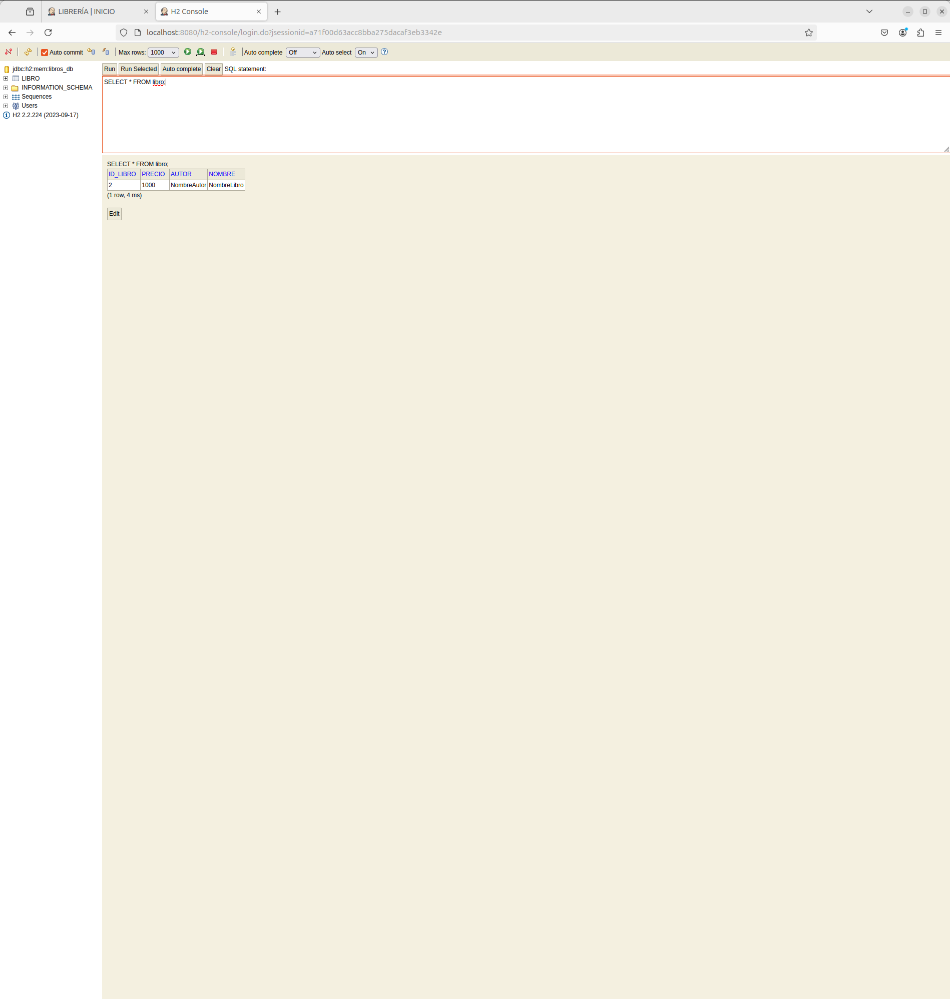

# Spring MVC

Tiempo aproximado: _15 minutos_

## OBJETIVO

En esta actividad se crea una pequeña aplicación Spring MVC con Spring Boot que realiza altas, bajas, cambios y consultas a una base de datos, mediante una vista web y un API RESTful.

### REPOSITORIO

Esta actividad requiere que el repositorio de trabajo este en:

- Rama: `labs/microservices-development`
  - Se recomienda siempre trabajar sobre una rama _feature_.
    - Por ejemplo: `git checkout -b labs/microservices-development_cazucito`
- Carpeta: `/home/usuario/Desktop/CF01141024/`

## DESARROLLO

### PROYECTO MAVEN

Para crear una aplicación Spring Boot con Spring Tool Suite, entre al editor y seleccione la opción: `File → New → Spring Starter Project`.

En la ventana ingrese la siguiente información:

- Name: **spring-mvc-jpa**
- Type: **Maven Project**
- Packaging: **Jar**
- Java (versión): **17**
- Language: **Java**
- Group: **mx.com.fractalyst.pocs**
- Artifact: **spring-mvc-jpa**
- Version: **0.1.0-SNAPSHOT**
- Description: **Spring MVC-JPA PoC**
- Package Name: **mx.com.fractalyst.pocs**

De clic en `Next`:

- Spring Boot Version: **3.3.5**
  - Se recomienda utilizar las versiones estables
- Dependencias: `Spring Web`, `Thymeleaf`, `Spring Data JPA` y `H2 Database`.

De clic en `Next`:

- No realice cambios

De clic en `Finish`.

Este último paso solicita la creación y apertura del proyecto Maven en el STS.

### CREANDO LA APLICACIÓN

Al estar utilizando el enfoque MVC la aplicación se fragmenta en diversos componentes con responsabilidades claramente definidas.

- A continuación se crea cada uno de estos con apoyo de los proyectos de Java SE y de Spring.

#### ENTIDAD

Las clases de entidad representa los datos que se vinculan con una tabla del enfoque entidad relación.

En este proyecto se crea la clase de entidad `Libro` que será gestionada por el `CrudRepository`.

Cree la clase `src/main/java/mx/com/fractalyst/pocs/model/Libro.java` con el siguiente contenido:

``` java
package mx.com.fractalyst.pocs.model;

import java.util.Objects;

import jakarta.persistence.Column;
import jakarta.persistence.Entity;
import jakarta.persistence.GeneratedValue;
import jakarta.persistence.GenerationType;
import jakarta.persistence.Id;
import jakarta.persistence.Table;

// Clase de entidad
@Entity
// Nombre de la tabla
@Table
public class Libro {
	// Llave primaria
	@Id
	@GeneratedValue(strategy = GenerationType.AUTO)
	@Column
	private int idLibro;

	@Column
	private String nombre;
	@Column
	private String autor;
	@Column
	private int precio;

	public int getIdLibro() {
		return idLibro;
	}

	public void setIdLibro(int idLibro) {
		this.idLibro = idLibro;
	}

	public String getNombre() {
		return nombre;
	}

	public void setNombre(String nombre) {
		this.nombre = nombre;
	}

	public String getAutor() {
		return autor;
	}

	public void setAutor(String autor) {
		this.autor = autor;
	}

	public int getPrecio() {
		return precio;
	}

	public void setPrecio(int precio) {
		this.precio = precio;
	}

	@Override
	public int hashCode() {
		return Objects.hash(autor, idLibro, nombre, precio);
	}

	@Override
	public boolean equals(Object obj) {
		if (this == obj)
			return true;
		if (obj == null)
			return false;
		if (getClass() != obj.getClass())
			return false;
		Libro other = (Libro) obj;
		return Objects.equals(autor, other.autor) && idLibro == other.idLibro && Objects.equals(nombre, other.nombre)
				&& precio == other.precio;
	}

	@Override
	public String toString() {
		return "Libro [idLibro=" + idLibro + ", nombre=" + nombre + ", autor=" + autor + ", precio=" + precio + "]";
	}

}
```

#### REPOSITORY

Existe una gran variedad de maneras de gestionar la persistencia de datos hacia bases de datos relacionales. En este proyecto se utiliza `CrudRepository` de _Spring_ para delegar las responsabilidades de interacción directa con la base de datos mediante _JPA_.

Para acceder a estas funcionalidades cree la interfaz `src/main/java/mx/com/fractalyst/pocs/model/LibrosRepository.java` que representa al repository que gestionará a la clase de entidad `Libro`:

``` java
package mx.com.fractalyst.pocs.model;

import org.springframework.data.repository.CrudRepository;

// Repositorio
public interface LibrosRepository extends CrudRepository<Libro, Integer> {
}
```

#### SERVICIO

Ahora que ya tenemos el mecanismo de interacción con la base de datos, debemos crear la clase que accede a estos y que les da un sentido de negocio.

Para esto cree una clase `src/main/java/mx/com/fractalyst/pocs/service/LibrosService.java` que brinde la funcionalidad de gestión de libros requerida.

``` java
package mx.com.fractalyst.pocs.service;

import java.util.ArrayList;
import java.util.List;
import java.util.Optional;

import org.springframework.beans.factory.annotation.Autowired;
import org.springframework.stereotype.Service;

import mx.com.fractalyst.pocs.model.Libro;
import mx.com.fractalyst.pocs.model.LibrosRepository;

// Lógica de negocio
@Service
public class LibrosService {
    @Autowired
    LibrosRepository librosRepository;

    // Recuperación de todos los libros mediante findaAll() de CrudRepository
    public List<Libro> consultaLibros() {
        List<Libro> libros = new ArrayList<>();
        librosRepository.findAll().forEach(libro -> libros.add(libro));
        return libros;
    }

    // Recuperación de un libro mediante findById() de CrudRepository
    public Libro consultaLibroPorId(int id) {
        Optional<Libro> optLibro = librosRepository.findById(id);
        if (optLibro.isPresent()) {
            return optLibro.get();
        }
        return null;
    }

    // Guardar un libro mediante save() de CrudRepository
    public void altaLibro(Libro libro) {
        librosRepository.save(libro);
    }

    // Elimina un libro mediante deleteById() de CrudRepository
    public void bajaLibro(int id) {
        librosRepository.deleteById(id);
    }

    // Actualiza un libro mediante save() de CrudRepository
    public void cambioLibro(Libro libro, int idLibro) {
        libro.setIdLibro(idLibro);
        librosRepository.save(libro);
    }
}
```

#### CONTROLADOR REST

Para interactuar con la clase de servicio cree un controlador REST `src/main/java/mx/com/fractalyst/pocs/controller/LibrosRESTController.java` que expone mediante el enfoque REST la funcionalidad del servicio.

``` java
package mx.com.fractalyst.pocs.controller;

import java.util.List;
import org.springframework.beans.factory.annotation.Autowired;
import org.springframework.http.HttpStatus;
import org.springframework.web.bind.annotation.DeleteMapping;
import org.springframework.web.bind.annotation.GetMapping;
import org.springframework.web.bind.annotation.PathVariable;
import org.springframework.web.bind.annotation.PostMapping;
import org.springframework.web.bind.annotation.PutMapping;
import org.springframework.web.bind.annotation.RequestBody;
import org.springframework.web.bind.annotation.RequestMapping;
import org.springframework.web.bind.annotation.RestController;
import org.springframework.web.server.ResponseStatusException;

import mx.com.fractalyst.pocs.model.Libro;
import mx.com.fractalyst.pocs.service.LibrosService;

//
@RestController
@RequestMapping("/rest")
public class LibrosRESTController {
	// autowire al servicio
	@Autowired
	LibrosService librosService;

	// URL para consultar todos los libros
	@GetMapping("/libros")
	private List<Libro> consultaLibros() {
		return librosService.consultaLibros();
	}

	// URL para consultar un libro
	@GetMapping("/libros/{id-libro}")
	private Libro consultaLibro(@PathVariable("id-libro") int idLibro) {

		Libro libro = librosService.consultaLibroPorId(idLibro);

		if (libro == null) {
			throw new ResponseStatusException(HttpStatus.NOT_FOUND, "Libro no encontrado");
		}

		return libro;
	}

	// URL para el borrado de un libro
	@DeleteMapping("/libros/{id-libro}")
	private void bajaLibro(@PathVariable("id-libro") int idLibro) {
		librosService.bajaLibro(idLibro);
	}

	// URL para alta libro
	@PostMapping("/libros")
	private int altaLibro(@RequestBody Libro libro) {
		librosService.altaLibro(libro);
		return libro.getIdLibro();
	}

	// URL para cambio libro
	@PutMapping("/libros/{id-libro}")
	private Libro cambioLibro(@PathVariable("id-libro") int idLibro, @RequestBody Libro libro) {
		librosService.cambioLibro(libro, idLibro);
		return libro;
	}

}
```

#### CONTROLADOR WEB

Otra manera de exponer la funcionalidad de la clase servicio es mediante una aplicación web. Para lo que se requiere la creación de un controlador que interactúe con la vista.

Cree la clase controlador `src/main/java/mx/com/fractalyst/pocs/controller/LibrosController.java` que expone mediante el enfoque de aplicación web a la tecnología de plantilla _Thymeleaf_.

``` java
package mx.com.fractalyst.pocs.controller;

import java.util.List;

import org.springframework.beans.factory.annotation.Autowired;
import org.springframework.stereotype.Controller;
import org.springframework.ui.Model;
import org.springframework.web.bind.annotation.GetMapping;
import org.springframework.web.bind.annotation.PathVariable;
import org.springframework.web.bind.annotation.PostMapping;

import mx.com.fractalyst.pocs.model.Libro;
import mx.com.fractalyst.pocs.service.LibrosService;

@Controller
public class LibrosController {
	//
	@Autowired
	LibrosService librosService;

	// URL para consultar todos los libros
	@GetMapping("/index.do")
	private String consultaLibros(Model model) {
		List<Libro> libros = librosService.consultaLibros();
		model.addAttribute("libros", libros);
		return "index";
	}

	// URL para el borrado de un libro
	@GetMapping("/baja.do/{id-libro}")
	private String bajaLibro(@PathVariable("id-libro") int idLibro) {
		librosService.bajaLibro(idLibro);
		return "redirect:/index.do";
	}

	// URL para alta libro formulario
	@GetMapping("/alta.do")
	private String altaLibro(Model model) {
		model.addAttribute("libro", new Libro());
		return "/alta-libro";
	}

	// URL para alta libro
	@PostMapping("/alta.do")
	private String altaLibro(Libro libro) {
		librosService.altaLibro(libro);
		return "redirect:/index.do";
	}

	// URL para cambio libro formulario
	@GetMapping("/cambio.do/{id-libro}")
	private String cambioLibro(@PathVariable("id-libro") int idLibro, Model model) {
		Libro libro = librosService.consultaLibroPorId(idLibro);
		model.addAttribute("libro", libro);
		return "/cambio-libro";
	}

	// URL para cambio libro
	@PostMapping("/cambio.do/{id-libro}")
	private String cambioLibro(Libro libro, @PathVariable("id-libro") int idLibro) {
		librosService.cambioLibro(libro, idLibro);
		return "redirect:/index.do";
	}

}
```

#### VISTA

Existe una gran variedad de tecnología de vista. En este proyecto se adicionó el _starter_ para _Thymeleaf_.

``` xml
      <dependency>
            <groupId>org.springframework.boot</groupId>
            <artifactId>spring-boot-starter-thymeleaf</artifactId>
      </dependency>
```

El _starter_ se encarga de configurar lo necesario para que se creen las vistas en archivos `.html` en el directorio `src/main/resources/templates`.

##### INICIO

Cree la página de inicio `src/main/resources/templates/index.html` con el código siguiente:

``` html
<!DOCTYPE html>
<html xmlns=http://www.w3.org/1999/xhtml xmlns:th="http://www.thymeleaf.org">

<head>
    <title>LIBRERÍA | INICIO</title>
</head>

<body>
    <p>LIBRERÍA</p>
    <hr />
    <div th:switch="${libros}">
        <p th:case="null">Sin Libros</p>
        <div th:case="*">
            <h3>Libros</h3>
            <table border=1>
                <thead>
                    <tr>
                        <th>Nombre</th>
                        <th>Autor</th>
                        <th>Precio</th>
                        <th> </th>
                        <th> </th>
                    </tr>
                </thead>
                <tbody>
                    <tr th:each="libro : ${libros}">
                        <td th:text="${libro.nombre}"></td>
                        <td th:text="${libro.autor}"></td>
                        <td th:text="${libro.precio}"></td>
                        <td><a th:href="@{/cambio.do/{id}(id=${libro.idLibro})}">Cambio</a></td>
                        <td><a th:href="@{/baja.do/{id}(id=${libro.idLibro})}">Baja</a></td>
                    </tr>
                </tbody>
            </table>
        </div>
    </div>
    <hr />
    <p><a href="alta.do">ALTA LIBRO</a></p>
</body>

</html>
```

##### ALTA

Cree la página `src/main/resources/templates/alta-libro.html` que permite dar de alta un libro. Adicione el código siguiente:

``` html
<!DOCTYPE html>
<html xmlns=http://www.w3.org/1999/xhtml xmlns:th="http://www.thymeleaf.org">

<head>
    <title>LIBRERIA | ALTA</title>
</head>

<body>
    <p>LIBRERÍA | ALTA</p>
    <hr />
    <form action="#" th:action="@{/alta.do}" th:object="${libro}" method="post">
        <label for="nombre">Nombre</label>
        <input type="text" th:field="*{nombre}" id="nombre" placeholder="Nombre" required>
        <label for="autor">Autor</label>
        <input type="text" th:field="*{autor}" id="autor" placeholder="Autor">
        <label for="precio">Precio</label>
        <input type="number" th:field="*{precio}" id="precio" placeholder="Precio">
        <input type="submit" value="Alta Libro">
    </form>
    <hr />
    <p><a href="/index.do">INICIO</a></p>
</body>

</html>
```

##### CAMBIO

Cree la página `src/main/resources/templates/cambio-libro.html` que permite realizar cambios en el libro seleccionado.

Adicione el código siguiente:

``` html
<!DOCTYPE html>
<html xmlns=http://www.w3.org/1999/xhtml xmlns:th="http://www.thymeleaf.org">

<head>
    <title>LIBRERIA | CAMBIO</title>
</head>

<body>
    <p>LIBRERÍA | CAMBIO</p>
    <hr />
    <form action="#" th:action="@{/cambio.do/{id}(id=${libro.idLibro})}" th:object="${libro}" method="post">
        <label for="id">id</label>
        <input type="text" th:field="*{idLibro}" id="id" readonly>
        <label for="nombre">Nombre</label>
        <input type="text" th:field="*{nombre}" id="nombre" placeholder="Nombre" required>
        <label for="autor">Autor</label>
        <input type="text" th:field="*{autor}" id="autor" placeholder="Autor">
        <label for="precio">Precio</label>
        <input type="number" th:field="*{precio}" id="precio" placeholder="Precio">
        <input type="submit" value="Cambio Libro">
    </form>
    <hr />
    <p><a href="/index.do">INICIO</a></p>
</body>

</html>
```

##### ERROR

Cree la página `src/main/resources/templates/error.html` que será despachada al ocurrir un error.

Adicione el código siguiente:

``` html
<!DOCTYPE html>
<html lang="en" xmlns="http://www.w3.org/1999/xhtml" xmlns:th="http://www.thymleaf.org">

<head>
    <meta charset="utf-8" />
    <meta http-equiv="X-UA-Compatible" content="IE=edge" />
    <meta name="viewport" content="width=device-width, initial-scale=1" />
    <title>LIBRERIA | ERROR</title>
    <style>
        body {
            background-color: red;
            margin: 20px;
        }

        h1,
        p {
            color: #ffffff;
        }
    </style>
</head>

<body>
    <h1>LIBRERÍA | REPORTE DE ERROR</h1>
    <hr />
    <h2 th:text="${error}">Información</h2>
    <hr />
    <p><a href="/index.do">INICIO</a></p>
</body>

</html>
```

### CONFIGURACIÓN

En este proyecto se utiliza la base de datos en memoria H2 por lo que debemos configurar sus detalles en el archivo `src/main/resources/application.properties`.

``` properties
spring.application.name=spring-mvc-jpa
spring.datasource.url=jdbc:h2:mem:libros_db
spring.datasource.driverClassName=org.h2.Driver
spring.datasource.username=sa
spring.datasource.password=
spring.jpa.database-platform=org.hibernate.dialect.H2Dialect
spring.h2.console.enabled=true
```

### DATOS DE PRUEBA

#### PAYLOAD: peticionPOST.json

Para el consumo se requieren datos de entrada por lo que se recomienda crear el archivo siguiente: `src/main/resources/peticionPOST.json`.

``` json
  {
    "nombre": "Libro 1000",
    "autor": "Autor 1000",
    "precio": "1000"
  }
```

#### PAYLOAD: peticionPUT.json

Para el consumo se requieren datos de entrada por lo que se recomienda crear el archivo siguiente: `src/main/resources/peticionPUT.json`.

``` json
  {
    "idLibro": "1",
    "nombre": "Libro 1111 Cambio",
    "autor": "Autor 1111",
    "precio": "1111"
  }
```

### CONSTRUCCIÓN Y EJECUCIÓN

Para construir y ejecutar el proyecto en una terminal de comandos ubicada en la carpeta raíz del proyecto:

``` shell
mvn spring-boot:run
```

La salida debe ser similar a:

``` shell
[INFO] Scanning for projects...
[INFO] 
[INFO] ---------------< mx.com.fractalyst.pocs:spring-mvc-jpa >----------------
[INFO] Building spring-mvc-jpa 0.1.0-SNAPSHOT
[INFO] --------------------------------[ jar ]---------------------------------
[INFO] 
[INFO] >>> spring-boot-maven-plugin:3.3.5:run (default-cli) > test-compile @ spring-mvc-jpa >>>
[INFO] 
[INFO] --- maven-resources-plugin:3.3.1:resources (default-resources) @ spring-mvc-jpa ---
[INFO] Copying 1 resource from src/main/resources to target/classes
[INFO] Copying 4 resources from src/main/resources to target/classes
[INFO] 
[INFO] --- maven-compiler-plugin:3.13.0:compile (default-compile) @ spring-mvc-jpa ---
[INFO] Recompiling the module because of added or removed source files.
[INFO] Compiling 6 source files with javac [debug parameters release 17] to target/classes
[INFO] 
[INFO] --- maven-resources-plugin:3.3.1:testResources (default-testResources) @ spring-mvc-jpa ---
[INFO] skip non existing resourceDirectory /home/usuario/Desktop/CF01141024/spring-mvc-jpa/src/test/resources
[INFO] 
[INFO] --- maven-compiler-plugin:3.13.0:testCompile (default-testCompile) @ spring-mvc-jpa ---
[INFO] Recompiling the module because of changed dependency.
[INFO] Compiling 1 source file with javac [debug parameters release 17] to target/test-classes
[INFO] 
[INFO] <<< spring-boot-maven-plugin:3.3.5:run (default-cli) < test-compile @ spring-mvc-jpa <<<
[INFO] 
[INFO] 
[INFO] --- spring-boot-maven-plugin:3.3.5:run (default-cli) @ spring-mvc-jpa ---

  .   ____          _            __ _ _
 /\\ / ___'_ __ _ _(_)_ __  __ _ \ \ \ \
( ( )\___ | '_ | '_| | '_ \/ _` | \ \ \ \
 \\/  ___)| |_)| | | | | || (_| |  ) ) ) )
  '  |____| .__|_| |_|_| |_\__, | / / / /
 =========|_|==============|___/=/_/_/_/

 :: Spring Boot ::                (v3.3.5)

2024-10-26T21:47:27.279-06:00  INFO 7305 --- [spring-mvc-jpa] [           main] m.c.f.pocs.SpringMvcJpaApplication       : Starting SpringMvcJpaApplication using Java 17.0.12 with PID 7305 (/home/usuario/Desktop/CF01141024/spring-mvc-jpa/target/classes started by usuario in /home/usuario/Desktop/CF01141024/spring-mvc-jpa)
2024-10-26T21:47:27.283-06:00  INFO 7305 --- [spring-mvc-jpa] [           main] m.c.f.pocs.SpringMvcJpaApplication       : No active profile set, falling back to 1 default profile: "default"
2024-10-26T21:47:29.101-06:00  INFO 7305 --- [spring-mvc-jpa] [           main] .s.d.r.c.RepositoryConfigurationDelegate : Bootstrapping Spring Data JPA repositories in DEFAULT mode.
2024-10-26T21:47:29.256-06:00  INFO 7305 --- [spring-mvc-jpa] [           main] .s.d.r.c.RepositoryConfigurationDelegate : Finished Spring Data repository scanning in 140 ms. Found 1 JPA repository interface.
2024-10-26T21:47:30.411-06:00  INFO 7305 --- [spring-mvc-jpa] [           main] o.s.b.w.embedded.tomcat.TomcatWebServer  : Tomcat initialized with port 8080 (http)
2024-10-26T21:47:30.429-06:00  INFO 7305 --- [spring-mvc-jpa] [           main] o.apache.catalina.core.StandardService   : Starting service [Tomcat]
2024-10-26T21:47:30.430-06:00  INFO 7305 --- [spring-mvc-jpa] [           main] o.apache.catalina.core.StandardEngine    : Starting Servlet engine: [Apache Tomcat/10.1.31]
2024-10-26T21:47:30.588-06:00  INFO 7305 --- [spring-mvc-jpa] [           main] o.a.c.c.C.[Tomcat].[localhost].[/]       : Initializing Spring embedded WebApplicationContext
2024-10-26T21:47:30.591-06:00  INFO 7305 --- [spring-mvc-jpa] [           main] w.s.c.ServletWebServerApplicationContext : Root WebApplicationContext: initialization completed in 3031 ms
2024-10-26T21:47:30.763-06:00  INFO 7305 --- [spring-mvc-jpa] [           main] com.zaxxer.hikari.HikariDataSource       : HikariPool-1 - Starting...
2024-10-26T21:47:31.050-06:00  INFO 7305 --- [spring-mvc-jpa] [           main] com.zaxxer.hikari.pool.HikariPool        : HikariPool-1 - Added connection conn0: url=jdbc:h2:mem:libros_db user=SA
2024-10-26T21:47:31.053-06:00  INFO 7305 --- [spring-mvc-jpa] [           main] com.zaxxer.hikari.HikariDataSource       : HikariPool-1 - Start completed.
2024-10-26T21:47:31.068-06:00  INFO 7305 --- [spring-mvc-jpa] [           main] o.s.b.a.h2.H2ConsoleAutoConfiguration    : H2 console available at '/h2-console'. Database available at 'jdbc:h2:mem:libros_db'
2024-10-26T21:47:31.380-06:00  INFO 7305 --- [spring-mvc-jpa] [           main] o.hibernate.jpa.internal.util.LogHelper  : HHH000204: Processing PersistenceUnitInfo [name: default]
2024-10-26T21:47:31.518-06:00  INFO 7305 --- [spring-mvc-jpa] [           main] org.hibernate.Version                    : HHH000412: Hibernate ORM core version 6.5.3.Final
2024-10-26T21:47:31.567-06:00  INFO 7305 --- [spring-mvc-jpa] [           main] o.h.c.internal.RegionFactoryInitiator    : HHH000026: Second-level cache disabled
2024-10-26T21:47:32.070-06:00  INFO 7305 --- [spring-mvc-jpa] [           main] o.s.o.j.p.SpringPersistenceUnitInfo      : No LoadTimeWeaver setup: ignoring JPA class transformer
2024-10-26T21:47:32.124-06:00  WARN 7305 --- [spring-mvc-jpa] [           main] org.hibernate.orm.deprecation            : HHH90000025: H2Dialect does not need to be specified explicitly using 'hibernate.dialect' (remove the property setting and it will be selected by default)
2024-10-26T21:47:33.090-06:00  INFO 7305 --- [spring-mvc-jpa] [           main] o.h.e.t.j.p.i.JtaPlatformInitiator       : HHH000489: No JTA platform available (set 'hibernate.transaction.jta.platform' to enable JTA platform integration)
2024-10-26T21:47:33.247-06:00  INFO 7305 --- [spring-mvc-jpa] [           main] j.LocalContainerEntityManagerFactoryBean : Initialized JPA EntityManagerFactory for persistence unit 'default'
2024-10-26T21:47:33.629-06:00  WARN 7305 --- [spring-mvc-jpa] [           main] JpaBaseConfiguration$JpaWebConfiguration : spring.jpa.open-in-view is enabled by default. Therefore, database queries may be performed during view rendering. Explicitly configure spring.jpa.open-in-view to disable this warning
2024-10-26T21:47:33.723-06:00  INFO 7305 --- [spring-mvc-jpa] [           main] o.s.b.a.w.s.WelcomePageHandlerMapping    : Adding welcome page template: index
2024-10-26T21:47:34.143-06:00  INFO 7305 --- [spring-mvc-jpa] [           main] o.s.b.w.embedded.tomcat.TomcatWebServer  : Tomcat started on port 8080 (http) with context path '/'
2024-10-26T21:47:34.157-06:00  INFO 7305 --- [spring-mvc-jpa] [           main] m.c.f.pocs.SpringMvcJpaApplication       : Started SpringMvcJpaApplication in 7.597 seconds (process running for 8.357)
```

Recuerde que esta terminal se quedará bloqueada por la ejecución del proyecto de _Spring Boot_.

### CONSUMO

Esta aplicación posee dos controladores que exponen como REST o como aplicación web.

#### CONSUMO REST

Para consumir un API REST se requiere de un cliente REST, por ejemplo; _Postman_, _cURL_, etcétera.

##### ALTA LIBRO

Para la creación de un estado en el recurso `Libros` ejecute:

``` shell
curl -d "@src/main/resources/peticionPOST.json" -H "Content-Type: application/json" -X POST http://localhost:8080/rest/libros
```

Al enviar esta petición se obtiene la salida que corresponde a la llave primaria del elemento creado, por ejemplo: 1.

``` json
1
```

##### CONSULTA LIBRO

Para la consulta de estados del recurso `Libros` ejecute:

``` shell
curl localhost:8080/rest/libros/1
```

– Donde el valor `1` corresponde al valor de la respuesta de la petición de alta.

Al enviar esta petición se obtiene la salida similar a:

``` json
{
  "idLibro": 1,
  "nombre": "Libro 1000",
  "autor": "Autor 1000",
  "precio": "1000"
}
```

##### CAMBIO LIBRO

Para la actualización de un estado en el recurso `Libros` ejecute:

``` shell
curl -d "@src/main/resources/peticionPUT.json" -H "Content-Type: application/json" -X PUT http://localhost:8080/rest/libros/1
```

– Donde el valor 1 corresponde al valor de la respuesta de la petición de alta.

Al enviar esta petición se obtiene la salida similar a:

``` json
{
    "idLibro": 1,
    "nombre": "Libro 1111 Cambio",
    "autor": "Autor 1111",
    "precio": 1111
}
```

##### BAJA LIBRO

Para la eliminación de un estado del recurso `Libros` ejecute:

``` shell
curl  -X DELETE http://localhost:8080/rest/libros/1
```

– Donde el valor `1` corresponde al valor de la respuesta de la petición de alta.

Al ejecutarse de manera exitosa la salida no genera respuesta.

Para comprobar el borrado exitoso, ejecute:.

``` shell
curl localhost:8080/rest/libros/1
```

– Donde el valor `1` corresponde al valor de la respuesta de la petición de alta.

Al enviar esta petición se obtiene la salida similar a:

``` json
{
    "timestamp": "2024-10-27T04:17:52.986+00:00",
    "status": 404,
    "error": "Not Found",
    "path": "/rest/libros/1"
}
```

#### CONSUMO APLICACIÓN WEB

Para consumir la aplicación con la aplicación web creada en _Thymeleaf_, se debe utilizar la URL: <http://localhost:8080> en un navegador web.

La página principal es semejante a:


Utilice la interfaz web para validar el correcto funcionamiento.

### CONSOLA H2

En la configuración se habilitó la consola de _H2_, por lo que si abrimos un navegador web con la dirección <http://localhost:8080/h2-console> podemos acceder a ésta.

Para ingresar solo de clic en el botón `Connect` después de validar que los campos de entrada de texto tienen la siguiente información:

- Saved Settings: `Generic H2 (Embedded)`
- Setting Name: `Generic H2 (Embedded)`
- Driver Class: `org.h2.Driver`
- JDBC URL: `jdbc:h2:mem:libros_db`
- User Name: `sa`
- Password: ``

Ya en la consola podemos interactuar con la base de datos en memoria H2 como se aprecia al lanzar la consulta de _SQL_:

``` sql
SELECT * FROM libro;
```



### RESTABLECIMIENTO

Para restablecer el ambiente de trabajo se debe detener la ejecución haciendo `Ctrl + C` en la terminal de comandos en la que se haya iniciado dicha ejecución.

## RESULTADO

Comente los puntos más relevantes de las actividades.

## REFERENCIAS

- [Serving Web Content with Spring MVC](https://spring.io/guides/gs/serving-web-content/)
- [Building a RESTful Web Service](https://spring.io/guides/gs/rest-service/)
- [Accessing Data with JPA](https://spring.io/guides/gs/accessing-data-jpa/)

---

[DESARROLLO DE MICROSERVICIOS](../../M04.md)
