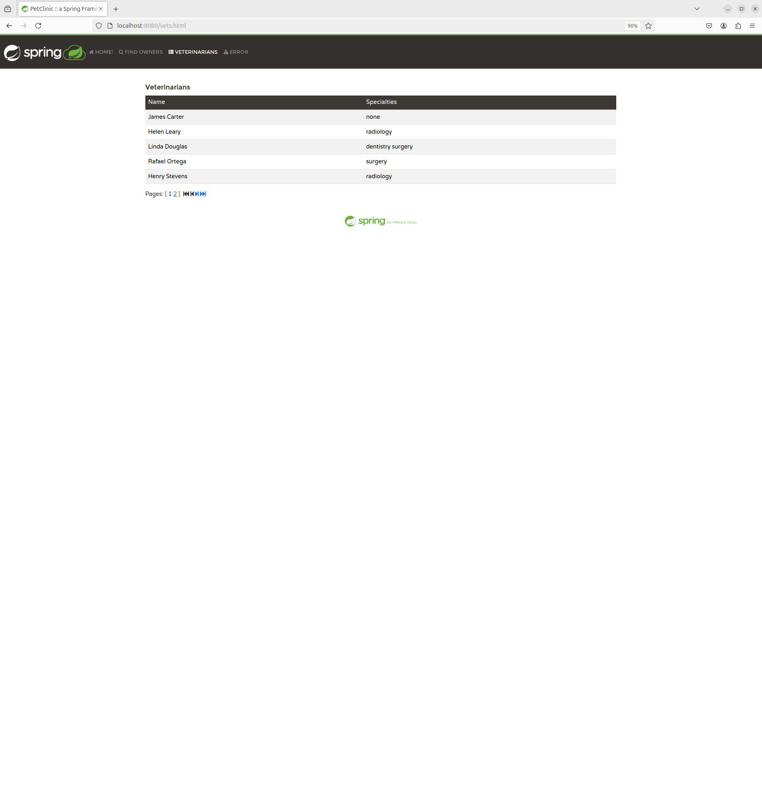
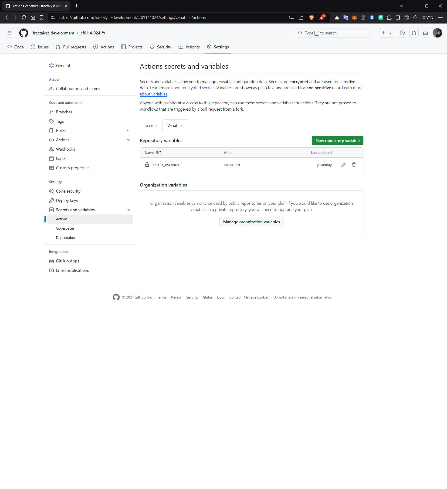
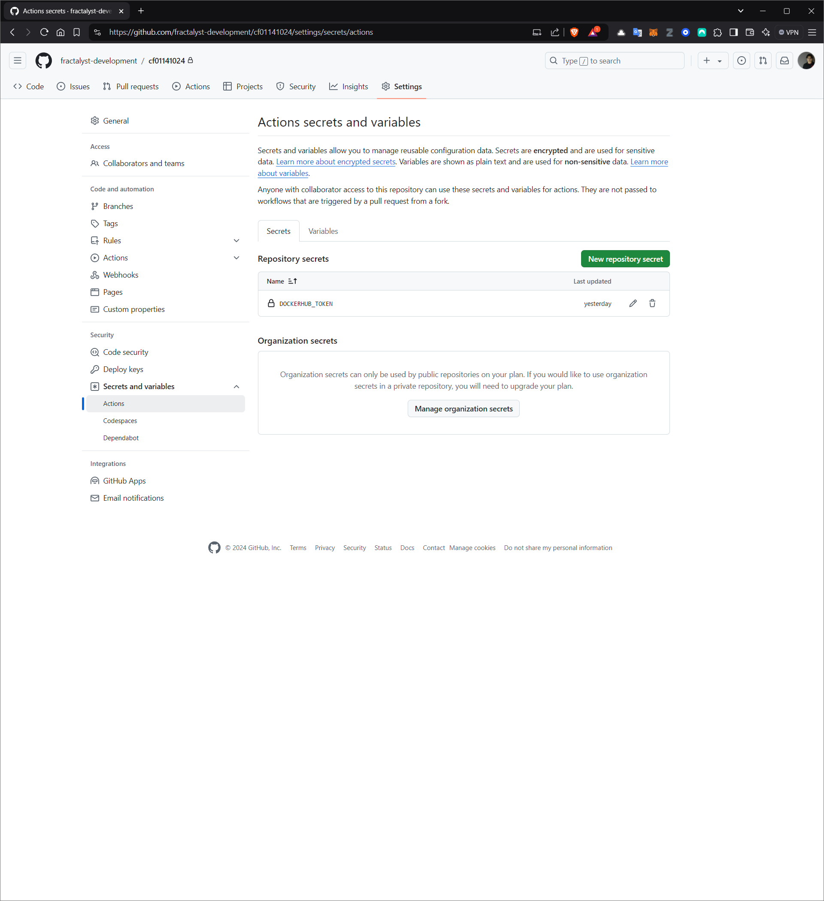
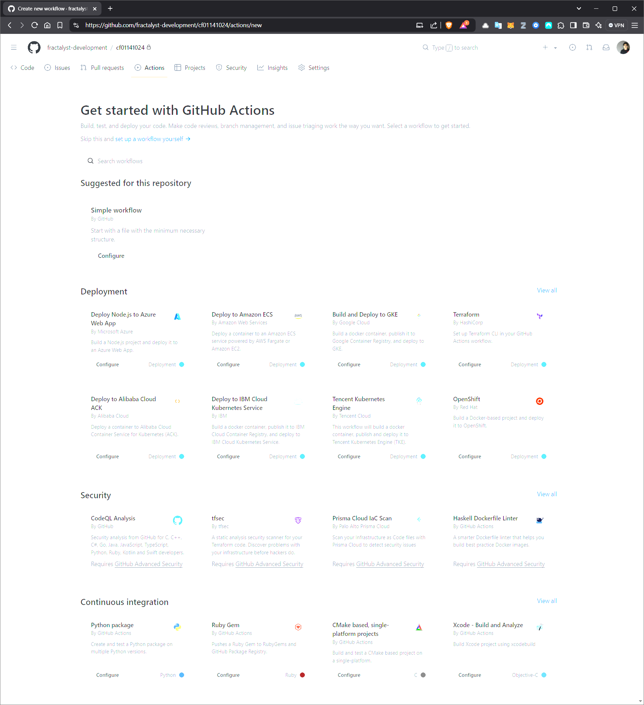
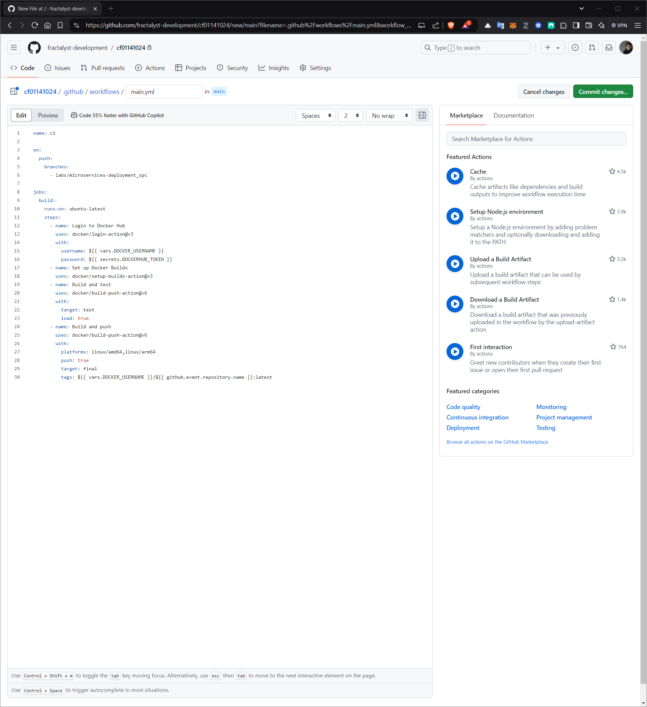
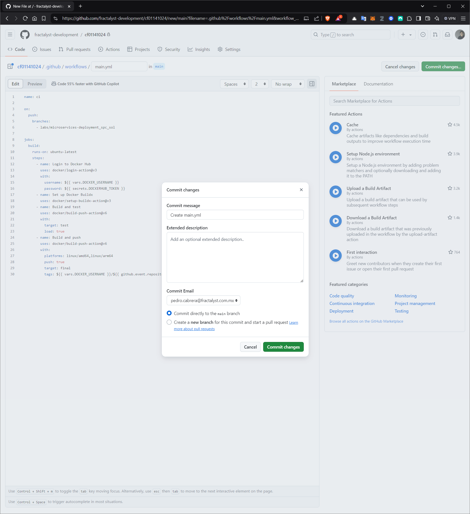
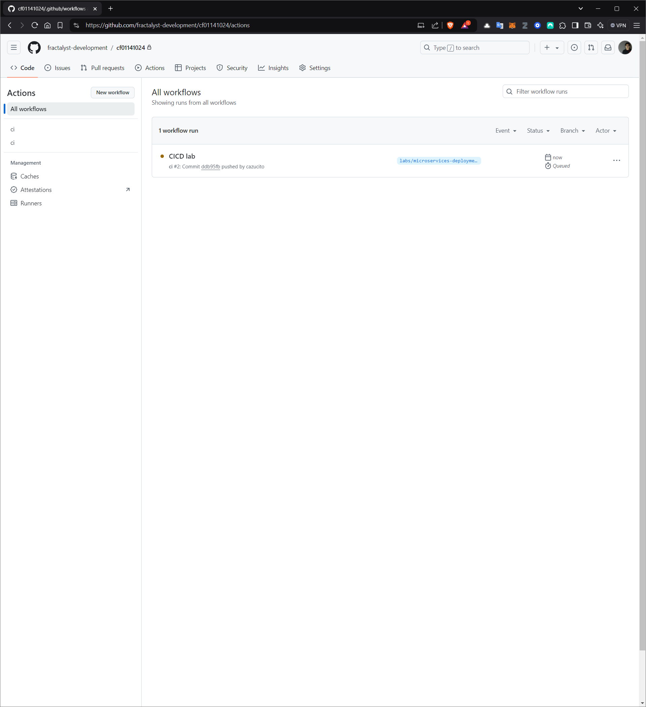
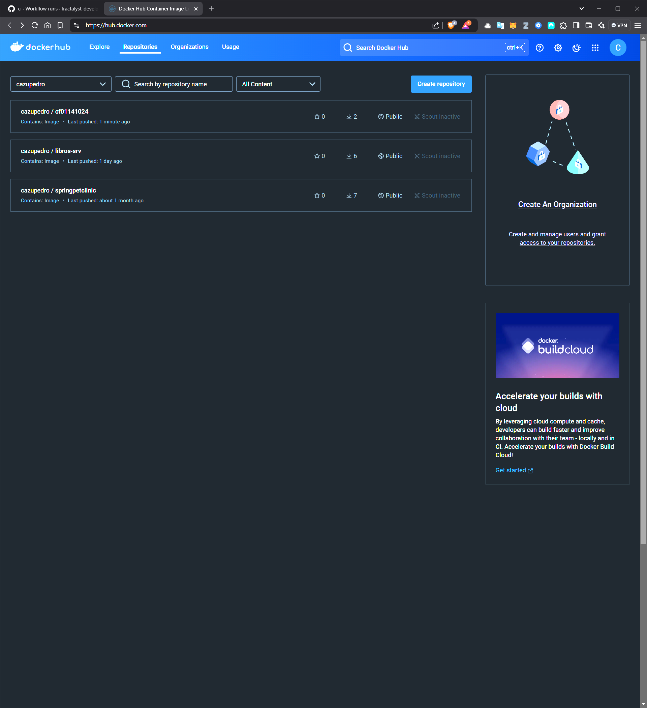
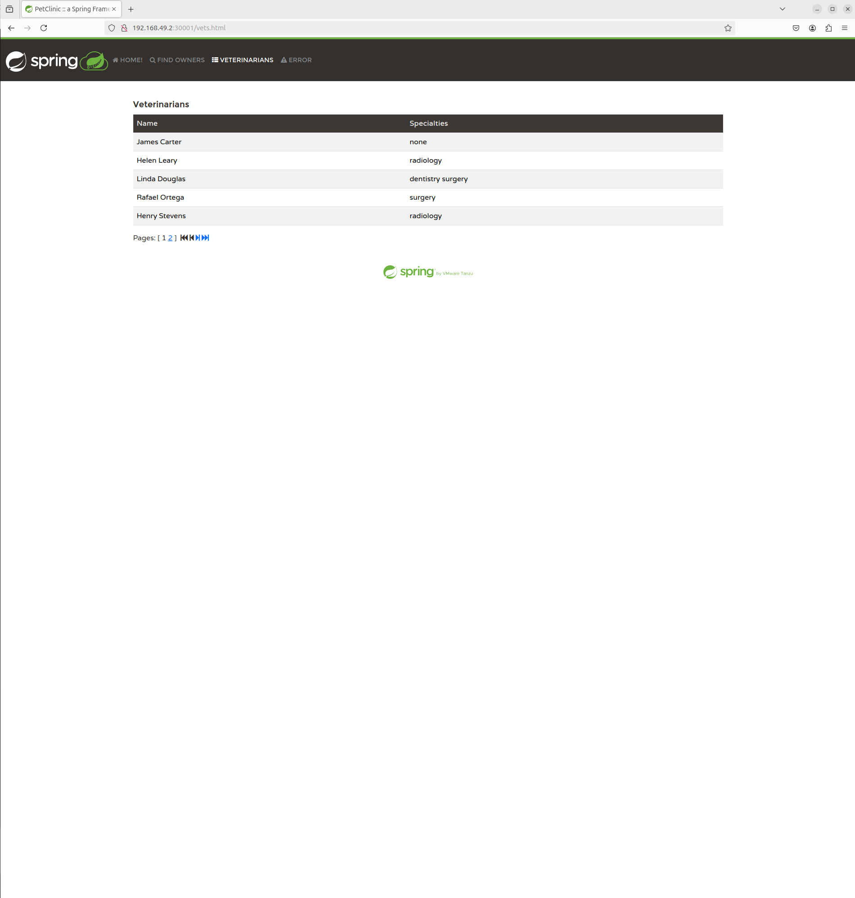

# DESPLIEGUE: CI

Tiempo aproximado: _15 minutos_

## OBJETIVO

Realizar el despliegue mediante en _Kubernetes_ de un microservicio con _Quarkus_.

## PRERREQUISITOS

### REPOSITORIO

Esta actividad requiere que el repositorio de trabajo este en:

- Rama: `labs/microservices-deployment_spc`
  - Se recomienda siempre trabajar sobre una rama _feature_.
    - Por ejemplo: `git checkout -b labs/microservices-deployment_spc_cazucito`
- Carpeta: `/home/usuario/Desktop/CF01141024`

### ACTIVIDADES

Se requiere haber realizado las actividad **DESPLIEGUE: QUARKUS - KUBERNETES**.

### KUBERNETES

Desde la terminal de comandos ejecuta:

``` shell
minikube start
```

La salida debe ser similar a:

``` shell
😄  minikube v1.34.0 on Ubuntu 24.04 (vbox/amd64)
✨  Automatically selected the docker driver. Other choices: ssh, none
📌  Using Docker driver with root privileges
👍  Starting "minikube" primary control-plane node in "minikube" cluster
🚜  Pulling base image v0.0.45 ...
💾  Downloading Kubernetes v1.31.0 preload ...
    > preloaded-images-k8s-v18-v1...:  326.69 MiB / 326.69 MiB  100.00% 7.77 Mi
    > gcr.io/k8s-minikube/kicbase...:  487.89 MiB / 487.90 MiB  100.00% 6.82 Mi
🔥  Creating docker container (CPUs=2, Memory=2900MB) ...
🐳  Preparing Kubernetes v1.31.0 on Docker 27.2.0 ...
    ▪ Generating certificates and keys ...
    ▪ Booting up control plane ...
    ▪ Configuring RBAC rules ...
🔗  Configuring bridge CNI (Container Networking Interface) ...
🔎  Verifying Kubernetes components...
    ▪ Using image gcr.io/k8s-minikube/storage-provisioner:v5
🌟  Enabled addons: storage-provisioner, default-storageclass
🏄  Done! kubectl is now configured to use "minikube" cluster and "default" namespace by default
```

## DESARROLLO

Desde el directorio del repositorio, realice lo que a continuación se indica.

### ARCHIVOS DOCKER

En el directorio raíz del repositorio cree los siguientes archivos con el contenido indicado.

- Analice el contenido de cada uno de éstos.

#### Dockerfile

``` Dockerfile
# syntax=docker/dockerfile:1

FROM eclipse-temurin:21-jdk-jammy as base
WORKDIR /build
COPY --chmod=0755 mvnw mvnw
COPY .mvn/ .mvn/

FROM base as test
WORKDIR /build
COPY ./src src/
RUN --mount=type=bind,source=pom.xml,target=pom.xml \
    --mount=type=cache,target=/root/.m2 \
    ./mvnw test

FROM base as deps
WORKDIR /build
RUN --mount=type=bind,source=pom.xml,target=pom.xml \
    --mount=type=cache,target=/root/.m2 \
    ./mvnw dependency:go-offline -DskipTests

FROM deps as package
WORKDIR /build
COPY ./src src/
RUN --mount=type=bind,source=pom.xml,target=pom.xml \
    --mount=type=cache,target=/root/.m2 \
    ./mvnw package -DskipTests && \
    mv target/$(./mvnw help:evaluate -Dexpression=project.artifactId -q -DforceStdout)-$(./mvnw help:evaluate -Dexpression=project.version -q -DforceStdout).jar target/app.jar

FROM package as extract
WORKDIR /build
RUN java -Djarmode=layertools -jar target/app.jar extract --destination target/extracted

FROM extract as development
WORKDIR /build
RUN cp -r /build/target/extracted/dependencies/. ./
RUN cp -r /build/target/extracted/spring-boot-loader/. ./
RUN cp -r /build/target/extracted/snapshot-dependencies/. ./
RUN cp -r /build/target/extracted/application/. ./
ENV JAVA_TOOL_OPTIONS="-agentlib:jdwp=transport=dt_socket,server=y,suspend=n,address=*:8000"
CMD [ "java", "org.springframework.boot.loader.launch.JarLauncher" ]

FROM eclipse-temurin:21-jre-jammy AS final
ARG UID=10001
RUN adduser \
    --disabled-password \
    --gecos "" \
    --home "/nonexistent" \
    --shell "/sbin/nologin" \
    --no-create-home \
    --uid "${UID}" \
    appuser
USER appuser
COPY --from=extract build/target/extracted/dependencies/ ./
COPY --from=extract build/target/extracted/spring-boot-loader/ ./
COPY --from=extract build/target/extracted/snapshot-dependencies/ ./
COPY --from=extract build/target/extracted/application/ ./
EXPOSE 8080
ENTRYPOINT [ "java", "org.springframework.boot.loader.launch.JarLauncher" ]
```

#### docker-compose.yaml

``` yaml
# Comments are provided throughout this file to help you get started.
# If you need more help, visit the Docker Compose reference guide at
# https://docs.docker.com/go/compose-spec-reference/

# Here the instructions define your application as a service called "server".
# This service is built from the Dockerfile in the current directory.
# You can add other services your application may depend on here, such as a
# database or a cache. For examples, see the Awesome Compose repository:
# https://github.com/docker/awesome-compose
services:
  server:
    build:
      context: .
    ports:
      - 8080:8080
# The commented out section below is an example of how to define a PostgreSQL
# database that your application can use. `depends_on` tells Docker Compose to
# start the database before your application. The `db-data` volume persists the
# database data between container restarts. The `db-password` secret is used
# to set the database password. You must create `db/password.txt` and add
# a password of your choosing to it before running `docker-compose up`.
#     depends_on:
#       db:
#         condition: service_healthy
#   db:
#     image: postgres
#     restart: always
#     user: postgres
#     secrets:
#       - db-password
#     volumes:
#       - db-data:/var/lib/postgresql/data
#     environment:
#       - POSTGRES_DB=example
#       - POSTGRES_PASSWORD_FILE=/run/secrets/db-password
#     expose:
#       - 5432
#     healthcheck:
#       test: [ "CMD", "pg_isready" ]
#       interval: 10s
#       timeout: 5s
#       retries: 5
# volumes:
#   db-data:
# secrets:
#   db-password:
#     file: db/password.txt
```

#### .dockerignore

``` dockerignore
# Include any files or directories that you don't want to be copied to your
# container here (e.g., local build artifacts, temporary files, etc.).
#
# For more help, visit the .dockerignore file reference guide at
# https://docs.docker.com/go/build-context-dockerignore/

**/.classpath
**/.dockerignore
**/.env
**/.git
**/.gitignore
**/.project
**/.settings
**/.toolstarget
**/.vs
**/.vscode
**/.next
**/.cache
**/*.*proj.user
**/*.dbmdl
**/*.jfm
**/charts
**/docker-compose*
**/compose.y*ml
**/target
**/Dockerfile*
**/node_modules
**/npm-debug.log
**/obj
**/secrets.dev.yaml
**/values.dev.yaml
**/vendor
LICENSE
README.md
```

### PRUEBA LOCAL

Para validar el correcto funcionamiento de la aplicación ejecute:

``` shell
docker compose up --build
```

La salida será semejante a:

``` shell
[+] Building 3.4s (28/28) FINISHED                                                                                                                                                                                                                                                                                                                                 docker:default
 => [server internal] load build definition from Dockerfile                                                                                                                                                                                                                                                                                                                  0.1s
 => => transferring dockerfile: 2.01kB                                                                                                                                                                                                                                                                                                                                       0.1s
 => [server] resolve image config for docker-image://docker.io/docker/dockerfile:1                                                                                                                                                                                                                                                                                           1.0s
 => [server auth] docker/dockerfile:pull token for registry-1.docker.io                                                                                                                                                                                                                                                                                                      0.0s
 => CACHED [server] docker-image://docker.io/docker/dockerfile:1@sha256:865e5dd094beca432e8c0a1d5e1c465db5f998dca4e439981029b3b81fb39ed5                                                                                                                                                                                                                                     0.0s
 => [server internal] load metadata for docker.io/library/eclipse-temurin:21-jdk-jammy                                                                                                                                                                                                                                                                                       0.7s
 => [server internal] load metadata for docker.io/library/eclipse-temurin:21-jre-jammy                                                                                                                                                                                                                                                                                       0.7s
 => [server auth] library/eclipse-temurin:pull token for registry-1.docker.io                                                                                                                                                                                                                                                                                                0.0s
 => [server internal] load .dockerignore                                                                                                                                                                                                                                                                                                                                     0.0s
 => => transferring context: 665B                                                                                                                                                                                                                                                                                                                                            0.0s
 => [server base 1/4] FROM docker.io/library/eclipse-temurin:21-jdk-jammy@sha256:4c19911e6c22732db123ffaf049d033b9fe487935cffe265d1517cd26dac7f11                                                                                                                                                                                                                            0.0s
 => [server internal] load build context                                                                                                                                                                                                                                                                                                                                     0.2s
 => => transferring context: 9.99kB                                                                                                                                                                                                                                                                                                                                          0.1s
 => [server final 1/6] FROM docker.io/library/eclipse-temurin:21-jre-jammy@sha256:5f8358c9d5615c18e95728e8b8528bda7ff40a7a5da2ac9a35b7a01f5d9b231a                                                                                                                                                                                                                           0.0s
 => CACHED [server final 2/6] RUN adduser     --disabled-password     --gecos ""     --home "/nonexistent"     --shell "/sbin/nologin"     --no-create-home     --uid "10001"     appuser                                                                                                                                                                                    0.0s
 => CACHED [server base 2/4] WORKDIR /build                                                                                                                                                                                                                                                                                                                                  0.0s
 => CACHED [server base 3/4] COPY --chmod=0755 mvnw mvnw                                                                                                                                                                                                                                                                                                                     0.0s
 => CACHED [server base 4/4] COPY .mvn/ .mvn/                                                                                                                                                                                                                                                                                                                                0.0s
 => CACHED [server deps 1/2] WORKDIR /build                                                                                                                                                                                                                                                                                                                                  0.0s
 => CACHED [server deps 2/2] RUN --mount=type=bind,source=pom.xml,target=pom.xml     --mount=type=cache,target=/root/.m2     ./mvnw dependency:go-offline -DskipTests                                                                                                                                                                                                        0.0s
 => CACHED [server package 1/3] WORKDIR /build                                                                                                                                                                                                                                                                                                                               0.0s
 => CACHED [server package 2/3] COPY ./src src/                                                                                                                                                                                                                                                                                                                              0.0s
 => CACHED [server package 3/3] RUN --mount=type=bind,source=pom.xml,target=pom.xml     --mount=type=cache,target=/root/.m2     ./mvnw package -DskipTests &&     mv target/$(./mvnw help:evaluate -Dexpression=project.artifactId -q -DforceStdout)-$(./mvnw help:evaluate -Dexpression=project.version -q -DforceStdout).jar target/app.jar                                0.0s
 => CACHED [server extract 1/2] WORKDIR /build                                                                                                                                                                                                                                                                                                                               0.0s
 => CACHED [server extract 2/2] RUN java -Djarmode=layertools -jar target/app.jar extract --destination target/extracted                                                                                                                                                                                                                                                     0.0s
 => CACHED [server final 3/6] COPY --from=extract build/target/extracted/dependencies/ ./                                                                                                                                                                                                                                                                                    0.0s
 => CACHED [server final 4/6] COPY --from=extract build/target/extracted/spring-boot-loader/ ./                                                                                                                                                                                                                                                                              0.0s
 => CACHED [server final 5/6] COPY --from=extract build/target/extracted/snapshot-dependencies/ ./                                                                                                                                                                                                                                                                           0.0s
 => CACHED [server final 6/6] COPY --from=extract build/target/extracted/application/ ./                                                                                                                                                                                                                                                                                     0.0s
 => [server] exporting to image                                                                                                                                                                                                                                                                                                                                              0.1s
 => => exporting layers                                                                                                                                                                                                                                                                                                                                                      0.0s
 => => writing image sha256:55805a4dcfd9966f7050a9e51a3e0a8e7c6435b77ea223ca61aa3fced388dde2                                                                                                                                                                                                                                                                                 0.0s
 => => naming to docker.io/library/cf01141024-server                                                                                                                                                                                                                                                                                                                         0.0s
 => [server] resolving provenance for metadata file                                                                                                                                                                                                                                                                                                                          0.1s
[+] Running 1/0
 ✔ Container cf01141024-server-1  Created                                                                                                                                                                                                                                                                                                                                    0.0s 
Attaching to server-1
server-1  | 
server-1  | 
server-1  |               |\      _,,,--,,_
server-1  |              /,`.-'`'   ._  \-;;,_
server-1  |   _______ __|,4-  ) )_   .;.(__`'-'__     ___ __    _ ___ _______
server-1  |  |       | '---''(_/._)-'(_\_)   |   |   |   |  |  | |   |       |
server-1  |  |    _  |    ___|_     _|       |   |   |   |   |_| |   |       | __ _ _
server-1  |  |   |_| |   |___  |   | |       |   |   |   |       |   |       | \ \ \ \
server-1  |  |    ___|    ___| |   | |      _|   |___|   |  _    |   |      _|  \ \ \ \
server-1  |  |   |   |   |___  |   | |     |_|       |   | | |   |   |     |_    ) ) ) )
server-1  |  |___|   |_______| |___| |_______|_______|___|_|  |__|___|_______|  / / / /
server-1  |  ==================================================================/_/_/_/
server-1  | 
server-1  | :: Built with Spring Boot :: 3.3.4
server-1  | 
server-1  | 
server-1  | 2024-10-25T15:16:18.661Z  INFO 1 --- [           main] o.s.s.petclinic.PetClinicApplication     : Starting PetClinicApplication v3.3.0-SNAPSHOT using Java 21.0.5 with PID 1 (/BOOT-INF/classes started by appuser in /)
server-1  | 2024-10-25T15:16:18.682Z  INFO 1 --- [           main] o.s.s.petclinic.PetClinicApplication     : No active profile set, falling back to 1 default profile: "default"
server-1  | 2024-10-25T15:16:21.745Z  INFO 1 --- [           main] .s.d.r.c.RepositoryConfigurationDelegate : Bootstrapping Spring Data JPA repositories in DEFAULT mode.
server-1  | 2024-10-25T15:16:21.829Z  INFO 1 --- [           main] .s.d.r.c.RepositoryConfigurationDelegate : Finished Spring Data repository scanning in 74 ms. Found 2 JPA repository interfaces.
server-1  | 2024-10-25T15:16:24.064Z  INFO 1 --- [           main] o.s.b.w.embedded.tomcat.TomcatWebServer  : Tomcat initialized with port 8080 (http)
server-1  | 2024-10-25T15:16:24.100Z  INFO 1 --- [           main] o.apache.catalina.core.StandardService   : Starting service [Tomcat]
server-1  | 2024-10-25T15:16:24.100Z  INFO 1 --- [           main] o.apache.catalina.core.StandardEngine    : Starting Servlet engine: [Apache Tomcat/10.1.30]
server-1  | 2024-10-25T15:16:24.230Z  INFO 1 --- [           main] o.a.c.c.C.[Tomcat].[localhost].[/]       : Initializing Spring embedded WebApplicationContext
server-1  | 2024-10-25T15:16:24.246Z  INFO 1 --- [           main] w.s.c.ServletWebServerApplicationContext : Root WebApplicationContext: initialization completed in 5212 ms
server-1  | 2024-10-25T15:16:25.805Z  INFO 1 --- [           main] com.zaxxer.hikari.HikariDataSource       : HikariPool-1 - Starting...
server-1  | 2024-10-25T15:16:26.420Z  INFO 1 --- [           main] com.zaxxer.hikari.pool.HikariPool        : HikariPool-1 - Added connection conn0: url=jdbc:h2:mem:69d31b74-f541-4b95-8c86-bf258d716f9b user=SA
server-1  | 2024-10-25T15:16:26.426Z  INFO 1 --- [           main] com.zaxxer.hikari.HikariDataSource       : HikariPool-1 - Start completed.
server-1  | 2024-10-25T15:16:26.825Z  INFO 1 --- [           main] o.hibernate.jpa.internal.util.LogHelper  : HHH000204: Processing PersistenceUnitInfo [name: default]
server-1  | 2024-10-25T15:16:27.225Z  INFO 1 --- [           main] org.hibernate.Version                    : HHH000412: Hibernate ORM core version 6.5.3.Final
server-1  | 2024-10-25T15:16:27.331Z  INFO 1 --- [           main] o.h.c.internal.RegionFactoryInitiator    : HHH000026: Second-level cache disabled
server-1  | 2024-10-25T15:16:27.889Z  INFO 1 --- [           main] o.s.o.j.p.SpringPersistenceUnitInfo      : No LoadTimeWeaver setup: ignoring JPA class transformer
server-1  | 2024-10-25T15:16:30.415Z  INFO 1 --- [           main] o.h.e.t.j.p.i.JtaPlatformInitiator       : HHH000489: No JTA platform available (set 'hibernate.transaction.jta.platform' to enable JTA platform integration)
server-1  | 2024-10-25T15:16:30.419Z  INFO 1 --- [           main] j.LocalContainerEntityManagerFactoryBean : Initialized JPA EntityManagerFactory for persistence unit 'default'
server-1  | 2024-10-25T15:16:31.300Z  INFO 1 --- [           main] o.s.d.j.r.query.QueryEnhancerFactory     : Hibernate is in classpath; If applicable, HQL parser will be used.
server-1  | 2024-10-25T15:16:33.434Z  INFO 1 --- [           main] o.s.b.a.e.web.EndpointLinksResolver      : Exposing 14 endpoints beneath base path '/actuator'
server-1  | 2024-10-25T15:16:33.692Z  INFO 1 --- [           main] o.s.b.w.embedded.tomcat.TomcatWebServer  : Tomcat started on port 8080 (http) with context path '/'
server-1  | 2024-10-25T15:16:33.727Z  INFO 1 --- [           main] o.s.s.petclinic.PetClinicApplication     : Started PetClinicApplication in 16.042 seconds (process running for 17.684)
```

#### CONSUMO LOCAL

Para validar el correcto despliegue visite: <http://localhost:8080/vets.html>



#### DETENCIÓN LOCAL

Para detener la aplicación, digite `Control+C` en la terminal que se ha lanzado la ejecución o en otra terminal ubicada en la ruta raíz del repositorio: `docker compose down`.

### FLUJO DE CI/CD

Para crear un flujo de CI/CD utilizando GitHub Actions realice lo siguiente en la rama `labs/microservices-deployment_spc` de su repositorio de trabajo (típicamente localizado en `/home/usuario/Desktop/CF01141024_NOMBREUSUARIO`).

#### VARIABLES Y SECRETOS

Configure la variable `DOCKER_USERNAME` para las _Actions_ de _GitHub_ con el valor `cazupedro`.

- Recuerde que el valor debe ser su nombre de usuario.
- <https://github.com/fractalyst-development/cf01141024/settings/variables/actions>
  - Recuerde que en el _url_ mostrado debe sustituir _fractalyst-development_ por su nombre de usuario en _GitHub_ y _cf01141024_ por el nombre de su repositorio bifurcado.



Configure el secreto `DOCKERHUB_TOKEN` para las _Actions_ de _GitHub_ con el valor del token previamente creado.

- Debe ser similar a: `dckr_pat_AtUDnkTY...`.

- <https://github.com/fractalyst-development/cf01141024/settings/secrets/actions>
  - Recuerde que en el _url_ mostrado debe sustituir _fractalyst-development_ por su nombre de usuario en _GitHub_ y _cf01141024_ por el nombre de su repositorio bifurcado.



#### FLUJO

PAra crear un flujo de trabajo en _GitHub Actions_ visite la opción _Actions_ de su repositorio de trabajo en la rama en la que desee el _workflow_, en este caso `labs/microservices-deployment_spc`.

- <https://github.com/fractalyst-development/cf01141024/actions/new>
  - Recuerde que en el _url_ mostrado debe sustituir _fractalyst-development_ por su nombre de usuario en _GitHub_ y _cf01141024_ por el nombre de su repositorio bifurcado.

En dicha pantalla selecciones el hiperenlace: `set up a workflow yourself `.



En la pantalla mostrada ingrese el código mostrado.

- Puede dejar el nombre por defecto `main.yaml` o indicar el que prefiera.
  - Por ejemplo: `ci.yaml`
- Recuerde poner el nombre de la rama en la que está trabajando.
  - Por ejemplo: `labs/microservices-deployment_spc_cazucito`.

``` yaml
name: ci

on:
  push:
    branches:
      - labs/microservices-deployment_spc
      
jobs:
  build:
    runs-on: ubuntu-latest
    steps:
      - name: Login to Docker Hub
        uses: docker/login-action@v3
        with:
          username: ${{ vars.DOCKER_USERNAME }}
          password: ${{ secrets.DOCKERHUB_TOKEN }}
      - name: Set up Docker Buildx
        uses: docker/setup-buildx-action@v3
      - name: Build and test
        uses: docker/build-push-action@v6
        with:
          target: test
          load: true
      - name: Build and push
        uses: docker/build-push-action@v6
        with:
          platforms: linux/amd64,linux/arm64
          push: true
          target: final
          tags: ${{ vars.DOCKER_USERNAME }}/${{ github.event.repository.name }}:latest
```



A continuación:

- Seleccione: `Commit directly to the main branch`
- Haga clic en el botón: `Commit changes`



#### EJECUCIÓN DEL FLUJO

Suba sus cambios con los siguientes comandos:

``` shell
git add --all
git commit --message="CICD lab"
git push
```

Al subir sus cambios _GitHub_ ejecuta el flujo definido.



#### REPOSITORIO DOCKER HUB

Después de concluida la ejecución del flujo visite _Docker Hub_ y valide que su imagen ha sido publicada.

Visite: <https://hub.docker.com/>



### DESPLIEGUE EN MINIKUBE

Para realizar el despliegue en un clúster de _Kubernetes_ cree el archivo `docker-java-kubernetes.yaml` con el siguiente contenido:

- Recuerde que el nombre de la imagen (`image: cazupedro/cf01141024`) debe ser el de la suya.

``` yaml
apiVersion: apps/v1
kind: Deployment
metadata:
  name: docker-java-demo
  namespace: default
spec:
  replicas: 1
  selector:
    matchLabels:
      service: server
  template:
    metadata:
      labels:
        service: server
    spec:
      containers:
        - name: server-service
          image: cazupedro/cf01141024
          imagePullPolicy: Always
---
apiVersion: v1
kind: Service
metadata:
  name: service-entrypoint
  namespace: default
spec:
  type: NodePort
  selector:
    service: server
  ports:
    - port: 8080
      targetPort: 8080
      nodePort: 30001
```

En la terminal de comandos ejecute:

``` shell
kubectl apply -f docker-java-kubernetes.yaml
```

La salida debe ser similar a:

``` shell
deployment.apps/docker-java-demo created
service/service-entrypoint created
```

#### VERIFICACIÓN Y CONSUMO

Para visualizar los _deployments_ ejecute:

``` shell
kubectl get deployments
```

La salida será similar a:

``` shell
NAME               READY   UP-TO-DATE   AVAILABLE   AGE
docker-java-demo   1/1     1            1           109s
```

_Esta salida puede demorar un poco._

Ahora para obtener la dirección del servicio en _minikube_ ejecuta:

``` shell
minikube service list
```

La salida será similar a:

``` shell
|-------------|--------------------|--------------|---------------------------|
|  NAMESPACE  |        NAME        | TARGET PORT  |            URL            |
|-------------|--------------------|--------------|---------------------------|
| default     | kubernetes         | No node port |                           |
| default     | service-entrypoint |         8080 | http://192.168.49.2:30001 |
| kube-system | kube-dns           | No node port |                           |
|-------------|--------------------|--------------|---------------------------|
```

Puede probar que se está ejecutando visitando:

- <http://192.168.49.2:30001/vets.html>



## OPCIONAL

1. Puede instalar las extensiones `Docker` y `Kubernetes` de _Microsoft_ en _Visual Studio Code_ para explorar más la arquitectura de despliegue creada.
2. Visite _Docker Hub_ y visualize la imagen publicada.

## RESTABLECIMIENTO

Para detener el servicio en operación es detener el clúster con:

``` shell
minikube stop
```

Con una salida similar a:

``` shell
✋  Stopping node "minikube"  ...
🛑  Powering off "minikube" via SSH ...
🛑  1 node stopped.
```

## RESULTADO

Comenta los puntos más relevantes de las actividades.

## REFERENCIAS

- [Containerize a Java application](https://docs.docker.com/guides/java/containerize/)
- [Spring PetClinic Sample Application](https://github.com/spring-projects/spring-petclinic.git)

---

[DESPLIEGUE DE MICROSERVICIOS](../../M05.md)
